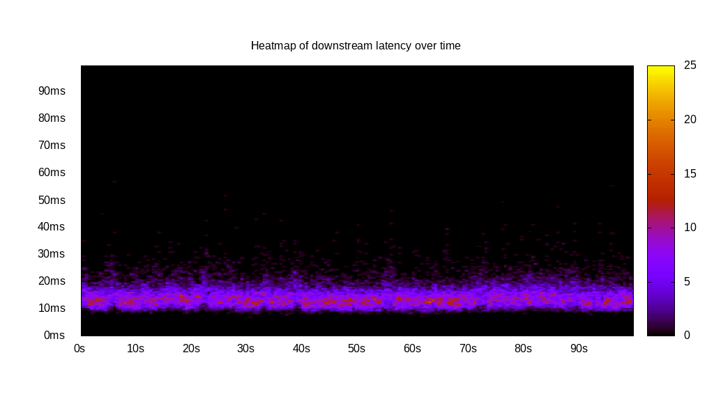

# Latency benchmark report. Crowd is 8

## Populate workload

## Object Size is 0.00kiB

### PUT Latency in ms over time

Evolution of PUT Latency over time

| Parameter | Value |
| --- | --- |
| Y Coordinate | PUT Latency in ms |
| X Coordinate | time in s since begining of workload |

### PUT Latency distribution in ms

Distribution of the PUT Latency in ms

| Parameter | Value |
| --- | --- |
| Y Coordinate | Number of PUT |
| X Coordinate | Latency in ms |
| Server volume | 0.000MiB|
| Server bandwidth | 0.000MiB/s |
| Server time | 300.00s |
| Server load | 7.93 |
| Server responses | 160992PUT |
| Server IOps | 536.65PUT/s |
| Client bandwidth | 0.000MiB/s |
| Client volume | 0.000MiB|
| Client time | 2379.66s |
| Client IOps |  67.65PUT/s  |
| Client Latency | 14.78ms/PUT |
| Client Limbo | 2.54ms/PUT |
| Crowd time | 2399.96s |
| Crowd efficiency | 99.15% |
| Highest Latency | 100.00ms |
| 95th percentile Latency | 21.11ms |
| 68th percentile Latency | 16.08ms |
| 50th percentile Latency | 14.57ms |
| 32nd percentile Latency | 13.57ms |
| 5th percentile Latency | 10.55ms |
| Lowest Latency | 6.53ms |

## Read workload

## Object Size is 0.00kiB

### GET Latency in ms over time

Evolution of GET Latency over time

| Parameter | Value |
| --- | --- |
| Y Coordinate | GET Latency in ms |
| X Coordinate | time in s since begining of workload |

### GET Latency distribution in ms

Distribution of the GET Latency in ms

| Parameter | Value |
| --- | --- |
| Y Coordinate | Number of GET |
| X Coordinate | Latency in ms |
| Server volume | 0.000MiB|
| Server bandwidth | 0.000MiB/s |
| Server time | 100.01s |
| Server load | 7.92 |
| Server responses | 52627GET |
| Server IOps | 526.21GET/s |
| Client bandwidth | 0.000MiB/s |
| Client volume | 0.000MiB|
| Client time | 792.01s |
| Client IOps |  66.45GET/s  |
| Client Latency | 15.05ms/GET |
| Client Limbo | 1.01ms/GET |
| Crowd time | 800.09s |
| Crowd efficiency | 98.99% |
| Highest Latency | 100.00ms |
| 95th percentile Latency | 22.61ms |
| 68th percentile Latency | 16.58ms |
| 50th percentile Latency | 14.57ms |
| 32nd percentile Latency | 13.57ms |
| 5th percentile Latency | 11.06ms |
| Lowest Latency | 7.04ms |

## Mixed workload

## Object Size is 0.00kiB

### PUT Latency in ms over time

Evolution of PUT Latency over time

| Parameter | Value |
| --- | --- |
| Y Coordinate | PUT Latency in ms |
| X Coordinate | time in s since begining of workload |

### GET Latency in ms over time

Evolution of GET Latency over time

| Parameter | Value |
| --- | --- |
| Y Coordinate | GET Latency in ms |
| X Coordinate | time in s since begining of workload |

### PUT Latency distribution in ms

Distribution of the PUT Latency in ms

| Parameter | Value |
| --- | --- |
| Y Coordinate | Number of PUT |
| X Coordinate | Latency in ms |
| Server volume | 0.000MiB|
| Server bandwidth | 0.000MiB/s |
| Server time | 100.02s |
| Server load | 4.34 |
| Server responses | 24599PUT |
| Server IOps | 245.95PUT/s |
| Client bandwidth | 0.000MiB/s |
| Client volume | 0.000MiB|
| Client time | 433.59s |
| Client IOps |  56.73PUT/s  |
| Client Latency | 17.63ms/PUT |
| Client Limbo | 45.82ms/PUT |
| Crowd time | 800.13s |
| Crowd efficiency | 54.19% |
| Highest Latency | 100.00ms |
| 95th percentile Latency | 25.63ms |
| 68th percentile Latency | 19.10ms |
| 50th percentile Latency | 17.59ms |
| 32nd percentile Latency | 15.58ms |
| 5th percentile Latency | 12.06ms |
| Lowest Latency | 7.54ms |

### GET Latency distribution in ms

Distribution of the GET Latency in ms

| Parameter | Value |
| --- | --- |
| Y Coordinate | Number of GET |
| X Coordinate | Latency in ms |
| Server volume | 0.000MiB|
| Server bandwidth | 0.000MiB/s |
| Server time | 100.02s |
| Server load | 3.59 |
| Server responses | 24415GET |
| Server IOps | 244.11GET/s |
| Client bandwidth | 0.000MiB/s |
| Client volume | 0.000MiB|
| Client time | 359.12s |
| Client IOps |  67.99GET/s  |
| Client Latency | 14.71ms/GET |
| Client Limbo | 55.13ms/GET |
| Crowd time | 800.13s |
| Crowd efficiency | 44.88% |
| Highest Latency | 57.29ms |
| 95th percentile Latency | 21.61ms |
| 68th percentile Latency | 16.08ms |
| 50th percentile Latency | 14.57ms |
| 32nd percentile Latency | 13.07ms |
| 5th percentile Latency | 11.06ms |
| Lowest Latency | 7.54ms |

## Cleanup workload

## Object Size is 0.00kiB

### DELETE Latency in ms over time

Evolution of DELETE Latency over time

| Parameter | Value |
| --- | --- |
| Y Coordinate | DELETE Latency in ms |
| X Coordinate | time in s since begining of workload |

### DELETE Latency distribution in ms

Distribution of the DELETE Latency in ms

| Parameter | Value |
| --- | --- |
| Y Coordinate | Number of DELETE |
| X Coordinate | Latency in ms |
| Server volume | 0.000MiB|
| Server bandwidth | 0.000MiB/s |
| Server time | 286.15s |
| Server load | 7.91 |
| Server responses | 161000DELETE |
| Server IOps | 562.64DELETE/s |
| Client bandwidth | 0.000MiB/s |
| Client volume | 0.000MiB|
| Client time | 2262.35s |
| Client IOps |  71.16DELETE/s  |
| Client Latency | 14.05ms/DELETE |
| Client Limbo | 3.36ms/DELETE |
| Crowd time | 2289.19s |
| Crowd efficiency | 98.83% |
| Highest Latency | 100.00ms |
| 95th percentile Latency | 20.10ms |
| 68th percentile Latency | 15.58ms |
| 50th percentile Latency | 14.07ms |
| 32nd percentile Latency | 13.07ms |
| 5th percentile Latency | 10.55ms |
| Lowest Latency | 5.03ms |

