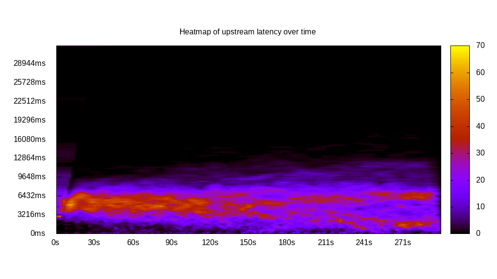
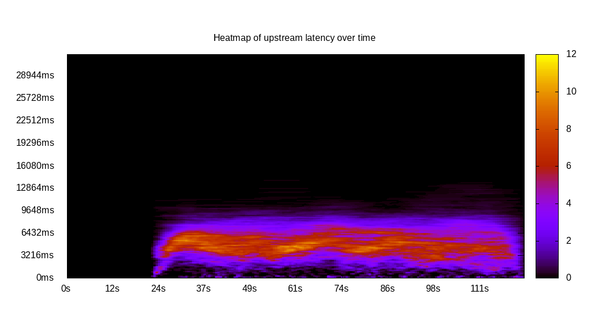
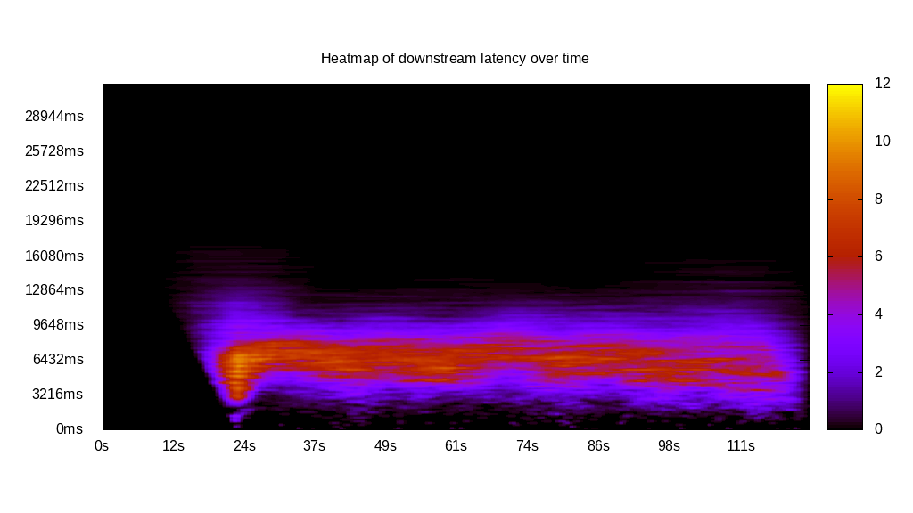
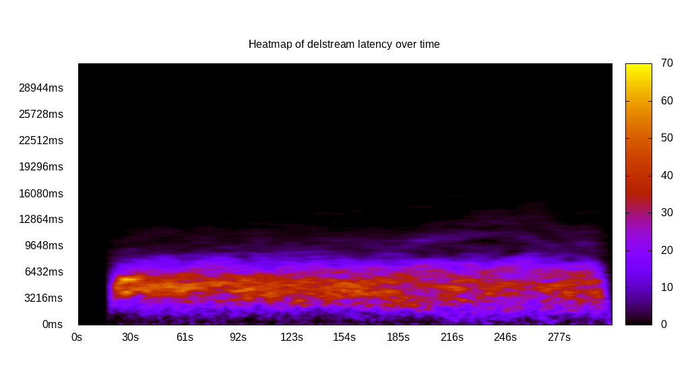
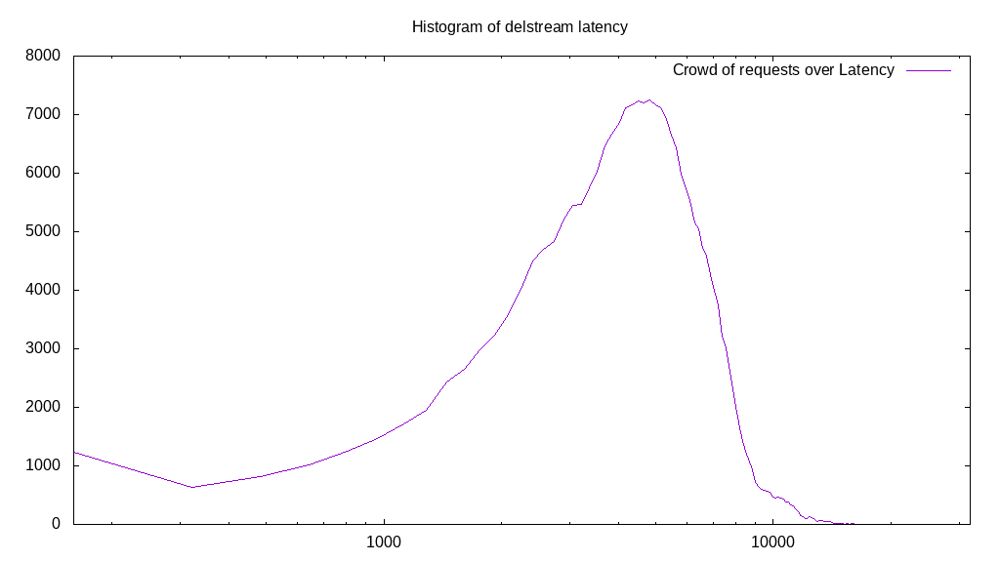

# Latency benchmark report. Crowd is 4096

## Populate workload

## Object Size is 0.00kiB

### PUT Latency in ms over time

Evolution of PUT Latency over time

| Parameter | Value |
| --- | --- |
| Y Coordinate | PUT Latency in ms |
| X Coordinate | time in s since begining of workload |

### PUT Latency distribution in ms

Distribution of the PUT Latency in ms

| Parameter | Value |
| --- | --- |
| Y Coordinate | Number of PUT |
| X Coordinate | Latency in ms |
| Server volume | 0.000MiB|
| Server bandwidth | 0.000MiB/s |
| Server time | 300.00s |
| Server load | 4046.96 |
| Server responses | 239303PUT |
| Server IOps | 797.67PUT/s |
| Client bandwidth | 0.000MiB/s |
| Client volume | 0.000MiB|
| Client time | 1214095.53s |
| Client IOps |  0.20PUT/s  |
| Client Latency | 5073.47ms/PUT |
| Client Limbo | 3.59ms/PUT |
| Crowd time | 1228808.19s |
| Crowd efficiency | 98.80% |
| Highest Latency | 32000.00ms |
| 95th percentile Latency | 9648.24ms |
| 68th percentile Latency | 6271.36ms |
| 50th percentile Latency | 5145.73ms |
| 32nd percentile Latency | 4020.10ms |
| 5th percentile Latency | 1286.43ms |
| Lowest Latency | 160.80ms |

## Read workload

## Object Size is 0.00kiB

### GET Latency in ms over time

Evolution of GET Latency over time

| Parameter | Value |
| --- | --- |
| Y Coordinate | GET Latency in ms |
| X Coordinate | time in s since begining of workload |

### GET Latency distribution in ms

Distribution of the GET Latency in ms

| Parameter | Value |
| --- | --- |
| Y Coordinate | Number of GET |
| X Coordinate | Latency in ms |
| Server volume | 0.000MiB|
| Server bandwidth | 0.000MiB/s |
| Server time | 118.21s |
| Server load | 3176.99 |
| Server responses | 63469GET |
| Server IOps | 536.92GET/s |
| Client bandwidth | 0.000MiB/s |
| Client volume | 0.000MiB|
| Client time | 375551.77s |
| Client IOps |  0.17GET/s  |
| Client Latency | 5917.09ms/GET |
| Client Limbo | 26.52ms/GET |
| Crowd time | 484188.16s |
| Crowd efficiency | 77.56% |
| Highest Latency | 27819.10ms |
| 95th percentile Latency | 12060.30ms |
| 68th percentile Latency | 7075.38ms |
| 50th percentile Latency | 5788.94ms |
| 32nd percentile Latency | 4502.51ms |
| 5th percentile Latency | 1125.63ms |
| Lowest Latency | 160.80ms |

## Mixed workload

## Object Size is 0.00kiB

### PUT Latency in ms over time

Evolution of PUT Latency over time

| Parameter | Value |
| --- | --- |
| Y Coordinate | PUT Latency in ms |
| X Coordinate | time in s since begining of workload |

### GET Latency in ms over time

Evolution of GET Latency over time

| Parameter | Value |
| --- | --- |
| Y Coordinate | GET Latency in ms |
| X Coordinate | time in s since begining of workload |

### PUT Latency distribution in ms

Distribution of the PUT Latency in ms

| Parameter | Value |
| --- | --- |
| Y Coordinate | Number of PUT |
| X Coordinate | Latency in ms |
| Server volume | 0.000MiB|
| Server bandwidth | 0.000MiB/s |
| Server time | 123.00s |
| Server load | 1336.35 |
| Server responses | 33090PUT |
| Server IOps | 269.03PUT/s |
| Client bandwidth | 0.000MiB/s |
| Client volume | 0.000MiB|
| Client time | 164368.75s |
| Client IOps |  0.20PUT/s  |
| Client Latency | 4967.32ms/PUT |
| Client Limbo | 82.87ms/PUT |
| Crowd time | 503799.81s |
| Crowd efficiency | 32.63% |
| Highest Latency | 22030.15ms |
| 95th percentile Latency | 8522.61ms |
| 68th percentile Latency | 5949.75ms |
| 50th percentile Latency | 4984.92ms |
| 32nd percentile Latency | 4180.90ms |
| 5th percentile Latency | 1929.65ms |
| Lowest Latency | 160.80ms |

### GET Latency distribution in ms

Distribution of the GET Latency in ms

| Parameter | Value |
| --- | --- |
| Y Coordinate | Number of GET |
| X Coordinate | Latency in ms |
| Server volume | 0.000MiB|
| Server bandwidth | 0.000MiB/s |
| Server time | 123.00s |
| Server load | 1995.29 |
| Server responses | 36600GET |
| Server IOps | 297.57GET/s |
| Client bandwidth | 0.000MiB/s |
| Client volume | 0.000MiB|
| Client time | 245417.28s |
| Client IOps |  0.15GET/s  |
| Client Latency | 6705.39ms/GET |
| Client Limbo | 63.08ms/GET |
| Crowd time | 503799.81s |
| Crowd efficiency | 48.71% |
| Highest Latency | 25246.23ms |
| 95th percentile Latency | 10934.67ms |
| 68th percentile Latency | 7879.40ms |
| 50th percentile Latency | 6753.77ms |
| 32nd percentile Latency | 5628.14ms |
| 5th percentile Latency | 3216.08ms |
| Lowest Latency | 160.80ms |

## Cleanup workload

## Object Size is 0.00kiB

### DELETE Latency in ms over time

Evolution of DELETE Latency over time

| Parameter | Value |
| --- | --- |
| Y Coordinate | DELETE Latency in ms |
| X Coordinate | time in s since begining of workload |

### DELETE Latency distribution in ms

Distribution of the DELETE Latency in ms

| Parameter | Value |
| --- | --- |
| Y Coordinate | Number of DELETE |
| X Coordinate | Latency in ms |
| Server volume | 0.000MiB|
| Server bandwidth | 0.000MiB/s |
| Server time | 307.04s |
| Server load | 3767.79 |
| Server responses | 239311DELETE |
| Server IOps | 779.42DELETE/s |
| Client bandwidth | 0.000MiB/s |
| Client volume | 0.000MiB|
| Client time | 1156846.24s |
| Client IOps |  0.21DELETE/s  |
| Client Latency | 4834.07ms/DELETE |
| Client Limbo | 24.60ms/DELETE |
| Crowd time | 1257619.46s |
| Crowd efficiency | 91.99% |
| Highest Latency | 22351.76ms |
| 95th percentile Latency | 8683.42ms |
| 68th percentile Latency | 5949.75ms |
| 50th percentile Latency | 4824.12ms |
| 32nd percentile Latency | 3859.30ms |
| 5th percentile Latency | 1608.04ms |
| Lowest Latency | 160.80ms |

