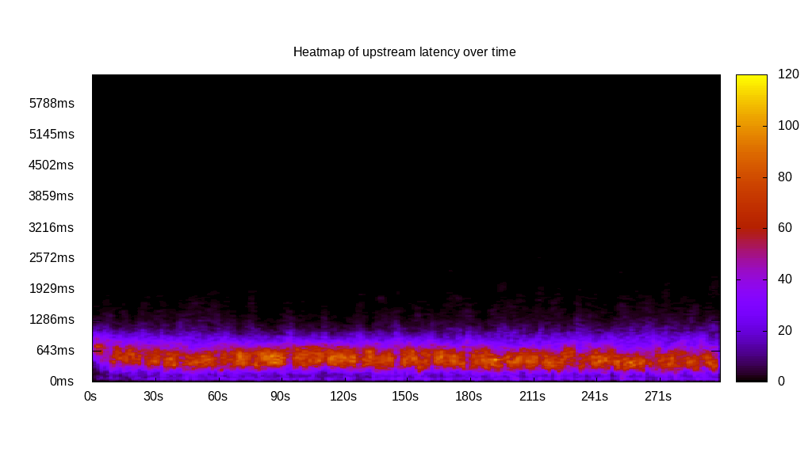
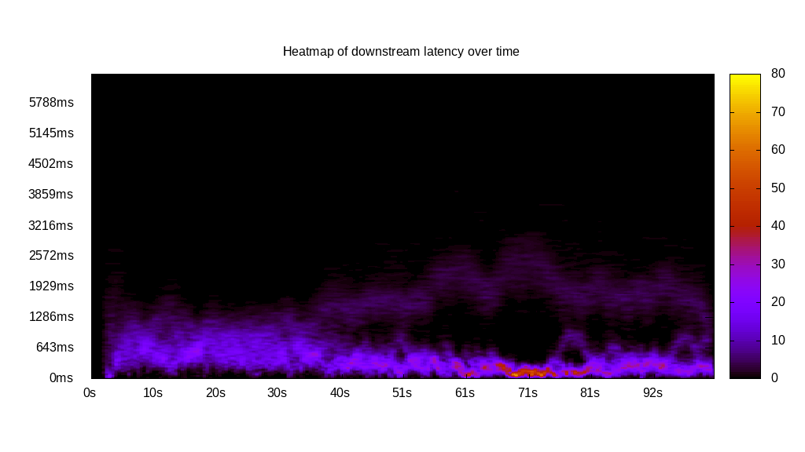
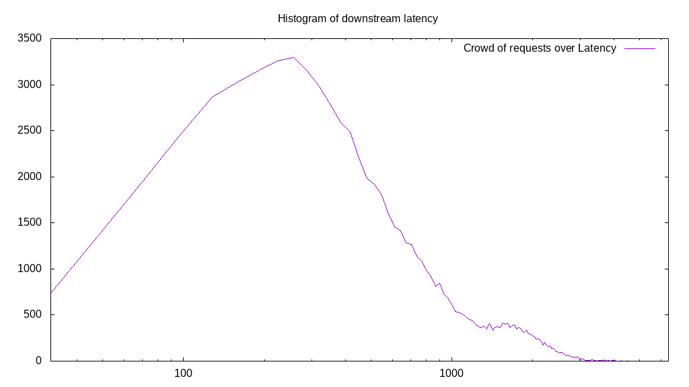
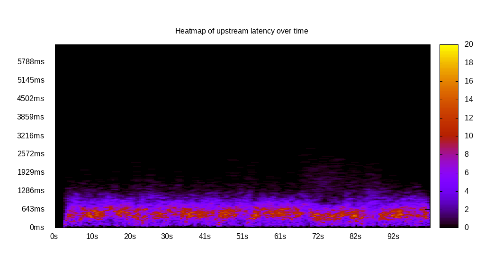
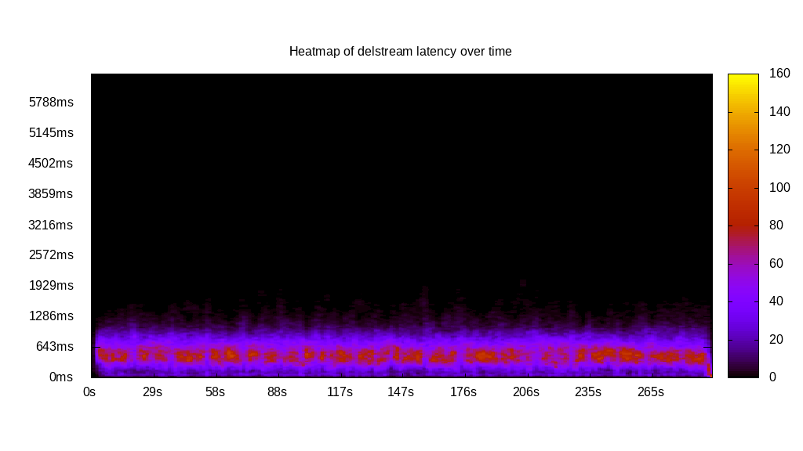
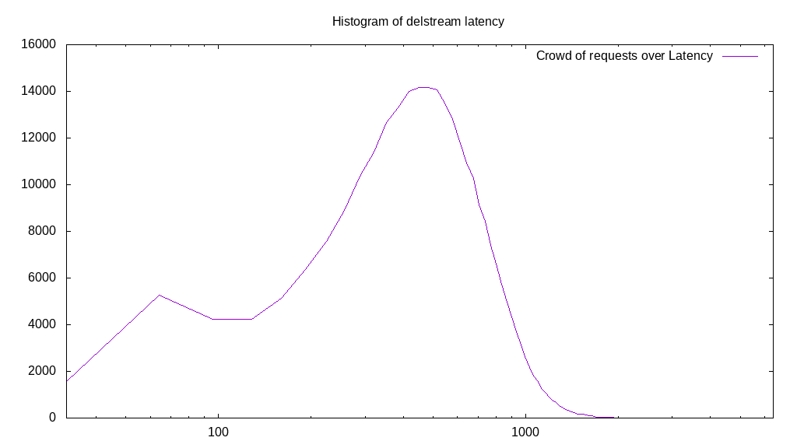

# Latency benchmark report. Crowd is 512

## Populate workload

## Object Size is 0.00kiB

### PUT Latency in ms over time

Evolution of PUT Latency over time

| Parameter | Value |
| --- | --- |
| Y Coordinate | PUT Latency in ms |
| X Coordinate | time in s since begining of workload |

### PUT Latency distribution in ms

Distribution of the PUT Latency in ms

| Parameter | Value |
| --- | --- |
| Y Coordinate | Number of PUT |
| X Coordinate | Latency in ms |
| Server volume | 0.000MiB|
| Server bandwidth | 0.000MiB/s |
| Server time | 300.00s |
| Server load | 511.10 |
| Server responses | 276553PUT |
| Server IOps | 921.85PUT/s |
| Client bandwidth | 0.000MiB/s |
| Client volume | 0.000MiB|
| Client time | 153330.54s |
| Client IOps |  1.80PUT/s  |
| Client Latency | 554.43ms/PUT |
| Client Limbo | 0.53ms/PUT |
| Crowd time | 153599.49s |
| Crowd efficiency | 99.82% |
| Highest Latency | 3681.11ms |
| 95th percentile Latency | 1091.64ms |
| 68th percentile Latency | 685.45ms |
| 50th percentile Latency | 558.51ms |
| 32nd percentile Latency | 431.58ms |
| 5th percentile Latency | 177.71ms |
| Lowest Latency | 25.39ms |

## Read workload

## Object Size is 0.00kiB

### GET Latency in ms over time

Evolution of GET Latency over time

| Parameter | Value |
| --- | --- |
| Y Coordinate | GET Latency in ms |
| X Coordinate | time in s since begining of workload |

### GET Latency distribution in ms

Distribution of the GET Latency in ms

| Parameter | Value |
| --- | --- |
| Y Coordinate | Number of GET |
| X Coordinate | Latency in ms |
| Server volume | 0.000MiB|
| Server bandwidth | 0.000MiB/s |
| Server time | 101.98s |
| Server load | 496.04 |
| Server responses | 73194GET |
| Server IOps | 717.72GET/s |
| Client bandwidth | 0.000MiB/s |
| Client volume | 0.000MiB|
| Client time | 50586.96s |
| Client IOps |  1.45GET/s  |
| Client Latency | 691.14ms/GET |
| Client Limbo | 3.18ms/GET |
| Crowd time | 52214.27s |
| Crowd efficiency | 96.88% |
| Highest Latency | 5052.00ms |
| 95th percentile Latency | 2081.73ms |
| 68th percentile Latency | 761.61ms |
| 50th percentile Latency | 482.35ms |
| 32nd percentile Latency | 330.03ms |
| 5th percentile Latency | 126.93ms |
| Lowest Latency | 25.39ms |

## Mixed workload

## Object Size is 0.00kiB

### PUT Latency in ms over time

Evolution of PUT Latency over time

| Parameter | Value |
| --- | --- |
| Y Coordinate | PUT Latency in ms |
| X Coordinate | time in s since begining of workload |

### GET Latency in ms over time

Evolution of GET Latency over time

| Parameter | Value |
| --- | --- |
| Y Coordinate | GET Latency in ms |
| X Coordinate | time in s since begining of workload |

### PUT Latency distribution in ms

Distribution of the PUT Latency in ms

| Parameter | Value |
| --- | --- |
| Y Coordinate | Number of PUT |
| X Coordinate | Latency in ms |
| Server volume | 0.000MiB|
| Server bandwidth | 0.000MiB/s |
| Server time | 102.38s |
| Server load | 221.23 |
| Server responses | 38839PUT |
| Server IOps | 379.36PUT/s |
| Client bandwidth | 0.000MiB/s |
| Client volume | 0.000MiB|
| Client time | 22649.88s |
| Client IOps |  1.71PUT/s  |
| Client Latency | 583.17ms/PUT |
| Client Limbo | 58.14ms/PUT |
| Crowd time | 52419.07s |
| Crowd efficiency | 43.21% |
| Highest Latency | 3300.30ms |
| 95th percentile Latency | 1193.19ms |
| 68th percentile Latency | 710.83ms |
| 50th percentile Latency | 558.51ms |
| 32nd percentile Latency | 431.58ms |
| 5th percentile Latency | 152.32ms |
| Lowest Latency | 25.39ms |

### GET Latency distribution in ms

Distribution of the GET Latency in ms

| Parameter | Value |
| --- | --- |
| Y Coordinate | Number of GET |
| X Coordinate | Latency in ms |
| Server volume | 0.000MiB|
| Server bandwidth | 0.000MiB/s |
| Server time | 102.38s |
| Server load | 279.48 |
| Server responses | 39650GET |
| Server IOps | 387.28GET/s |
| Client bandwidth | 0.000MiB/s |
| Client volume | 0.000MiB|
| Client time | 28613.16s |
| Client IOps |  1.39GET/s  |
| Client Latency | 721.64ms/GET |
| Client Limbo | 46.50ms/GET |
| Crowd time | 52419.07s |
| Crowd efficiency | 54.59% |
| Highest Latency | 3782.65ms |
| 95th percentile Latency | 1370.89ms |
| 68th percentile Latency | 863.16ms |
| 50th percentile Latency | 710.83ms |
| 32nd percentile Latency | 558.51ms |
| 5th percentile Latency | 253.87ms |
| Lowest Latency | 25.39ms |

## Cleanup workload

## Object Size is 0.00kiB

### DELETE Latency in ms over time

Evolution of DELETE Latency over time

| Parameter | Value |
| --- | --- |
| Y Coordinate | DELETE Latency in ms |
| X Coordinate | time in s since begining of workload |

### DELETE Latency distribution in ms

Distribution of the DELETE Latency in ms

| Parameter | Value |
| --- | --- |
| Y Coordinate | Number of DELETE |
| X Coordinate | Latency in ms |
| Server volume | 0.000MiB|
| Server bandwidth | 0.000MiB/s |
| Server time | 293.21s |
| Server load | 505.52 |
| Server responses | 276561DELETE |
| Server IOps | 943.21DELETE/s |
| Client bandwidth | 0.000MiB/s |
| Client volume | 0.000MiB|
| Client time | 148225.51s |
| Client IOps |  1.87DELETE/s  |
| Client Latency | 535.96ms/DELETE |
| Client Limbo | 3.71ms/DELETE |
| Crowd time | 150125.57s |
| Crowd efficiency | 98.73% |
| Highest Latency | 2513.31ms |
| 95th percentile Latency | 1040.86ms |
| 68th percentile Latency | 660.06ms |
| 50th percentile Latency | 533.13ms |
| 32nd percentile Latency | 431.58ms |
| 5th percentile Latency | 152.32ms |
| Lowest Latency | 25.39ms |

