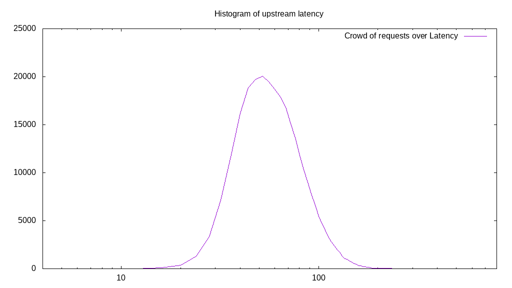
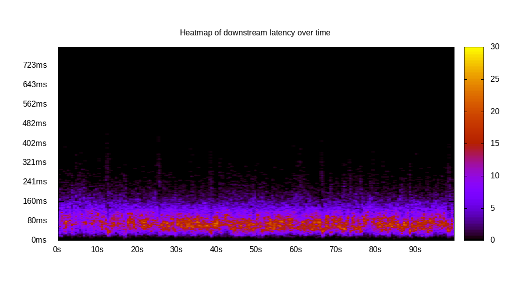
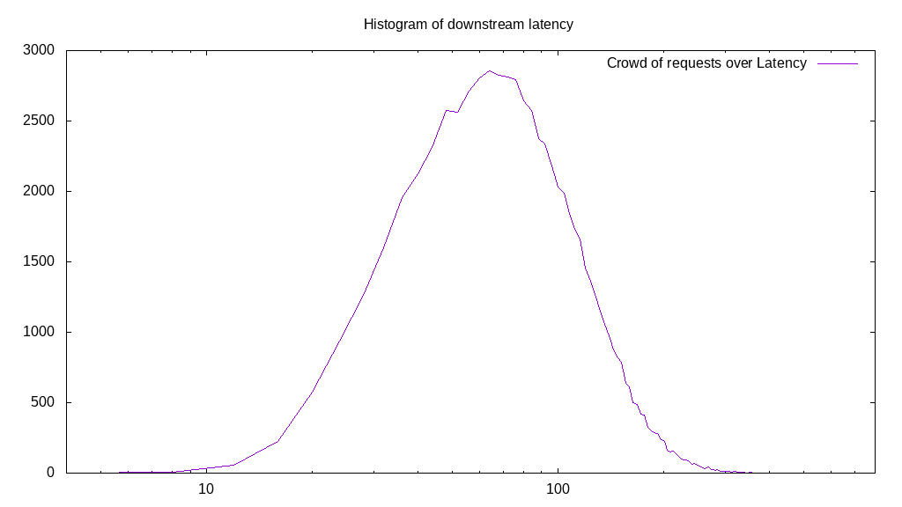
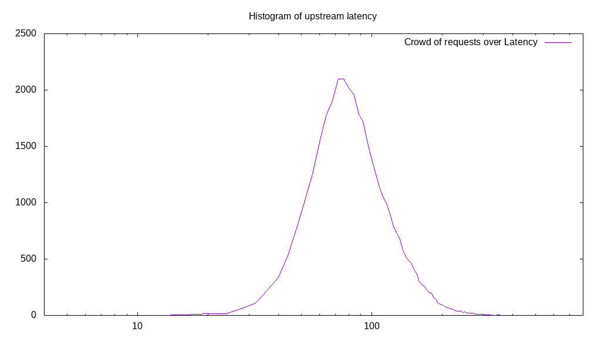
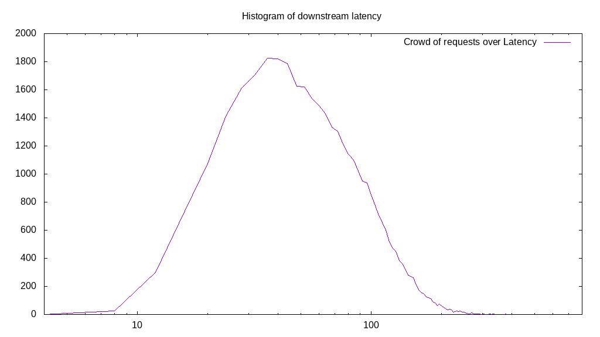
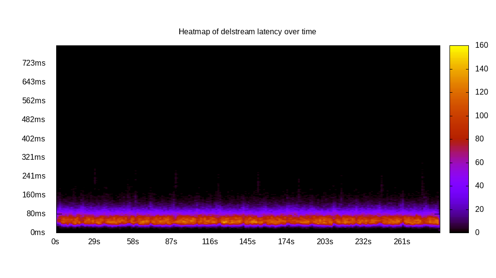
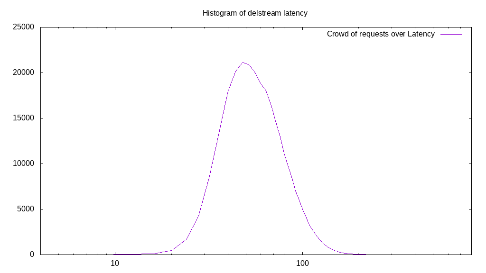

# Latency benchmark report. Crowd is 64

## Populate workload

## Object Size is 0.00kiB

### PUT Latency in ms over time

Evolution of PUT Latency over time

| Parameter | Value |
| --- | --- |
| Y Coordinate | PUT Latency in ms |
| X Coordinate | time in s since begining of workload |

### PUT Latency distribution in ms

Distribution of the PUT Latency in ms

| Parameter | Value |
| --- | --- |
| Y Coordinate | Number of PUT |
| X Coordinate | Latency in ms |
| Server volume | 0.000MiB|
| Server bandwidth | 0.000MiB/s |
| Server time | 300.00s |
| Server load | 63.88 |
| Server responses | 281118PUT |
| Server IOps | 937.07PUT/s |
| Client bandwidth | 0.000MiB/s |
| Client volume | 0.000MiB|
| Client time | 19165.34s |
| Client IOps |  14.67PUT/s  |
| Client Latency | 68.18ms/PUT |
| Client Limbo | 0.54ms/PUT |
| Crowd time | 19199.87s |
| Crowd efficiency | 99.82% |
| Highest Latency | 426.13ms |
| 95th percentile Latency | 124.62ms |
| 68th percentile Latency | 80.40ms |
| 50th percentile Latency | 68.34ms |
| 32nd percentile Latency | 56.28ms |
| 5th percentile Latency | 40.20ms |
| Lowest Latency | 12.06ms |

## Read workload

## Object Size is 0.00kiB

### GET Latency in ms over time

Evolution of GET Latency over time

| Parameter | Value |
| --- | --- |
| Y Coordinate | GET Latency in ms |
| X Coordinate | time in s since begining of workload |

### GET Latency distribution in ms

Distribution of the GET Latency in ms

| Parameter | Value |
| --- | --- |
| Y Coordinate | Number of GET |
| X Coordinate | Latency in ms |
| Server volume | 0.000MiB|
| Server bandwidth | 0.000MiB/s |
| Server time | 100.10s |
| Server load | 63.74 |
| Server responses | 70594GET |
| Server IOps | 705.23GET/s |
| Client bandwidth | 0.000MiB/s |
| Client volume | 0.000MiB|
| Client time | 6380.59s |
| Client IOps |  11.06GET/s  |
| Client Latency | 90.38ms/GET |
| Client Limbo | 0.40ms/GET |
| Crowd time | 6406.46s |
| Crowd efficiency | 99.60% |
| Highest Latency | 442.21ms |
| 95th percentile Latency | 180.90ms |
| 68th percentile Latency | 108.54ms |
| 50th percentile Latency | 84.42ms |
| 32nd percentile Latency | 68.34ms |
| 5th percentile Latency | 36.18ms |
| Lowest Latency | 8.04ms |

## Mixed workload

## Object Size is 0.00kiB

### PUT Latency in ms over time

Evolution of PUT Latency over time

| Parameter | Value |
| --- | --- |
| Y Coordinate | PUT Latency in ms |
| X Coordinate | time in s since begining of workload |

### GET Latency in ms over time

Evolution of GET Latency over time

| Parameter | Value |
| --- | --- |
| Y Coordinate | GET Latency in ms |
| X Coordinate | time in s since begining of workload |

### PUT Latency distribution in ms

Distribution of the PUT Latency in ms

| Parameter | Value |
| --- | --- |
| Y Coordinate | Number of PUT |
| X Coordinate | Latency in ms |
| Server volume | 0.000MiB|
| Server bandwidth | 0.000MiB/s |
| Server time | 100.22s |
| Server load | 36.44 |
| Server responses | 37440PUT |
| Server IOps | 373.59PUT/s |
| Client bandwidth | 0.000MiB/s |
| Client volume | 0.000MiB|
| Client time | 3651.49s |
| Client IOps |  10.25PUT/s  |
| Client Latency | 97.53ms/PUT |
| Client Limbo | 43.16ms/PUT |
| Crowd time | 6413.89s |
| Crowd efficiency | 56.93% |
| Highest Latency | 462.31ms |
| 95th percentile Latency | 176.88ms |
| 68th percentile Latency | 112.56ms |
| 50th percentile Latency | 92.46ms |
| 32nd percentile Latency | 80.40ms |
| 5th percentile Latency | 52.26ms |
| Lowest Latency | 12.06ms |

### GET Latency distribution in ms

Distribution of the GET Latency in ms

| Parameter | Value |
| --- | --- |
| Y Coordinate | Number of GET |
| X Coordinate | Latency in ms |
| Server volume | 0.000MiB|
| Server bandwidth | 0.000MiB/s |
| Server time | 100.22s |
| Server load | 27.32 |
| Server responses | 37771GET |
| Server IOps | 376.89GET/s |
| Client bandwidth | 0.000MiB/s |
| Client volume | 0.000MiB|
| Client time | 2738.26s |
| Client IOps |  13.79GET/s  |
| Client Latency | 72.50ms/GET |
| Client Limbo | 57.43ms/GET |
| Crowd time | 6413.89s |
| Crowd efficiency | 42.69% |
| Highest Latency | 458.29ms |
| 95th percentile Latency | 156.78ms |
| 68th percentile Latency | 88.44ms |
| 50th percentile Latency | 68.34ms |
| 32nd percentile Latency | 48.24ms |
| 5th percentile Latency | 24.12ms |
| Lowest Latency | 8.04ms |

## Cleanup workload

## Object Size is 0.00kiB

### DELETE Latency in ms over time

Evolution of DELETE Latency over time

| Parameter | Value |
| --- | --- |
| Y Coordinate | DELETE Latency in ms |
| X Coordinate | time in s since begining of workload |

### DELETE Latency distribution in ms

Distribution of the DELETE Latency in ms

| Parameter | Value |
| --- | --- |
| Y Coordinate | Number of DELETE |
| X Coordinate | Latency in ms |
| Server volume | 0.000MiB|
| Server bandwidth | 0.000MiB/s |
| Server time | 288.74s |
| Server load | 63.80 |
| Server responses | 281126DELETE |
| Server IOps | 973.63DELETE/s |
| Client bandwidth | 0.000MiB/s |
| Client volume | 0.000MiB|
| Client time | 18421.29s |
| Client IOps |  15.26DELETE/s  |
| Client Latency | 65.53ms/DELETE |
| Client Limbo | 0.91ms/DELETE |
| Crowd time | 18479.30s |
| Crowd efficiency | 99.69% |
| Highest Latency | 353.77ms |
| 95th percentile Latency | 116.58ms |
| 68th percentile Latency | 76.38ms |
| 50th percentile Latency | 64.32ms |
| 32nd percentile Latency | 56.28ms |
| 5th percentile Latency | 36.18ms |
| Lowest Latency | 8.04ms |

