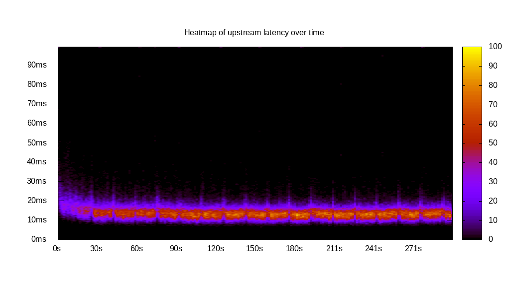
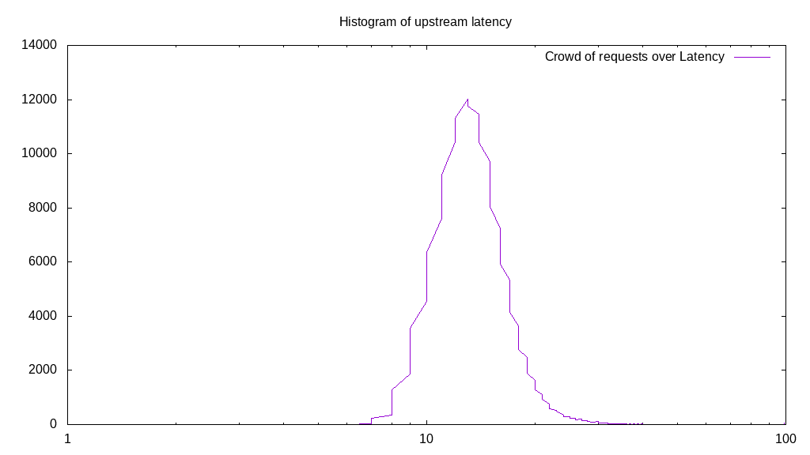
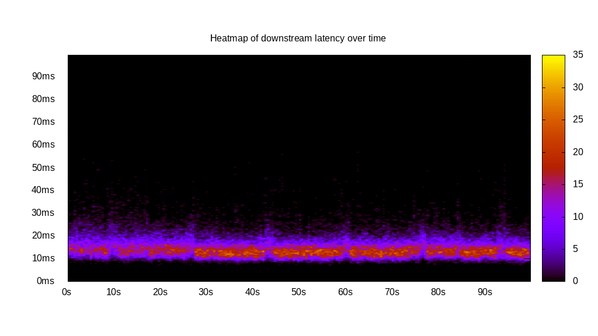
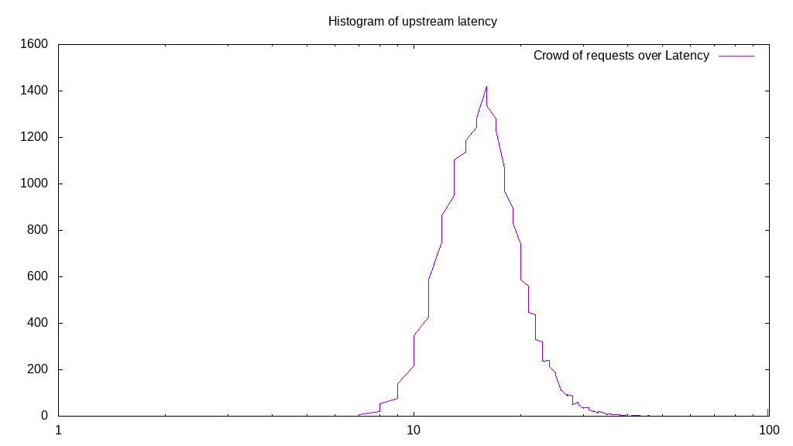
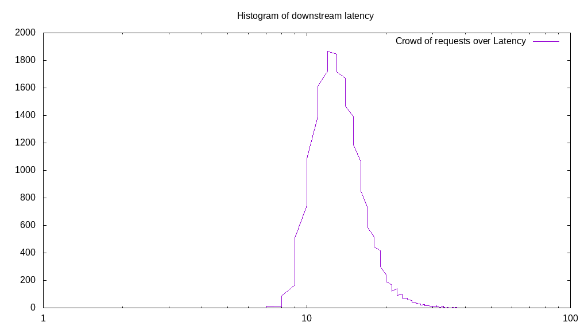
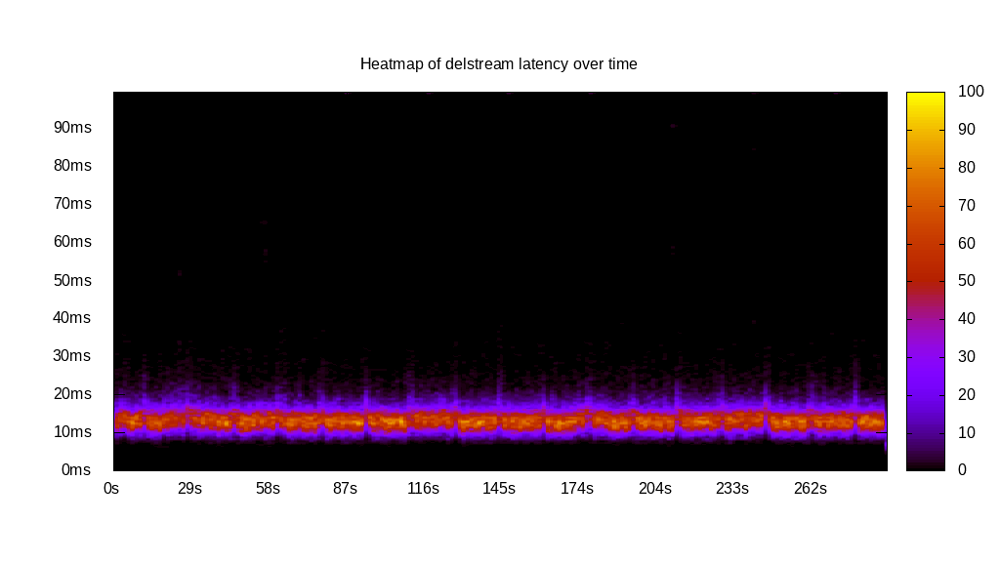
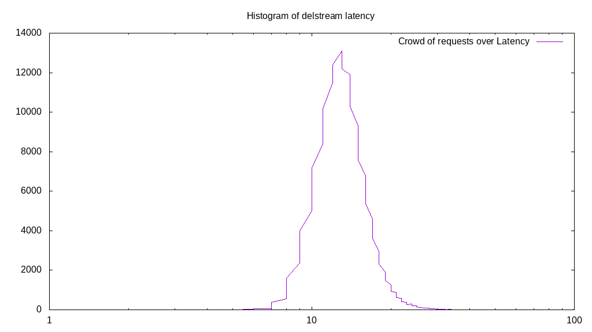

# Latency benchmark report. Crowd is 8

## Populate workload

## Object Size is 0.00kiB

### PUT Latency in ms over time

Evolution of PUT Latency over time

| Parameter | Value |
| --- | --- |
| Y Coordinate | PUT Latency in ms |
| X Coordinate | time in s since begining of workload |

### PUT Latency distribution in ms

Distribution of the PUT Latency in ms

| Parameter | Value |
| --- | --- |
| Y Coordinate | Number of PUT |
| X Coordinate | Latency in ms |
| Server volume | 0.000MiB|
| Server bandwidth | 0.000MiB/s |
| Server time | 299.99s |
| Server load | 7.93 |
| Server responses | 164300PUT |
| Server IOps | 547.68PUT/s |
| Client bandwidth | 0.000MiB/s |
| Client volume | 0.000MiB|
| Client time | 2378.82s |
| Client IOps |  69.07PUT/s  |
| Client Latency | 14.48ms/PUT |
| Client Limbo | 2.64ms/PUT |
| Crowd time | 2399.94s |
| Crowd efficiency | 99.12% |
| Highest Latency | 100.00ms |
| 95th percentile Latency | 21.11ms |
| 68th percentile Latency | 15.58ms |
| 50th percentile Latency | 14.57ms |
| 32nd percentile Latency | 13.07ms |
| 5th percentile Latency | 10.55ms |
| Lowest Latency | 6.53ms |

## Read workload

## Object Size is 0.00kiB

### GET Latency in ms over time

Evolution of GET Latency over time

| Parameter | Value |
| --- | --- |
| Y Coordinate | GET Latency in ms |
| X Coordinate | time in s since begining of workload |

### GET Latency distribution in ms

Distribution of the GET Latency in ms

| Parameter | Value |
| --- | --- |
| Y Coordinate | Number of GET |
| X Coordinate | Latency in ms |
| Server volume | 0.000MiB|
| Server bandwidth | 0.000MiB/s |
| Server time | 100.02s |
| Server load | 7.92 |
| Server responses | 52759GET |
| Server IOps | 527.48GET/s |
| Client bandwidth | 0.000MiB/s |
| Client volume | 0.000MiB|
| Client time | 792.31s |
| Client IOps |  66.59GET/s  |
| Client Latency | 15.02ms/GET |
| Client Limbo | 0.98ms/GET |
| Crowd time | 800.16s |
| Crowd efficiency | 99.02% |
| Highest Latency | 100.00ms |
| 95th percentile Latency | 22.61ms |
| 68th percentile Latency | 16.58ms |
| 50th percentile Latency | 14.57ms |
| 32nd percentile Latency | 13.57ms |
| 5th percentile Latency | 11.06ms |
| Lowest Latency | 7.54ms |

## Mixed workload

## Object Size is 0.00kiB

### PUT Latency in ms over time

Evolution of PUT Latency over time

| Parameter | Value |
| --- | --- |
| Y Coordinate | PUT Latency in ms |
| X Coordinate | time in s since begining of workload |

### GET Latency in ms over time

Evolution of GET Latency over time

| Parameter | Value |
| --- | --- |
| Y Coordinate | GET Latency in ms |
| X Coordinate | time in s since begining of workload |

### PUT Latency distribution in ms

Distribution of the PUT Latency in ms

| Parameter | Value |
| --- | --- |
| Y Coordinate | Number of PUT |
| X Coordinate | Latency in ms |
| Server volume | 0.000MiB|
| Server bandwidth | 0.000MiB/s |
| Server time | 100.01s |
| Server load | 4.32 |
| Server responses | 24916PUT |
| Server IOps | 249.13PUT/s |
| Client bandwidth | 0.000MiB/s |
| Client volume | 0.000MiB|
| Client time | 431.71s |
| Client IOps |  57.71PUT/s  |
| Client Latency | 17.33ms/PUT |
| Client Limbo | 46.05ms/PUT |
| Crowd time | 800.09s |
| Crowd efficiency | 53.96% |
| Highest Latency | 100.00ms |
| 95th percentile Latency | 25.63ms |
| 68th percentile Latency | 19.10ms |
| 50th percentile Latency | 17.09ms |
| 32nd percentile Latency | 15.58ms |
| 5th percentile Latency | 11.56ms |
| Lowest Latency | 6.53ms |

### GET Latency distribution in ms

Distribution of the GET Latency in ms

| Parameter | Value |
| --- | --- |
| Y Coordinate | Number of GET |
| X Coordinate | Latency in ms |
| Server volume | 0.000MiB|
| Server bandwidth | 0.000MiB/s |
| Server time | 100.01s |
| Server load | 3.61 |
| Server responses | 25059GET |
| Server IOps | 250.56GET/s |
| Client bandwidth | 0.000MiB/s |
| Client volume | 0.000MiB|
| Client time | 360.86s |
| Client IOps |  69.44GET/s  |
| Client Latency | 14.40ms/GET |
| Client Limbo | 54.90ms/GET |
| Crowd time | 800.09s |
| Crowd efficiency | 45.10% |
| Highest Latency | 100.00ms |
| 95th percentile Latency | 21.11ms |
| 68th percentile Latency | 15.58ms |
| 50th percentile Latency | 14.07ms |
| 32nd percentile Latency | 13.07ms |
| 5th percentile Latency | 10.55ms |
| Lowest Latency | 6.53ms |

## Cleanup workload

## Object Size is 0.00kiB

### DELETE Latency in ms over time

Evolution of DELETE Latency over time

| Parameter | Value |
| --- | --- |
| Y Coordinate | DELETE Latency in ms |
| X Coordinate | time in s since begining of workload |

### DELETE Latency distribution in ms

Distribution of the DELETE Latency in ms

| Parameter | Value |
| --- | --- |
| Y Coordinate | Number of DELETE |
| X Coordinate | Latency in ms |
| Server volume | 0.000MiB|
| Server bandwidth | 0.000MiB/s |
| Server time | 290.19s |
| Server load | 7.92 |
| Server responses | 164308DELETE |
| Server IOps | 566.20DELETE/s |
| Client bandwidth | 0.000MiB/s |
| Client volume | 0.000MiB|
| Client time | 2298.23s |
| Client IOps |  71.49DELETE/s  |
| Client Latency | 13.99ms/DELETE |
| Client Limbo | 2.92ms/DELETE |
| Crowd time | 2321.56s |
| Crowd efficiency | 98.99% |
| Highest Latency | 100.00ms |
| 95th percentile Latency | 20.10ms |
| 68th percentile Latency | 15.58ms |
| 50th percentile Latency | 14.07ms |
| 32nd percentile Latency | 13.07ms |
| 5th percentile Latency | 10.05ms |
| Lowest Latency | 4.52ms |

