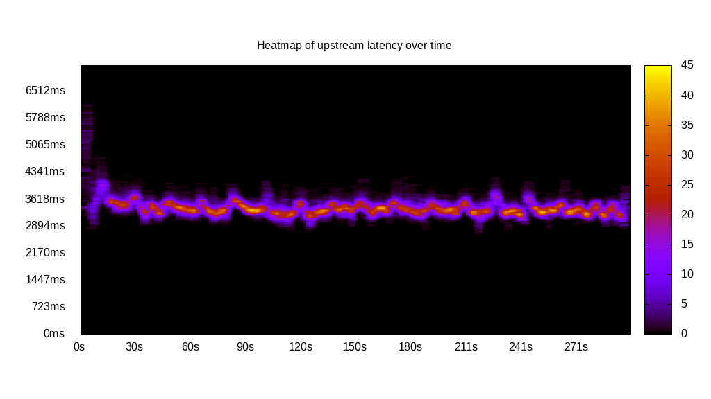
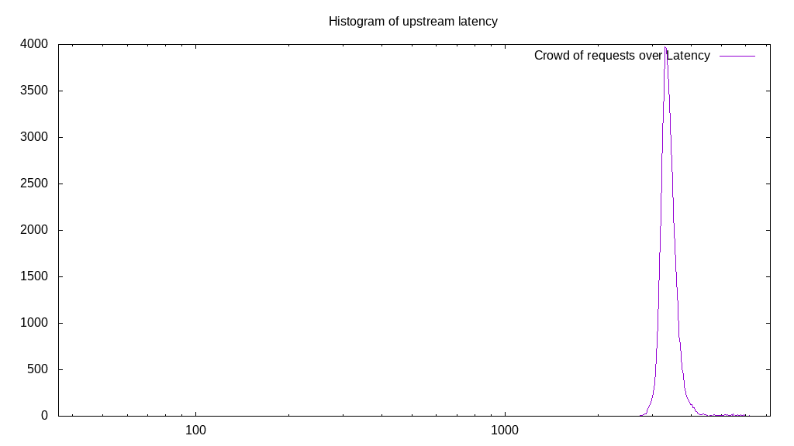
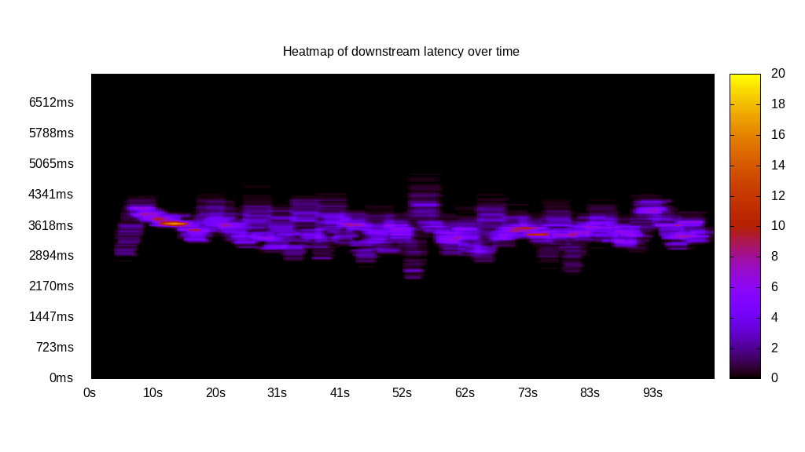
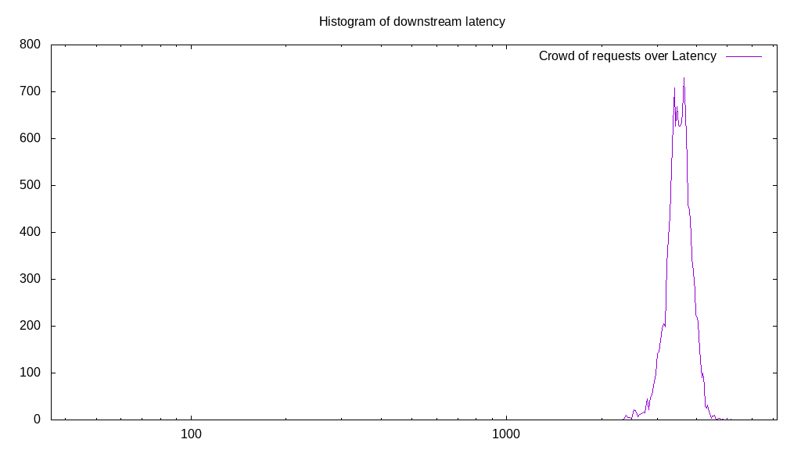
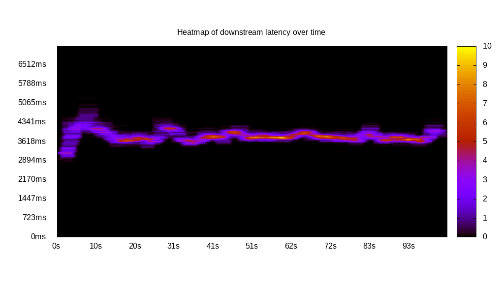
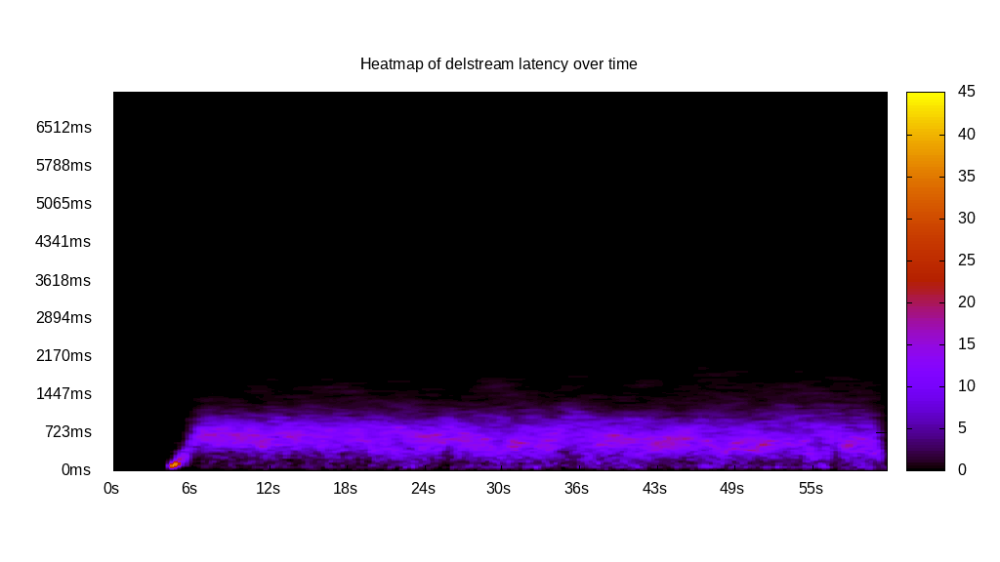
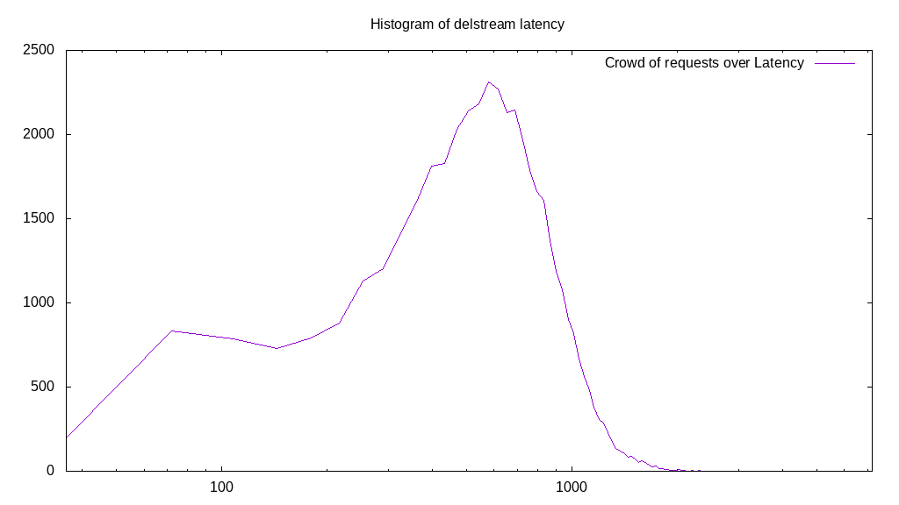

# Latency benchmark report. Crowd is 512

## Populate workload

## Object Size is 1024.00kiB

### PUT Latency in ms over time

Evolution of PUT Latency over time

| Parameter | Value |
| --- | --- |
| Y Coordinate | PUT Latency in ms |
| X Coordinate | time in s since begining of workload |

### PUT Latency distribution in ms

Distribution of the PUT Latency in ms

| Parameter | Value |
| --- | --- |
| Y Coordinate | Number of PUT |
| X Coordinate | Latency in ms |
| Server volume | 44846.000MiB|
| Server bandwidth | 149.480MiB/s |
| Server time | 300.01s |
| Server load | 508.85 |
| Server responses | 44846PUT |
| Server IOps | 149.48PUT/s |
| Client bandwidth | 0.292MiB/s |
| Client volume | 87.590MiB|
| Client time | 152661.98s |
| Client IOps |  0.29PUT/s  |
| Client Latency | 3404.14ms/PUT |
| Client Limbo | 1.85ms/PUT |
| Crowd time | 153606.66s |
| Crowd efficiency | 99.39% |
| Highest Latency | 6336.00ms |
| 95th percentile Latency | 3820.70ms |
| 68th percentile Latency | 3470.47ms |
| 50th percentile Latency | 3406.79ms |
| 32nd percentile Latency | 3311.28ms |
| 5th percentile Latency | 3152.08ms |
| Lowest Latency | 2483.46ms |

## Read workload

## Object Size is 1024.00kiB

### GET Latency in ms over time

Evolution of GET Latency over time

| Parameter | Value |
| --- | --- |
| Y Coordinate | GET Latency in ms |
| X Coordinate | time in s since begining of workload |

### GET Latency distribution in ms

Distribution of the GET Latency in ms

| Parameter | Value |
| --- | --- |
| Y Coordinate | Number of GET |
| X Coordinate | Latency in ms |
| Server volume | 13934.000MiB|
| Server bandwidth | 134.136MiB/s |
| Server time | 103.88s |
| Server load | 477.21 |
| Server responses | 13934GET |
| Server IOps | 134.14GET/s |
| Client bandwidth | 0.262MiB/s |
| Client volume | 27.215MiB|
| Client time | 49572.09s |
| Client IOps |  0.28GET/s  |
| Client Latency | 3557.63ms/GET |
| Client Limbo | 7.06ms/GET |
| Crowd time | 53186.56s |
| Crowd efficiency | 93.20% |
| Highest Latency | 5126.11ms |
| 95th percentile Latency | 4107.26ms |
| 68th percentile Latency | 3725.19ms |
| 50th percentile Latency | 3597.83ms |
| 32nd percentile Latency | 3438.63ms |
| 5th percentile Latency | 3088.40ms |
| Lowest Latency | 2356.10ms |

## Mixed workload

## Object Size is 1024.00kiB

### PUT Latency in ms over time

Evolution of PUT Latency over time

| Parameter | Value |
| --- | --- |
| Y Coordinate | PUT Latency in ms |
| X Coordinate | time in s since begining of workload |

### GET Latency in ms over time

Evolution of GET Latency over time

| Parameter | Value |
| --- | --- |
| Y Coordinate | GET Latency in ms |
| X Coordinate | time in s since begining of workload |

### PUT Latency distribution in ms

Distribution of the PUT Latency in ms

| Parameter | Value |
| --- | --- |
| Y Coordinate | Number of PUT |
| X Coordinate | Latency in ms |
| Server volume | 6185.000MiB|
| Server bandwidth | 59.838MiB/s |
| Server time | 103.36s |
| Server load | 243.10 |
| Server responses | 6185PUT |
| Server IOps | 59.84PUT/s |
| Client bandwidth | 0.117MiB/s |
| Client volume | 12.080MiB|
| Client time | 25127.47s |
| Client IOps |  0.25PUT/s  |
| Client Latency | 4062.65ms/PUT |
| Client Limbo | 54.28ms/PUT |
| Crowd time | 52921.34s |
| Crowd efficiency | 47.48% |
| Highest Latency | 5030.59ms |
| 95th percentile Latency | 4393.81ms |
| 68th percentile Latency | 4139.10ms |
| 50th percentile Latency | 4075.42ms |
| 32nd percentile Latency | 4011.74ms |
| 5th percentile Latency | 3852.54ms |
| Lowest Latency | 3629.67ms |

### GET Latency distribution in ms

Distribution of the GET Latency in ms

| Parameter | Value |
| --- | --- |
| Y Coordinate | Number of GET |
| X Coordinate | Latency in ms |
| Server volume | 6798.000MiB|
| Server bandwidth | 65.769MiB/s |
| Server time | 103.36s |
| Server load | 251.38 |
| Server responses | 6798GET |
| Server IOps | 65.77GET/s |
| Client bandwidth | 0.128MiB/s |
| Client volume | 13.277MiB|
| Client time | 25983.60s |
| Client IOps |  0.26GET/s  |
| Client Latency | 3822.24ms/GET |
| Client Limbo | 52.61ms/GET |
| Crowd time | 52921.34s |
| Crowd efficiency | 49.10% |
| Highest Latency | 5253.47ms |
| 95th percentile Latency | 4234.61ms |
| 68th percentile Latency | 3916.22ms |
| 50th percentile Latency | 3820.70ms |
| 32nd percentile Latency | 3757.03ms |
| 5th percentile Latency | 3565.99ms |
| Lowest Latency | 2865.53ms |

## Cleanup workload

## Object Size is 1024.00kiB

### DELETE Latency in ms over time

Evolution of DELETE Latency over time

| Parameter | Value |
| --- | --- |
| Y Coordinate | DELETE Latency in ms |
| X Coordinate | time in s since begining of workload |

### DELETE Latency distribution in ms

Distribution of the DELETE Latency in ms

| Parameter | Value |
| --- | --- |
| Y Coordinate | Number of DELETE |
| X Coordinate | Latency in ms |
| Server volume | 44854.000MiB|
| Server bandwidth | 731.105MiB/s |
| Server time | 61.35s |
| Server load | 456.80 |
| Server responses | 44854DELETE |
| Server IOps | 731.10DELETE/s |
| Client bandwidth | 1.428MiB/s |
| Client volume | 87.605MiB|
| Client time | 28025.31s |
| Client IOps |  1.60DELETE/s  |
| Client Latency | 624.81ms/DELETE |
| Client Limbo | 6.61ms/DELETE |
| Crowd time | 31411.71s |
| Crowd efficiency | 89.22% |
| Highest Latency | 2547.14ms |
| 95th percentile Latency | 1178.05ms |
| 68th percentile Latency | 764.14ms |
| 50th percentile Latency | 636.78ms |
| 32nd percentile Latency | 509.43ms |
| 5th percentile Latency | 191.04ms |
| Lowest Latency | 31.84ms |

