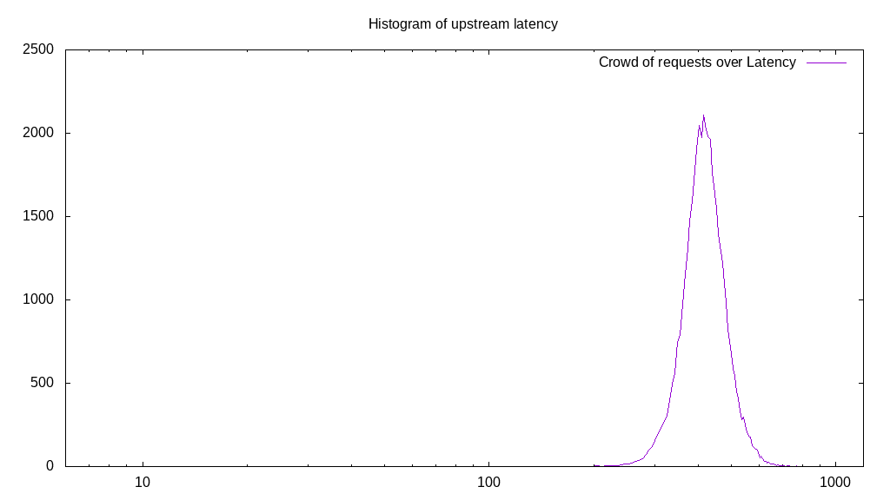
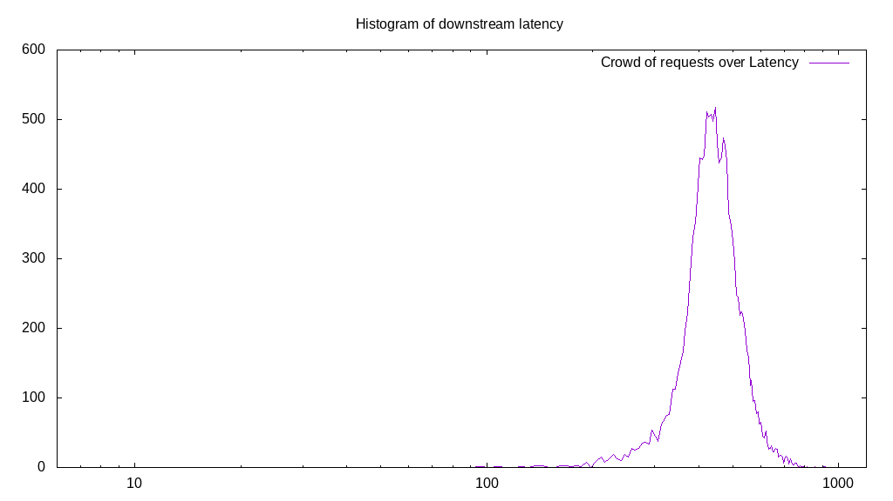
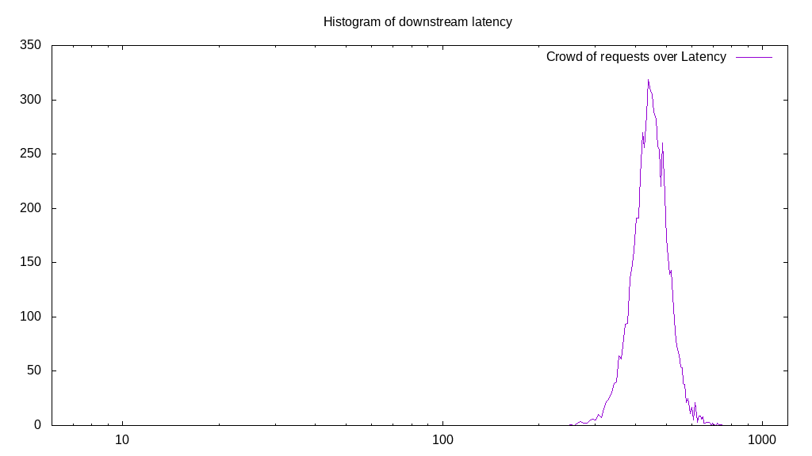
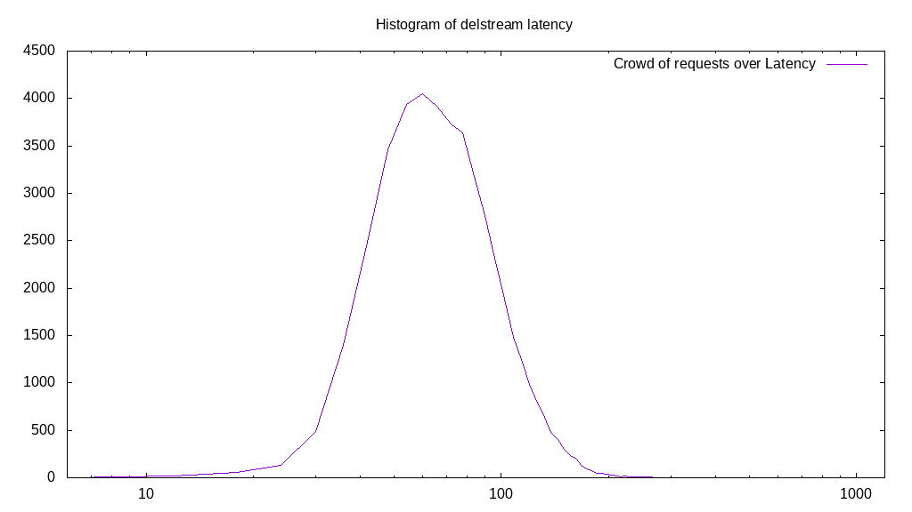

# Latency benchmark report. Crowd is 64

## Populate workload

## Object Size is 1024.00kiB

### PUT Latency in ms over time

Evolution of PUT Latency over time

| Parameter | Value |
| --- | --- |
| Y Coordinate | PUT Latency in ms |
| X Coordinate | time in s since begining of workload |

### PUT Latency distribution in ms

Distribution of the PUT Latency in ms

| Parameter | Value |
| --- | --- |
| Y Coordinate | Number of PUT |
| X Coordinate | Latency in ms |
| Server volume | 44761.000MiB|
| Server bandwidth | 149.203MiB/s |
| Server time | 300.00s |
| Server load | 63.90 |
| Server responses | 44761PUT |
| Server IOps | 149.20PUT/s |
| Client bandwidth | 2.331MiB/s |
| Client volume | 699.391MiB|
| Client time | 19170.85s |
| Client IOps |  2.33PUT/s  |
| Client Latency | 428.29ms/PUT |
| Client Limbo | 0.46ms/PUT |
| Crowd time | 19200.00s |
| Crowd efficiency | 99.85% |
| Highest Latency | 892.46ms |
| 95th percentile Latency | 542.71ms |
| 68th percentile Latency | 458.29ms |
| 50th percentile Latency | 428.14ms |
| 32nd percentile Latency | 404.02ms |
| 5th percentile Latency | 343.72ms |
| Lowest Latency | 138.69ms |

## Read workload

## Object Size is 1024.00kiB

### GET Latency in ms over time

Evolution of GET Latency over time

| Parameter | Value |
| --- | --- |
| Y Coordinate | GET Latency in ms |
| X Coordinate | time in s since begining of workload |

### GET Latency distribution in ms

Distribution of the GET Latency in ms

| Parameter | Value |
| --- | --- |
| Y Coordinate | Number of GET |
| X Coordinate | Latency in ms |
| Server volume | 14045.000MiB|
| Server bandwidth | 139.829MiB/s |
| Server time | 100.44s |
| Server load | 63.47 |
| Server responses | 14045GET |
| Server IOps | 139.83GET/s |
| Client bandwidth | 2.185MiB/s |
| Client volume | 219.453MiB|
| Client time | 6375.65s |
| Client IOps |  2.20GET/s  |
| Client Latency | 453.94ms/GET |
| Client Limbo | 0.82ms/GET |
| Crowd time | 6428.42s |
| Crowd efficiency | 99.18% |
| Highest Latency | 916.58ms |
| 95th percentile Latency | 596.98ms |
| 68th percentile Latency | 488.44ms |
| 50th percentile Latency | 452.26ms |
| 32nd percentile Latency | 422.11ms |
| 5th percentile Latency | 337.69ms |
| Lowest Latency | 96.48ms |

## Mixed workload

## Object Size is 1024.00kiB

### PUT Latency in ms over time

Evolution of PUT Latency over time

| Parameter | Value |
| --- | --- |
| Y Coordinate | PUT Latency in ms |
| X Coordinate | time in s since begining of workload |

### GET Latency in ms over time

Evolution of GET Latency over time

| Parameter | Value |
| --- | --- |
| Y Coordinate | GET Latency in ms |
| X Coordinate | time in s since begining of workload |

### PUT Latency distribution in ms

Distribution of the PUT Latency in ms

| Parameter | Value |
| --- | --- |
| Y Coordinate | Number of PUT |
| X Coordinate | Latency in ms |
| Server volume | 6677.000MiB|
| Server bandwidth | 66.601MiB/s |
| Server time | 100.25s |
| Server load | 33.75 |
| Server responses | 6677PUT |
| Server IOps | 66.60PUT/s |
| Client bandwidth | 1.041MiB/s |
| Client volume | 104.328MiB|
| Client time | 3383.81s |
| Client IOps |  1.97PUT/s  |
| Client Latency | 506.79ms/PUT |
| Client Limbo | 47.38ms/PUT |
| Crowd time | 6416.26s |
| Crowd efficiency | 52.74% |
| Highest Latency | 802.01ms |
| 95th percentile Latency | 621.11ms |
| 68th percentile Latency | 536.68ms |
| 50th percentile Latency | 506.53ms |
| 32nd percentile Latency | 482.41ms |
| 5th percentile Latency | 416.08ms |
| Lowest Latency | 247.24ms |

### GET Latency distribution in ms

Distribution of the GET Latency in ms

| Parameter | Value |
| --- | --- |
| Y Coordinate | Number of GET |
| X Coordinate | Latency in ms |
| Server volume | 6583.000MiB|
| Server bandwidth | 65.663MiB/s |
| Server time | 100.25s |
| Server load | 29.96 |
| Server responses | 6583GET |
| Server IOps | 65.66GET/s |
| Client bandwidth | 1.026MiB/s |
| Client volume | 102.859MiB|
| Client time | 3003.64s |
| Client IOps |  2.19GET/s  |
| Client Latency | 456.27ms/GET |
| Client Limbo | 53.32ms/GET |
| Crowd time | 6416.26s |
| Crowd efficiency | 46.81% |
| Highest Latency | 747.74ms |
| 95th percentile Latency | 560.80ms |
| 68th percentile Latency | 482.41ms |
| 50th percentile Latency | 458.29ms |
| 32nd percentile Latency | 434.17ms |
| 5th percentile Latency | 367.84ms |
| Lowest Latency | 253.27ms |

## Cleanup workload

## Object Size is 1024.00kiB

### DELETE Latency in ms over time

Evolution of DELETE Latency over time

| Parameter | Value |
| --- | --- |
| Y Coordinate | DELETE Latency in ms |
| X Coordinate | time in s since begining of workload |

### DELETE Latency distribution in ms

Distribution of the DELETE Latency in ms

| Parameter | Value |
| --- | --- |
| Y Coordinate | Number of DELETE |
| X Coordinate | Latency in ms |
| Server volume | 44769.000MiB|
| Server bandwidth | 803.521MiB/s |
| Server time | 55.72s |
| Server load | 62.90 |
| Server responses | 44769DELETE |
| Server IOps | 803.52DELETE/s |
| Client bandwidth | 12.555MiB/s |
| Client volume | 699.516MiB|
| Client time | 3504.70s |
| Client IOps |  12.77DELETE/s  |
| Client Latency | 78.28ms/DELETE |
| Client Limbo | 0.96ms/DELETE |
| Crowd time | 3565.82s |
| Crowd efficiency | 98.29% |
| Highest Latency | 319.60ms |
| 95th percentile Latency | 138.69ms |
| 68th percentile Latency | 90.45ms |
| 50th percentile Latency | 78.39ms |
| 32nd percentile Latency | 66.33ms |
| 5th percentile Latency | 48.24ms |
| Lowest Latency | 12.06ms |

