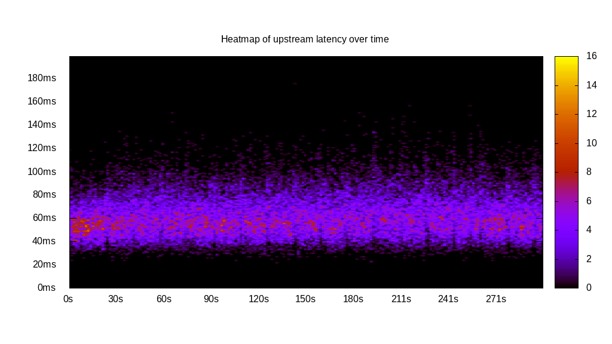
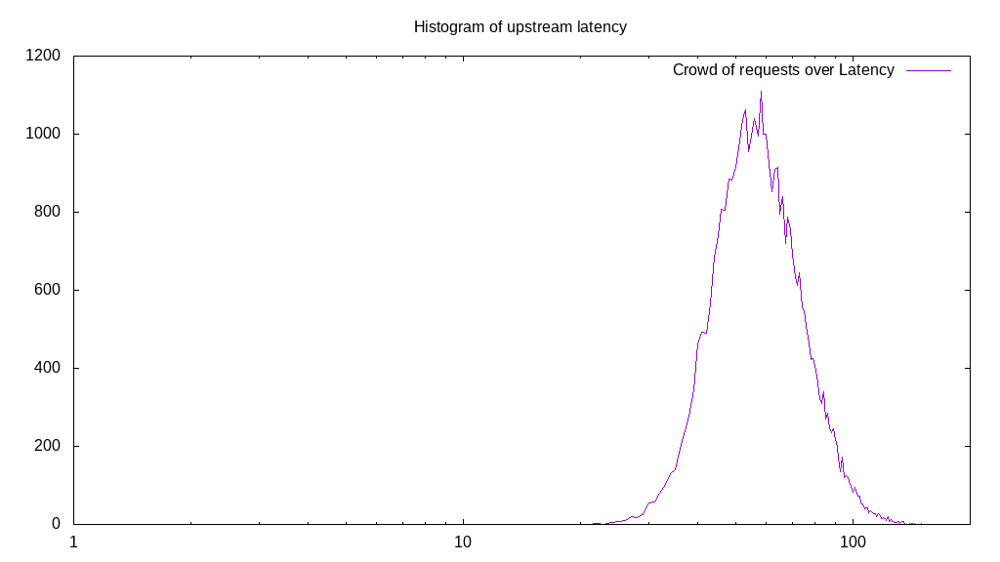
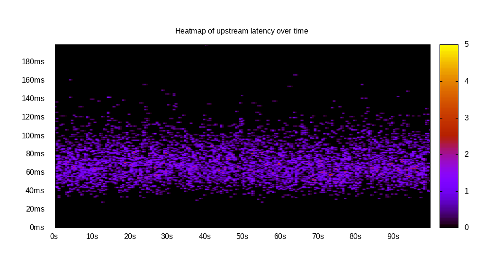
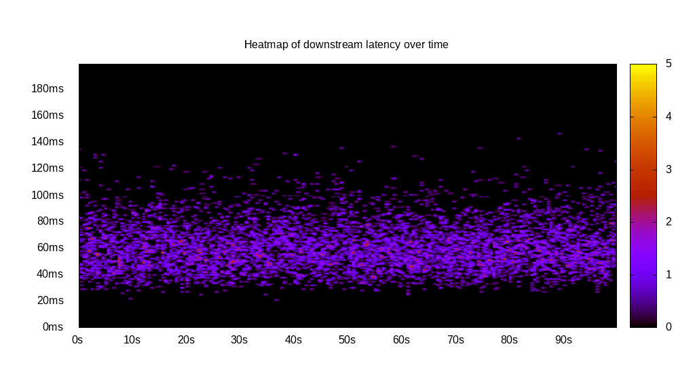
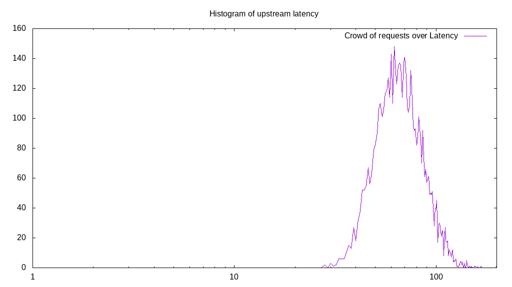
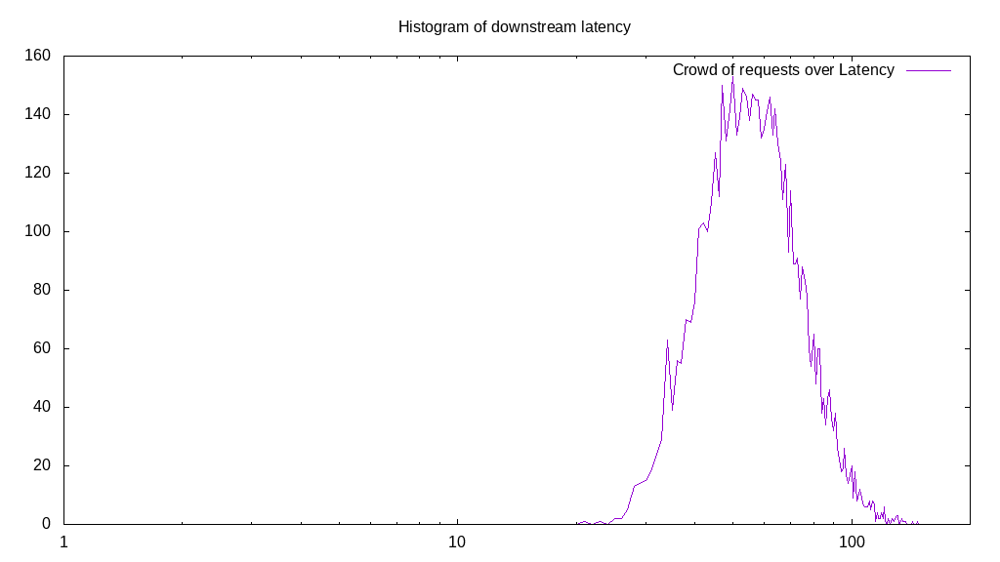
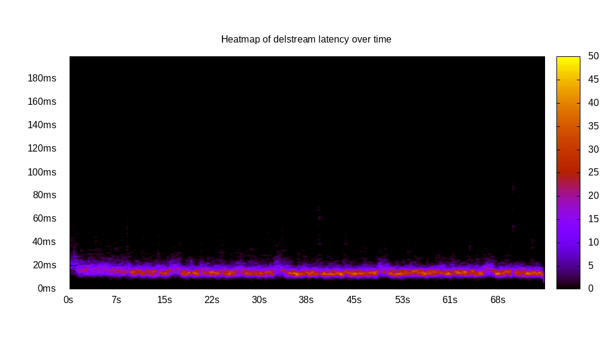

# Latency benchmark report. Crowd is 8

## Populate workload

## Object Size is 1024.00kiB

### PUT Latency in ms over time

Evolution of PUT Latency over time

| Parameter | Value |
| --- | --- |
| Y Coordinate | PUT Latency in ms |
| X Coordinate | time in s since begining of workload |

### PUT Latency distribution in ms

Distribution of the PUT Latency in ms

| Parameter | Value |
| --- | --- |
| Y Coordinate | Number of PUT |
| X Coordinate | Latency in ms |
| Server volume | 38157.000MiB|
| Server bandwidth | 127.200MiB/s |
| Server time | 299.98s |
| Server load | 7.97 |
| Server responses | 38157PUT |
| Server IOps | 127.20PUT/s |
| Client bandwidth | 15.900MiB/s |
| Client volume | 4769.625MiB|
| Client time | 2392.26s |
| Client IOps |  15.95PUT/s  |
| Client Latency | 62.70ms/PUT |
| Client Limbo | 0.94ms/PUT |
| Crowd time | 2399.82s |
| Crowd efficiency | 99.69% |
| Highest Latency | 175.88ms |
| 95th percentile Latency | 94.47ms |
| 68th percentile Latency | 69.35ms |
| 50th percentile Latency | 61.31ms |
| 32nd percentile Latency | 54.27ms |
| 5th percentile Latency | 41.21ms |
| Lowest Latency | 22.11ms |

## Read workload

## Object Size is 1024.00kiB

### GET Latency in ms over time

Evolution of GET Latency over time

| Parameter | Value |
| --- | --- |
| Y Coordinate | GET Latency in ms |
| X Coordinate | time in s since begining of workload |

### GET Latency distribution in ms

Distribution of the GET Latency in ms

| Parameter | Value |
| --- | --- |
| Y Coordinate | Number of GET |
| X Coordinate | Latency in ms |
| Server volume | 12410.000MiB|
| Server bandwidth | 124.049MiB/s |
| Server time | 100.04s |
| Server load | 7.96 |
| Server responses | 12410GET |
| Server IOps | 124.05GET/s |
| Client bandwidth | 15.506MiB/s |
| Client volume | 1551.250MiB|
| Client time | 796.30s |
| Client IOps |  15.58GET/s  |
| Client Latency | 64.17ms/GET |
| Client Limbo | 0.50ms/GET |
| Crowd time | 800.33s |
| Crowd efficiency | 99.50% |
| Highest Latency | 200.00ms |
| 95th percentile Latency | 95.48ms |
| 68th percentile Latency | 70.35ms |
| 50th percentile Latency | 63.32ms |
| 32nd percentile Latency | 56.28ms |
| 5th percentile Latency | 42.21ms |
| Lowest Latency | 26.13ms |

## Mixed workload

## Object Size is 1024.00kiB

### PUT Latency in ms over time

Evolution of PUT Latency over time

| Parameter | Value |
| --- | --- |
| Y Coordinate | PUT Latency in ms |
| X Coordinate | time in s since begining of workload |

### GET Latency in ms over time

Evolution of GET Latency over time

| Parameter | Value |
| --- | --- |
| Y Coordinate | GET Latency in ms |
| X Coordinate | time in s since begining of workload |

### PUT Latency distribution in ms

Distribution of the PUT Latency in ms

| Parameter | Value |
| --- | --- |
| Y Coordinate | Number of PUT |
| X Coordinate | Latency in ms |
| Server volume | 5900.000MiB|
| Server bandwidth | 58.984MiB/s |
| Server time | 100.03s |
| Server load | 4.25 |
| Server responses | 5900PUT |
| Server IOps | 58.98PUT/s |
| Client bandwidth | 7.373MiB/s |
| Client volume | 737.500MiB|
| Client time | 424.89s |
| Client IOps |  13.89PUT/s  |
| Client Latency | 72.02ms/PUT |
| Client Limbo | 46.92ms/PUT |
| Crowd time | 800.22s |
| Crowd efficiency | 53.10% |
| Highest Latency | 200.00ms |
| 95th percentile Latency | 107.54ms |
| 68th percentile Latency | 80.40ms |
| 50th percentile Latency | 70.35ms |
| 32nd percentile Latency | 62.31ms |
| 5th percentile Latency | 46.23ms |
| Lowest Latency | 28.14ms |

### GET Latency distribution in ms

Distribution of the GET Latency in ms

| Parameter | Value |
| --- | --- |
| Y Coordinate | Number of GET |
| X Coordinate | Latency in ms |
| Server volume | 6040.000MiB|
| Server bandwidth | 60.384MiB/s |
| Server time | 100.03s |
| Server load | 3.72 |
| Server responses | 6040GET |
| Server IOps | 60.38GET/s |
| Client bandwidth | 7.548MiB/s |
| Client volume | 755.000MiB|
| Client time | 372.39s |
| Client IOps |  16.22GET/s  |
| Client Latency | 61.65ms/GET |
| Client Limbo | 53.48ms/GET |
| Crowd time | 800.22s |
| Crowd efficiency | 46.54% |
| Highest Latency | 147.74ms |
| 95th percentile Latency | 94.47ms |
| 68th percentile Latency | 68.34ms |
| 50th percentile Latency | 60.30ms |
| 32nd percentile Latency | 53.27ms |
| 5th percentile Latency | 38.19ms |
| Lowest Latency | 21.11ms |

## Cleanup workload

## Object Size is 1024.00kiB

### DELETE Latency in ms over time

Evolution of DELETE Latency over time

| Parameter | Value |
| --- | --- |
| Y Coordinate | DELETE Latency in ms |
| X Coordinate | time in s since begining of workload |

### DELETE Latency distribution in ms

Distribution of the DELETE Latency in ms

| Parameter | Value |
| --- | --- |
| Y Coordinate | Number of DELETE |
| X Coordinate | Latency in ms |
| Server volume | 38165.000MiB|
| Server bandwidth | 502.793MiB/s |
| Server time | 75.91s |
| Server load | 7.90 |
| Server responses | 38165DELETE |
| Server IOps | 502.79DELETE/s |
| Client bandwidth | 62.849MiB/s |
| Client volume | 4770.625MiB|
| Client time | 599.63s |
| Client IOps |  63.65DELETE/s  |
| Client Latency | 15.71ms/DELETE |
| Client Limbo | 0.95ms/DELETE |
| Crowd time | 607.25s |
| Crowd efficiency | 98.75% |
| Highest Latency | 92.46ms |
| 95th percentile Latency | 24.12ms |
| 68th percentile Latency | 18.09ms |
| 50th percentile Latency | 16.08ms |
| 32nd percentile Latency | 15.08ms |
| 5th percentile Latency | 12.06ms |
| Lowest Latency | 6.03ms |

