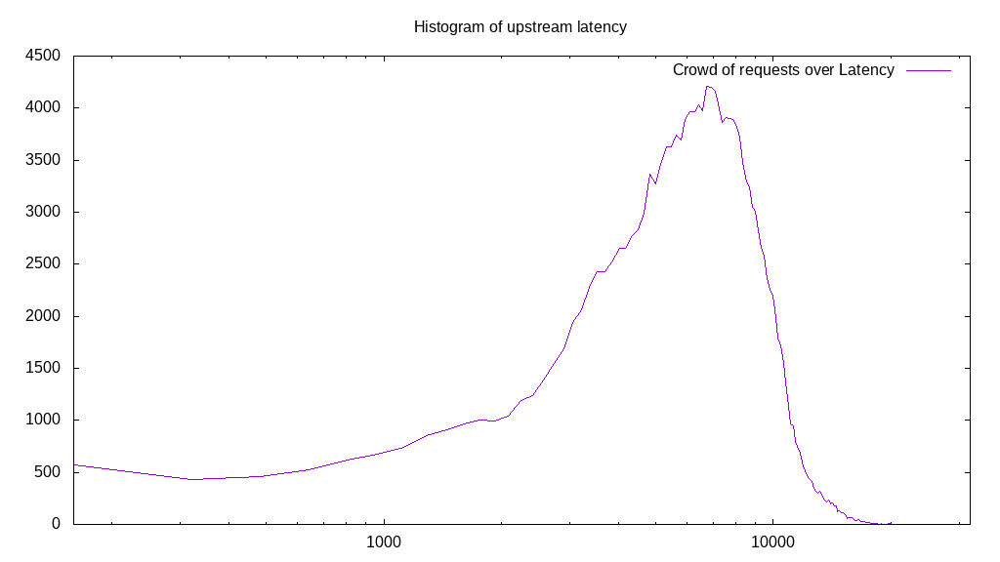
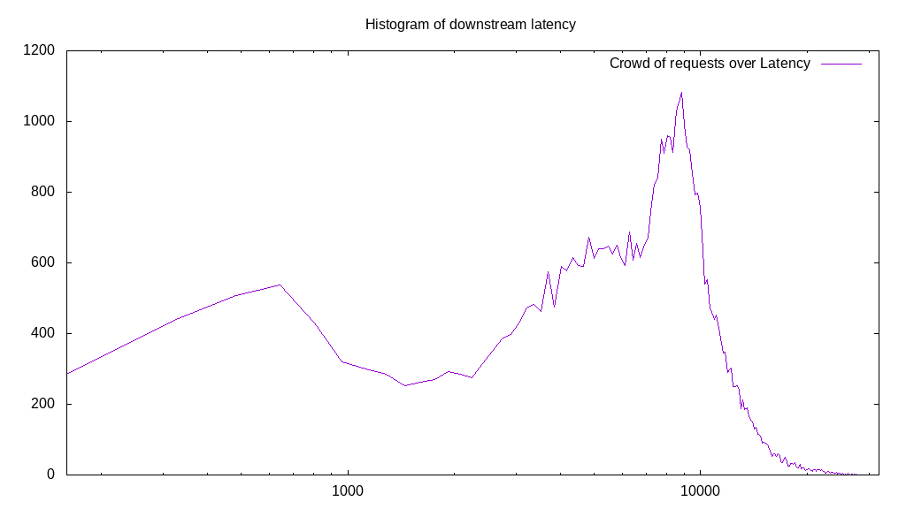

# Latency benchmark report. Crowd is 4096

## Populate workload

## Object Size is 32.00kiB

### PUT Latency in ms over time

Evolution of PUT Latency over time

| Parameter | Value |
| --- | --- |
| Y Coordinate | PUT Latency in ms |
| X Coordinate | time in s since begining of workload |

### PUT Latency distribution in ms

Distribution of the PUT Latency in ms

| Parameter | Value |
| --- | --- |
| Y Coordinate | Number of PUT |
| X Coordinate | Latency in ms |
| Server volume | 5626.094MiB|
| Server bandwidth | 18.754MiB/s |
| Server time | 300.00s |
| Server load | 4033.32 |
| Server responses | 180035PUT |
| Server IOps | 600.12PUT/s |
| Client bandwidth | 0.005MiB/s |
| Client volume | 1.374MiB|
| Client time | 1209986.71s |
| Client IOps |  0.15PUT/s  |
| Client Latency | 6720.84ms/PUT |
| Client Limbo | 4.59ms/PUT |
| Crowd time | 1228791.81s |
| Crowd efficiency | 98.47% |
| Highest Latency | 27336.68ms |
| 95th percentile Latency | 11417.09ms |
| 68th percentile Latency | 8201.01ms |
| 50th percentile Latency | 6914.57ms |
| 32nd percentile Latency | 5467.34ms |
| 5th percentile Latency | 2251.26ms |
| Lowest Latency | 160.80ms |

## Read workload

## Object Size is 32.00kiB

### GET Latency in ms over time

Evolution of GET Latency over time

| Parameter | Value |
| --- | --- |
| Y Coordinate | GET Latency in ms |
| X Coordinate | time in s since begining of workload |

### GET Latency distribution in ms

Distribution of the GET Latency in ms

| Parameter | Value |
| --- | --- |
| Y Coordinate | Number of GET |
| X Coordinate | Latency in ms |
| Server volume | 1515.375MiB|
| Server bandwidth | 12.582MiB/s |
| Server time | 120.44s |
| Server load | 3018.64 |
| Server responses | 48492GET |
| Server IOps | 402.62GET/s |
| Client bandwidth | 0.003MiB/s |
| Client volume | 0.370MiB|
| Client time | 363568.26s |
| Client IOps |  0.13GET/s  |
| Client Latency | 7497.49ms/GET |
| Client Limbo | 31.68ms/GET |
| Crowd time | 493326.34s |
| Crowd efficiency | 73.70% |
| Highest Latency | 29427.14ms |
| 95th percentile Latency | 14150.75ms |
| 68th percentile Latency | 9326.63ms |
| 50th percentile Latency | 7879.40ms |
| 32nd percentile Latency | 5788.94ms |
| 5th percentile Latency | 1125.63ms |
| Lowest Latency | 160.80ms |

## Mixed workload

## Object Size is 32.00kiB

### PUT Latency in ms over time

Evolution of PUT Latency over time

| Parameter | Value |
| --- | --- |
| Y Coordinate | PUT Latency in ms |
| X Coordinate | time in s since begining of workload |

### GET Latency in ms over time

Evolution of GET Latency over time

| Parameter | Value |
| --- | --- |
| Y Coordinate | GET Latency in ms |
| X Coordinate | time in s since begining of workload |

### PUT Latency distribution in ms

Distribution of the PUT Latency in ms

| Parameter | Value |
| --- | --- |
| Y Coordinate | Number of PUT |
| X Coordinate | Latency in ms |
| Server volume | 775.844MiB|
| Server bandwidth | 6.493MiB/s |
| Server time | 119.50s |
| Server load | 1340.91 |
| Server responses | 24827PUT |
| Server IOps | 207.76PUT/s |
| Client bandwidth | 0.002MiB/s |
| Client volume | 0.189MiB|
| Client time | 160235.04s |
| Client IOps |  0.15PUT/s  |
| Client Latency | 6454.06ms/PUT |
| Client Limbo | 80.38ms/PUT |
| Crowd time | 489459.71s |
| Crowd efficiency | 32.74% |
| Highest Latency | 22512.56ms |
| 95th percentile Latency | 12060.30ms |
| 68th percentile Latency | 7879.40ms |
| 50th percentile Latency | 6271.36ms |
| 32nd percentile Latency | 4824.12ms |
| 5th percentile Latency | 2090.45ms |
| Lowest Latency | 160.80ms |

### GET Latency distribution in ms

Distribution of the GET Latency in ms

| Parameter | Value |
| --- | --- |
| Y Coordinate | Number of GET |
| X Coordinate | Latency in ms |
| Server volume | 898.781MiB|
| Server bandwidth | 7.521MiB/s |
| Server time | 119.50s |
| Server load | 2087.76 |
| Server responses | 28761GET |
| Server IOps | 240.68GET/s |
| Client bandwidth | 0.002MiB/s |
| Client volume | 0.219MiB|
| Client time | 249481.12s |
| Client IOps |  0.12GET/s  |
| Client Latency | 8674.29ms/GET |
| Client Limbo | 58.59ms/GET |
| Crowd time | 489459.71s |
| Crowd efficiency | 50.97% |
| Highest Latency | 26371.86ms |
| 95th percentile Latency | 14954.77ms |
| 68th percentile Latency | 10291.46ms |
| 50th percentile Latency | 8522.61ms |
| 32nd percentile Latency | 6914.57ms |
| 5th percentile Latency | 3698.49ms |
| Lowest Latency | 160.80ms |

## Cleanup workload

## Object Size is 32.00kiB

### DELETE Latency in ms over time

Evolution of DELETE Latency over time

| Parameter | Value |
| --- | --- |
| Y Coordinate | DELETE Latency in ms |
| X Coordinate | time in s since begining of workload |

### DELETE Latency distribution in ms

Distribution of the DELETE Latency in ms

| Parameter | Value |
| --- | --- |
| Y Coordinate | Number of DELETE |
| X Coordinate | Latency in ms |
| Server volume | 5626.344MiB|
| Server bandwidth | 20.631MiB/s |
| Server time | 272.71s |
| Server load | 3625.10 |
| Server responses | 180043DELETE |
| Server IOps | 660.20DELETE/s |
| Client bandwidth | 0.005MiB/s |
| Client volume | 1.374MiB|
| Client time | 988604.83s |
| Client IOps |  0.18DELETE/s  |
| Client Latency | 5490.94ms/DELETE |
| Client Limbo | 31.35ms/DELETE |
| Crowd time | 1117024.26s |
| Crowd efficiency | 88.50% |
| Highest Latency | 24120.60ms |
| 95th percentile Latency | 10613.07ms |
| 68th percentile Latency | 6753.77ms |
| 50th percentile Latency | 5467.34ms |
| 32nd percentile Latency | 4180.90ms |
| 5th percentile Latency | 1286.43ms |
| Lowest Latency | 160.80ms |

