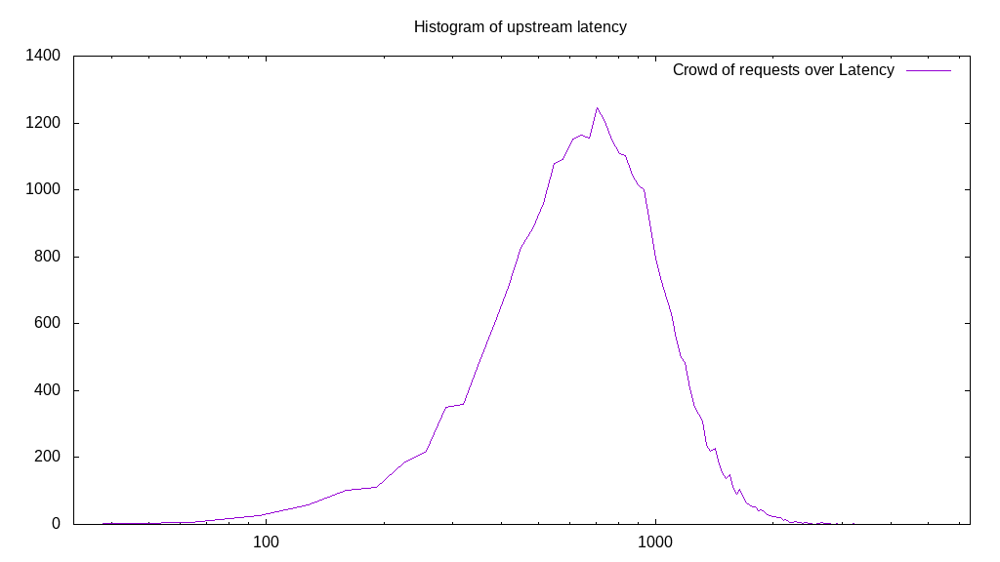

# Latency benchmark report. Crowd is 512

## Populate workload

## Object Size is 32.00kiB

### PUT Latency in ms over time

Evolution of PUT Latency over time

| Parameter | Value |
| --- | --- |
| Y Coordinate | PUT Latency in ms |
| X Coordinate | time in s since begining of workload |

### PUT Latency distribution in ms

Distribution of the PUT Latency in ms

| Parameter | Value |
| --- | --- |
| Y Coordinate | Number of PUT |
| X Coordinate | Latency in ms |
| Server volume | 6508.938MiB|
| Server bandwidth | 21.697MiB/s |
| Server time | 300.00s |
| Server load | 511.01 |
| Server responses | 208286PUT |
| Server IOps | 694.30PUT/s |
| Client bandwidth | 0.042MiB/s |
| Client volume | 12.713MiB|
| Client time | 153301.47s |
| Client IOps |  1.36PUT/s  |
| Client Latency | 736.01ms/PUT |
| Client Limbo | 0.58ms/PUT |
| Crowd time | 153597.95s |
| Crowd efficiency | 99.81% |
| Highest Latency | 3505.53ms |
| 95th percentile Latency | 1382.91ms |
| 68th percentile Latency | 900.50ms |
| 50th percentile Latency | 739.70ms |
| 32nd percentile Latency | 578.89ms |
| 5th percentile Latency | 289.45ms |
| Lowest Latency | 32.16ms |

## Read workload

## Object Size is 32.00kiB

### GET Latency in ms over time

Evolution of GET Latency over time

| Parameter | Value |
| --- | --- |
| Y Coordinate | GET Latency in ms |
| X Coordinate | time in s since begining of workload |

### GET Latency distribution in ms

Distribution of the GET Latency in ms

| Parameter | Value |
| --- | --- |
| Y Coordinate | Number of GET |
| X Coordinate | Latency in ms |
| Server volume | 1817.469MiB|
| Server bandwidth | 17.825MiB/s |
| Server time | 101.96s |
| Server load | 495.07 |
| Server responses | 58159GET |
| Server IOps | 570.40GET/s |
| Client bandwidth | 0.035MiB/s |
| Client volume | 3.550MiB|
| Client time | 50478.34s |
| Client IOps |  1.15GET/s  |
| Client Latency | 867.94ms/GET |
| Client Limbo | 3.37ms/GET |
| Crowd time | 52204.54s |
| Crowd efficiency | 96.69% |
| Highest Latency | 5499.50ms |
| 95th percentile Latency | 2797.99ms |
| 68th percentile Latency | 771.86ms |
| 50th percentile Latency | 514.57ms |
| 32nd percentile Latency | 385.93ms |
| 5th percentile Latency | 192.96ms |
| Lowest Latency | 32.16ms |

## Mixed workload

## Object Size is 32.00kiB

### PUT Latency in ms over time

Evolution of PUT Latency over time

| Parameter | Value |
| --- | --- |
| Y Coordinate | PUT Latency in ms |
| X Coordinate | time in s since begining of workload |

### GET Latency in ms over time

Evolution of GET Latency over time

| Parameter | Value |
| --- | --- |
| Y Coordinate | GET Latency in ms |
| X Coordinate | time in s since begining of workload |

### PUT Latency distribution in ms

Distribution of the PUT Latency in ms

| Parameter | Value |
| --- | --- |
| Y Coordinate | Number of PUT |
| X Coordinate | Latency in ms |
| Server volume | 918.125MiB|
| Server bandwidth | 8.866MiB/s |
| Server time | 103.55s |
| Server load | 232.89 |
| Server responses | 29380PUT |
| Server IOps | 283.73PUT/s |
| Client bandwidth | 0.017MiB/s |
| Client volume | 1.793MiB|
| Client time | 24116.17s |
| Client IOps |  1.22PUT/s  |
| Client Latency | 820.84ms/PUT |
| Client Limbo | 56.45ms/PUT |
| Crowd time | 53017.60s |
| Crowd efficiency | 45.49% |
| Highest Latency | 3216.08ms |
| 95th percentile Latency | 1479.40ms |
| 68th percentile Latency | 964.82ms |
| 50th percentile Latency | 804.02ms |
| 32nd percentile Latency | 675.38ms |
| 5th percentile Latency | 385.93ms |
| Lowest Latency | 32.16ms |

### GET Latency distribution in ms

Distribution of the GET Latency in ms

| Parameter | Value |
| --- | --- |
| Y Coordinate | Number of GET |
| X Coordinate | Latency in ms |
| Server volume | 922.750MiB|
| Server bandwidth | 8.911MiB/s |
| Server time | 103.55s |
| Server load | 262.51 |
| Server responses | 29528GET |
| Server IOps | 285.16GET/s |
| Client bandwidth | 0.017MiB/s |
| Client volume | 1.802MiB|
| Client time | 27183.05s |
| Client IOps |  1.09GET/s  |
| Client Latency | 920.59ms/GET |
| Client Limbo | 50.46ms/GET |
| Crowd time | 53017.60s |
| Crowd efficiency | 51.27% |
| Highest Latency | 4020.10ms |
| 95th percentile Latency | 1736.68ms |
| 68th percentile Latency | 1093.47ms |
| 50th percentile Latency | 900.50ms |
| 32nd percentile Latency | 707.54ms |
| 5th percentile Latency | 353.77ms |
| Lowest Latency | 32.16ms |

## Cleanup workload

## Object Size is 32.00kiB

### DELETE Latency in ms over time

Evolution of DELETE Latency over time

| Parameter | Value |
| --- | --- |
| Y Coordinate | DELETE Latency in ms |
| X Coordinate | time in s since begining of workload |

### DELETE Latency distribution in ms

Distribution of the DELETE Latency in ms

| Parameter | Value |
| --- | --- |
| Y Coordinate | Number of DELETE |
| X Coordinate | Latency in ms |
| Server volume | 6509.188MiB|
| Server bandwidth | 25.870MiB/s |
| Server time | 251.62s |
| Server load | 506.52 |
| Server responses | 208294DELETE |
| Server IOps | 827.83DELETE/s |
| Client bandwidth | 0.051MiB/s |
| Client volume | 12.713MiB|
| Client time | 127446.83s |
| Client IOps |  1.63DELETE/s  |
| Client Latency | 611.86ms/DELETE |
| Client Limbo | 2.70ms/DELETE |
| Crowd time | 128826.88s |
| Crowd efficiency | 98.93% |
| Highest Latency | 3151.76ms |
| 95th percentile Latency | 1189.95ms |
| 68th percentile Latency | 739.70ms |
| 50th percentile Latency | 611.06ms |
| 32nd percentile Latency | 482.41ms |
| 5th percentile Latency | 192.96ms |
| Lowest Latency | 32.16ms |

