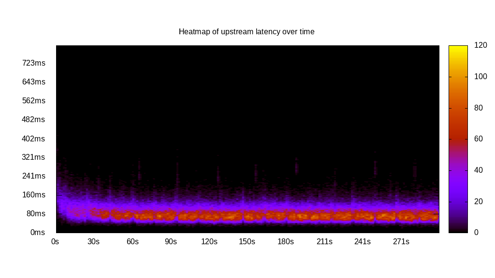
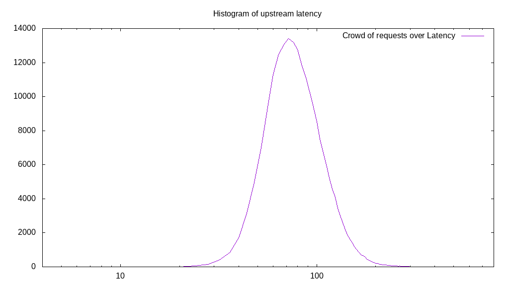
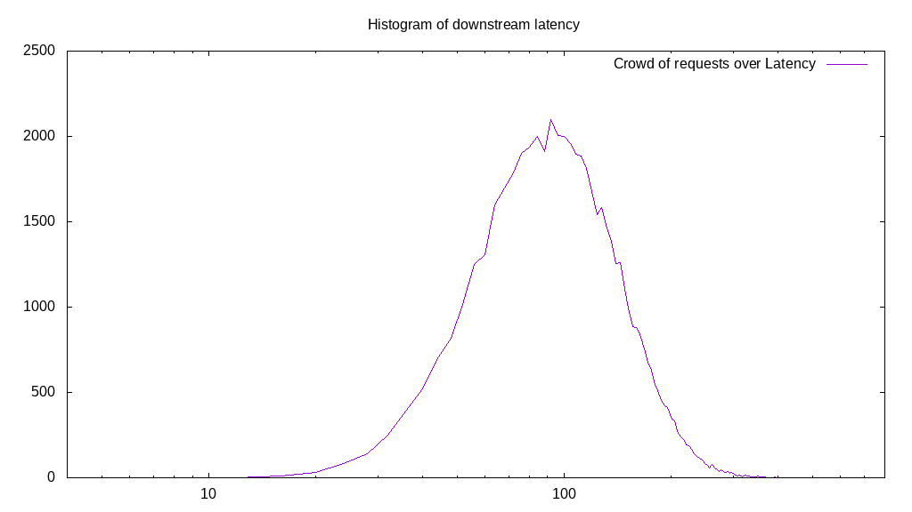
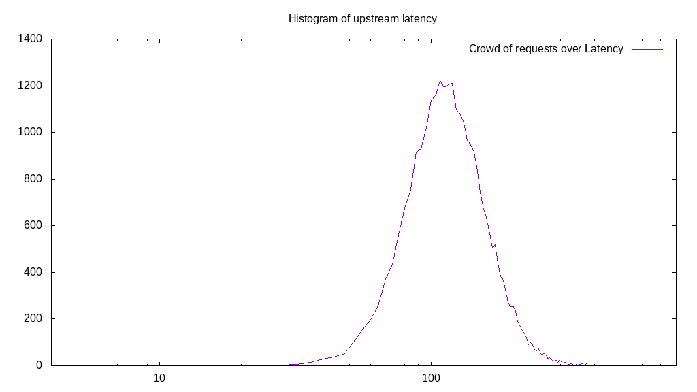
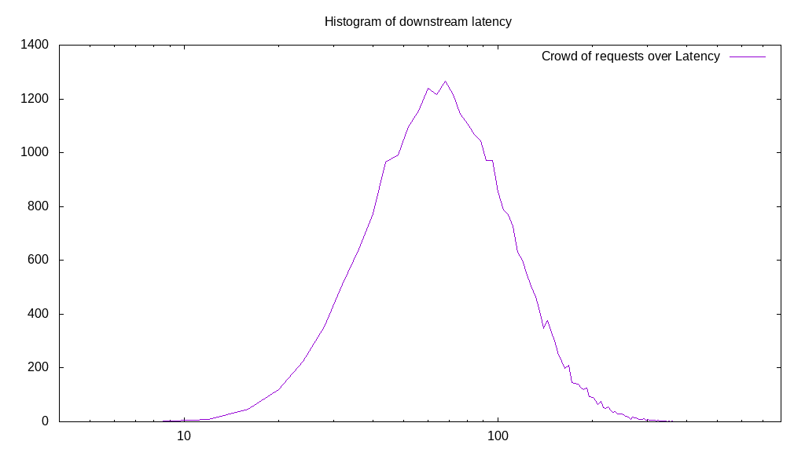
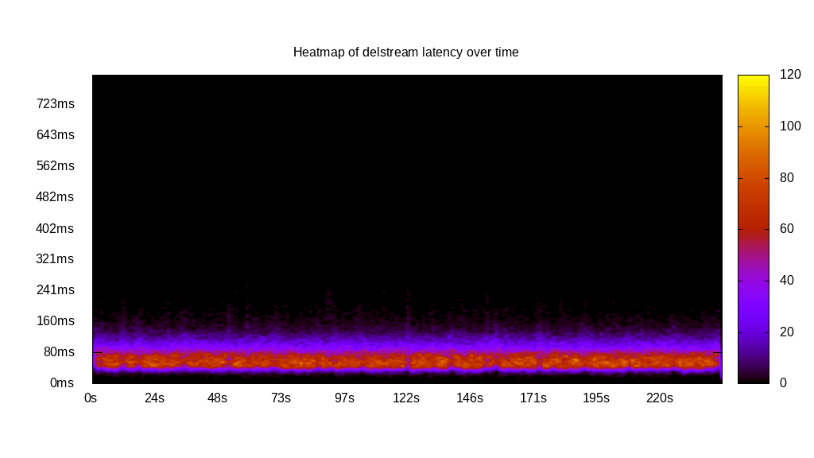

# Latency benchmark report. Crowd is 64

## Populate workload

## Object Size is 32.00kiB

### PUT Latency in ms over time

Evolution of PUT Latency over time

| Parameter | Value |
| --- | --- |
| Y Coordinate | PUT Latency in ms |
| X Coordinate | time in s since begining of workload |

### PUT Latency distribution in ms

Distribution of the PUT Latency in ms

| Parameter | Value |
| --- | --- |
| Y Coordinate | Number of PUT |
| X Coordinate | Latency in ms |
| Server volume | 6678.469MiB|
| Server bandwidth | 22.262MiB/s |
| Server time | 299.99s |
| Server load | 63.88 |
| Server responses | 213711PUT |
| Server IOps | 712.38PUT/s |
| Client bandwidth | 0.348MiB/s |
| Client volume | 104.351MiB|
| Client time | 19163.21s |
| Client IOps |  11.15PUT/s  |
| Client Latency | 89.67ms/PUT |
| Client Limbo | 0.57ms/PUT |
| Crowd time | 19199.62s |
| Crowd efficiency | 99.81% |
| Highest Latency | 478.39ms |
| 95th percentile Latency | 152.76ms |
| 68th percentile Latency | 100.50ms |
| 50th percentile Latency | 88.44ms |
| 32nd percentile Latency | 76.38ms |
| 5th percentile Latency | 52.26ms |
| Lowest Latency | 16.08ms |

## Read workload

## Object Size is 32.00kiB

### GET Latency in ms over time

Evolution of GET Latency over time

| Parameter | Value |
| --- | --- |
| Y Coordinate | GET Latency in ms |
| X Coordinate | time in s since begining of workload |

### GET Latency distribution in ms

Distribution of the GET Latency in ms

| Parameter | Value |
| --- | --- |
| Y Coordinate | Number of GET |
| X Coordinate | Latency in ms |
| Server volume | 1736.688MiB|
| Server bandwidth | 17.346MiB/s |
| Server time | 100.12s |
| Server load | 63.73 |
| Server responses | 55574GET |
| Server IOps | 555.07GET/s |
| Client bandwidth | 0.271MiB/s |
| Client volume | 27.136MiB|
| Client time | 6381.14s |
| Client IOps |  8.71GET/s  |
| Client Latency | 114.82ms/GET |
| Client Limbo | 0.42ms/GET |
| Crowd time | 6407.74s |
| Crowd efficiency | 99.58% |
| Highest Latency | 482.41ms |
| 95th percentile Latency | 209.05ms |
| 68th percentile Latency | 132.66ms |
| 50th percentile Latency | 112.56ms |
| 32nd percentile Latency | 92.46ms |
| 5th percentile Latency | 52.26ms |
| Lowest Latency | 16.08ms |

## Mixed workload

## Object Size is 32.00kiB

### PUT Latency in ms over time

Evolution of PUT Latency over time

| Parameter | Value |
| --- | --- |
| Y Coordinate | PUT Latency in ms |
| X Coordinate | time in s since begining of workload |

### GET Latency in ms over time

Evolution of GET Latency over time

| Parameter | Value |
| --- | --- |
| Y Coordinate | GET Latency in ms |
| X Coordinate | time in s since begining of workload |

### PUT Latency distribution in ms

Distribution of the PUT Latency in ms

| Parameter | Value |
| --- | --- |
| Y Coordinate | Number of PUT |
| X Coordinate | Latency in ms |
| Server volume | 891.625MiB|
| Server bandwidth | 8.899MiB/s |
| Server time | 100.20s |
| Server load | 37.63 |
| Server responses | 28532PUT |
| Server IOps | 284.75PUT/s |
| Client bandwidth | 0.139MiB/s |
| Client volume | 13.932MiB|
| Client time | 3770.97s |
| Client IOps |  7.57PUT/s  |
| Client Latency | 132.17ms/PUT |
| Client Limbo | 41.28ms/PUT |
| Crowd time | 6412.74s |
| Crowd efficiency | 58.80% |
| Highest Latency | 502.51ms |
| 95th percentile Latency | 221.11ms |
| 68th percentile Latency | 148.74ms |
| 50th percentile Latency | 128.64ms |
| 32nd percentile Latency | 112.56ms |
| 5th percentile Latency | 76.38ms |
| Lowest Latency | 20.10ms |

### GET Latency distribution in ms

Distribution of the GET Latency in ms

| Parameter | Value |
| --- | --- |
| Y Coordinate | Number of GET |
| X Coordinate | Latency in ms |
| Server volume | 888.969MiB|
| Server bandwidth | 8.872MiB/s |
| Server time | 100.20s |
| Server load | 26.15 |
| Server responses | 28447GET |
| Server IOps | 283.91GET/s |
| Client bandwidth | 0.139MiB/s |
| Client volume | 13.890MiB|
| Client time | 2619.99s |
| Client IOps |  10.86GET/s  |
| Client Latency | 92.10ms/GET |
| Client Limbo | 59.26ms/GET |
| Crowd time | 6412.74s |
| Crowd efficiency | 40.86% |
| Highest Latency | 478.39ms |
| 95th percentile Latency | 184.92ms |
| 68th percentile Latency | 108.54ms |
| 50th percentile Latency | 88.44ms |
| 32nd percentile Latency | 68.34ms |
| 5th percentile Latency | 40.20ms |
| Lowest Latency | 12.06ms |

## Cleanup workload

## Object Size is 32.00kiB

### DELETE Latency in ms over time

Evolution of DELETE Latency over time

| Parameter | Value |
| --- | --- |
| Y Coordinate | DELETE Latency in ms |
| X Coordinate | time in s since begining of workload |

### DELETE Latency distribution in ms

Distribution of the DELETE Latency in ms

| Parameter | Value |
| --- | --- |
| Y Coordinate | Number of DELETE |
| X Coordinate | Latency in ms |
| Server volume | 6678.719MiB|
| Server bandwidth | 27.436MiB/s |
| Server time | 243.43s |
| Server load | 63.73 |
| Server responses | 213719DELETE |
| Server IOps | 877.94DELETE/s |
| Client bandwidth | 0.429MiB/s |
| Client volume | 104.355MiB|
| Client time | 15514.20s |
| Client IOps |  13.78DELETE/s  |
| Client Latency | 72.59ms/DELETE |
| Client Limbo | 1.02ms/DELETE |
| Crowd time | 15579.65s |
| Crowd efficiency | 99.58% |
| Highest Latency | 337.69ms |
| 95th percentile Latency | 128.64ms |
| 68th percentile Latency | 84.42ms |
| 50th percentile Latency | 72.36ms |
| 32nd percentile Latency | 60.30ms |
| 5th percentile Latency | 40.20ms |
| Lowest Latency | 12.06ms |

