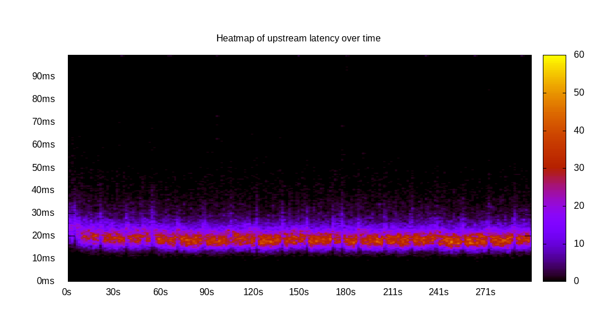
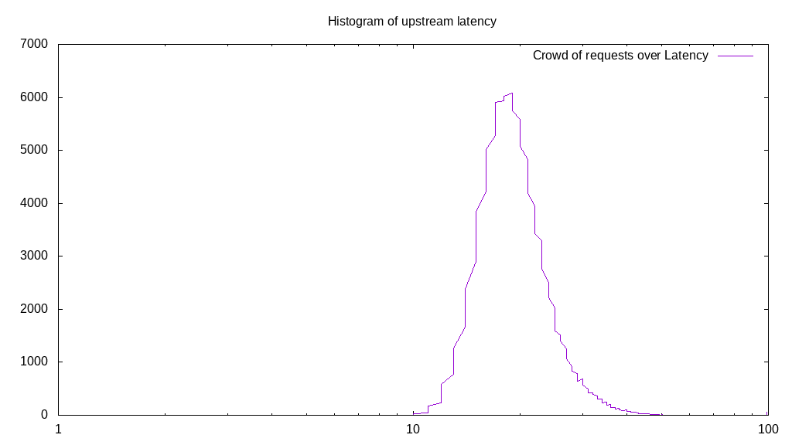
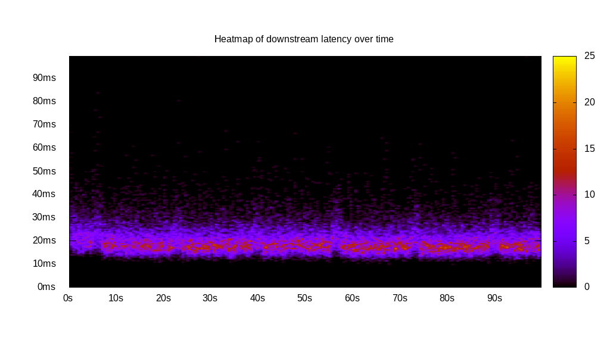
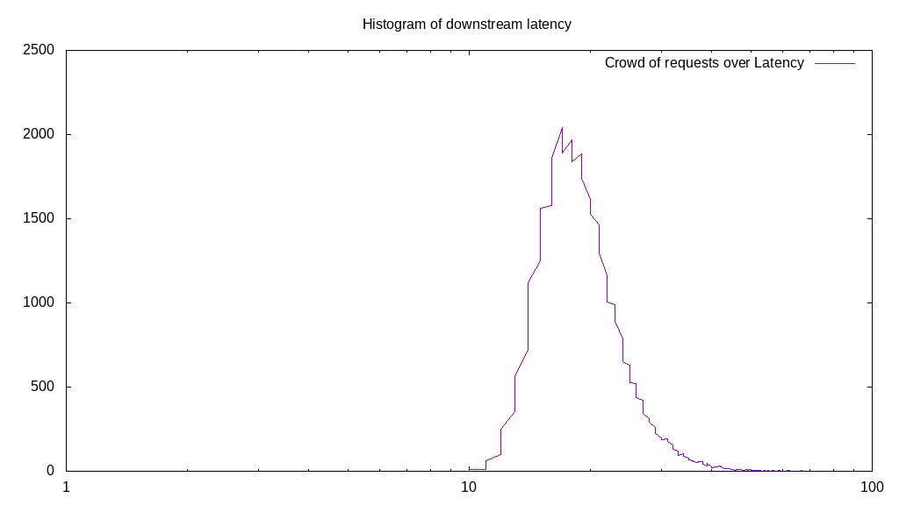
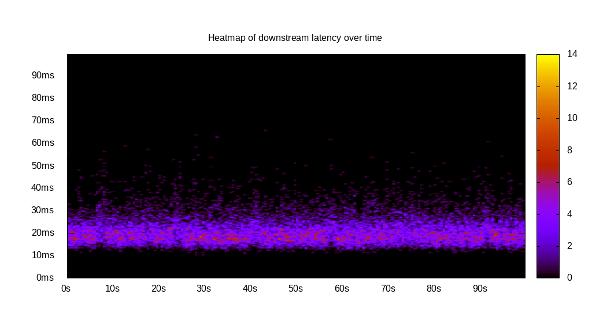

# Latency benchmark report. Crowd is 8

## Populate workload

## Object Size is 32.00kiB

### PUT Latency in ms over time

Evolution of PUT Latency over time

| Parameter | Value |
| --- | --- |
| Y Coordinate | PUT Latency in ms |
| X Coordinate | time in s since begining of workload |

### PUT Latency distribution in ms

Distribution of the PUT Latency in ms

| Parameter | Value |
| --- | --- |
| Y Coordinate | Number of PUT |
| X Coordinate | Latency in ms |
| Server volume | 3579.063MiB|
| Server bandwidth | 11.930MiB/s |
| Server time | 300.00s |
| Server load | 7.95 |
| Server responses | 114530PUT |
| Server IOps | 381.77PUT/s |
| Client bandwidth | 1.491MiB/s |
| Client volume | 447.383MiB|
| Client time | 2383.85s |
| Client IOps |  48.04PUT/s  |
| Client Latency | 20.81ms/PUT |
| Client Limbo | 2.02ms/PUT |
| Crowd time | 2400.01s |
| Crowd efficiency | 99.33% |
| Highest Latency | 186.46ms |
| 95th percentile Latency | 31.93ms |
| 68th percentile Latency | 22.66ms |
| 50th percentile Latency | 20.60ms |
| 32nd percentile Latency | 19.57ms |
| 5th percentile Latency | 15.45ms |
| Lowest Latency | 8.24ms |

## Read workload

## Object Size is 32.00kiB

### GET Latency in ms over time

Evolution of GET Latency over time

| Parameter | Value |
| --- | --- |
| Y Coordinate | GET Latency in ms |
| X Coordinate | time in s since begining of workload |

### GET Latency distribution in ms

Distribution of the GET Latency in ms

| Parameter | Value |
| --- | --- |
| Y Coordinate | Number of GET |
| X Coordinate | Latency in ms |
| Server volume | 1204.563MiB|
| Server bandwidth | 12.044MiB/s |
| Server time | 100.02s |
| Server load | 7.93 |
| Server responses | 38546GET |
| Server IOps | 385.40GET/s |
| Client bandwidth | 1.505MiB/s |
| Client volume | 150.570MiB|
| Client time | 793.56s |
| Client IOps |  48.57GET/s  |
| Client Latency | 20.59ms/GET |
| Client Limbo | 0.82ms/GET |
| Crowd time | 800.12s |
| Crowd efficiency | 99.18% |
| Highest Latency | 205.00ms |
| 95th percentile Latency | 31.93ms |
| 68th percentile Latency | 22.66ms |
| 50th percentile Latency | 20.60ms |
| 32nd percentile Latency | 18.54ms |
| 5th percentile Latency | 15.45ms |
| Lowest Latency | 10.30ms |

## Mixed workload

## Object Size is 32.00kiB

### PUT Latency in ms over time

Evolution of PUT Latency over time

| Parameter | Value |
| --- | --- |
| Y Coordinate | PUT Latency in ms |
| X Coordinate | time in s since begining of workload |

### GET Latency in ms over time

Evolution of GET Latency over time

| Parameter | Value |
| --- | --- |
| Y Coordinate | GET Latency in ms |
| X Coordinate | time in s since begining of workload |

### PUT Latency distribution in ms

Distribution of the PUT Latency in ms

| Parameter | Value |
| --- | --- |
| Y Coordinate | Number of PUT |
| X Coordinate | Latency in ms |
| Server volume | 544.125MiB|
| Server bandwidth | 5.441MiB/s |
| Server time | 100.01s |
| Server load | 4.25 |
| Server responses | 17412PUT |
| Server IOps | 174.10PUT/s |
| Client bandwidth | 0.680MiB/s |
| Client volume | 68.016MiB|
| Client time | 425.28s |
| Client IOps |  40.94PUT/s  |
| Client Latency | 24.42ms/PUT |
| Client Limbo | 46.85ms/PUT |
| Crowd time | 800.10s |
| Crowd efficiency | 53.15% |
| Highest Latency | 163.79ms |
| 95th percentile Latency | 38.12ms |
| 68th percentile Latency | 26.78ms |
| 50th percentile Latency | 24.72ms |
| 32nd percentile Latency | 21.63ms |
| 5th percentile Latency | 17.51ms |
| Lowest Latency | 10.30ms |

### GET Latency distribution in ms

Distribution of the GET Latency in ms

| Parameter | Value |
| --- | --- |
| Y Coordinate | Number of GET |
| X Coordinate | Latency in ms |
| Server volume | 547.188MiB|
| Server bandwidth | 5.471MiB/s |
| Server time | 100.01s |
| Server load | 3.69 |
| Server responses | 17510GET |
| Server IOps | 175.08GET/s |
| Client bandwidth | 0.684MiB/s |
| Client volume | 68.398MiB|
| Client time | 369.05s |
| Client IOps |  47.45GET/s  |
| Client Latency | 21.08ms/GET |
| Client Limbo | 53.88ms/GET |
| Crowd time | 800.10s |
| Crowd efficiency | 46.12% |
| Highest Latency | 65.93ms |
| 95th percentile Latency | 31.93ms |
| 68th percentile Latency | 23.69ms |
| 50th percentile Latency | 20.60ms |
| 32nd percentile Latency | 19.57ms |
| 5th percentile Latency | 15.45ms |
| Lowest Latency | 10.30ms |

## Cleanup workload

## Object Size is 32.00kiB

### DELETE Latency in ms over time

Evolution of DELETE Latency over time

| Parameter | Value |
| --- | --- |
| Y Coordinate | DELETE Latency in ms |
| X Coordinate | time in s since begining of workload |

### DELETE Latency distribution in ms

Distribution of the DELETE Latency in ms

| Parameter | Value |
| --- | --- |
| Y Coordinate | Number of DELETE |
| X Coordinate | Latency in ms |
| Server volume | 3579.313MiB|
| Server bandwidth | 15.429MiB/s |
| Server time | 231.99s |
| Server load | 7.93 |
| Server responses | 114538DELETE |
| Server IOps | 493.71DELETE/s |
| Client bandwidth | 1.929MiB/s |
| Client volume | 447.414MiB|
| Client time | 1838.55s |
| Client IOps |  62.30DELETE/s  |
| Client Latency | 16.05ms/DELETE |
| Client Limbo | 2.17ms/DELETE |
| Crowd time | 1855.94s |
| Crowd efficiency | 99.06% |
| Highest Latency | 121.56ms |
| 95th percentile Latency | 24.72ms |
| 68th percentile Latency | 18.54ms |
| 50th percentile Latency | 16.48ms |
| 32nd percentile Latency | 15.45ms |
| 5th percentile Latency | 11.33ms |
| Lowest Latency | 5.15ms |

