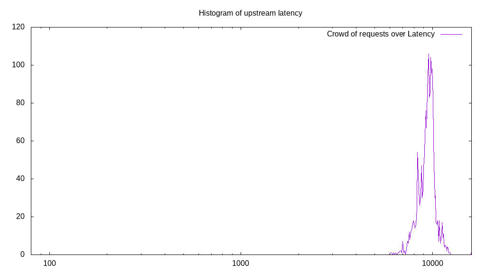
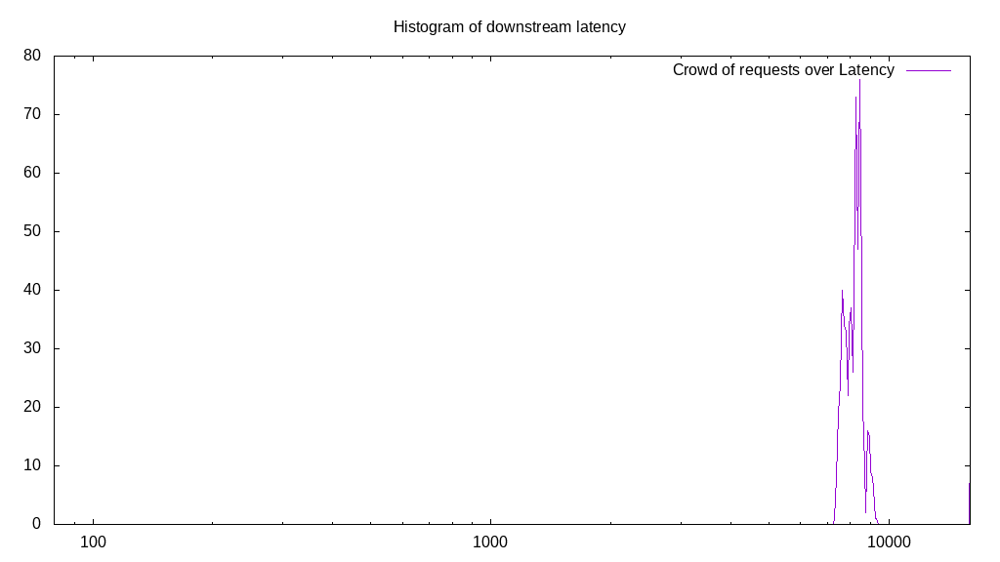
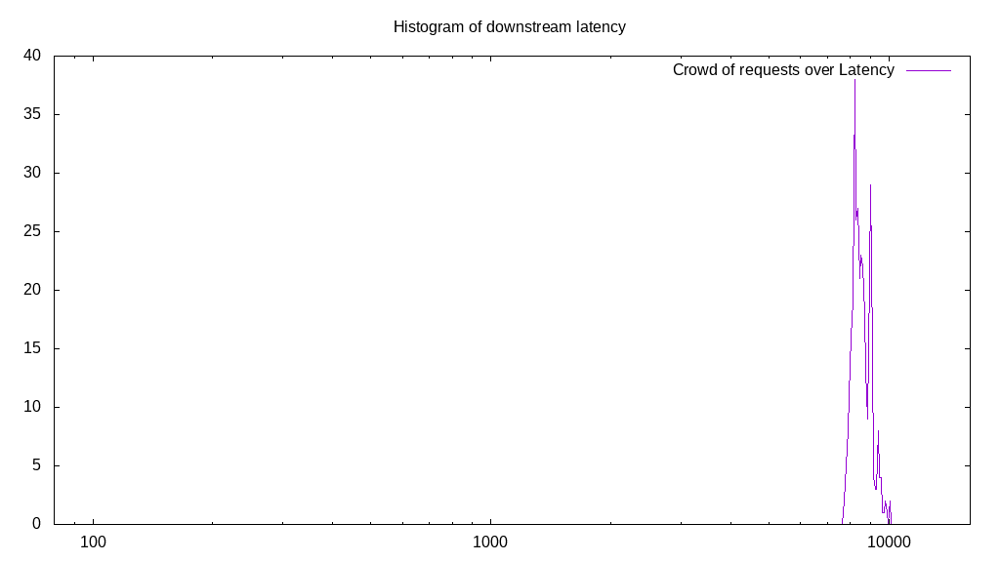

# Latency benchmark report. Crowd is 64

## Populate workload

## Object Size is 32768.00kiB

### PUT Latency in ms over time

Evolution of PUT Latency over time

| Parameter | Value |
| --- | --- |
| Y Coordinate | PUT Latency in ms |
| X Coordinate | time in s since begining of workload |

### PUT Latency distribution in ms

Distribution of the PUT Latency in ms

| Parameter | Value |
| --- | --- |
| Y Coordinate | Number of PUT |
| X Coordinate | Latency in ms |
| Server volume | 63744.000MiB|
| Server bandwidth | 211.918MiB/s |
| Server time | 300.80s |
| Server load | 62.87 |
| Server responses | 1992PUT |
| Server IOps | 6.62PUT/s |
| Client bandwidth | 3.311MiB/s |
| Client volume | 996.000MiB|
| Client time | 18909.98s |
| Client IOps |  0.11PUT/s  |
| Client Latency | 9492.96ms/PUT |
| Client Limbo | 5.33ms/PUT |
| Crowd time | 19250.94s |
| Crowd efficiency | 98.23% |
| Highest Latency | 23181.92ms |
| 95th percentile Latency | 11122.64ms |
| 68th percentile Latency | 9951.83ms |
| 50th percentile Latency | 9717.67ms |
| 32nd percentile Latency | 9366.43ms |
| 5th percentile Latency | 8078.55ms |
| Lowest Latency | 5971.10ms |

## Read workload

## Object Size is 32768.00kiB

### GET Latency in ms over time

Evolution of GET Latency over time

| Parameter | Value |
| --- | --- |
| Y Coordinate | GET Latency in ms |
| X Coordinate | time in s since begining of workload |

### GET Latency distribution in ms

Distribution of the GET Latency in ms

| Parameter | Value |
| --- | --- |
| Y Coordinate | Number of GET |
| X Coordinate | Latency in ms |
| Server volume | 22080.000MiB|
| Server bandwidth | 202.835MiB/s |
| Server time | 108.86s |
| Server load | 53.74 |
| Server responses | 690GET |
| Server IOps | 6.34GET/s |
| Client bandwidth | 3.169MiB/s |
| Client volume | 345.000MiB|
| Client time | 5849.52s |
| Client IOps |  0.12GET/s  |
| Client Latency | 8477.57ms/GET |
| Client Limbo | 17.46ms/GET |
| Crowd time | 6966.85s |
| Crowd efficiency | 83.96% |
| Highest Latency | 23299.00ms |
| 95th percentile Latency | 9132.27ms |
| 68th percentile Latency | 8546.87ms |
| 50th percentile Latency | 8312.71ms |
| 32nd percentile Latency | 8078.55ms |
| 5th percentile Latency | 7610.23ms |
| Lowest Latency | 7376.07ms |

## Mixed workload

## Object Size is 32768.00kiB

### PUT Latency in ms over time

Evolution of PUT Latency over time

| Parameter | Value |
| --- | --- |
| Y Coordinate | PUT Latency in ms |
| X Coordinate | time in s since begining of workload |

### GET Latency in ms over time

Evolution of GET Latency over time

| Parameter | Value |
| --- | --- |
| Y Coordinate | GET Latency in ms |
| X Coordinate | time in s since begining of workload |

### PUT Latency distribution in ms

Distribution of the PUT Latency in ms

| Parameter | Value |
| --- | --- |
| Y Coordinate | Number of PUT |
| X Coordinate | Latency in ms |
| Server volume | 10304.000MiB|
| Server bandwidth | 94.948MiB/s |
| Server time | 108.52s |
| Server load | 27.33 |
| Server responses | 322PUT |
| Server IOps | 2.97PUT/s |
| Client bandwidth | 1.484MiB/s |
| Client volume | 161.000MiB|
| Client time | 2966.41s |
| Client IOps |  0.11PUT/s  |
| Client Latency | 9212.46ms/PUT |
| Client Limbo | 62.17ms/PUT |
| Crowd time | 6945.47s |
| Crowd efficiency | 42.71% |
| Highest Latency | 11122.64ms |
| 95th percentile Latency | 10537.24ms |
| 68th percentile Latency | 9483.51ms |
| 50th percentile Latency | 9249.35ms |
| 32nd percentile Latency | 8898.11ms |
| 5th percentile Latency | 8546.87ms |
| Lowest Latency | 8078.55ms |

### GET Latency distribution in ms

Distribution of the GET Latency in ms

| Parameter | Value |
| --- | --- |
| Y Coordinate | Number of GET |
| X Coordinate | Latency in ms |
| Server volume | 11392.000MiB|
| Server bandwidth | 104.973MiB/s |
| Server time | 108.52s |
| Server load | 28.11 |
| Server responses | 356GET |
| Server IOps | 3.28GET/s |
| Client bandwidth | 1.640MiB/s |
| Client volume | 178.000MiB|
| Client time | 3050.19s |
| Client IOps |  0.12GET/s  |
| Client Latency | 8567.94ms/GET |
| Client Limbo | 60.86ms/GET |
| Crowd time | 6945.47s |
| Crowd efficiency | 43.92% |
| Highest Latency | 10068.91ms |
| 95th percentile Latency | 9600.59ms |
| 68th percentile Latency | 8898.11ms |
| 50th percentile Latency | 8663.95ms |
| 32nd percentile Latency | 8429.79ms |
| 5th percentile Latency | 8078.55ms |
| Lowest Latency | 7727.31ms |

## Cleanup workload

## Object Size is 32768.00kiB

### DELETE Latency in ms over time

Evolution of DELETE Latency over time

| Parameter | Value |
| --- | --- |
| Y Coordinate | DELETE Latency in ms |
| X Coordinate | time in s since begining of workload |

### DELETE Latency distribution in ms

Distribution of the DELETE Latency in ms

| Parameter | Value |
| --- | --- |
| Y Coordinate | Number of DELETE |
| X Coordinate | Latency in ms |
| Server volume | 64384.000MiB|
| Server bandwidth | 3766.908MiB/s |
| Server time | 17.09s |
| Server load | 7.53 |
| Server responses | 2012DELETE |
| Server IOps | 117.72DELETE/s |
| Client bandwidth | 58.858MiB/s |
| Client volume | 1006.000MiB|
| Client time | 128.77s |
| Client IOps |  15.63DELETE/s  |
| Client Latency | 64.00ms/DELETE |
| Client Limbo | 15.08ms/DELETE |
| Crowd time | 1093.89s |
| Crowd efficiency | 11.77% |
| Highest Latency | 234.16ms |
| 95th percentile Latency | 234.16ms |
| 68th percentile Latency | 234.16ms |
| 50th percentile Latency | 117.08ms |
| 32nd percentile Latency | 117.08ms |
| 5th percentile Latency | 117.08ms |
| Lowest Latency | 117.08ms |

