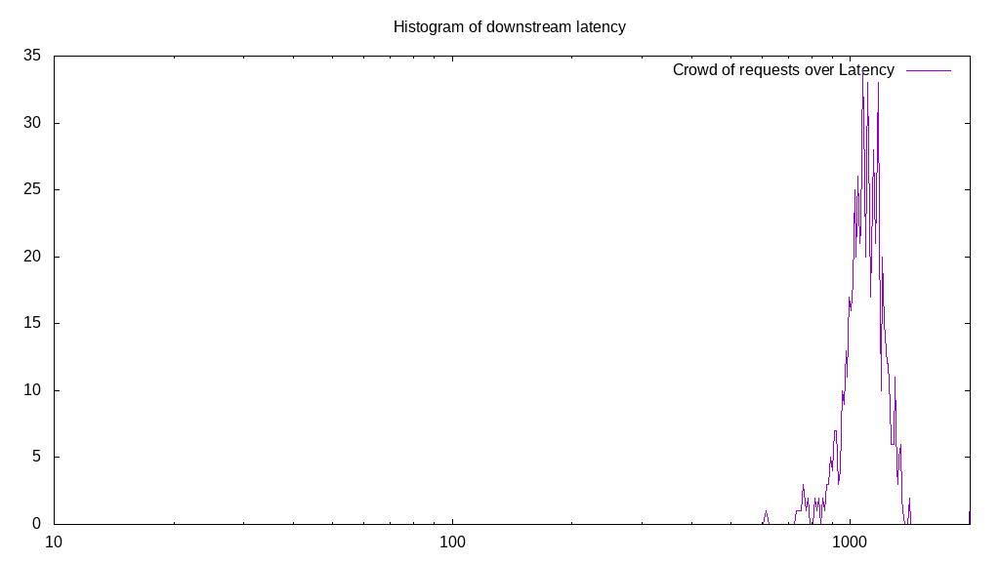
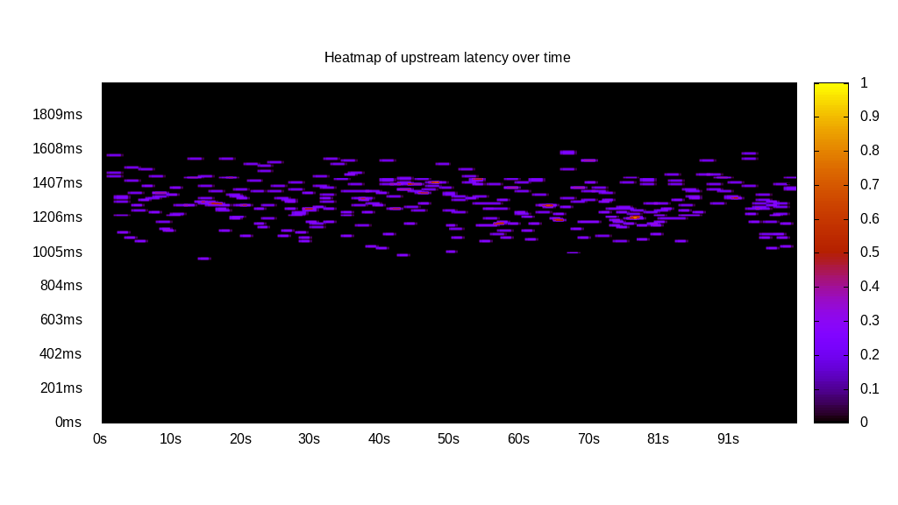
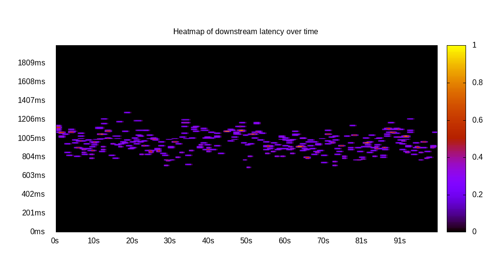
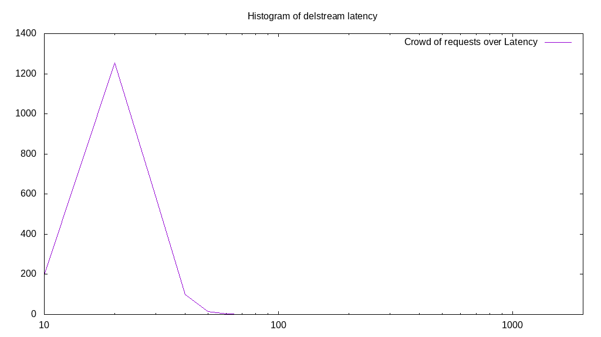

# Latency benchmark report. Crowd is 8

## Populate workload

## Object Size is 32768.00kiB

### PUT Latency in ms over time

Evolution of PUT Latency over time

| Parameter | Value |
| --- | --- |
| Y Coordinate | PUT Latency in ms |
| X Coordinate | time in s since begining of workload |

### PUT Latency distribution in ms

Distribution of the PUT Latency in ms

| Parameter | Value |
| --- | --- |
| Y Coordinate | Number of PUT |
| X Coordinate | Latency in ms |
| Server volume | 68864.000MiB|
| Server bandwidth | 229.627MiB/s |
| Server time | 299.89s |
| Server load | 7.99 |
| Server responses | 2152PUT |
| Server IOps | 7.18PUT/s |
| Client bandwidth | 28.703MiB/s |
| Client volume | 8608.000MiB|
| Client time | 2394.80s |
| Client IOps |  0.90PUT/s  |
| Client Latency | 1112.82ms/PUT |
| Client Limbo | 0.55ms/PUT |
| Crowd time | 2399.16s |
| Crowd efficiency | 99.82% |
| Highest Latency | 1575.80ms |
| 95th percentile Latency | 1326.39ms |
| 68th percentile Latency | 1179.02ms |
| 50th percentile Latency | 1122.33ms |
| 32nd percentile Latency | 1065.65ms |
| 5th percentile Latency | 906.93ms |
| Lowest Latency | 600.84ms |

## Read workload

## Object Size is 32768.00kiB

### GET Latency in ms over time

Evolution of GET Latency over time

| Parameter | Value |
| --- | --- |
| Y Coordinate | GET Latency in ms |
| X Coordinate | time in s since begining of workload |

### GET Latency distribution in ms

Distribution of the GET Latency in ms

| Parameter | Value |
| --- | --- |
| Y Coordinate | Number of GET |
| X Coordinate | Latency in ms |
| Server volume | 22784.000MiB|
| Server bandwidth | 227.578MiB/s |
| Server time | 100.11s |
| Server load | 7.87 |
| Server responses | 712GET |
| Server IOps | 7.11GET/s |
| Client bandwidth | 28.447MiB/s |
| Client volume | 2848.000MiB|
| Client time | 787.41s |
| Client IOps |  0.90GET/s  |
| Client Latency | 1105.91ms/GET |
| Client Limbo | 1.69ms/GET |
| Crowd time | 800.92s |
| Crowd efficiency | 98.31% |
| Highest Latency | 2256.00ms |
| 95th percentile Latency | 1303.72ms |
| 68th percentile Latency | 1167.68ms |
| 50th percentile Latency | 1122.33ms |
| 32nd percentile Latency | 1065.65ms |
| 5th percentile Latency | 929.61ms |
| Lowest Latency | 612.18ms |

## Mixed workload

## Object Size is 32768.00kiB

### PUT Latency in ms over time

Evolution of PUT Latency over time

| Parameter | Value |
| --- | --- |
| Y Coordinate | PUT Latency in ms |
| X Coordinate | time in s since begining of workload |

### GET Latency in ms over time

Evolution of GET Latency over time

| Parameter | Value |
| --- | --- |
| Y Coordinate | GET Latency in ms |
| X Coordinate | time in s since begining of workload |

### PUT Latency distribution in ms

Distribution of the PUT Latency in ms

| Parameter | Value |
| --- | --- |
| Y Coordinate | Number of PUT |
| X Coordinate | Latency in ms |
| Server volume | 10880.000MiB|
| Server bandwidth | 107.867MiB/s |
| Server time | 100.86s |
| Server load | 4.39 |
| Server responses | 340PUT |
| Server IOps | 3.37PUT/s |
| Client bandwidth | 13.483MiB/s |
| Client volume | 1360.000MiB|
| Client time | 442.86s |
| Client IOps |  0.77PUT/s  |
| Client Latency | 1302.52ms/PUT |
| Client Limbo | 45.51ms/PUT |
| Crowd time | 806.92s |
| Crowd efficiency | 54.88% |
| Highest Latency | 1598.47ms |
| 95th percentile Latency | 1530.45ms |
| 68th percentile Latency | 1383.08ms |
| 50th percentile Latency | 1315.06ms |
| 32nd percentile Latency | 1258.37ms |
| 5th percentile Latency | 1110.99ms |
| Lowest Latency | 963.62ms |

### GET Latency distribution in ms

Distribution of the GET Latency in ms

| Parameter | Value |
| --- | --- |
| Y Coordinate | Number of GET |
| X Coordinate | Latency in ms |
| Server volume | 11904.000MiB|
| Server bandwidth | 118.019MiB/s |
| Server time | 100.86s |
| Server load | 3.57 |
| Server responses | 372GET |
| Server IOps | 3.69GET/s |
| Client bandwidth | 14.752MiB/s |
| Client volume | 1488.000MiB|
| Client time | 359.84s |
| Client IOps |  1.03GET/s  |
| Client Latency | 967.32ms/GET |
| Client Limbo | 55.88ms/GET |
| Crowd time | 806.92s |
| Crowd efficiency | 44.59% |
| Highest Latency | 1292.38ms |
| 95th percentile Latency | 1145.01ms |
| 68th percentile Latency | 1031.64ms |
| 50th percentile Latency | 974.95ms |
| 32nd percentile Latency | 918.27ms |
| 5th percentile Latency | 804.90ms |
| Lowest Latency | 691.54ms |

## Cleanup workload

## Object Size is 32768.00kiB

### DELETE Latency in ms over time

Evolution of DELETE Latency over time

| Parameter | Value |
| --- | --- |
| Y Coordinate | DELETE Latency in ms |
| X Coordinate | time in s since begining of workload |

### DELETE Latency distribution in ms

Distribution of the DELETE Latency in ms

| Parameter | Value |
| --- | --- |
| Y Coordinate | Number of DELETE |
| X Coordinate | Latency in ms |
| Server volume | 69120.000MiB|
| Server bandwidth | 8720.666MiB/s |
| Server time | 7.93s |
| Server load | 6.31 |
| Server responses | 2160DELETE |
| Server IOps | 272.52DELETE/s |
| Client bandwidth | 1090.083MiB/s |
| Client volume | 8640.000MiB|
| Client time | 50.02s |
| Client IOps |  43.19DELETE/s  |
| Client Latency | 23.16ms/DELETE |
| Client Limbo | 1.67ms/DELETE |
| Crowd time | 63.41s |
| Crowd efficiency | 78.88% |
| Highest Latency | 136.04ms |
| 95th percentile Latency | 45.35ms |
| 68th percentile Latency | 34.01ms |
| 50th percentile Latency | 34.01ms |
| 32nd percentile Latency | 34.01ms |
| 5th percentile Latency | 22.67ms |
| Lowest Latency | 11.34ms |

