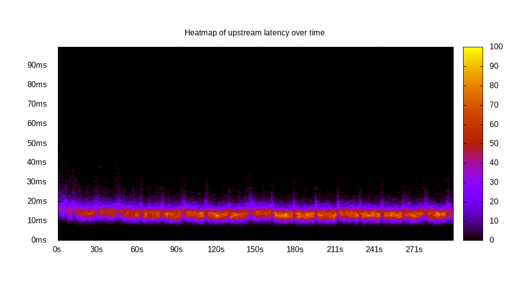
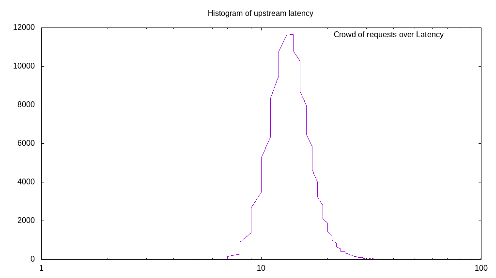
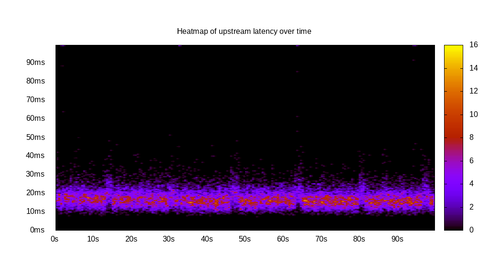
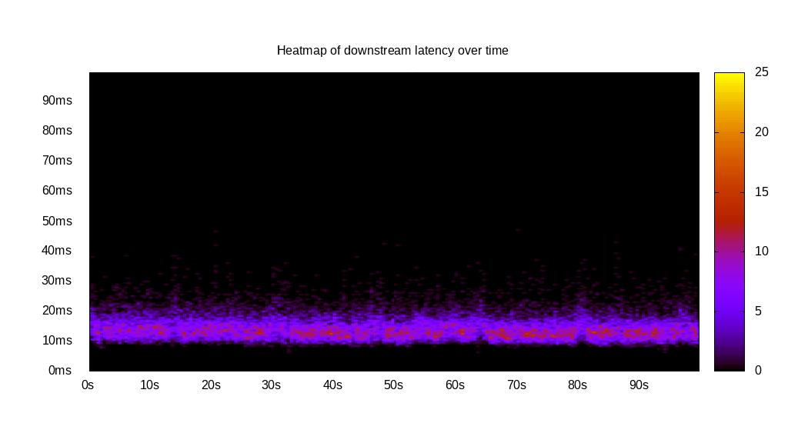
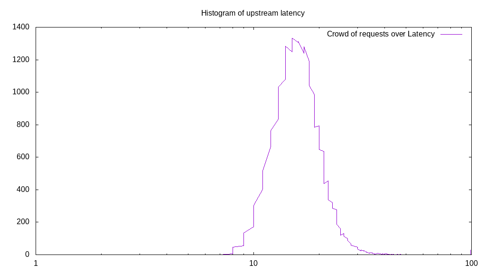
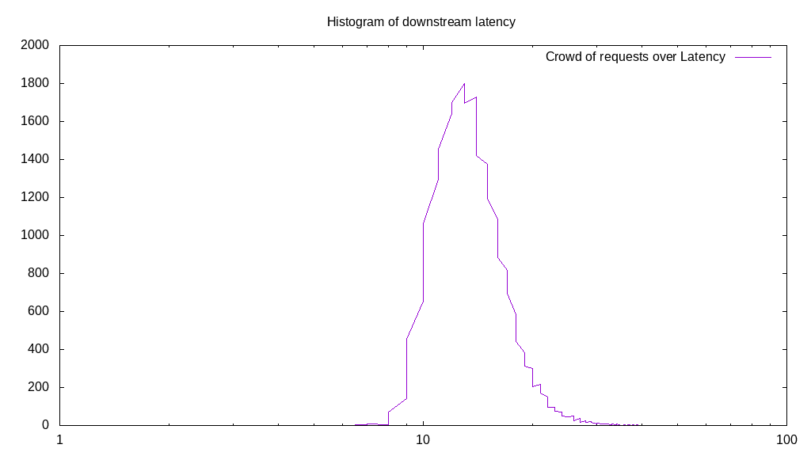
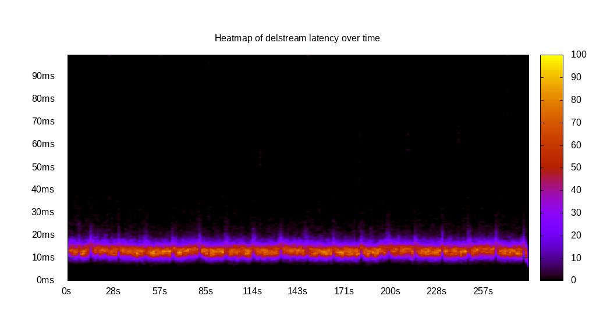
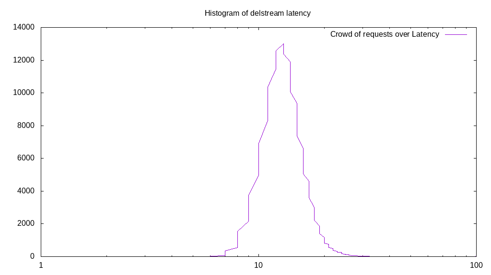

# Latency benchmark report. Crowd is 8

## Populate workload

## Object Size is 0.00kiB

### PUT Latency in ms over time

Evolution of PUT Latency over time

| Parameter | Value |
| --- | --- |
| Y Coordinate | PUT Latency in ms |
| X Coordinate | time in s since begining of workload |

### PUT Latency distribution in ms

Distribution of the PUT Latency in ms

| Parameter | Value |
| --- | --- |
| Y Coordinate | Number of PUT |
| X Coordinate | Latency in ms |
| Server volume | 0.000MiB|
| Server bandwidth | 0.000MiB/s |
| Server time | 300.00s |
| Server load | 7.93 |
| Server responses | 161728PUT |
| Server IOps | 539.10PUT/s |
| Client bandwidth | 0.000MiB/s |
| Client volume | 0.000MiB|
| Client time | 2379.07s |
| Client IOps |  67.98PUT/s  |
| Client Latency | 14.71ms/PUT |
| Client Limbo | 2.61ms/PUT |
| Crowd time | 2399.97s |
| Crowd efficiency | 99.13% |
| Highest Latency | 100.00ms |
| 95th percentile Latency | 21.11ms |
| 68th percentile Latency | 16.08ms |
| 50th percentile Latency | 14.57ms |
| 32nd percentile Latency | 13.57ms |
| 5th percentile Latency | 10.55ms |
| Lowest Latency | 6.53ms |

## Read workload

## Object Size is 0.00kiB

### GET Latency in ms over time

Evolution of GET Latency over time

| Parameter | Value |
| --- | --- |
| Y Coordinate | GET Latency in ms |
| X Coordinate | time in s since begining of workload |

### GET Latency distribution in ms

Distribution of the GET Latency in ms

| Parameter | Value |
| --- | --- |
| Y Coordinate | Number of GET |
| X Coordinate | Latency in ms |
| Server volume | 0.000MiB|
| Server bandwidth | 0.000MiB/s |
| Server time | 100.01s |
| Server load | 7.92 |
| Server responses | 53089GET |
| Server IOps | 530.84GET/s |
| Client bandwidth | 0.000MiB/s |
| Client volume | 0.000MiB|
| Client time | 792.16s |
| Client IOps |  67.02GET/s  |
| Client Latency | 14.92ms/GET |
| Client Limbo | 0.99ms/GET |
| Crowd time | 800.08s |
| Crowd efficiency | 99.01% |
| Highest Latency | 100.00ms |
| 95th percentile Latency | 22.11ms |
| 68th percentile Latency | 16.08ms |
| 50th percentile Latency | 14.57ms |
| 32nd percentile Latency | 13.57ms |
| 5th percentile Latency | 11.06ms |
| Lowest Latency | 7.54ms |

## Mixed workload

## Object Size is 0.00kiB

### PUT Latency in ms over time

Evolution of PUT Latency over time

| Parameter | Value |
| --- | --- |
| Y Coordinate | PUT Latency in ms |
| X Coordinate | time in s since begining of workload |

### GET Latency in ms over time

Evolution of GET Latency over time

| Parameter | Value |
| --- | --- |
| Y Coordinate | GET Latency in ms |
| X Coordinate | time in s since begining of workload |

### PUT Latency distribution in ms

Distribution of the PUT Latency in ms

| Parameter | Value |
| --- | --- |
| Y Coordinate | Number of PUT |
| X Coordinate | Latency in ms |
| Server volume | 0.000MiB|
| Server bandwidth | 0.000MiB/s |
| Server time | 100.01s |
| Server load | 4.32 |
| Server responses | 24713PUT |
| Server IOps | 247.10PUT/s |
| Client bandwidth | 0.000MiB/s |
| Client volume | 0.000MiB|
| Client time | 432.46s |
| Client IOps |  57.15PUT/s  |
| Client Latency | 17.50ms/PUT |
| Client Limbo | 45.95ms/PUT |
| Crowd time | 800.10s |
| Crowd efficiency | 54.05% |
| Highest Latency | 100.00ms |
| 95th percentile Latency | 25.63ms |
| 68th percentile Latency | 19.10ms |
| 50th percentile Latency | 17.09ms |
| 32nd percentile Latency | 15.58ms |
| 5th percentile Latency | 12.06ms |
| Lowest Latency | 7.04ms |

### GET Latency distribution in ms

Distribution of the GET Latency in ms

| Parameter | Value |
| --- | --- |
| Y Coordinate | Number of GET |
| X Coordinate | Latency in ms |
| Server volume | 0.000MiB|
| Server bandwidth | 0.000MiB/s |
| Server time | 100.01s |
| Server load | 3.60 |
| Server responses | 24748GET |
| Server IOps | 247.45GET/s |
| Client bandwidth | 0.000MiB/s |
| Client volume | 0.000MiB|
| Client time | 360.48s |
| Client IOps |  68.65GET/s  |
| Client Latency | 14.57ms/GET |
| Client Limbo | 54.95ms/GET |
| Crowd time | 800.10s |
| Crowd efficiency | 45.05% |
| Highest Latency | 100.00ms |
| 95th percentile Latency | 21.61ms |
| 68th percentile Latency | 16.08ms |
| 50th percentile Latency | 14.57ms |
| 32nd percentile Latency | 13.07ms |
| 5th percentile Latency | 10.55ms |
| Lowest Latency | 7.04ms |

## Cleanup workload

## Object Size is 0.00kiB

### DELETE Latency in ms over time

Evolution of DELETE Latency over time

| Parameter | Value |
| --- | --- |
| Y Coordinate | DELETE Latency in ms |
| X Coordinate | time in s since begining of workload |

### DELETE Latency distribution in ms

Distribution of the DELETE Latency in ms

| Parameter | Value |
| --- | --- |
| Y Coordinate | Number of DELETE |
| X Coordinate | Latency in ms |
| Server volume | 0.000MiB|
| Server bandwidth | 0.000MiB/s |
| Server time | 284.66s |
| Server load | 7.92 |
| Server responses | 161736DELETE |
| Server IOps | 568.17DELETE/s |
| Client bandwidth | 0.000MiB/s |
| Client volume | 0.000MiB|
| Client time | 2254.61s |
| Client IOps |  71.74DELETE/s  |
| Client Latency | 13.94ms/DELETE |
| Client Limbo | 2.83ms/DELETE |
| Crowd time | 2277.27s |
| Crowd efficiency | 99.00% |
| Highest Latency | 100.00ms |
| 95th percentile Latency | 19.60ms |
| 68th percentile Latency | 15.08ms |
| 50th percentile Latency | 14.07ms |
| 32nd percentile Latency | 13.07ms |
| 5th percentile Latency | 10.05ms |
| Lowest Latency | 4.52ms |

