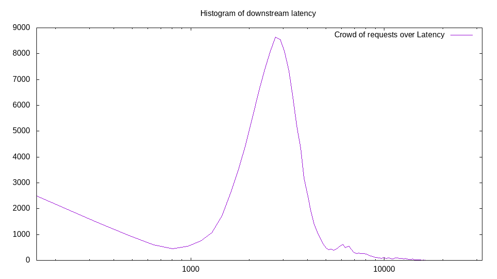

# Latency benchmark report. Crowd is 4096

## Populate workload

## Object Size is 0.00kiB

### PUT Latency in ms over time

Evolution of PUT Latency over time

| Parameter | Value |
| --- | --- |
| Y Coordinate | PUT Latency in ms |
| X Coordinate | time in s since begining of workload |

### PUT Latency distribution in ms

Distribution of the PUT Latency in ms

| Parameter | Value |
| --- | --- |
| Y Coordinate | Number of PUT |
| X Coordinate | Latency in ms |
| Server volume | 0.000MiB|
| Server bandwidth | 0.000MiB/s |
| Server time | 300.00s |
| Server load | 4046.67 |
| Server responses | 225905PUT |
| Server IOps | 753.02PUT/s |
| Client bandwidth | 0.000MiB/s |
| Client volume | 0.000MiB|
| Client time | 1213988.86s |
| Client IOps |  0.19PUT/s  |
| Client Latency | 5373.89ms/PUT |
| Client Limbo | 3.61ms/PUT |
| Crowd time | 1228787.71s |
| Crowd efficiency | 98.80% |
| Highest Latency | 25889.45ms |
| 95th percentile Latency | 10130.65ms |
| 68th percentile Latency | 6753.77ms |
| 50th percentile Latency | 5467.34ms |
| 32nd percentile Latency | 4180.90ms |
| 5th percentile Latency | 1447.24ms |
| Lowest Latency | 160.80ms |

## Read workload

## Object Size is 0.00kiB

### GET Latency in ms over time

Evolution of GET Latency over time

| Parameter | Value |
| --- | --- |
| Y Coordinate | GET Latency in ms |
| X Coordinate | time in s since begining of workload |

### GET Latency distribution in ms

Distribution of the GET Latency in ms

| Parameter | Value |
| --- | --- |
| Y Coordinate | Number of GET |
| X Coordinate | Latency in ms |
| Server volume | 0.000MiB|
| Server bandwidth | 0.000MiB/s |
| Server time | 115.03s |
| Server load | 3323.94 |
| Server responses | 122826GET |
| Server IOps | 1067.81GET/s |
| Client bandwidth | 0.000MiB/s |
| Client volume | 0.000MiB|
| Client time | 382339.65s |
| Client IOps |  0.32GET/s  |
| Client Latency | 3112.86ms/GET |
| Client Limbo | 21.68ms/GET |
| Crowd time | 471146.50s |
| Crowd efficiency | 81.15% |
| Highest Latency | 19778.89ms |
| 95th percentile Latency | 6914.57ms |
| 68th percentile Latency | 3376.88ms |
| 50th percentile Latency | 3055.28ms |
| 32nd percentile Latency | 2572.86ms |
| 5th percentile Latency | 482.41ms |
| Lowest Latency | 160.80ms |

## Mixed workload

## Object Size is 0.00kiB

### PUT Latency in ms over time

Evolution of PUT Latency over time

| Parameter | Value |
| --- | --- |
| Y Coordinate | PUT Latency in ms |
| X Coordinate | time in s since begining of workload |

### GET Latency in ms over time

Evolution of GET Latency over time

| Parameter | Value |
| --- | --- |
| Y Coordinate | GET Latency in ms |
| X Coordinate | time in s since begining of workload |

### PUT Latency distribution in ms

Distribution of the PUT Latency in ms

| Parameter | Value |
| --- | --- |
| Y Coordinate | Number of PUT |
| X Coordinate | Latency in ms |
| Server volume | 0.000MiB|
| Server bandwidth | 0.000MiB/s |
| Server time | 112.58s |
| Server load | 2073.30 |
| Server responses | 43534PUT |
| Server IOps | 386.69PUT/s |
| Client bandwidth | 0.000MiB/s |
| Client volume | 0.000MiB|
| Client time | 233416.79s |
| Client IOps |  0.19PUT/s  |
| Client Latency | 5361.71ms/PUT |
| Client Limbo | 55.60ms/PUT |
| Crowd time | 461135.87s |
| Crowd efficiency | 50.62% |
| Highest Latency | 14150.75ms |
| 95th percentile Latency | 8683.42ms |
| 68th percentile Latency | 6432.16ms |
| 50th percentile Latency | 5628.14ms |
| 32nd percentile Latency | 4663.32ms |
| 5th percentile Latency | 2251.26ms |
| Lowest Latency | 160.80ms |

### GET Latency distribution in ms

Distribution of the GET Latency in ms

| Parameter | Value |
| --- | --- |
| Y Coordinate | Number of GET |
| X Coordinate | Latency in ms |
| Server volume | 0.000MiB|
| Server bandwidth | 0.000MiB/s |
| Server time | 112.58s |
| Server load | 1530.85 |
| Server responses | 48462GET |
| Server IOps | 430.46GET/s |
| Client bandwidth | 0.000MiB/s |
| Client volume | 0.000MiB|
| Client time | 172346.28s |
| Client IOps |  0.28GET/s  |
| Client Latency | 3556.32ms/GET |
| Client Limbo | 70.51ms/GET |
| Crowd time | 461135.87s |
| Crowd efficiency | 37.37% |
| Highest Latency | 13507.54ms |
| 95th percentile Latency | 6271.36ms |
| 68th percentile Latency | 4341.71ms |
| 50th percentile Latency | 3698.49ms |
| 32nd percentile Latency | 3055.28ms |
| 5th percentile Latency | 1125.63ms |
| Lowest Latency | 160.80ms |

## Cleanup workload

## Object Size is 0.00kiB

### DELETE Latency in ms over time

Evolution of DELETE Latency over time

| Parameter | Value |
| --- | --- |
| Y Coordinate | DELETE Latency in ms |
| X Coordinate | time in s since begining of workload |

### DELETE Latency distribution in ms

Distribution of the DELETE Latency in ms

| Parameter | Value |
| --- | --- |
| Y Coordinate | Number of DELETE |
| X Coordinate | Latency in ms |
| Server volume | 0.000MiB|
| Server bandwidth | 0.000MiB/s |
| Server time | 302.73s |
| Server load | 3825.48 |
| Server responses | 225913DELETE |
| Server IOps | 746.25DELETE/s |
| Client bandwidth | 0.000MiB/s |
| Client volume | 0.000MiB|
| Client time | 1158099.28s |
| Client IOps |  0.20DELETE/s  |
| Client Latency | 5126.31ms/DELETE |
| Client Limbo | 19.99ms/DELETE |
| Crowd time | 1239994.37s |
| Crowd efficiency | 93.40% |
| Highest Latency | 18974.87ms |
| 95th percentile Latency | 9326.63ms |
| 68th percentile Latency | 6432.16ms |
| 50th percentile Latency | 5145.73ms |
| 32nd percentile Latency | 4020.10ms |
| 5th percentile Latency | 1447.24ms |
| Lowest Latency | 160.80ms |

