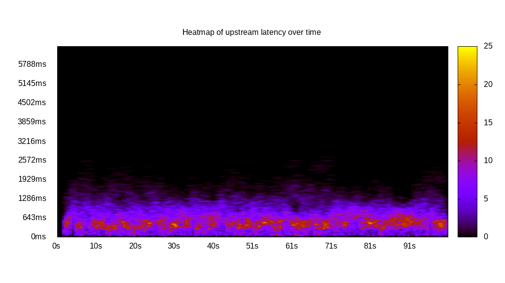

# Latency benchmark report. Crowd is 512

## Populate workload

## Object Size is 0.00kiB

### PUT Latency in ms over time

Evolution of PUT Latency over time

| Parameter | Value |
| --- | --- |
| Y Coordinate | PUT Latency in ms |
| X Coordinate | time in s since begining of workload |

### PUT Latency distribution in ms

Distribution of the PUT Latency in ms

| Parameter | Value |
| --- | --- |
| Y Coordinate | Number of PUT |
| X Coordinate | Latency in ms |
| Server volume | 0.000MiB|
| Server bandwidth | 0.000MiB/s |
| Server time | 300.00s |
| Server load | 511.14 |
| Server responses | 263711PUT |
| Server IOps | 879.03PUT/s |
| Client bandwidth | 0.000MiB/s |
| Client volume | 0.000MiB|
| Client time | 153344.27s |
| Client IOps |  1.72PUT/s  |
| Client Latency | 581.49ms/PUT |
| Client Limbo | 0.50ms/PUT |
| Crowd time | 153601.02s |
| Crowd efficiency | 99.83% |
| Highest Latency | 3441.21ms |
| 95th percentile Latency | 1125.63ms |
| 68th percentile Latency | 707.54ms |
| 50th percentile Latency | 578.89ms |
| 32nd percentile Latency | 450.25ms |
| 5th percentile Latency | 192.96ms |
| Lowest Latency | 32.16ms |

## Read workload

## Object Size is 0.00kiB

### GET Latency in ms over time

Evolution of GET Latency over time

| Parameter | Value |
| --- | --- |
| Y Coordinate | GET Latency in ms |
| X Coordinate | time in s since begining of workload |

### GET Latency distribution in ms

Distribution of the GET Latency in ms

| Parameter | Value |
| --- | --- |
| Y Coordinate | Number of GET |
| X Coordinate | Latency in ms |
| Server volume | 0.000MiB|
| Server bandwidth | 0.000MiB/s |
| Server time | 102.04s |
| Server load | 496.13 |
| Server responses | 143834GET |
| Server IOps | 1409.60GET/s |
| Client bandwidth | 0.000MiB/s |
| Client volume | 0.000MiB|
| Client time | 50624.15s |
| Client IOps |  2.84GET/s  |
| Client Latency | 351.96ms/GET |
| Client Limbo | 3.16ms/GET |
| Crowd time | 52243.97s |
| Crowd efficiency | 96.90% |
| Highest Latency | 4052.26ms |
| 95th percentile Latency | 1125.63ms |
| 68th percentile Latency | 418.09ms |
| 50th percentile Latency | 289.45ms |
| 32nd percentile Latency | 192.96ms |
| 5th percentile Latency | 64.32ms |
| Lowest Latency | 32.16ms |

## Mixed workload

## Object Size is 0.00kiB

### PUT Latency in ms over time

Evolution of PUT Latency over time

| Parameter | Value |
| --- | --- |
| Y Coordinate | PUT Latency in ms |
| X Coordinate | time in s since begining of workload |

### GET Latency in ms over time

Evolution of GET Latency over time

| Parameter | Value |
| --- | --- |
| Y Coordinate | GET Latency in ms |
| X Coordinate | time in s since begining of workload |

### PUT Latency distribution in ms

Distribution of the PUT Latency in ms

| Parameter | Value |
| --- | --- |
| Y Coordinate | Number of PUT |
| X Coordinate | Latency in ms |
| Server volume | 0.000MiB|
| Server bandwidth | 0.000MiB/s |
| Server time | 101.50s |
| Server load | 308.88 |
| Server responses | 51363PUT |
| Server IOps | 506.06PUT/s |
| Client bandwidth | 0.000MiB/s |
| Client volume | 0.000MiB|
| Client time | 31349.63s |
| Client IOps |  1.64PUT/s  |
| Client Latency | 610.35ms/PUT |
| Client Limbo | 40.27ms/PUT |
| Crowd time | 51965.44s |
| Crowd efficiency | 60.33% |
| Highest Latency | 3473.37ms |
| 95th percentile Latency | 1318.59ms |
| 68th percentile Latency | 739.70ms |
| 50th percentile Latency | 578.89ms |
| 32nd percentile Latency | 450.25ms |
| 5th percentile Latency | 160.80ms |
| Lowest Latency | 32.16ms |

### GET Latency distribution in ms

Distribution of the GET Latency in ms

| Parameter | Value |
| --- | --- |
| Y Coordinate | Number of GET |
| X Coordinate | Latency in ms |
| Server volume | 0.000MiB|
| Server bandwidth | 0.000MiB/s |
| Server time | 101.50s |
| Server load | 195.28 |
| Server responses | 51526GET |
| Server IOps | 507.67GET/s |
| Client bandwidth | 0.000MiB/s |
| Client volume | 0.000MiB|
| Client time | 19819.58s |
| Client IOps |  2.60GET/s  |
| Client Latency | 384.65ms/GET |
| Client Limbo | 62.78ms/GET |
| Crowd time | 51965.44s |
| Crowd efficiency | 38.14% |
| Highest Latency | 2412.06ms |
| 95th percentile Latency | 964.82ms |
| 68th percentile Latency | 482.41ms |
| 50th percentile Latency | 353.77ms |
| 32nd percentile Latency | 257.29ms |
| 5th percentile Latency | 64.32ms |
| Lowest Latency | 32.16ms |

## Cleanup workload

## Object Size is 0.00kiB

### DELETE Latency in ms over time

Evolution of DELETE Latency over time

| Parameter | Value |
| --- | --- |
| Y Coordinate | DELETE Latency in ms |
| X Coordinate | time in s since begining of workload |

### DELETE Latency distribution in ms

Distribution of the DELETE Latency in ms

| Parameter | Value |
| --- | --- |
| Y Coordinate | Number of DELETE |
| X Coordinate | Latency in ms |
| Server volume | 0.000MiB|
| Server bandwidth | 0.000MiB/s |
| Server time | 289.37s |
| Server load | 506.39 |
| Server responses | 263719DELETE |
| Server IOps | 911.37DELETE/s |
| Client bandwidth | 0.000MiB/s |
| Client volume | 0.000MiB|
| Client time | 146531.59s |
| Client IOps |  1.80DELETE/s  |
| Client Latency | 555.64ms/DELETE |
| Client Limbo | 3.17ms/DELETE |
| Crowd time | 148154.88s |
| Crowd efficiency | 98.90% |
| Highest Latency | 6400.00ms |
| 95th percentile Latency | 1093.47ms |
| 68th percentile Latency | 675.38ms |
| 50th percentile Latency | 546.73ms |
| 32nd percentile Latency | 450.25ms |
| 5th percentile Latency | 160.80ms |
| Lowest Latency | 32.16ms |

