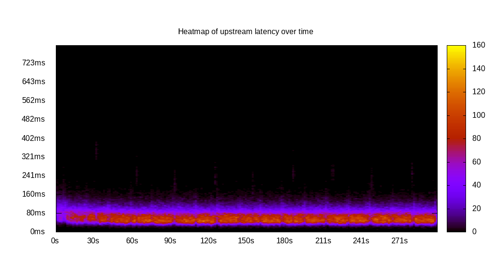
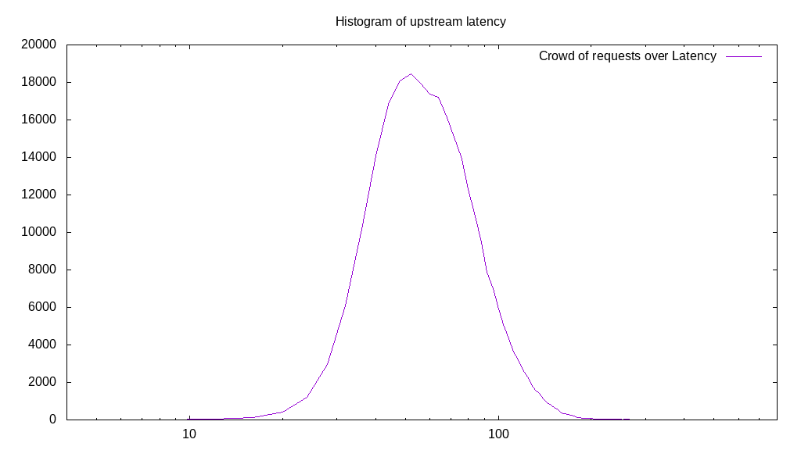
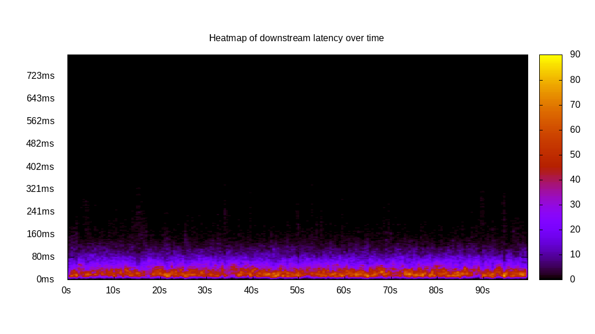
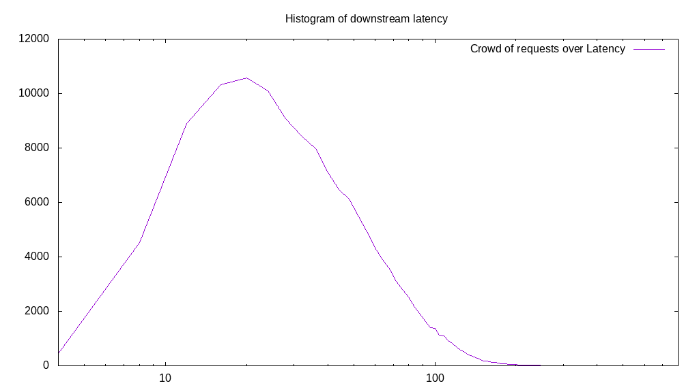
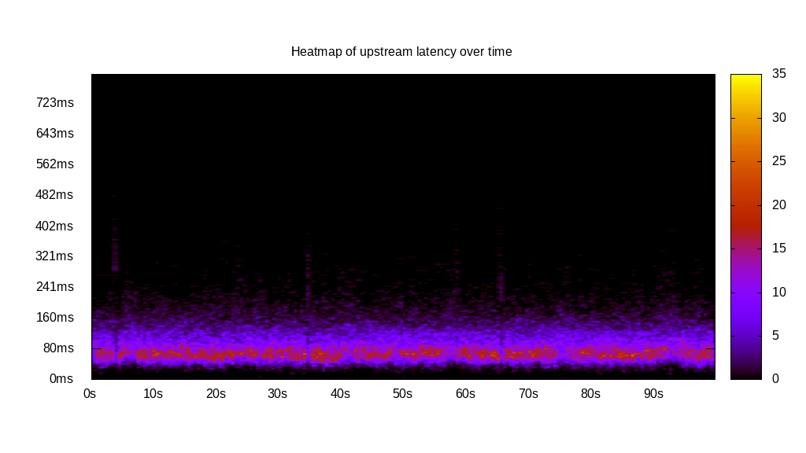
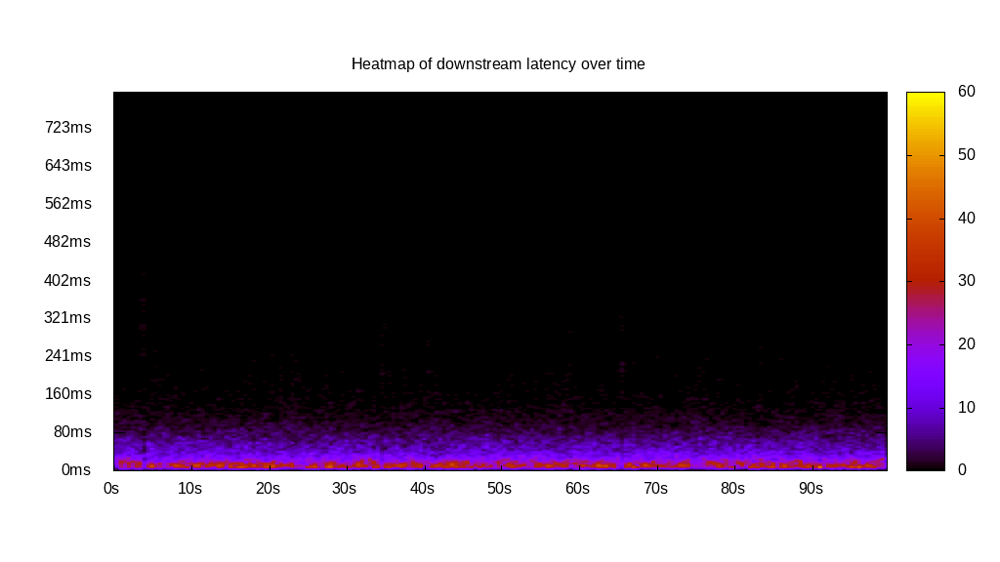
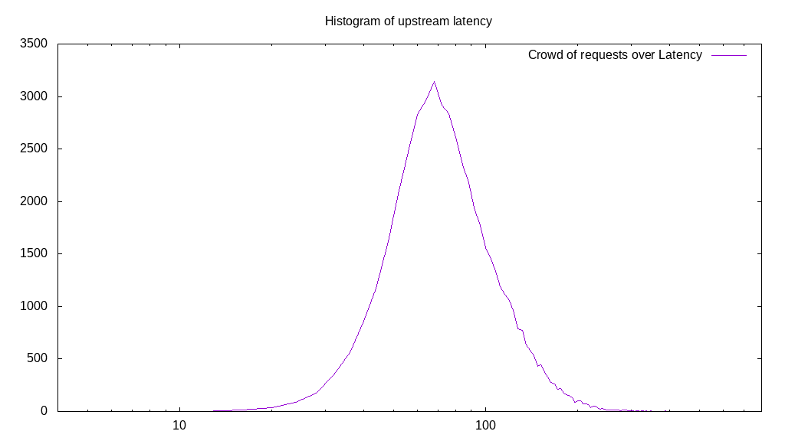
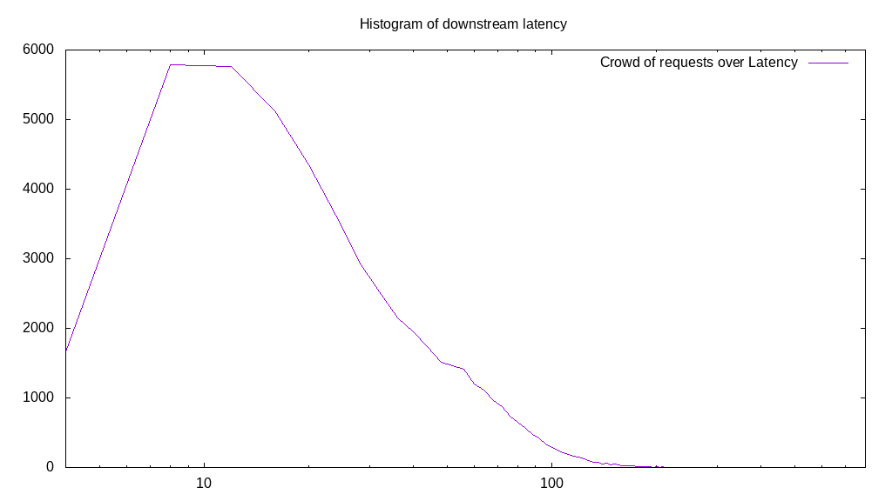
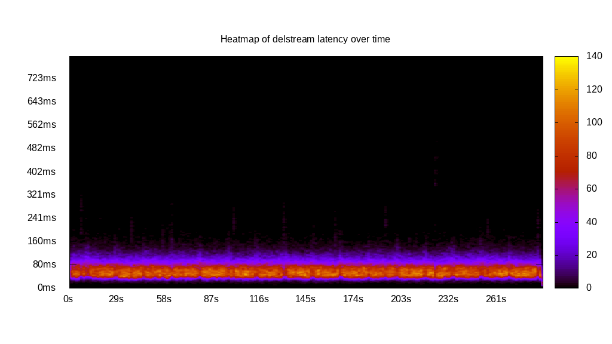
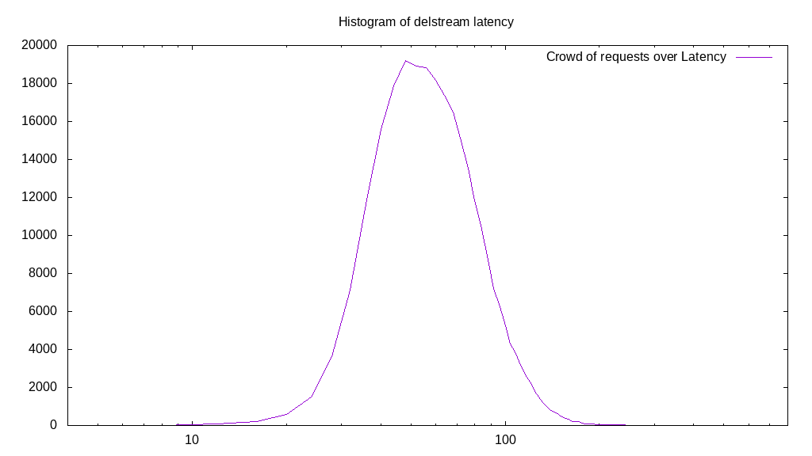

# Latency benchmark report. Crowd is 64

## Populate workload

## Object Size is 0.00kiB

### PUT Latency in ms over time

Evolution of PUT Latency over time

| Parameter | Value |
| --- | --- |
| Y Coordinate | PUT Latency in ms |
| X Coordinate | time in s since begining of workload |

### PUT Latency distribution in ms

Distribution of the PUT Latency in ms

| Parameter | Value |
| --- | --- |
| Y Coordinate | Number of PUT |
| X Coordinate | Latency in ms |
| Server volume | 0.000MiB|
| Server bandwidth | 0.000MiB/s |
| Server time | 300.00s |
| Server load | 63.89 |
| Server responses | 272431PUT |
| Server IOps | 908.11PUT/s |
| Client bandwidth | 0.000MiB/s |
| Client volume | 0.000MiB|
| Client time | 19165.34s |
| Client IOps |  14.21PUT/s  |
| Client Latency | 70.35ms/PUT |
| Client Limbo | 0.54ms/PUT |
| Crowd time | 19199.81s |
| Crowd efficiency | 99.82% |
| Highest Latency | 426.13ms |
| 95th percentile Latency | 128.64ms |
| 68th percentile Latency | 80.40ms |
| 50th percentile Latency | 68.34ms |
| 32nd percentile Latency | 56.28ms |
| 5th percentile Latency | 40.20ms |
| Lowest Latency | 8.04ms |

## Read workload

## Object Size is 0.00kiB

### GET Latency in ms over time

Evolution of GET Latency over time

| Parameter | Value |
| --- | --- |
| Y Coordinate | GET Latency in ms |
| X Coordinate | time in s since begining of workload |

### GET Latency distribution in ms

Distribution of the GET Latency in ms

| Parameter | Value |
| --- | --- |
| Y Coordinate | Number of GET |
| X Coordinate | Latency in ms |
| Server volume | 0.000MiB|
| Server bandwidth | 0.000MiB/s |
| Server time | 100.18s |
| Server load | 63.68 |
| Server responses | 138224GET |
| Server IOps | 1379.76GET/s |
| Client bandwidth | 0.000MiB/s |
| Client volume | 0.000MiB|
| Client time | 6379.10s |
| Client IOps |  21.67GET/s  |
| Client Latency | 46.15ms/GET |
| Client Limbo | 0.51ms/GET |
| Crowd time | 6411.52s |
| Crowd efficiency | 99.49% |
| Highest Latency | 341.71ms |
| 95th percentile Latency | 112.56ms |
| 68th percentile Latency | 56.28ms |
| 50th percentile Latency | 40.20ms |
| 32nd percentile Latency | 28.14ms |
| 5th percentile Latency | 16.08ms |
| Lowest Latency | 4.02ms |

## Mixed workload

## Object Size is 0.00kiB

### PUT Latency in ms over time

Evolution of PUT Latency over time

| Parameter | Value |
| --- | --- |
| Y Coordinate | PUT Latency in ms |
| X Coordinate | time in s since begining of workload |

### GET Latency in ms over time

Evolution of GET Latency over time

| Parameter | Value |
| --- | --- |
| Y Coordinate | GET Latency in ms |
| X Coordinate | time in s since begining of workload |

### PUT Latency distribution in ms

Distribution of the PUT Latency in ms

| Parameter | Value |
| --- | --- |
| Y Coordinate | Number of PUT |
| X Coordinate | Latency in ms |
| Server volume | 0.000MiB|
| Server bandwidth | 0.000MiB/s |
| Server time | 100.10s |
| Server load | 45.70 |
| Server responses | 51082PUT |
| Server IOps | 510.30PUT/s |
| Client bandwidth | 0.000MiB/s |
| Client volume | 0.000MiB|
| Client time | 4574.47s |
| Client IOps |  11.17PUT/s  |
| Client Latency | 89.55ms/PUT |
| Client Limbo | 28.63ms/PUT |
| Crowd time | 6406.53s |
| Crowd efficiency | 71.40% |
| Highest Latency | 482.41ms |
| 95th percentile Latency | 168.84ms |
| 68th percentile Latency | 100.50ms |
| 50th percentile Latency | 84.42ms |
| 32nd percentile Latency | 72.36ms |
| 5th percentile Latency | 48.24ms |
| Lowest Latency | 8.04ms |

### GET Latency distribution in ms

Distribution of the GET Latency in ms

| Parameter | Value |
| --- | --- |
| Y Coordinate | Number of GET |
| X Coordinate | Latency in ms |
| Server volume | 0.000MiB|
| Server bandwidth | 0.000MiB/s |
| Server time | 100.10s |
| Server load | 18.12 |
| Server responses | 51434GET |
| Server IOps | 513.82GET/s |
| Client bandwidth | 0.000MiB/s |
| Client volume | 0.000MiB|
| Client time | 1814.07s |
| Client IOps |  28.35GET/s  |
| Client Latency | 35.27ms/GET |
| Client Limbo | 71.76ms/GET |
| Crowd time | 6406.53s |
| Crowd efficiency | 28.32% |
| Highest Latency | 418.09ms |
| 95th percentile Latency | 96.48ms |
| 68th percentile Latency | 44.22ms |
| 50th percentile Latency | 28.14ms |
| 32nd percentile Latency | 20.10ms |
| 5th percentile Latency | 12.06ms |
| Lowest Latency | 4.02ms |

## Cleanup workload

## Object Size is 0.00kiB

### DELETE Latency in ms over time

Evolution of DELETE Latency over time

| Parameter | Value |
| --- | --- |
| Y Coordinate | DELETE Latency in ms |
| X Coordinate | time in s since begining of workload |

### DELETE Latency distribution in ms

Distribution of the DELETE Latency in ms

| Parameter | Value |
| --- | --- |
| Y Coordinate | Number of DELETE |
| X Coordinate | Latency in ms |
| Server volume | 0.000MiB|
| Server bandwidth | 0.000MiB/s |
| Server time | 289.12s |
| Server load | 63.71 |
| Server responses | 272439DELETE |
| Server IOps | 942.29DELETE/s |
| Client bandwidth | 0.000MiB/s |
| Client volume | 0.000MiB|
| Client time | 18420.81s |
| Client IOps |  14.79DELETE/s  |
| Client Latency | 67.61ms/DELETE |
| Client Limbo | 1.30ms/DELETE |
| Crowd time | 18503.94s |
| Crowd efficiency | 99.55% |
| Highest Latency | 510.55ms |
| 95th percentile Latency | 120.60ms |
| 68th percentile Latency | 80.40ms |
| 50th percentile Latency | 68.34ms |
| 32nd percentile Latency | 56.28ms |
| 5th percentile Latency | 40.20ms |
| Lowest Latency | 8.04ms |

