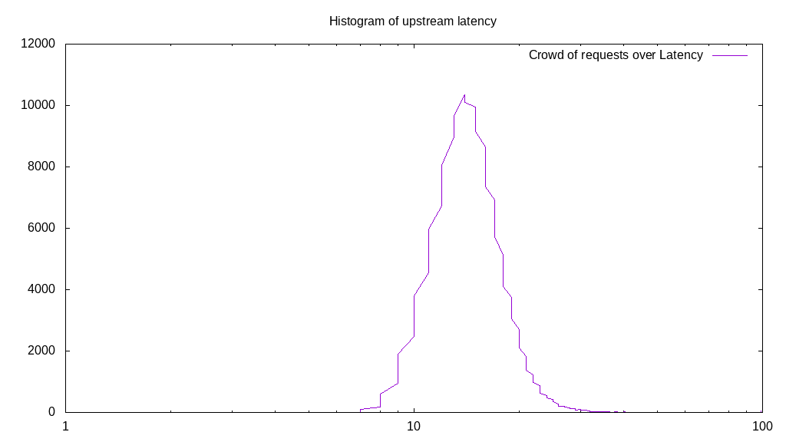
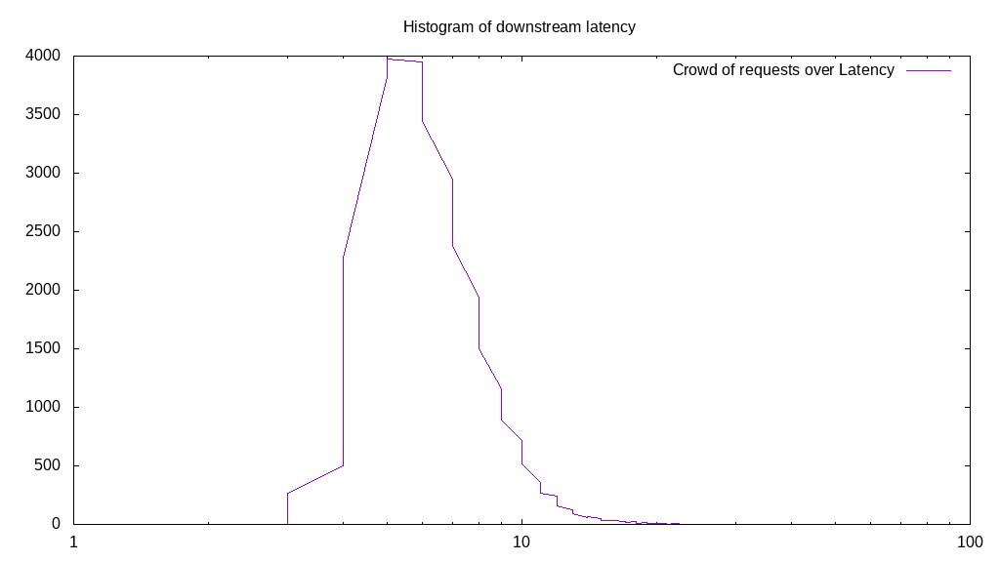

# Latency benchmark report. Crowd is 8

## Populate workload

## Object Size is 0.00kiB

### PUT Latency in ms over time

Evolution of PUT Latency over time

| Parameter | Value |
| --- | --- |
| Y Coordinate | PUT Latency in ms |
| X Coordinate | time in s since begining of workload |

### PUT Latency distribution in ms

Distribution of the PUT Latency in ms

| Parameter | Value |
| --- | --- |
| Y Coordinate | Number of PUT |
| X Coordinate | Latency in ms |
| Server volume | 0.000MiB|
| Server bandwidth | 0.000MiB/s |
| Server time | 300.00s |
| Server load | 7.93 |
| Server responses | 153803PUT |
| Server IOps | 512.68PUT/s |
| Client bandwidth | 0.000MiB/s |
| Client volume | 0.000MiB|
| Client time | 2379.60s |
| Client IOps |  64.63PUT/s  |
| Client Latency | 15.47ms/PUT |
| Client Limbo | 2.55ms/PUT |
| Crowd time | 2399.99s |
| Crowd efficiency | 99.15% |
| Highest Latency | 100.00ms |
| 95th percentile Latency | 22.11ms |
| 68th percentile Latency | 17.09ms |
| 50th percentile Latency | 15.58ms |
| 32nd percentile Latency | 14.07ms |
| 5th percentile Latency | 11.06ms |
| Lowest Latency | 6.53ms |

## Read workload

## Object Size is 0.00kiB

### GET Latency in ms over time

Evolution of GET Latency over time

| Parameter | Value |
| --- | --- |
| Y Coordinate | GET Latency in ms |
| X Coordinate | time in s since begining of workload |

### GET Latency distribution in ms

Distribution of the GET Latency in ms

| Parameter | Value |
| --- | --- |
| Y Coordinate | Number of GET |
| X Coordinate | Latency in ms |
| Server volume | 0.000MiB|
| Server bandwidth | 0.000MiB/s |
| Server time | 100.02s |
| Server load | 7.89 |
| Server responses | 104333GET |
| Server IOps | 1043.16GET/s |
| Client bandwidth | 0.000MiB/s |
| Client volume | 0.000MiB|
| Client time | 788.89s |
| Client IOps |  132.25GET/s  |
| Client Latency | 7.56ms/GET |
| Client Limbo | 1.40ms/GET |
| Crowd time | 800.13s |
| Crowd efficiency | 98.60% |
| Highest Latency | 58.29ms |
| 95th percentile Latency | 13.07ms |
| 68th percentile Latency | 8.54ms |
| 50th percentile Latency | 7.54ms |
| 32nd percentile Latency | 6.53ms |
| 5th percentile Latency | 5.03ms |
| Lowest Latency | 2.51ms |

## Mixed workload

## Object Size is 0.00kiB

### PUT Latency in ms over time

Evolution of PUT Latency over time

| Parameter | Value |
| --- | --- |
| Y Coordinate | PUT Latency in ms |
| X Coordinate | time in s since begining of workload |

### GET Latency in ms over time

Evolution of GET Latency over time

| Parameter | Value |
| --- | --- |
| Y Coordinate | GET Latency in ms |
| X Coordinate | time in s since begining of workload |

### PUT Latency distribution in ms

Distribution of the PUT Latency in ms

| Parameter | Value |
| --- | --- |
| Y Coordinate | Number of PUT |
| X Coordinate | Latency in ms |
| Server volume | 0.000MiB|
| Server bandwidth | 0.000MiB/s |
| Server time | 100.01s |
| Server load | 5.71 |
| Server responses | 32130PUT |
| Server IOps | 321.27PUT/s |
| Client bandwidth | 0.000MiB/s |
| Client volume | 0.000MiB|
| Client time | 571.10s |
| Client IOps |  56.26PUT/s  |
| Client Latency | 17.77ms/PUT |
| Client Limbo | 28.62ms/PUT |
| Crowd time | 800.06s |
| Crowd efficiency | 71.38% |
| Highest Latency | 100.00ms |
| 95th percentile Latency | 26.13ms |
| 68th percentile Latency | 19.60ms |
| 50th percentile Latency | 17.59ms |
| 32nd percentile Latency | 16.08ms |
| 5th percentile Latency | 12.06ms |
| Lowest Latency | 7.04ms |

### GET Latency distribution in ms

Distribution of the GET Latency in ms

| Parameter | Value |
| --- | --- |
| Y Coordinate | Number of GET |
| X Coordinate | Latency in ms |
| Server volume | 0.000MiB|
| Server bandwidth | 0.000MiB/s |
| Server time | 100.01s |
| Server load | 2.22 |
| Server responses | 31958GET |
| Server IOps | 319.55GET/s |
| Client bandwidth | 0.000MiB/s |
| Client volume | 0.000MiB|
| Client time | 221.59s |
| Client IOps |  144.22GET/s  |
| Client Latency | 6.93ms/GET |
| Client Limbo | 72.31ms/GET |
| Crowd time | 800.06s |
| Crowd efficiency | 27.70% |
| Highest Latency | 27.14ms |
| 95th percentile Latency | 11.56ms |
| 68th percentile Latency | 8.04ms |
| 50th percentile Latency | 7.04ms |
| 32nd percentile Latency | 6.03ms |
| 5th percentile Latency | 5.03ms |
| Lowest Latency | 3.52ms |

## Cleanup workload

## Object Size is 0.00kiB

### DELETE Latency in ms over time

Evolution of DELETE Latency over time

| Parameter | Value |
| --- | --- |
| Y Coordinate | DELETE Latency in ms |
| X Coordinate | time in s since begining of workload |

### DELETE Latency distribution in ms

Distribution of the DELETE Latency in ms

| Parameter | Value |
| --- | --- |
| Y Coordinate | Number of DELETE |
| X Coordinate | Latency in ms |
| Server volume | 0.000MiB|
| Server bandwidth | 0.000MiB/s |
| Server time | 279.18s |
| Server load | 7.93 |
| Server responses | 153811DELETE |
| Server IOps | 550.94DELETE/s |
| Client bandwidth | 0.000MiB/s |
| Client volume | 0.000MiB|
| Client time | 2212.72s |
| Client IOps |  69.51DELETE/s  |
| Client Latency | 14.39ms/DELETE |
| Client Limbo | 2.59ms/DELETE |
| Crowd time | 2233.43s |
| Crowd efficiency | 99.07% |
| Highest Latency | 100.00ms |
| 95th percentile Latency | 20.60ms |
| 68th percentile Latency | 16.08ms |
| 50th percentile Latency | 14.57ms |
| 32nd percentile Latency | 13.07ms |
| 5th percentile Latency | 10.55ms |
| Lowest Latency | 5.53ms |

