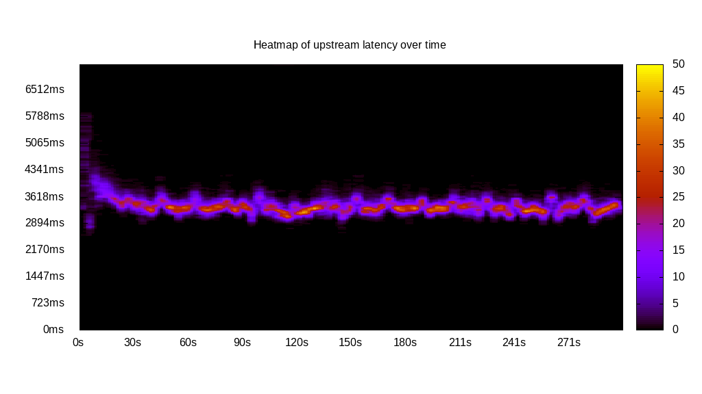
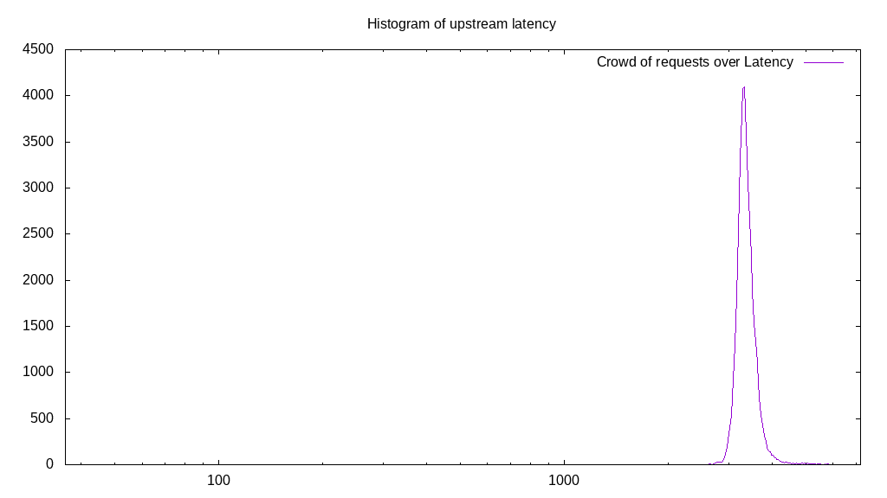
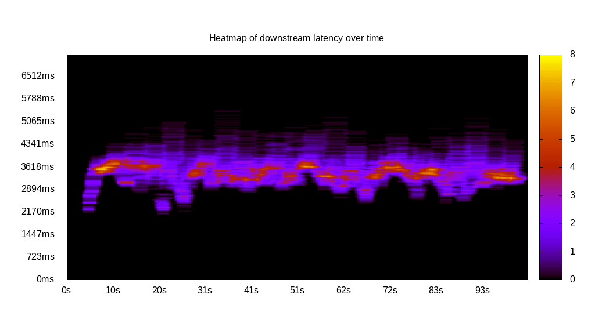
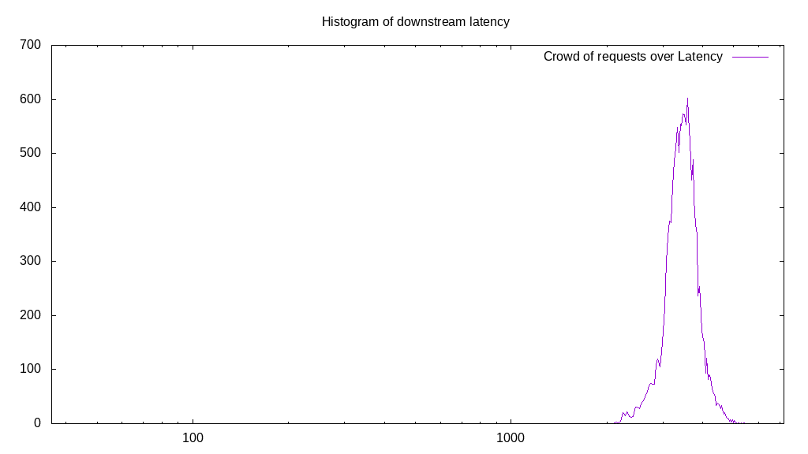
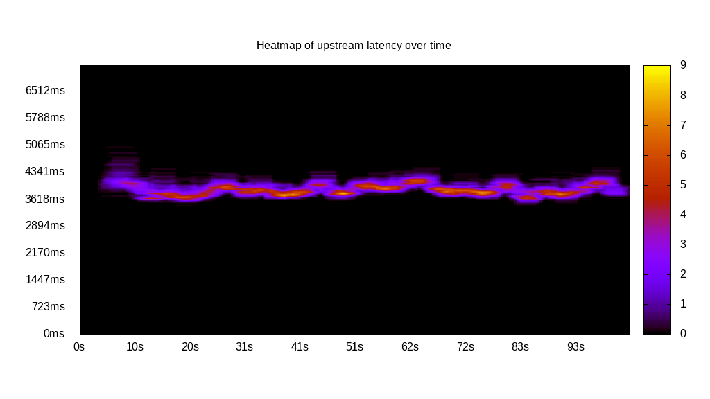
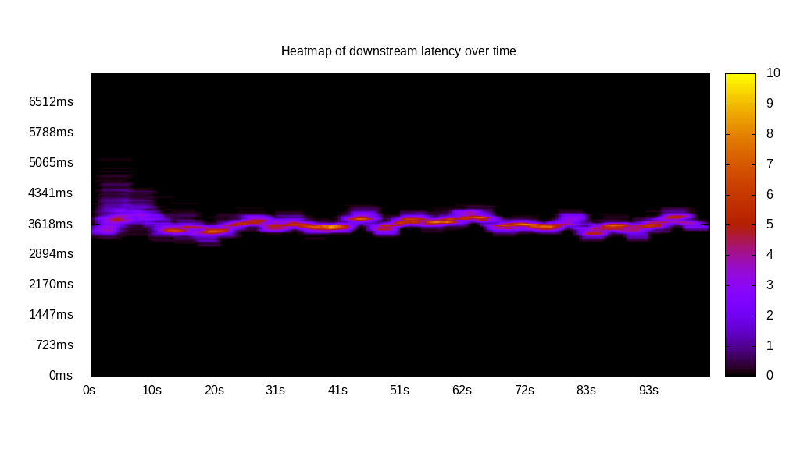
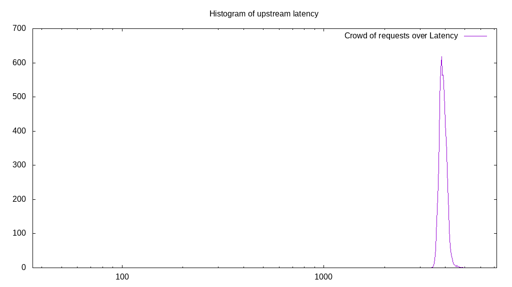
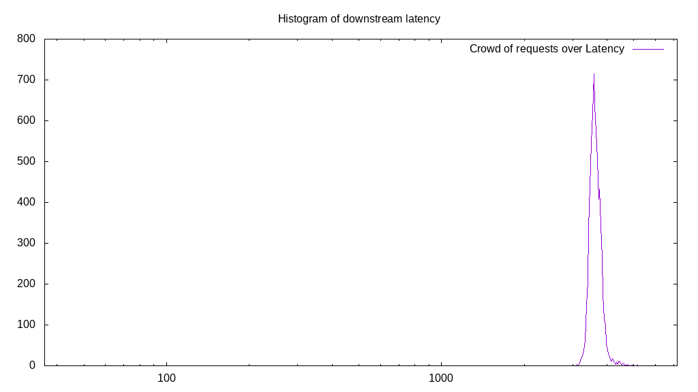
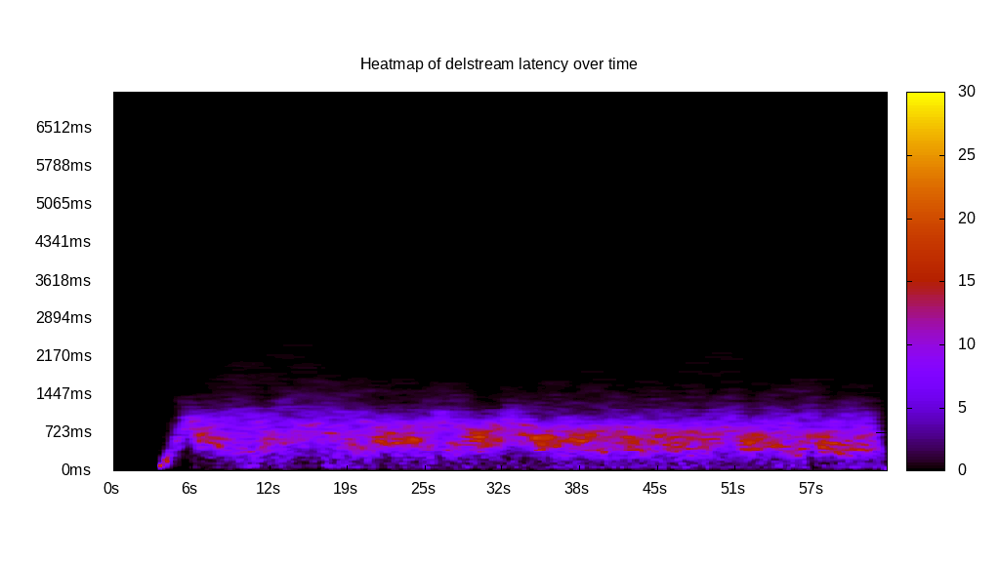
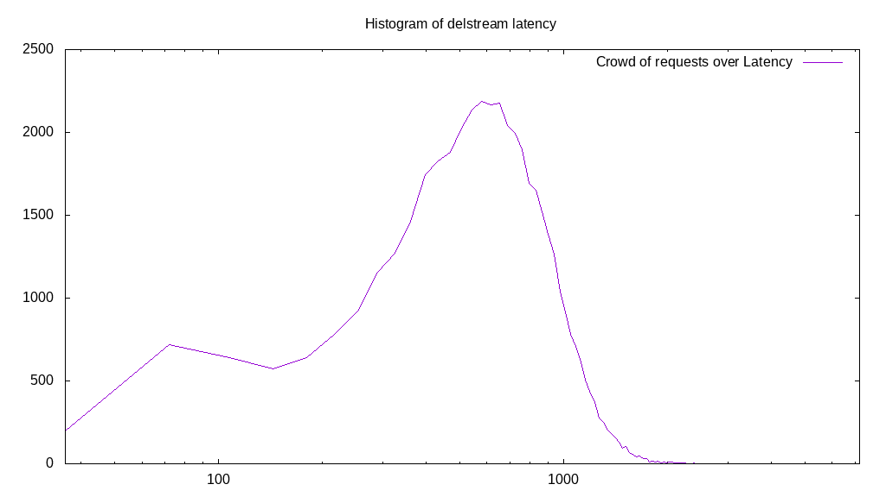

# Latency benchmark report. Crowd is 512

## Populate workload

## Object Size is 1024.00kiB

### PUT Latency in ms over time

Evolution of PUT Latency over time

| Parameter | Value |
| --- | --- |
| Y Coordinate | PUT Latency in ms |
| X Coordinate | time in s since begining of workload |

### PUT Latency distribution in ms

Distribution of the PUT Latency in ms

| Parameter | Value |
| --- | --- |
| Y Coordinate | Number of PUT |
| X Coordinate | Latency in ms |
| Server volume | 45089.000MiB|
| Server bandwidth | 150.299MiB/s |
| Server time | 300.00s |
| Server load | 509.01 |
| Server responses | 45089PUT |
| Server IOps | 150.30PUT/s |
| Client bandwidth | 0.294MiB/s |
| Client volume | 88.064MiB|
| Client time | 152699.64s |
| Client IOps |  0.30PUT/s  |
| Client Latency | 3386.63ms/PUT |
| Client Limbo | 1.75ms/PUT |
| Crowd time | 153597.95s |
| Crowd efficiency | 99.42% |
| Highest Latency | 7200.00ms |
| 95th percentile Latency | 3798.99ms |
| 68th percentile Latency | 3473.37ms |
| 50th percentile Latency | 3364.82ms |
| 32nd percentile Latency | 3292.46ms |
| 5th percentile Latency | 3111.56ms |
| Lowest Latency | 2460.30ms |

## Read workload

## Object Size is 1024.00kiB

### GET Latency in ms over time

Evolution of GET Latency over time

| Parameter | Value |
| --- | --- |
| Y Coordinate | GET Latency in ms |
| X Coordinate | time in s since begining of workload |

### GET Latency distribution in ms

Distribution of the GET Latency in ms

| Parameter | Value |
| --- | --- |
| Y Coordinate | Number of GET |
| X Coordinate | Latency in ms |
| Server volume | 14178.000MiB|
| Server bandwidth | 137.135MiB/s |
| Server time | 103.39s |
| Server load | 479.94 |
| Server responses | 14178GET |
| Server IOps | 137.14GET/s |
| Client bandwidth | 0.268MiB/s |
| Client volume | 27.691MiB|
| Client time | 49619.68s |
| Client IOps |  0.29GET/s  |
| Client Latency | 3499.77ms/GET |
| Client Limbo | 6.47ms/GET |
| Crowd time | 52934.14s |
| Crowd efficiency | 93.74% |
| Highest Latency | 5427.14ms |
| 95th percentile Latency | 4233.17ms |
| 68th percentile Latency | 3690.45ms |
| 50th percentile Latency | 3545.73ms |
| 32nd percentile Latency | 3364.82ms |
| 5th percentile Latency | 2894.47ms |
| Lowest Latency | 2134.67ms |

## Mixed workload

## Object Size is 1024.00kiB

### PUT Latency in ms over time

Evolution of PUT Latency over time

| Parameter | Value |
| --- | --- |
| Y Coordinate | PUT Latency in ms |
| X Coordinate | time in s since begining of workload |

### GET Latency in ms over time

Evolution of GET Latency over time

| Parameter | Value |
| --- | --- |
| Y Coordinate | GET Latency in ms |
| X Coordinate | time in s since begining of workload |

### PUT Latency distribution in ms

Distribution of the PUT Latency in ms

| Parameter | Value |
| --- | --- |
| Y Coordinate | Number of PUT |
| X Coordinate | Latency in ms |
| Server volume | 6581.000MiB|
| Server bandwidth | 63.666MiB/s |
| Server time | 103.37s |
| Server load | 248.87 |
| Server responses | 6581PUT |
| Server IOps | 63.67PUT/s |
| Client bandwidth | 0.124MiB/s |
| Client volume | 12.854MiB|
| Client time | 25725.40s |
| Client IOps |  0.26PUT/s  |
| Client Latency | 3909.04ms/PUT |
| Client Limbo | 53.12ms/PUT |
| Crowd time | 52923.90s |
| Crowd efficiency | 48.61% |
| Highest Latency | 4992.96ms |
| 95th percentile Latency | 4233.17ms |
| 68th percentile Latency | 4016.08ms |
| 50th percentile Latency | 3943.72ms |
| 32nd percentile Latency | 3871.36ms |
| 5th percentile Latency | 3690.45ms |
| Lowest Latency | 3437.19ms |

### GET Latency distribution in ms

Distribution of the GET Latency in ms

| Parameter | Value |
| --- | --- |
| Y Coordinate | Number of GET |
| X Coordinate | Latency in ms |
| Server volume | 6988.000MiB|
| Server bandwidth | 67.604MiB/s |
| Server time | 103.37s |
| Server load | 246.15 |
| Server responses | 6988GET |
| Server IOps | 67.60GET/s |
| Client bandwidth | 0.132MiB/s |
| Client volume | 13.648MiB|
| Client time | 25444.13s |
| Client IOps |  0.27GET/s  |
| Client Latency | 3641.12ms/GET |
| Client Limbo | 53.67ms/GET |
| Crowd time | 52923.90s |
| Crowd efficiency | 48.08% |
| Highest Latency | 5173.87ms |
| 95th percentile Latency | 3979.90ms |
| 68th percentile Latency | 3726.63ms |
| 50th percentile Latency | 3654.27ms |
| 32nd percentile Latency | 3581.91ms |
| 5th percentile Latency | 3437.19ms |
| Lowest Latency | 3111.56ms |

## Cleanup workload

## Object Size is 1024.00kiB

### DELETE Latency in ms over time

Evolution of DELETE Latency over time

| Parameter | Value |
| --- | --- |
| Y Coordinate | DELETE Latency in ms |
| X Coordinate | time in s since begining of workload |

### DELETE Latency distribution in ms

Distribution of the DELETE Latency in ms

| Parameter | Value |
| --- | --- |
| Y Coordinate | Number of DELETE |
| X Coordinate | Latency in ms |
| Server volume | 45097.000MiB|
| Server bandwidth | 704.058MiB/s |
| Server time | 64.05s |
| Server load | 463.74 |
| Server responses | 45097DELETE |
| Server IOps | 704.06DELETE/s |
| Client bandwidth | 1.375MiB/s |
| Client volume | 88.080MiB|
| Client time | 29703.94s |
| Client IOps |  1.52DELETE/s  |
| Client Latency | 658.67ms/DELETE |
| Client Limbo | 6.04ms/DELETE |
| Crowd time | 32795.14s |
| Crowd efficiency | 90.57% |
| Highest Latency | 2966.83ms |
| 95th percentile Latency | 1230.15ms |
| 68th percentile Latency | 832.16ms |
| 50th percentile Latency | 687.44ms |
| 32nd percentile Latency | 542.71ms |
| 5th percentile Latency | 217.09ms |
| Lowest Latency | 36.18ms |

