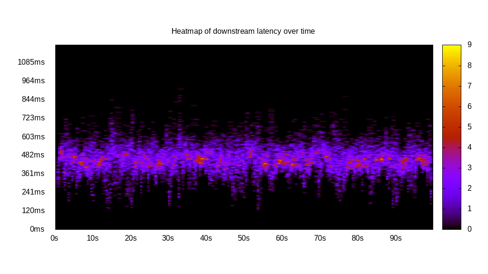

# Latency benchmark report. Crowd is 64

## Populate workload

## Object Size is 1024.00kiB

### PUT Latency in ms over time

Evolution of PUT Latency over time

| Parameter | Value |
| --- | --- |
| Y Coordinate | PUT Latency in ms |
| X Coordinate | time in s since begining of workload |

### PUT Latency distribution in ms

Distribution of the PUT Latency in ms

| Parameter | Value |
| --- | --- |
| Y Coordinate | Number of PUT |
| X Coordinate | Latency in ms |
| Server volume | 44859.000MiB|
| Server bandwidth | 149.526MiB/s |
| Server time | 300.01s |
| Server load | 63.92 |
| Server responses | 44859PUT |
| Server IOps | 149.53PUT/s |
| Client bandwidth | 2.336MiB/s |
| Client volume | 700.922MiB|
| Client time | 19175.08s |
| Client IOps |  2.34PUT/s  |
| Client Latency | 427.45ms/PUT |
| Client Limbo | 0.40ms/PUT |
| Crowd time | 19200.58s |
| Crowd efficiency | 99.87% |
| Highest Latency | 874.37ms |
| 95th percentile Latency | 536.68ms |
| 68th percentile Latency | 458.29ms |
| 50th percentile Latency | 428.14ms |
| 32nd percentile Latency | 404.02ms |
| 5th percentile Latency | 337.69ms |
| Lowest Latency | 180.90ms |

## Read workload

## Object Size is 1024.00kiB

### GET Latency in ms over time

Evolution of GET Latency over time

| Parameter | Value |
| --- | --- |
| Y Coordinate | GET Latency in ms |
| X Coordinate | time in s since begining of workload |

### GET Latency distribution in ms

Distribution of the GET Latency in ms

| Parameter | Value |
| --- | --- |
| Y Coordinate | Number of GET |
| X Coordinate | Latency in ms |
| Server volume | 14002.000MiB|
| Server bandwidth | 139.427MiB/s |
| Server time | 100.42s |
| Server load | 63.33 |
| Server responses | 14002GET |
| Server IOps | 139.43GET/s |
| Client bandwidth | 2.179MiB/s |
| Client volume | 218.781MiB|
| Client time | 6359.72s |
| Client IOps |  2.20GET/s  |
| Client Latency | 454.20ms/GET |
| Client Limbo | 1.05ms/GET |
| Crowd time | 6427.20s |
| Crowd efficiency | 98.95% |
| Highest Latency | 916.58ms |
| 95th percentile Latency | 596.98ms |
| 68th percentile Latency | 488.44ms |
| 50th percentile Latency | 458.29ms |
| 32nd percentile Latency | 428.14ms |
| 5th percentile Latency | 331.66ms |
| Lowest Latency | 132.66ms |

## Mixed workload

## Object Size is 1024.00kiB

### PUT Latency in ms over time

Evolution of PUT Latency over time

| Parameter | Value |
| --- | --- |
| Y Coordinate | PUT Latency in ms |
| X Coordinate | time in s since begining of workload |

### GET Latency in ms over time

Evolution of GET Latency over time

| Parameter | Value |
| --- | --- |
| Y Coordinate | GET Latency in ms |
| X Coordinate | time in s since begining of workload |

### PUT Latency distribution in ms

Distribution of the PUT Latency in ms

| Parameter | Value |
| --- | --- |
| Y Coordinate | Number of PUT |
| X Coordinate | Latency in ms |
| Server volume | 6603.000MiB|
| Server bandwidth | 65.671MiB/s |
| Server time | 100.55s |
| Server load | 34.27 |
| Server responses | 6603PUT |
| Server IOps | 65.67PUT/s |
| Client bandwidth | 1.026MiB/s |
| Client volume | 103.172MiB|
| Client time | 3445.36s |
| Client IOps |  1.92PUT/s  |
| Client Latency | 521.79ms/PUT |
| Client Limbo | 46.71ms/PUT |
| Crowd time | 6434.94s |
| Crowd efficiency | 53.54% |
| Highest Latency | 1200.00ms |
| 95th percentile Latency | 633.17ms |
| 68th percentile Latency | 548.74ms |
| 50th percentile Latency | 518.59ms |
| 32nd percentile Latency | 494.47ms |
| 5th percentile Latency | 434.17ms |
| Lowest Latency | 295.48ms |

### GET Latency distribution in ms

Distribution of the GET Latency in ms

| Parameter | Value |
| --- | --- |
| Y Coordinate | Number of GET |
| X Coordinate | Latency in ms |
| Server volume | 6892.000MiB|
| Server bandwidth | 68.546MiB/s |
| Server time | 100.55s |
| Server load | 29.35 |
| Server responses | 6892GET |
| Server IOps | 68.55GET/s |
| Client bandwidth | 1.071MiB/s |
| Client volume | 107.688MiB|
| Client time | 2950.67s |
| Client IOps |  2.34GET/s  |
| Client Latency | 428.13ms/GET |
| Client Limbo | 54.44ms/GET |
| Crowd time | 6434.94s |
| Crowd efficiency | 45.85% |
| Highest Latency | 789.95ms |
| 95th percentile Latency | 518.59ms |
| 68th percentile Latency | 452.26ms |
| 50th percentile Latency | 434.17ms |
| 32nd percentile Latency | 410.05ms |
| 5th percentile Latency | 355.78ms |
| Lowest Latency | 259.30ms |

## Cleanup workload

## Object Size is 1024.00kiB

### DELETE Latency in ms over time

Evolution of DELETE Latency over time

| Parameter | Value |
| --- | --- |
| Y Coordinate | DELETE Latency in ms |
| X Coordinate | time in s since begining of workload |

### DELETE Latency distribution in ms

Distribution of the DELETE Latency in ms

| Parameter | Value |
| --- | --- |
| Y Coordinate | Number of DELETE |
| X Coordinate | Latency in ms |
| Server volume | 44867.000MiB|
| Server bandwidth | 777.780MiB/s |
| Server time | 57.69s |
| Server load | 62.89 |
| Server responses | 44867DELETE |
| Server IOps | 777.78DELETE/s |
| Client bandwidth | 12.153MiB/s |
| Client volume | 701.047MiB|
| Client time | 3627.74s |
| Client IOps |  12.37DELETE/s  |
| Client Latency | 80.86ms/DELETE |
| Client Limbo | 1.00ms/DELETE |
| Crowd time | 3691.90s |
| Crowd efficiency | 98.26% |
| Highest Latency | 313.57ms |
| 95th percentile Latency | 144.72ms |
| 68th percentile Latency | 96.48ms |
| 50th percentile Latency | 78.39ms |
| 32nd percentile Latency | 66.33ms |
| 5th percentile Latency | 48.24ms |
| Lowest Latency | 12.06ms |

