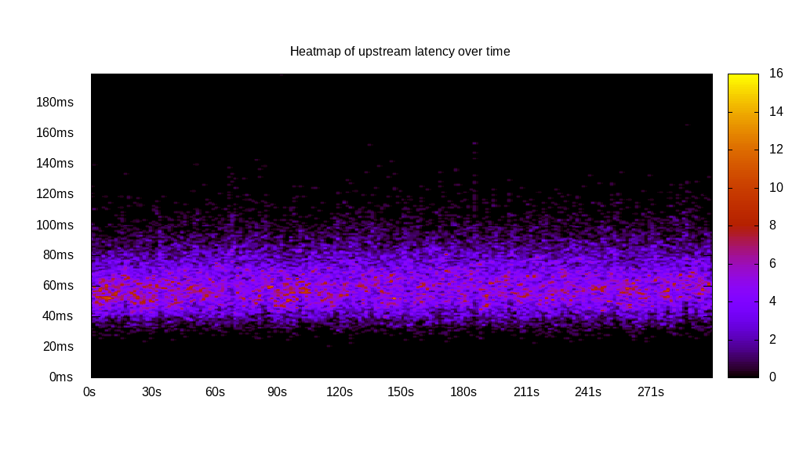
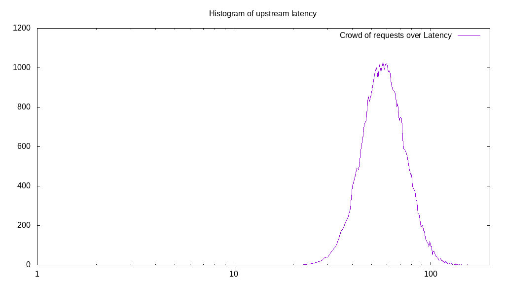
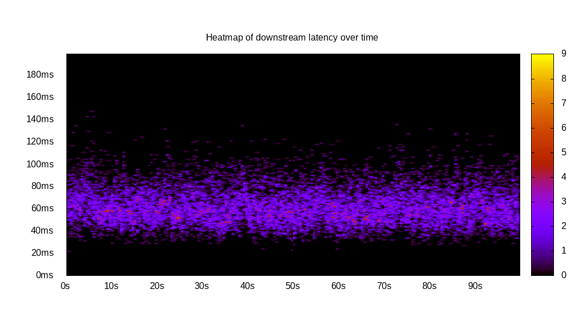
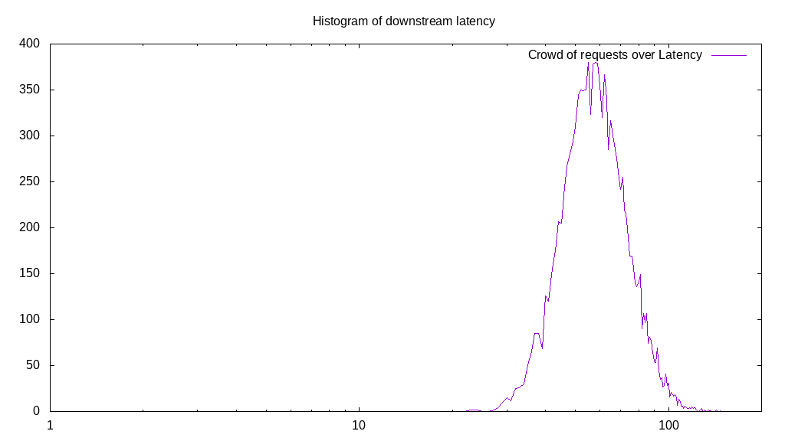
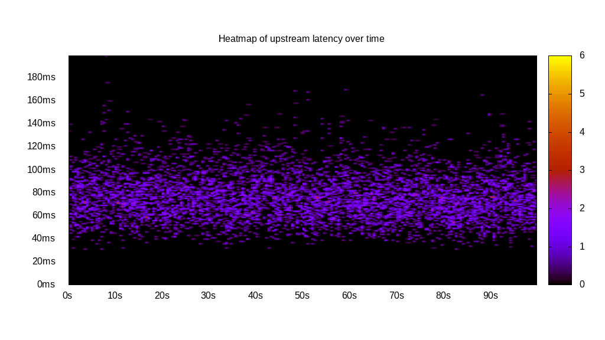
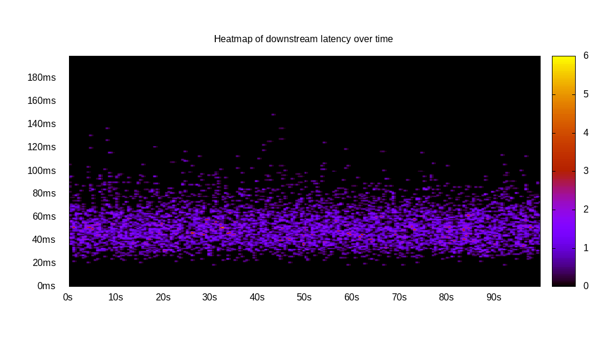
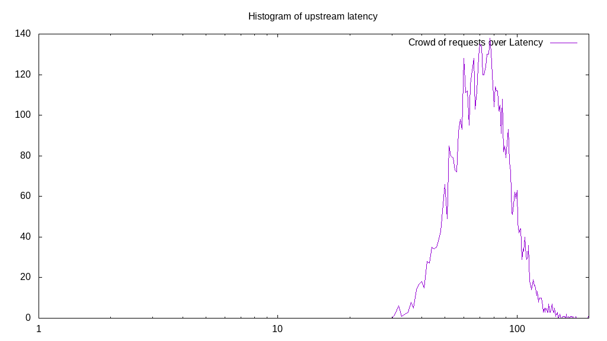
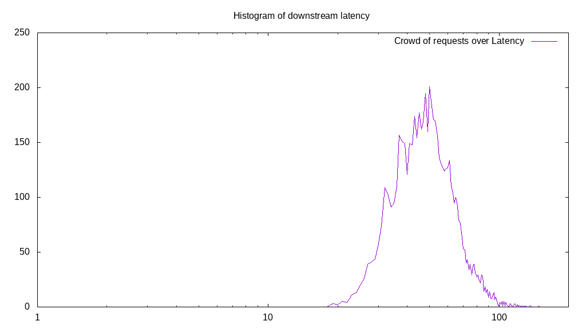
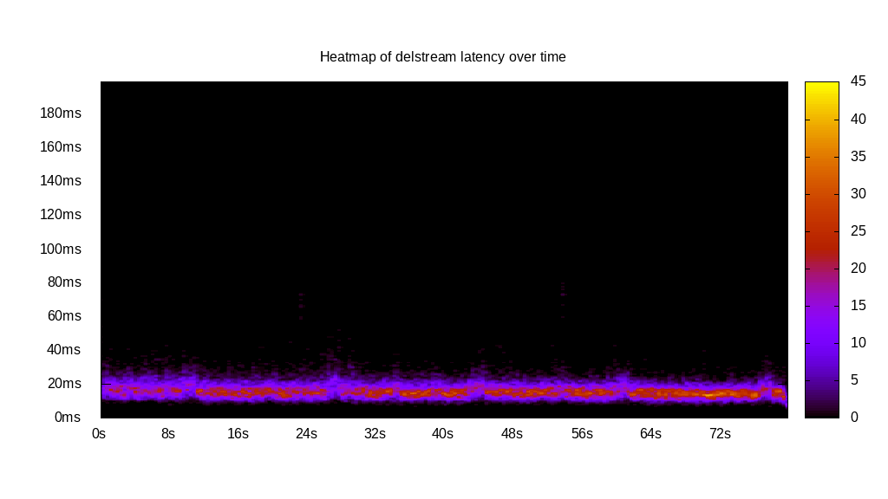
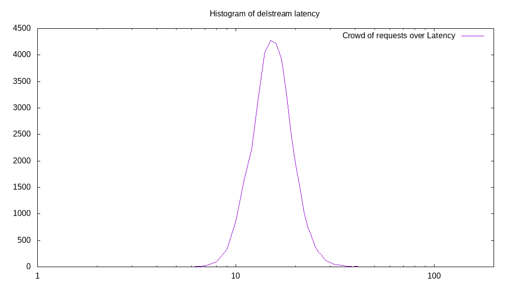

# Latency benchmark report. Crowd is 8

## Populate workload

## Object Size is 1024.00kiB

### PUT Latency in ms over time

Evolution of PUT Latency over time

| Parameter | Value |
| --- | --- |
| Y Coordinate | PUT Latency in ms |
| X Coordinate | time in s since begining of workload |

### PUT Latency distribution in ms

Distribution of the PUT Latency in ms

| Parameter | Value |
| --- | --- |
| Y Coordinate | Number of PUT |
| X Coordinate | Latency in ms |
| Server volume | 37878.000MiB|
| Server bandwidth | 126.262MiB/s |
| Server time | 300.00s |
| Server load | 7.97 |
| Server responses | 37878PUT |
| Server IOps | 126.26PUT/s |
| Client bandwidth | 15.783MiB/s |
| Client volume | 4734.750MiB|
| Client time | 2392.10s |
| Client IOps |  15.83PUT/s  |
| Client Latency | 63.15ms/PUT |
| Client Limbo | 0.98ms/PUT |
| Crowd time | 2399.96s |
| Crowd efficiency | 99.67% |
| Highest Latency | 200.00ms |
| 95th percentile Latency | 93.47ms |
| 68th percentile Latency | 70.35ms |
| 50th percentile Latency | 62.31ms |
| 32nd percentile Latency | 55.28ms |
| 5th percentile Latency | 41.21ms |
| Lowest Latency | 21.11ms |

## Read workload

## Object Size is 1024.00kiB

### GET Latency in ms over time

Evolution of GET Latency over time

| Parameter | Value |
| --- | --- |
| Y Coordinate | GET Latency in ms |
| X Coordinate | time in s since begining of workload |

### GET Latency distribution in ms

Distribution of the GET Latency in ms

| Parameter | Value |
| --- | --- |
| Y Coordinate | Number of GET |
| X Coordinate | Latency in ms |
| Server volume | 12736.000MiB|
| Server bandwidth | 127.257MiB/s |
| Server time | 100.08s |
| Server load | 7.95 |
| Server responses | 12736GET |
| Server IOps | 127.26GET/s |
| Client bandwidth | 15.907MiB/s |
| Client volume | 1592.000MiB|
| Client time | 795.68s |
| Client IOps |  16.01GET/s  |
| Client Latency | 62.48ms/GET |
| Client Limbo | 0.62ms/GET |
| Crowd time | 800.65s |
| Crowd efficiency | 99.38% |
| Highest Latency | 147.74ms |
| 95th percentile Latency | 91.46ms |
| 68th percentile Latency | 68.34ms |
| 50th percentile Latency | 61.31ms |
| 32nd percentile Latency | 55.28ms |
| 5th percentile Latency | 42.21ms |
| Lowest Latency | 23.12ms |

## Mixed workload

## Object Size is 1024.00kiB

### PUT Latency in ms over time

Evolution of PUT Latency over time

| Parameter | Value |
| --- | --- |
| Y Coordinate | PUT Latency in ms |
| X Coordinate | time in s since begining of workload |

### GET Latency in ms over time

Evolution of GET Latency over time

| Parameter | Value |
| --- | --- |
| Y Coordinate | GET Latency in ms |
| X Coordinate | time in s since begining of workload |

### PUT Latency distribution in ms

Distribution of the PUT Latency in ms

| Parameter | Value |
| --- | --- |
| Y Coordinate | Number of PUT |
| X Coordinate | Latency in ms |
| Server volume | 6110.000MiB|
| Server bandwidth | 61.080MiB/s |
| Server time | 100.03s |
| Server load | 4.73 |
| Server responses | 6110PUT |
| Server IOps | 61.08PUT/s |
| Client bandwidth | 7.635MiB/s |
| Client volume | 763.750MiB|
| Client time | 472.82s |
| Client IOps |  12.92PUT/s  |
| Client Latency | 77.38ms/PUT |
| Client Limbo | 40.93ms/PUT |
| Crowd time | 800.26s |
| Crowd efficiency | 59.08% |
| Highest Latency | 200.00ms |
| 95th percentile Latency | 113.57ms |
| 68th percentile Latency | 85.43ms |
| 50th percentile Latency | 76.38ms |
| 32nd percentile Latency | 67.34ms |
| 5th percentile Latency | 49.25ms |
| Lowest Latency | 31.16ms |

### GET Latency distribution in ms

Distribution of the GET Latency in ms

| Parameter | Value |
| --- | --- |
| Y Coordinate | Number of GET |
| X Coordinate | Latency in ms |
| Server volume | 6173.000MiB|
| Server bandwidth | 61.710MiB/s |
| Server time | 100.03s |
| Server load | 3.24 |
| Server responses | 6173GET |
| Server IOps | 61.71GET/s |
| Client bandwidth | 7.714MiB/s |
| Client volume | 771.625MiB|
| Client time | 324.35s |
| Client IOps |  19.03GET/s  |
| Client Latency | 52.54ms/GET |
| Client Limbo | 59.49ms/GET |
| Crowd time | 800.26s |
| Crowd efficiency | 40.53% |
| Highest Latency | 149.75ms |
| 95th percentile Latency | 82.41ms |
| 68th percentile Latency | 59.30ms |
| 50th percentile Latency | 51.26ms |
| 32nd percentile Latency | 45.23ms |
| 5th percentile Latency | 32.16ms |
| Lowest Latency | 19.10ms |

## Cleanup workload

## Object Size is 1024.00kiB

### DELETE Latency in ms over time

Evolution of DELETE Latency over time

| Parameter | Value |
| --- | --- |
| Y Coordinate | DELETE Latency in ms |
| X Coordinate | time in s since begining of workload |

### DELETE Latency distribution in ms

Distribution of the DELETE Latency in ms

| Parameter | Value |
| --- | --- |
| Y Coordinate | Number of DELETE |
| X Coordinate | Latency in ms |
| Server volume | 37886.000MiB|
| Server bandwidth | 475.435MiB/s |
| Server time | 79.69s |
| Server load | 7.90 |
| Server responses | 37886DELETE |
| Server IOps | 475.44DELETE/s |
| Client bandwidth | 59.429MiB/s |
| Client volume | 4735.750MiB|
| Client time | 629.80s |
| Client IOps |  60.16DELETE/s  |
| Client Latency | 16.62ms/DELETE |
| Client Limbo | 0.96ms/DELETE |
| Crowd time | 637.50s |
| Crowd efficiency | 98.79% |
| Highest Latency | 80.40ms |
| 95th percentile Latency | 25.13ms |
| 68th percentile Latency | 19.10ms |
| 50th percentile Latency | 17.09ms |
| 32nd percentile Latency | 15.08ms |
| 5th percentile Latency | 12.06ms |
| Lowest Latency | 6.03ms |

