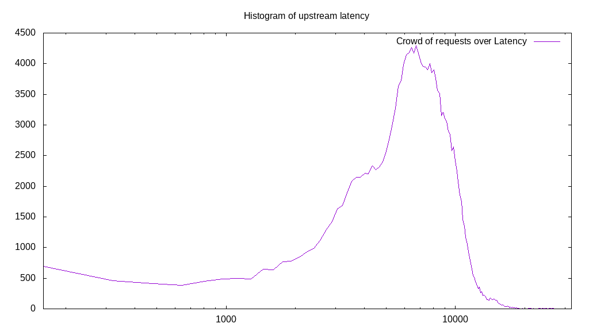

# Latency benchmark report. Crowd is 4096

## Populate workload

## Object Size is 32.00kiB

### PUT Latency in ms over time

Evolution of PUT Latency over time

| Parameter | Value |
| --- | --- |
| Y Coordinate | PUT Latency in ms |
| X Coordinate | time in s since begining of workload |

### PUT Latency distribution in ms

Distribution of the PUT Latency in ms

| Parameter | Value |
| --- | --- |
| Y Coordinate | Number of PUT |
| X Coordinate | Latency in ms |
| Server volume | 5403.406MiB|
| Server bandwidth | 18.011MiB/s |
| Server time | 300.00s |
| Server load | 4034.18 |
| Server responses | 172909PUT |
| Server IOps | 576.36PUT/s |
| Client bandwidth | 0.004MiB/s |
| Client volume | 1.319MiB|
| Client time | 1210255.12s |
| Client IOps |  0.14PUT/s  |
| Client Latency | 6999.38ms/PUT |
| Client Limbo | 4.53ms/PUT |
| Crowd time | 1228800.00s |
| Crowd efficiency | 98.49% |
| Highest Latency | 32000.00ms |
| 95th percentile Latency | 11577.89ms |
| 68th percentile Latency | 8361.81ms |
| 50th percentile Latency | 7075.38ms |
| 32nd percentile Latency | 5949.75ms |
| 5th percentile Latency | 2572.86ms |
| Lowest Latency | 160.80ms |

## Read workload

## Object Size is 32.00kiB

### GET Latency in ms over time

Evolution of GET Latency over time

| Parameter | Value |
| --- | --- |
| Y Coordinate | GET Latency in ms |
| X Coordinate | time in s since begining of workload |

### GET Latency distribution in ms

Distribution of the GET Latency in ms

| Parameter | Value |
| --- | --- |
| Y Coordinate | Number of GET |
| X Coordinate | Latency in ms |
| Server volume | 2506.656MiB|
| Server bandwidth | 20.921MiB/s |
| Server time | 119.81s |
| Server load | 3171.14 |
| Server responses | 80213GET |
| Server IOps | 669.48GET/s |
| Client bandwidth | 0.005MiB/s |
| Client volume | 0.612MiB|
| Client time | 379947.01s |
| Client IOps |  0.21GET/s  |
| Client Latency | 4736.73ms/GET |
| Client Limbo | 27.05ms/GET |
| Crowd time | 490758.14s |
| Crowd efficiency | 77.42% |
| Highest Latency | 32000.00ms |
| 95th percentile Latency | 8844.22ms |
| 68th percentile Latency | 4824.12ms |
| 50th percentile Latency | 4502.51ms |
| 32nd percentile Latency | 4341.71ms |
| 5th percentile Latency | 2090.45ms |
| Lowest Latency | 160.80ms |

## Mixed workload

## Object Size is 32.00kiB

### PUT Latency in ms over time

Evolution of PUT Latency over time

| Parameter | Value |
| --- | --- |
| Y Coordinate | PUT Latency in ms |
| X Coordinate | time in s since begining of workload |

### GET Latency in ms over time

Evolution of GET Latency over time

| Parameter | Value |
| --- | --- |
| Y Coordinate | GET Latency in ms |
| X Coordinate | time in s since begining of workload |

### PUT Latency distribution in ms

Distribution of the PUT Latency in ms

| Parameter | Value |
| --- | --- |
| Y Coordinate | Number of PUT |
| X Coordinate | Latency in ms |
| Server volume | 971.250MiB|
| Server bandwidth | 9.202MiB/s |
| Server time | 105.55s |
| Server load | 2136.69 |
| Server responses | 31080PUT |
| Server IOps | 294.45PUT/s |
| Client bandwidth | 0.002MiB/s |
| Client volume | 0.237MiB|
| Client time | 225529.79s |
| Client IOps |  0.14PUT/s  |
| Client Latency | 7256.43ms/PUT |
| Client Limbo | 50.49ms/PUT |
| Crowd time | 432336.90s |
| Crowd efficiency | 52.17% |
| Highest Latency | 20100.50ms |
| 95th percentile Latency | 11577.89ms |
| 68th percentile Latency | 8361.81ms |
| 50th percentile Latency | 7236.18ms |
| 32nd percentile Latency | 6271.36ms |
| 5th percentile Latency | 3376.88ms |
| Lowest Latency | 160.80ms |

### GET Latency distribution in ms

Distribution of the GET Latency in ms

| Parameter | Value |
| --- | --- |
| Y Coordinate | Number of GET |
| X Coordinate | Latency in ms |
| Server volume | 1127.656MiB|
| Server bandwidth | 10.684MiB/s |
| Server time | 105.55s |
| Server load | 1672.31 |
| Server responses | 36085GET |
| Server IOps | 341.87GET/s |
| Client bandwidth | 0.003MiB/s |
| Client volume | 0.275MiB|
| Client time | 176513.70s |
| Client IOps |  0.20GET/s  |
| Client Latency | 4891.61ms/GET |
| Client Limbo | 62.46ms/GET |
| Crowd time | 432336.90s |
| Crowd efficiency | 40.83% |
| Highest Latency | 13989.95ms |
| 95th percentile Latency | 8361.81ms |
| 68th percentile Latency | 5628.14ms |
| 50th percentile Latency | 4984.92ms |
| 32nd percentile Latency | 4502.51ms |
| 5th percentile Latency | 1768.84ms |
| Lowest Latency | 160.80ms |

## Cleanup workload

## Object Size is 32.00kiB

### DELETE Latency in ms over time

Evolution of DELETE Latency over time

| Parameter | Value |
| --- | --- |
| Y Coordinate | DELETE Latency in ms |
| X Coordinate | time in s since begining of workload |

### DELETE Latency distribution in ms

Distribution of the DELETE Latency in ms

| Parameter | Value |
| --- | --- |
| Y Coordinate | Number of DELETE |
| X Coordinate | Latency in ms |
| Server volume | 5403.656MiB|
| Server bandwidth | 20.106MiB/s |
| Server time | 268.76s |
| Server load | 3662.75 |
| Server responses | 172917DELETE |
| Server IOps | 643.39DELETE/s |
| Client bandwidth | 0.005MiB/s |
| Client volume | 1.319MiB|
| Client time | 984394.41s |
| Client IOps |  0.18DELETE/s  |
| Client Latency | 5692.87ms/DELETE |
| Client Limbo | 28.43ms/DELETE |
| Crowd time | 1100832.77s |
| Crowd efficiency | 89.42% |
| Highest Latency | 20904.52ms |
| 95th percentile Latency | 10613.07ms |
| 68th percentile Latency | 7075.38ms |
| 50th percentile Latency | 5788.94ms |
| 32nd percentile Latency | 4341.71ms |
| 5th percentile Latency | 1608.04ms |
| Lowest Latency | 160.80ms |

