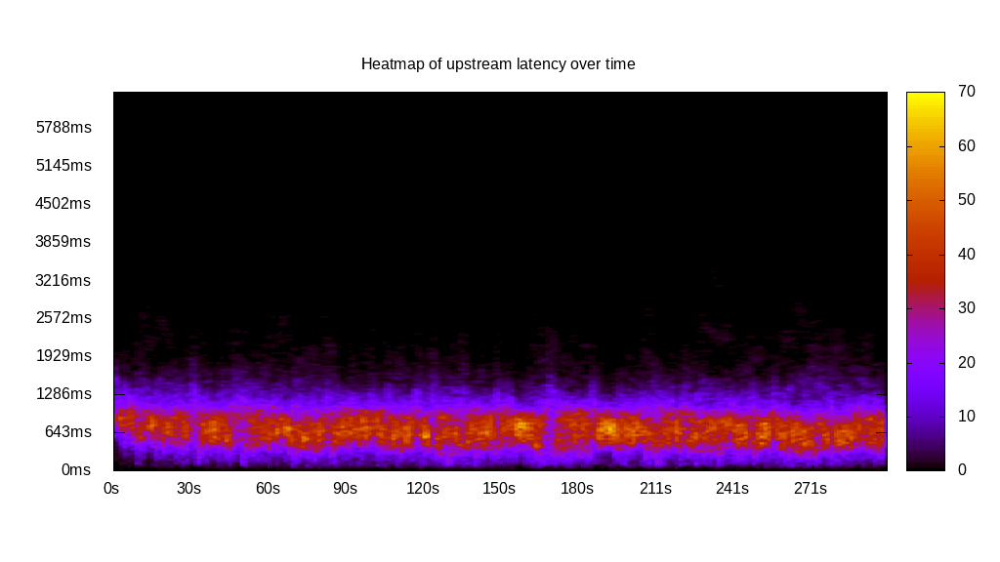
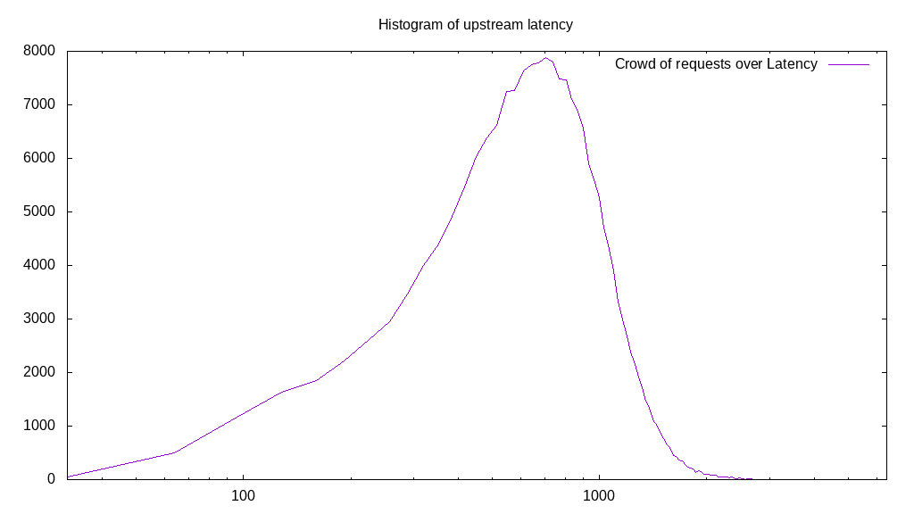
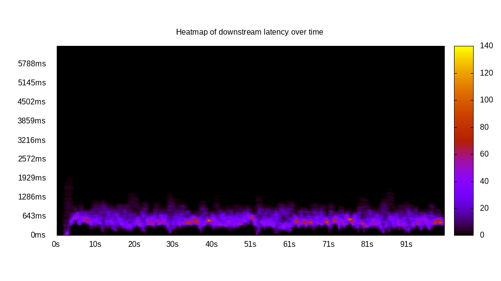
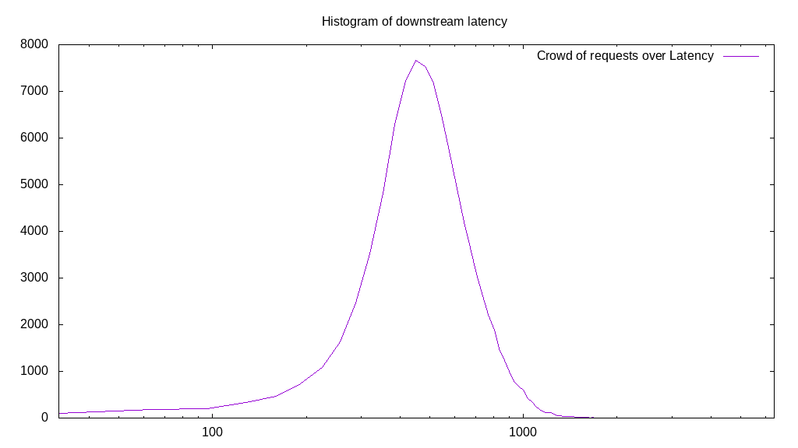
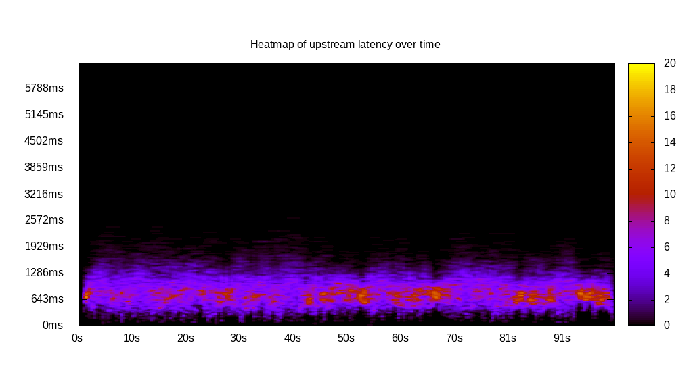
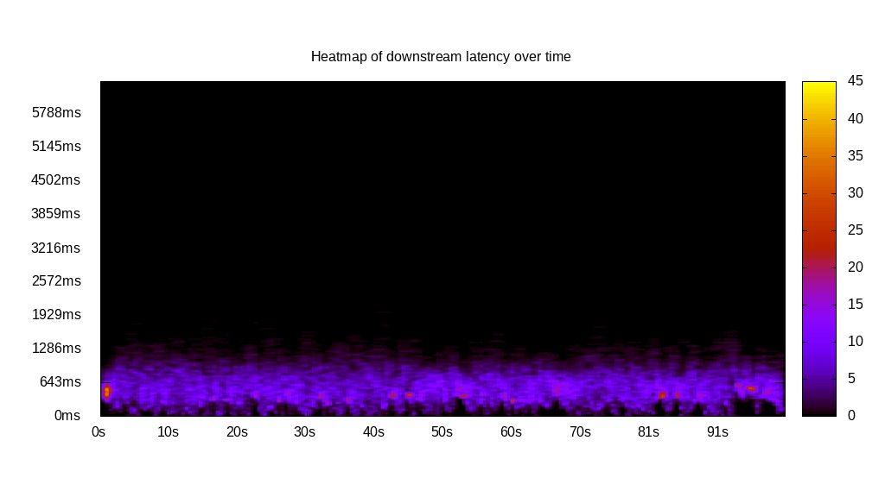
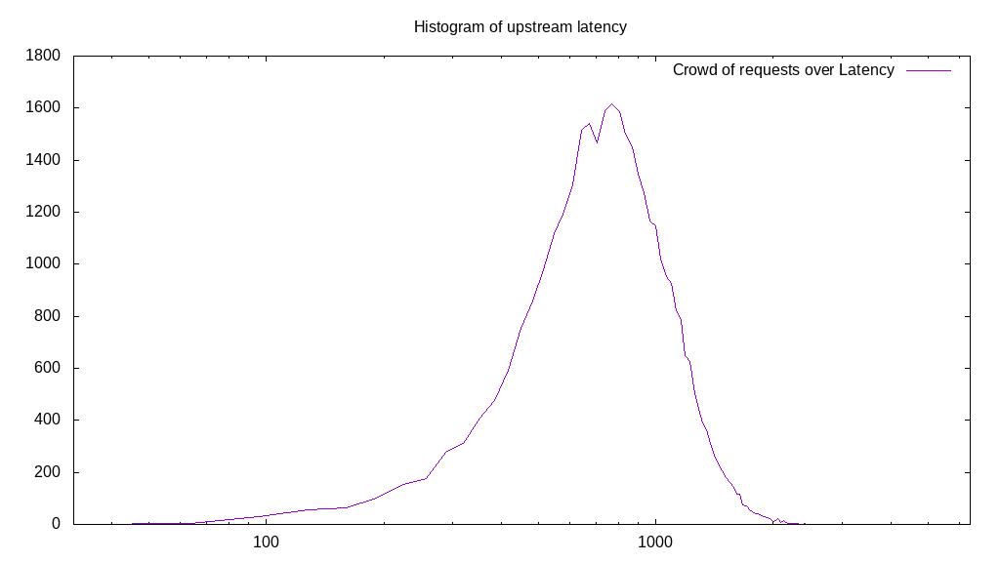
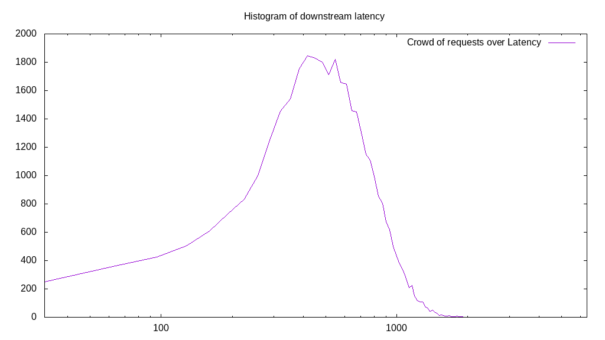
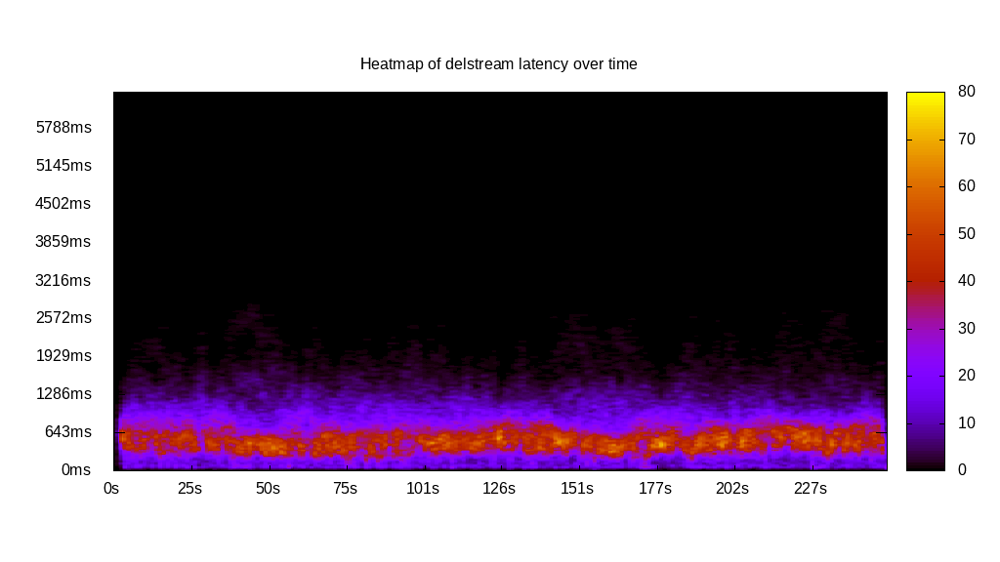
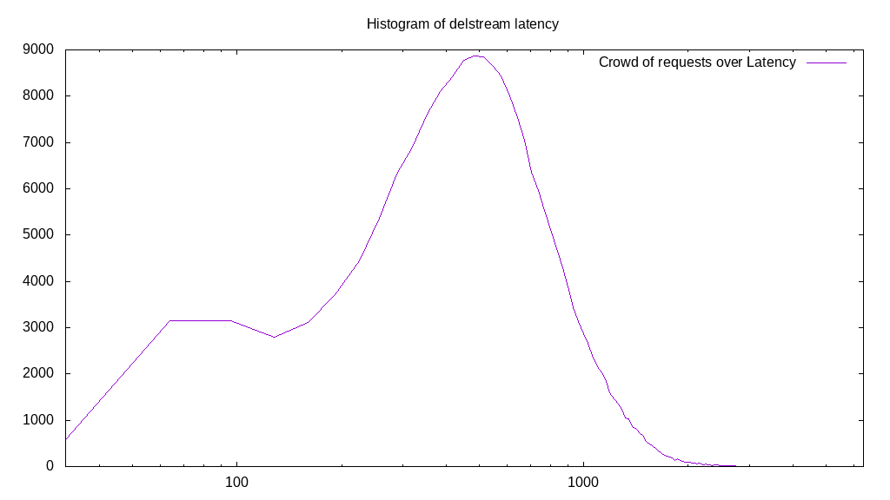

# Latency benchmark report. Crowd is 512

## Populate workload

## Object Size is 32.00kiB

### PUT Latency in ms over time

Evolution of PUT Latency over time

| Parameter | Value |
| --- | --- |
| Y Coordinate | PUT Latency in ms |
| X Coordinate | time in s since begining of workload |

### PUT Latency distribution in ms

Distribution of the PUT Latency in ms

| Parameter | Value |
| --- | --- |
| Y Coordinate | Number of PUT |
| X Coordinate | Latency in ms |
| Server volume | 6311.969MiB|
| Server bandwidth | 21.040MiB/s |
| Server time | 300.00s |
| Server load | 511.04 |
| Server responses | 201983PUT |
| Server IOps | 673.28PUT/s |
| Client bandwidth | 0.041MiB/s |
| Client volume | 12.328MiB|
| Client time | 153311.29s |
| Client IOps |  1.32PUT/s  |
| Client Latency | 759.03ms/PUT |
| Client Limbo | 0.56ms/PUT |
| Crowd time | 153598.46s |
| Crowd efficiency | 99.81% |
| Highest Latency | 3794.97ms |
| 95th percentile Latency | 1415.08ms |
| 68th percentile Latency | 932.66ms |
| 50th percentile Latency | 771.86ms |
| 32nd percentile Latency | 611.06ms |
| 5th percentile Latency | 289.45ms |
| Lowest Latency | 32.16ms |

## Read workload

## Object Size is 32.00kiB

### GET Latency in ms over time

Evolution of GET Latency over time

| Parameter | Value |
| --- | --- |
| Y Coordinate | GET Latency in ms |
| X Coordinate | time in s since begining of workload |

### GET Latency distribution in ms

Distribution of the GET Latency in ms

| Parameter | Value |
| --- | --- |
| Y Coordinate | Number of GET |
| X Coordinate | Latency in ms |
| Server volume | 2936.719MiB|
| Server bandwidth | 28.873MiB/s |
| Server time | 101.71s |
| Server load | 498.86 |
| Server responses | 93975GET |
| Server IOps | 923.94GET/s |
| Client bandwidth | 0.056MiB/s |
| Client volume | 5.736MiB|
| Client time | 50739.48s |
| Client IOps |  1.85GET/s  |
| Client Latency | 539.93ms/GET |
| Client Limbo | 2.61ms/GET |
| Crowd time | 52076.03s |
| Crowd efficiency | 97.43% |
| Highest Latency | 2894.47ms |
| 95th percentile Latency | 932.66ms |
| 68th percentile Latency | 643.22ms |
| 50th percentile Latency | 546.73ms |
| 32nd percentile Latency | 482.41ms |
| 5th percentile Latency | 289.45ms |
| Lowest Latency | 32.16ms |

## Mixed workload

## Object Size is 32.00kiB

### PUT Latency in ms over time

Evolution of PUT Latency over time

| Parameter | Value |
| --- | --- |
| Y Coordinate | PUT Latency in ms |
| X Coordinate | time in s since begining of workload |

### GET Latency in ms over time

Evolution of GET Latency over time

| Parameter | Value |
| --- | --- |
| Y Coordinate | GET Latency in ms |
| X Coordinate | time in s since begining of workload |

### PUT Latency distribution in ms

Distribution of the PUT Latency in ms

| Parameter | Value |
| --- | --- |
| Y Coordinate | Number of PUT |
| X Coordinate | Latency in ms |
| Server volume | 1118.969MiB|
| Server bandwidth | 11.105MiB/s |
| Server time | 100.76s |
| Server load | 301.54 |
| Server responses | 35807PUT |
| Server IOps | 355.36PUT/s |
| Client bandwidth | 0.022MiB/s |
| Client volume | 2.185MiB|
| Client time | 30383.69s |
| Client IOps |  1.18PUT/s  |
| Client Latency | 848.54ms/PUT |
| Client Limbo | 41.42ms/PUT |
| Crowd time | 51590.14s |
| Crowd efficiency | 58.89% |
| Highest Latency | 2637.19ms |
| 95th percentile Latency | 1447.24ms |
| 68th percentile Latency | 996.98ms |
| 50th percentile Latency | 836.18ms |
| 32nd percentile Latency | 707.54ms |
| 5th percentile Latency | 418.09ms |
| Lowest Latency | 32.16ms |

### GET Latency distribution in ms

Distribution of the GET Latency in ms

| Parameter | Value |
| --- | --- |
| Y Coordinate | Number of GET |
| X Coordinate | Latency in ms |
| Server volume | 1146.250MiB|
| Server bandwidth | 11.376MiB/s |
| Server time | 100.76s |
| Server load | 205.83 |
| Server responses | 36680GET |
| Server IOps | 364.03GET/s |
| Client bandwidth | 0.022MiB/s |
| Client volume | 2.239MiB|
| Client time | 20740.16s |
| Client IOps |  1.77GET/s  |
| Client Latency | 565.44ms/GET |
| Client Limbo | 60.25ms/GET |
| Crowd time | 51590.14s |
| Crowd efficiency | 40.20% |
| Highest Latency | 2090.45ms |
| 95th percentile Latency | 1093.47ms |
| 68th percentile Latency | 707.54ms |
| 50th percentile Latency | 578.89ms |
| 32nd percentile Latency | 450.25ms |
| 5th percentile Latency | 192.96ms |
| Lowest Latency | 32.16ms |

## Cleanup workload

## Object Size is 32.00kiB

### DELETE Latency in ms over time

Evolution of DELETE Latency over time

| Parameter | Value |
| --- | --- |
| Y Coordinate | DELETE Latency in ms |
| X Coordinate | time in s since begining of workload |

### DELETE Latency distribution in ms

Distribution of the DELETE Latency in ms

| Parameter | Value |
| --- | --- |
| Y Coordinate | Number of DELETE |
| X Coordinate | Latency in ms |
| Server volume | 6312.219MiB|
| Server bandwidth | 25.061MiB/s |
| Server time | 251.87s |
| Server load | 506.27 |
| Server responses | 201991DELETE |
| Server IOps | 801.96DELETE/s |
| Client bandwidth | 0.049MiB/s |
| Client volume | 12.329MiB|
| Client time | 127514.19s |
| Client IOps |  1.58DELETE/s  |
| Client Latency | 631.29ms/DELETE |
| Client Limbo | 2.82ms/DELETE |
| Crowd time | 128957.95s |
| Crowd efficiency | 98.88% |
| Highest Latency | 6400.00ms |
| 95th percentile Latency | 1350.75ms |
| 68th percentile Latency | 771.86ms |
| 50th percentile Latency | 611.06ms |
| 32nd percentile Latency | 482.41ms |
| 5th percentile Latency | 192.96ms |
| Lowest Latency | 32.16ms |

