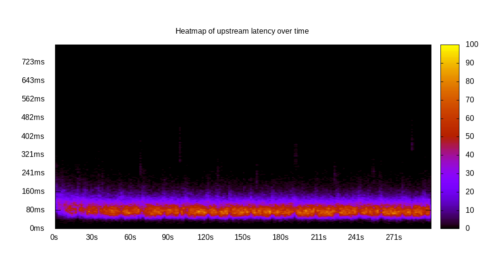
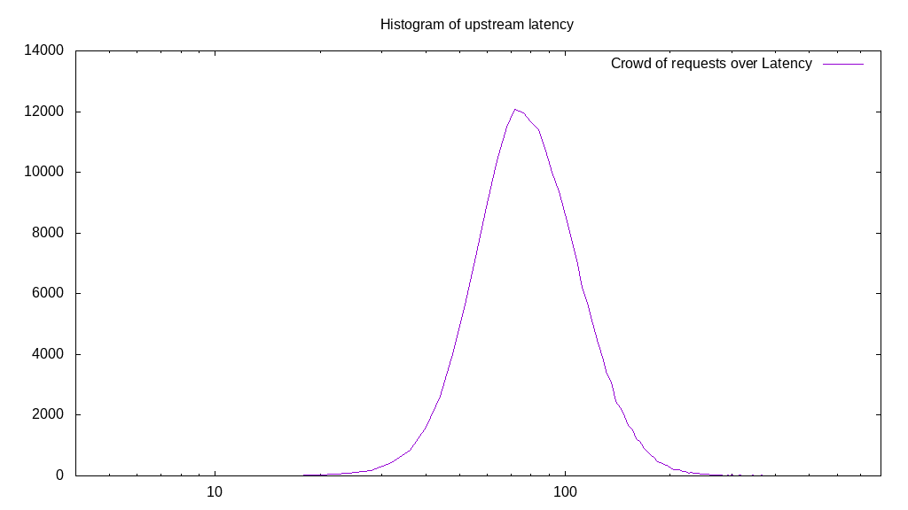
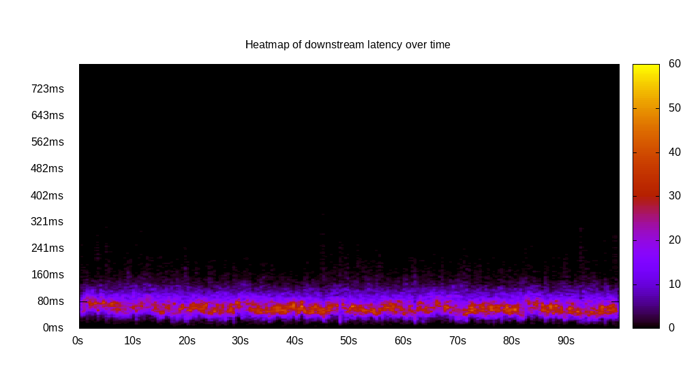
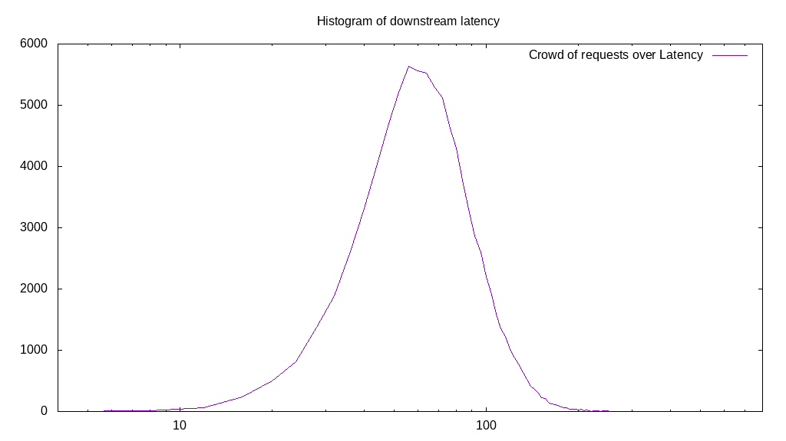
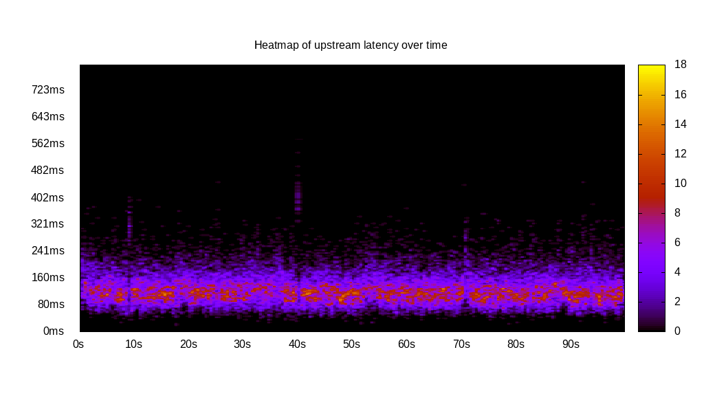
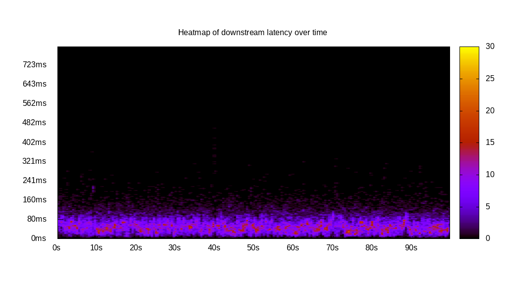
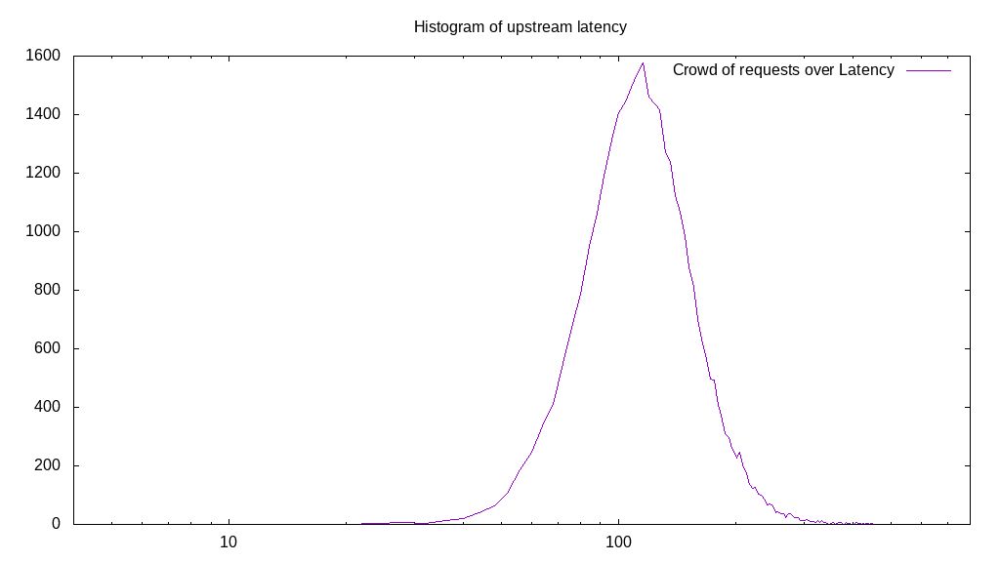
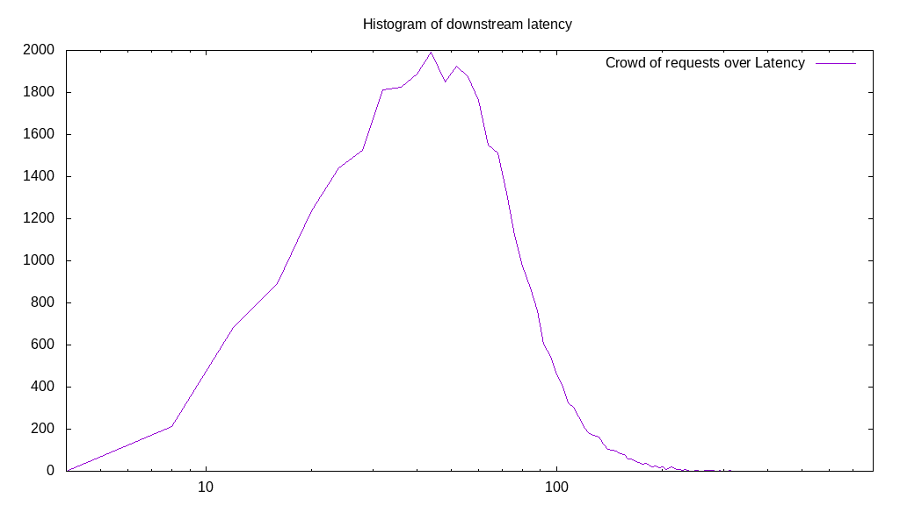
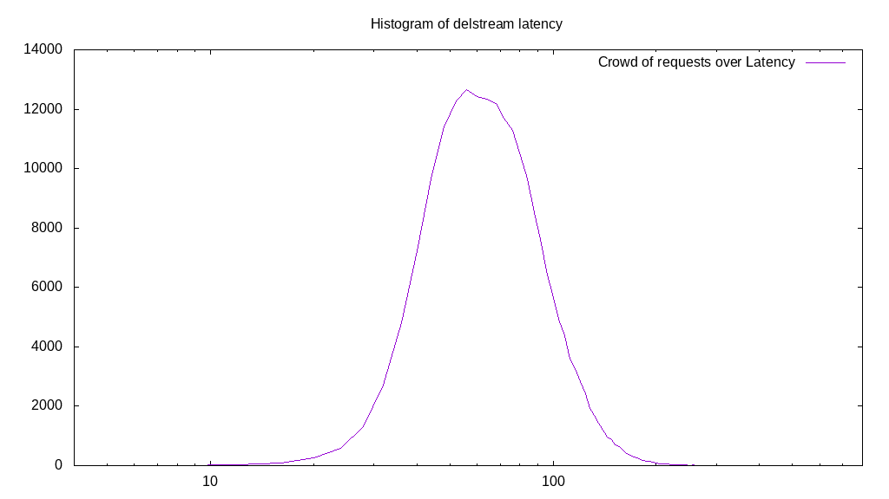

# Latency benchmark report. Crowd is 64

## Populate workload

## Object Size is 32.00kiB

### PUT Latency in ms over time

Evolution of PUT Latency over time

| Parameter | Value |
| --- | --- |
| Y Coordinate | PUT Latency in ms |
| X Coordinate | time in s since begining of workload |

### PUT Latency distribution in ms

Distribution of the PUT Latency in ms

| Parameter | Value |
| --- | --- |
| Y Coordinate | Number of PUT |
| X Coordinate | Latency in ms |
| Server volume | 6420.125MiB|
| Server bandwidth | 21.401MiB/s |
| Server time | 299.99s |
| Server load | 63.87 |
| Server responses | 205444PUT |
| Server IOps | 684.83PUT/s |
| Client bandwidth | 0.334MiB/s |
| Client volume | 100.314MiB|
| Client time | 19161.71s |
| Client IOps |  10.72PUT/s  |
| Client Latency | 93.27ms/PUT |
| Client Limbo | 0.59ms/PUT |
| Crowd time | 19199.49s |
| Crowd efficiency | 99.80% |
| Highest Latency | 486.43ms |
| 95th percentile Latency | 160.80ms |
| 68th percentile Latency | 104.52ms |
| 50th percentile Latency | 92.46ms |
| 32nd percentile Latency | 76.38ms |
| 5th percentile Latency | 56.28ms |
| Lowest Latency | 16.08ms |

## Read workload

## Object Size is 32.00kiB

### GET Latency in ms over time

Evolution of GET Latency over time

| Parameter | Value |
| --- | --- |
| Y Coordinate | GET Latency in ms |
| X Coordinate | time in s since begining of workload |

### GET Latency distribution in ms

Distribution of the GET Latency in ms

| Parameter | Value |
| --- | --- |
| Y Coordinate | Number of GET |
| X Coordinate | Latency in ms |
| Server volume | 2745.438MiB|
| Server bandwidth | 27.393MiB/s |
| Server time | 100.22s |
| Server load | 63.63 |
| Server responses | 87854GET |
| Server IOps | 876.59GET/s |
| Client bandwidth | 0.428MiB/s |
| Client volume | 42.897MiB|
| Client time | 6377.55s |
| Client IOps |  13.78GET/s  |
| Client Latency | 72.59ms/GET |
| Client Limbo | 0.57ms/GET |
| Crowd time | 6414.27s |
| Crowd efficiency | 99.43% |
| Highest Latency | 345.73ms |
| 95th percentile Latency | 132.66ms |
| 68th percentile Latency | 84.42ms |
| 50th percentile Latency | 72.36ms |
| 32nd percentile Latency | 60.30ms |
| 5th percentile Latency | 36.18ms |
| Lowest Latency | 8.04ms |

## Mixed workload

## Object Size is 32.00kiB

### PUT Latency in ms over time

Evolution of PUT Latency over time

| Parameter | Value |
| --- | --- |
| Y Coordinate | PUT Latency in ms |
| X Coordinate | time in s since begining of workload |

### GET Latency in ms over time

Evolution of GET Latency over time

| Parameter | Value |
| --- | --- |
| Y Coordinate | GET Latency in ms |
| X Coordinate | time in s since begining of workload |

### PUT Latency distribution in ms

Distribution of the PUT Latency in ms

| Parameter | Value |
| --- | --- |
| Y Coordinate | Number of PUT |
| X Coordinate | Latency in ms |
| Server volume | 1059.438MiB|
| Server bandwidth | 10.587MiB/s |
| Server time | 100.07s |
| Server load | 43.88 |
| Server responses | 33902PUT |
| Server IOps | 338.77PUT/s |
| Client bandwidth | 0.165MiB/s |
| Client volume | 16.554MiB|
| Client time | 4391.38s |
| Client IOps |  7.72PUT/s  |
| Client Latency | 129.53ms/PUT |
| Client Limbo | 31.46ms/PUT |
| Crowd time | 6404.67s |
| Crowd efficiency | 68.57% |
| Highest Latency | 578.89ms |
| 95th percentile Latency | 213.07ms |
| 68th percentile Latency | 144.72ms |
| 50th percentile Latency | 128.64ms |
| 32nd percentile Latency | 112.56ms |
| 5th percentile Latency | 76.38ms |
| Lowest Latency | 20.10ms |

### GET Latency distribution in ms

Distribution of the GET Latency in ms

| Parameter | Value |
| --- | --- |
| Y Coordinate | Number of GET |
| X Coordinate | Latency in ms |
| Server volume | 1055.563MiB|
| Server bandwidth | 10.548MiB/s |
| Server time | 100.07s |
| Server load | 19.96 |
| Server responses | 33778GET |
| Server IOps | 337.53GET/s |
| Client bandwidth | 0.165MiB/s |
| Client volume | 16.493MiB|
| Client time | 1997.13s |
| Client IOps |  16.91GET/s  |
| Client Latency | 59.13ms/GET |
| Client Limbo | 68.87ms/GET |
| Crowd time | 6404.67s |
| Crowd efficiency | 31.18% |
| Highest Latency | 462.31ms |
| 95th percentile Latency | 124.62ms |
| 68th percentile Latency | 72.36ms |
| 50th percentile Latency | 56.28ms |
| 32nd percentile Latency | 44.22ms |
| 5th percentile Latency | 20.10ms |
| Lowest Latency | 4.02ms |

## Cleanup workload

## Object Size is 32.00kiB

### DELETE Latency in ms over time

Evolution of DELETE Latency over time

| Parameter | Value |
| --- | --- |
| Y Coordinate | DELETE Latency in ms |
| X Coordinate | time in s since begining of workload |

### DELETE Latency distribution in ms

Distribution of the DELETE Latency in ms

| Parameter | Value |
| --- | --- |
| Y Coordinate | Number of DELETE |
| X Coordinate | Latency in ms |
| Server volume | 6420.375MiB|
| Server bandwidth | 26.025MiB/s |
| Server time | 246.71s |
| Server load | 63.61 |
| Server responses | 205452DELETE |
| Server IOps | 832.78DELETE/s |
| Client bandwidth | 0.407MiB/s |
| Client volume | 100.318MiB|
| Client time | 15693.25s |
| Client IOps |  13.09DELETE/s  |
| Client Latency | 76.38ms/DELETE |
| Client Limbo | 1.50ms/DELETE |
| Crowd time | 15789.12s |
| Crowd efficiency | 99.39% |
| Highest Latency | 800.00ms |
| 95th percentile Latency | 136.68ms |
| 68th percentile Latency | 88.44ms |
| 50th percentile Latency | 76.38ms |
| 32nd percentile Latency | 64.32ms |
| 5th percentile Latency | 44.22ms |
| Lowest Latency | 8.04ms |

