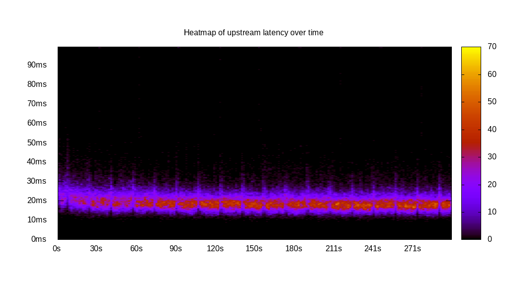
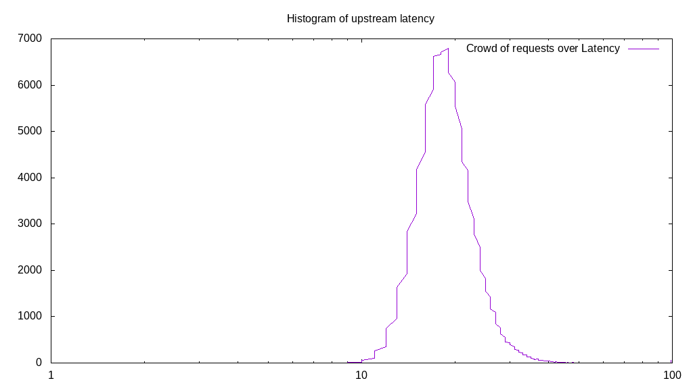
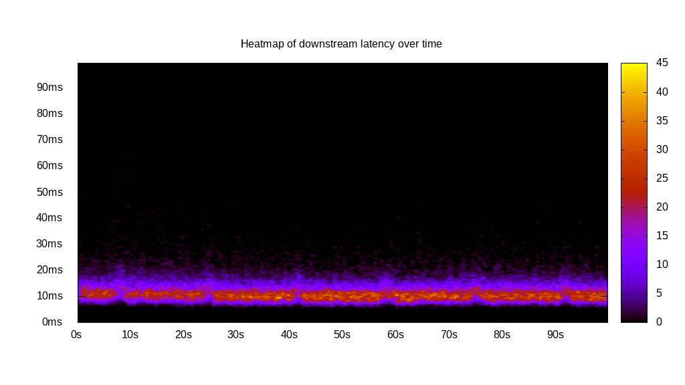
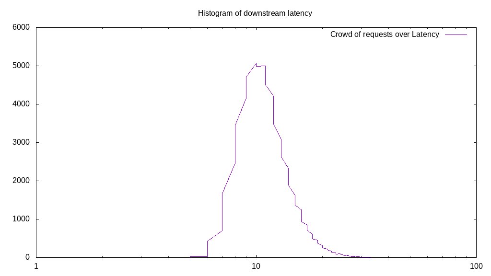
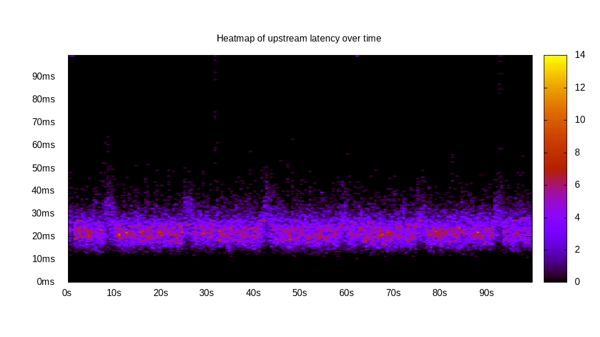
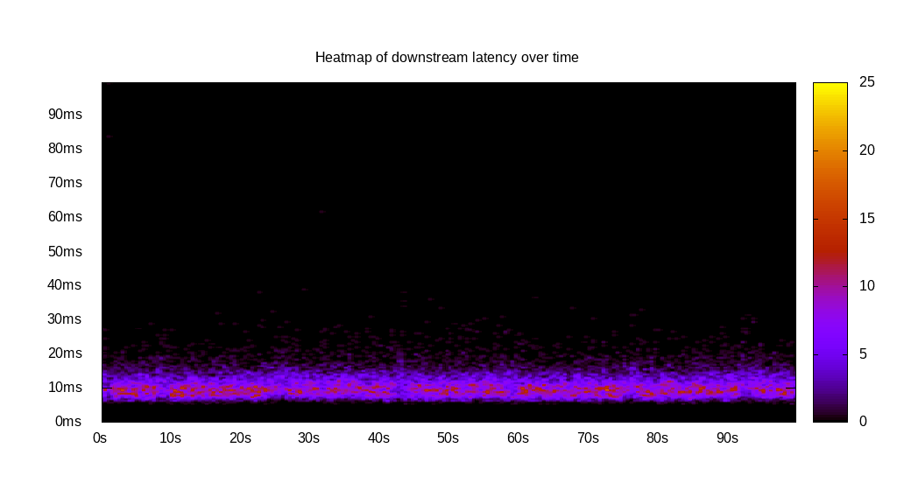
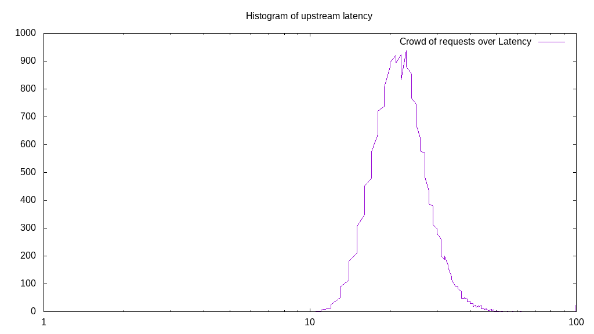
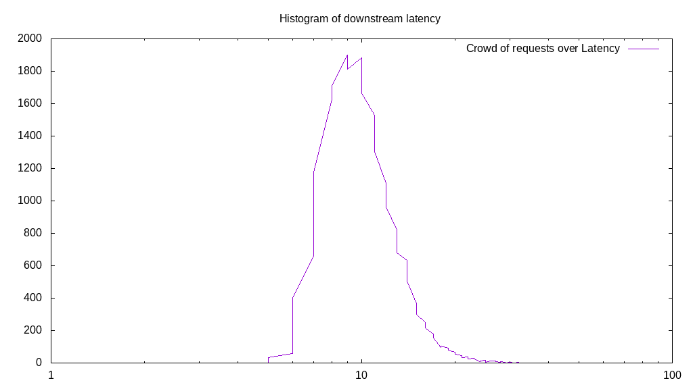
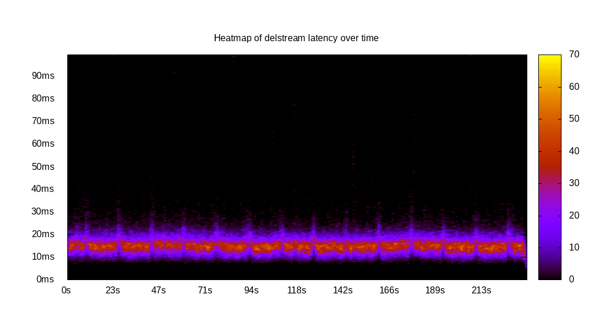
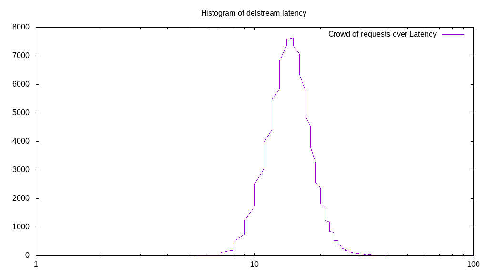

# Latency benchmark report. Crowd is 8

## Populate workload

## Object Size is 32.00kiB

### PUT Latency in ms over time

Evolution of PUT Latency over time

| Parameter | Value |
| --- | --- |
| Y Coordinate | PUT Latency in ms |
| X Coordinate | time in s since begining of workload |

### PUT Latency distribution in ms

Distribution of the PUT Latency in ms

| Parameter | Value |
| --- | --- |
| Y Coordinate | Number of PUT |
| X Coordinate | Latency in ms |
| Server volume | 3705.250MiB|
| Server bandwidth | 12.351MiB/s |
| Server time | 300.00s |
| Server load | 7.94 |
| Server responses | 118568PUT |
| Server IOps | 395.23PUT/s |
| Client bandwidth | 1.544MiB/s |
| Client volume | 463.156MiB|
| Client time | 2382.85s |
| Client IOps |  49.76PUT/s  |
| Client Latency | 20.10ms/PUT |
| Client Limbo | 2.14ms/PUT |
| Crowd time | 2399.99s |
| Crowd efficiency | 99.29% |
| Highest Latency | 100.00ms |
| 95th percentile Latency | 28.64ms |
| 68th percentile Latency | 21.61ms |
| 50th percentile Latency | 20.10ms |
| 32nd percentile Latency | 18.09ms |
| 5th percentile Latency | 14.57ms |
| Lowest Latency | 8.54ms |

## Read workload

## Object Size is 32.00kiB

### GET Latency in ms over time

Evolution of GET Latency over time

| Parameter | Value |
| --- | --- |
| Y Coordinate | GET Latency in ms |
| X Coordinate | time in s since begining of workload |

### GET Latency distribution in ms

Distribution of the GET Latency in ms

| Parameter | Value |
| --- | --- |
| Y Coordinate | Number of GET |
| X Coordinate | Latency in ms |
| Server volume | 2053.500MiB|
| Server bandwidth | 20.531MiB/s |
| Server time | 100.02s |
| Server load | 7.91 |
| Server responses | 65712GET |
| Server IOps | 657.00GET/s |
| Client bandwidth | 2.566MiB/s |
| Client volume | 256.688MiB|
| Client time | 791.54s |
| Client IOps |  83.02GET/s  |
| Client Latency | 12.05ms/GET |
| Client Limbo | 1.08ms/GET |
| Crowd time | 800.15s |
| Crowd efficiency | 98.92% |
| Highest Latency | 63.82ms |
| 95th percentile Latency | 19.10ms |
| 68th percentile Latency | 13.07ms |
| 50th percentile Latency | 12.06ms |
| 32nd percentile Latency | 10.55ms |
| 5th percentile Latency | 8.54ms |
| Lowest Latency | 5.53ms |

## Mixed workload

## Object Size is 32.00kiB

### PUT Latency in ms over time

Evolution of PUT Latency over time

| Parameter | Value |
| --- | --- |
| Y Coordinate | PUT Latency in ms |
| X Coordinate | time in s since begining of workload |

### GET Latency in ms over time

Evolution of GET Latency over time

| Parameter | Value |
| --- | --- |
| Y Coordinate | GET Latency in ms |
| X Coordinate | time in s since begining of workload |

### PUT Latency distribution in ms

Distribution of the PUT Latency in ms

| Parameter | Value |
| --- | --- |
| Y Coordinate | Number of PUT |
| X Coordinate | Latency in ms |
| Server volume | 710.156MiB|
| Server bandwidth | 7.101MiB/s |
| Server time | 100.01s |
| Server load | 5.44 |
| Server responses | 22725PUT |
| Server IOps | 227.22PUT/s |
| Client bandwidth | 0.888MiB/s |
| Client volume | 88.770MiB|
| Client time | 543.77s |
| Client IOps |  41.79PUT/s  |
| Client Latency | 23.93ms/PUT |
| Client Limbo | 32.04ms/PUT |
| Crowd time | 800.10s |
| Crowd efficiency | 67.96% |
| Highest Latency | 100.00ms |
| 95th percentile Latency | 34.67ms |
| 68th percentile Latency | 26.13ms |
| 50th percentile Latency | 23.62ms |
| 32nd percentile Latency | 21.11ms |
| 5th percentile Latency | 16.58ms |
| Lowest Latency | 11.06ms |

### GET Latency distribution in ms

Distribution of the GET Latency in ms

| Parameter | Value |
| --- | --- |
| Y Coordinate | Number of GET |
| X Coordinate | Latency in ms |
| Server volume | 711.031MiB|
| Server bandwidth | 7.109MiB/s |
| Server time | 100.01s |
| Server load | 2.50 |
| Server responses | 22753GET |
| Server IOps | 227.50GET/s |
| Client bandwidth | 0.889MiB/s |
| Client volume | 88.879MiB|
| Client time | 250.27s |
| Client IOps |  90.91GET/s  |
| Client Latency | 11.00ms/GET |
| Client Limbo | 68.73ms/GET |
| Crowd time | 800.10s |
| Crowd efficiency | 31.28% |
| Highest Latency | 100.00ms |
| 95th percentile Latency | 17.59ms |
| 68th percentile Latency | 12.06ms |
| 50th percentile Latency | 11.06ms |
| 32nd percentile Latency | 9.55ms |
| 5th percentile Latency | 7.54ms |
| Lowest Latency | 5.53ms |

## Cleanup workload

## Object Size is 32.00kiB

### DELETE Latency in ms over time

Evolution of DELETE Latency over time

| Parameter | Value |
| --- | --- |
| Y Coordinate | DELETE Latency in ms |
| X Coordinate | time in s since begining of workload |

### DELETE Latency distribution in ms

Distribution of the DELETE Latency in ms

| Parameter | Value |
| --- | --- |
| Y Coordinate | Number of DELETE |
| X Coordinate | Latency in ms |
| Server volume | 3705.500MiB|
| Server bandwidth | 15.686MiB/s |
| Server time | 236.22s |
| Server load | 7.91 |
| Server responses | 118576DELETE |
| Server IOps | 501.96DELETE/s |
| Client bandwidth | 1.961MiB/s |
| Client volume | 463.188MiB|
| Client time | 1868.46s |
| Client IOps |  63.46DELETE/s  |
| Client Latency | 15.76ms/DELETE |
| Client Limbo | 2.67ms/DELETE |
| Crowd time | 1889.80s |
| Crowd efficiency | 98.87% |
| Highest Latency | 100.00ms |
| 95th percentile Latency | 22.61ms |
| 68th percentile Latency | 17.59ms |
| 50th percentile Latency | 16.08ms |
| 32nd percentile Latency | 14.57ms |
| 5th percentile Latency | 11.06ms |
| Lowest Latency | 4.52ms |

