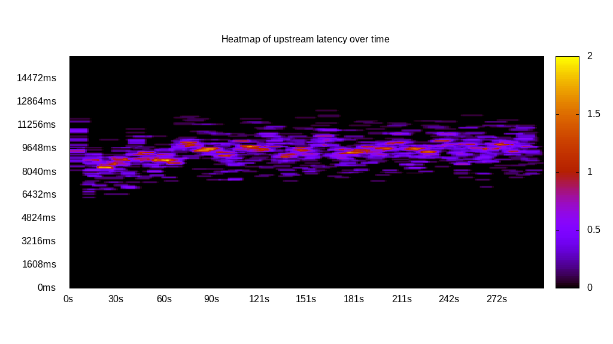
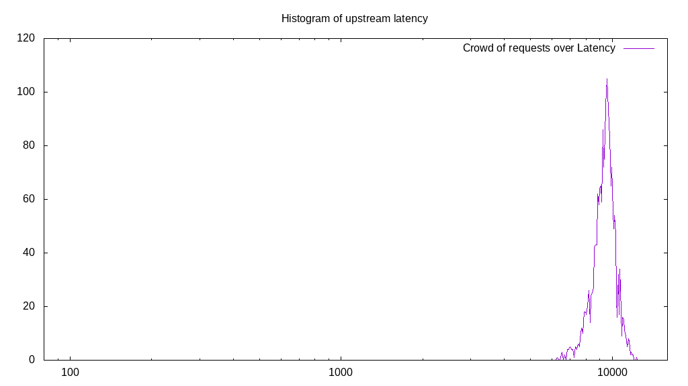
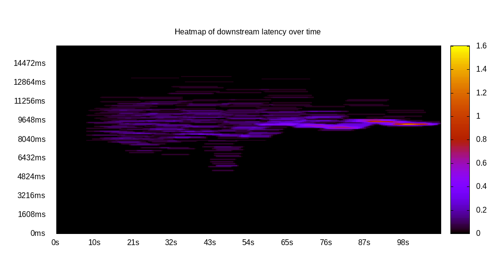
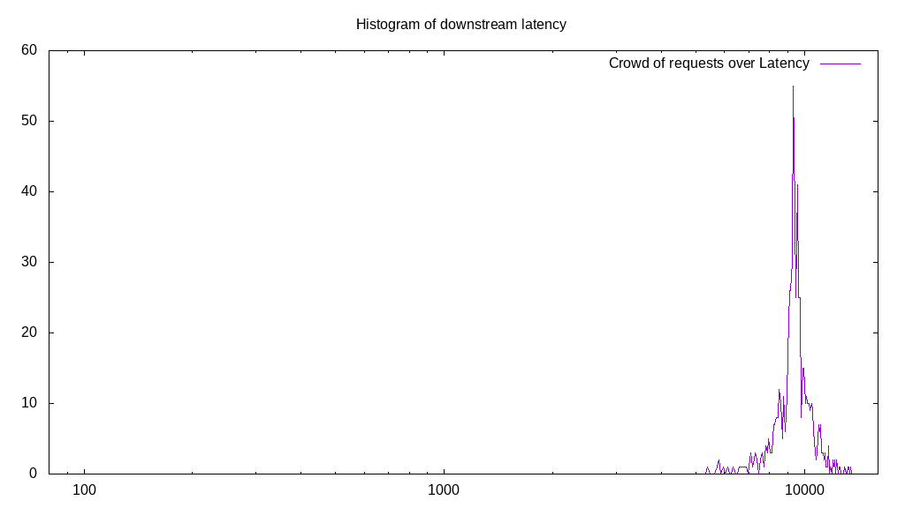
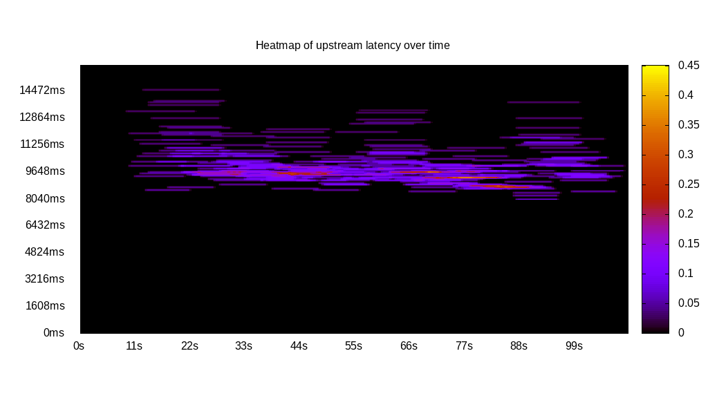
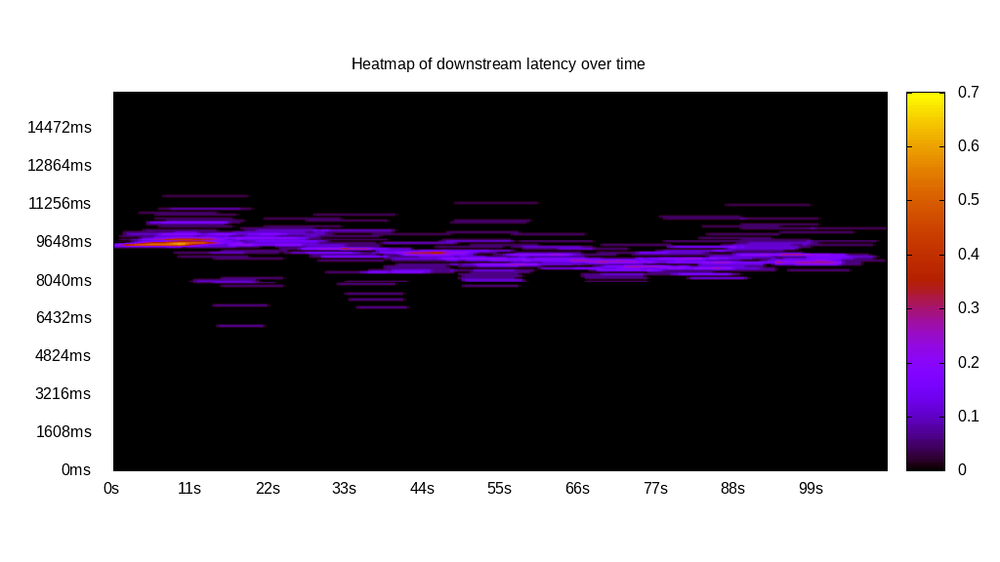
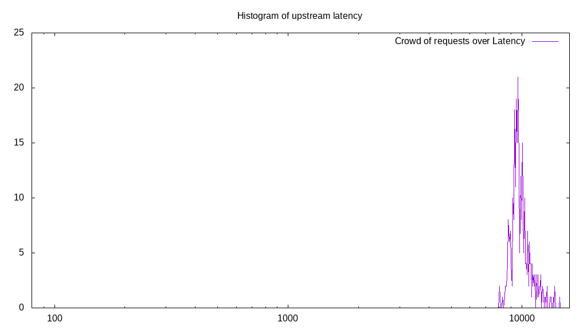
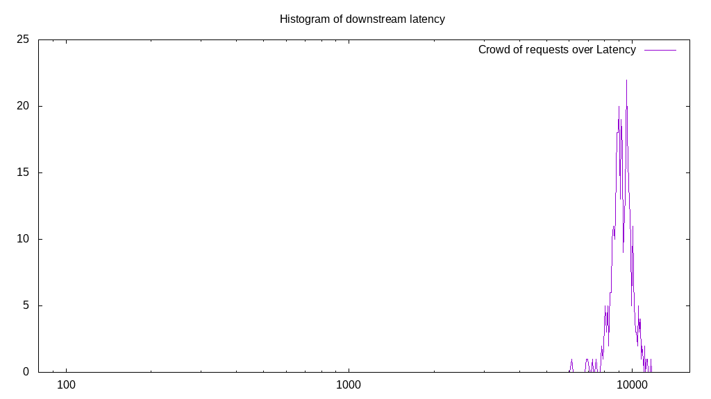
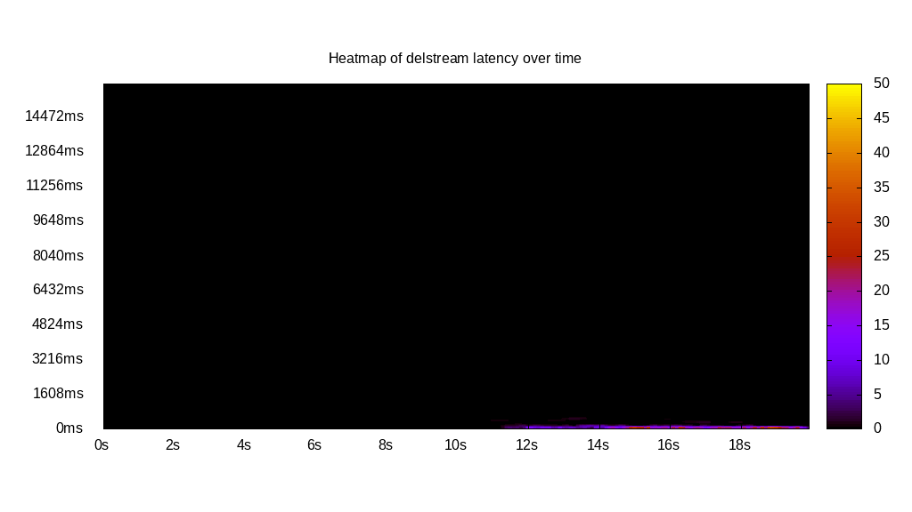
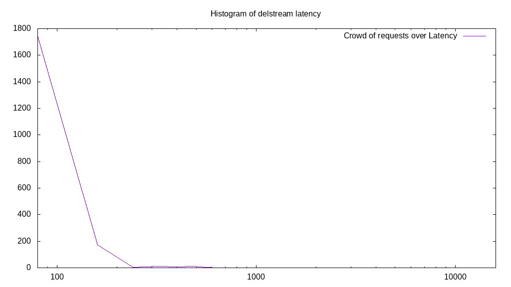

# Latency benchmark report. Crowd is 64

## Populate workload

## Object Size is 32768.00kiB

### PUT Latency in ms over time

Evolution of PUT Latency over time

| Parameter | Value |
| --- | --- |
| Y Coordinate | PUT Latency in ms |
| X Coordinate | time in s since begining of workload |

### PUT Latency distribution in ms

Distribution of the PUT Latency in ms

| Parameter | Value |
| --- | --- |
| Y Coordinate | Number of PUT |
| X Coordinate | Latency in ms |
| Server volume | 64128.000MiB|
| Server bandwidth | 212.973MiB/s |
| Server time | 301.11s |
| Server load | 62.87 |
| Server responses | 2004PUT |
| Server IOps | 6.66PUT/s |
| Client bandwidth | 3.328MiB/s |
| Client volume | 1002.000MiB|
| Client time | 18931.19s |
| Client IOps |  0.11PUT/s  |
| Client Latency | 9446.70ms/PUT |
| Client Limbo | 5.31ms/PUT |
| Crowd time | 19270.98s |
| Crowd efficiency | 98.24% |
| Highest Latency | 12301.51ms |
| 95th percentile Latency | 10934.67ms |
| 68th percentile Latency | 9889.45ms |
| 50th percentile Latency | 9567.84ms |
| 32nd percentile Latency | 9165.83ms |
| 5th percentile Latency | 8040.20ms |
| Lowest Latency | 6271.36ms |

## Read workload

## Object Size is 32768.00kiB

### GET Latency in ms over time

Evolution of GET Latency over time

| Parameter | Value |
| --- | --- |
| Y Coordinate | GET Latency in ms |
| X Coordinate | time in s since begining of workload |

### GET Latency distribution in ms

Distribution of the GET Latency in ms

| Parameter | Value |
| --- | --- |
| Y Coordinate | Number of GET |
| X Coordinate | Latency in ms |
| Server volume | 19552.000MiB|
| Server bandwidth | 179.865MiB/s |
| Server time | 108.70s |
| Server load | 53.14 |
| Server responses | 611GET |
| Server IOps | 5.62GET/s |
| Client bandwidth | 2.810MiB/s |
| Client volume | 305.500MiB|
| Client time | 5776.74s |
| Client IOps |  0.11GET/s  |
| Client Latency | 9454.56ms/GET |
| Client Limbo | 18.44ms/GET |
| Crowd time | 6957.06s |
| Crowd efficiency | 83.03% |
| Highest Latency | 13427.14ms |
| 95th percentile Latency | 11256.28ms |
| 68th percentile Latency | 9809.05ms |
| 50th percentile Latency | 9487.44ms |
| 32nd percentile Latency | 9246.23ms |
| 5th percentile Latency | 7879.40ms |
| Lowest Latency | 5386.93ms |

## Mixed workload

## Object Size is 32768.00kiB

### PUT Latency in ms over time

Evolution of PUT Latency over time

| Parameter | Value |
| --- | --- |
| Y Coordinate | PUT Latency in ms |
| X Coordinate | time in s since begining of workload |

### GET Latency in ms over time

Evolution of GET Latency over time

| Parameter | Value |
| --- | --- |
| Y Coordinate | GET Latency in ms |
| X Coordinate | time in s since begining of workload |

### PUT Latency distribution in ms

Distribution of the PUT Latency in ms

| Parameter | Value |
| --- | --- |
| Y Coordinate | Number of PUT |
| X Coordinate | Latency in ms |
| Server volume | 9568.000MiB|
| Server bandwidth | 87.053MiB/s |
| Server time | 109.91s |
| Server load | 27.35 |
| Server responses | 299PUT |
| Server IOps | 2.72PUT/s |
| Client bandwidth | 1.360MiB/s |
| Client volume | 149.500MiB|
| Client time | 3005.85s |
| Client IOps |  0.10PUT/s  |
| Client Latency | 10053.01ms/PUT |
| Client Limbo | 62.94ms/PUT |
| Crowd time | 7034.24s |
| Crowd efficiency | 42.73% |
| Highest Latency | 14552.76ms |
| 95th percentile Latency | 12381.91ms |
| 68th percentile Latency | 10291.46ms |
| 50th percentile Latency | 9809.05ms |
| 32nd percentile Latency | 9567.84ms |
| 5th percentile Latency | 8844.22ms |
| Lowest Latency | 8040.20ms |

### GET Latency distribution in ms

Distribution of the GET Latency in ms

| Parameter | Value |
| --- | --- |
| Y Coordinate | Number of GET |
| X Coordinate | Latency in ms |
| Server volume | 11296.000MiB|
| Server bandwidth | 102.775MiB/s |
| Server time | 109.91s |
| Server load | 29.82 |
| Server responses | 353GET |
| Server IOps | 3.21GET/s |
| Client bandwidth | 1.606MiB/s |
| Client volume | 176.500MiB|
| Client time | 3277.45s |
| Client IOps |  0.11GET/s  |
| Client Latency | 9284.57ms/GET |
| Client Limbo | 58.70ms/GET |
| Crowd time | 7034.24s |
| Crowd efficiency | 46.59% |
| Highest Latency | 11658.29ms |
| 95th percentile Latency | 10613.07ms |
| 68th percentile Latency | 9648.24ms |
| 50th percentile Latency | 9326.63ms |
| 32nd percentile Latency | 9005.03ms |
| 5th percentile Latency | 8201.01ms |
| Lowest Latency | 6110.55ms |

## Cleanup workload

## Object Size is 32768.00kiB

### DELETE Latency in ms over time

Evolution of DELETE Latency over time

| Parameter | Value |
| --- | --- |
| Y Coordinate | DELETE Latency in ms |
| X Coordinate | time in s since begining of workload |

### DELETE Latency distribution in ms

Distribution of the DELETE Latency in ms

| Parameter | Value |
| --- | --- |
| Y Coordinate | Number of DELETE |
| X Coordinate | Latency in ms |
| Server volume | 64960.000MiB|
| Server bandwidth | 3105.163MiB/s |
| Server time | 20.92s |
| Server load | 8.27 |
| Server responses | 2030DELETE |
| Server IOps | 97.04DELETE/s |
| Client bandwidth | 48.518MiB/s |
| Client volume | 1015.000MiB|
| Client time | 173.09s |
| Client IOps |  11.73DELETE/s  |
| Client Latency | 85.27ms/DELETE |
| Client Limbo | 18.22ms/DELETE |
| Crowd time | 1338.88s |
| Crowd efficiency | 12.93% |
| Highest Latency | 723.62ms |
| 95th percentile Latency | 241.21ms |
| 68th percentile Latency | 160.80ms |
| 50th percentile Latency | 160.80ms |
| 32nd percentile Latency | 160.80ms |
| 5th percentile Latency | 160.80ms |
| Lowest Latency | 80.40ms |

