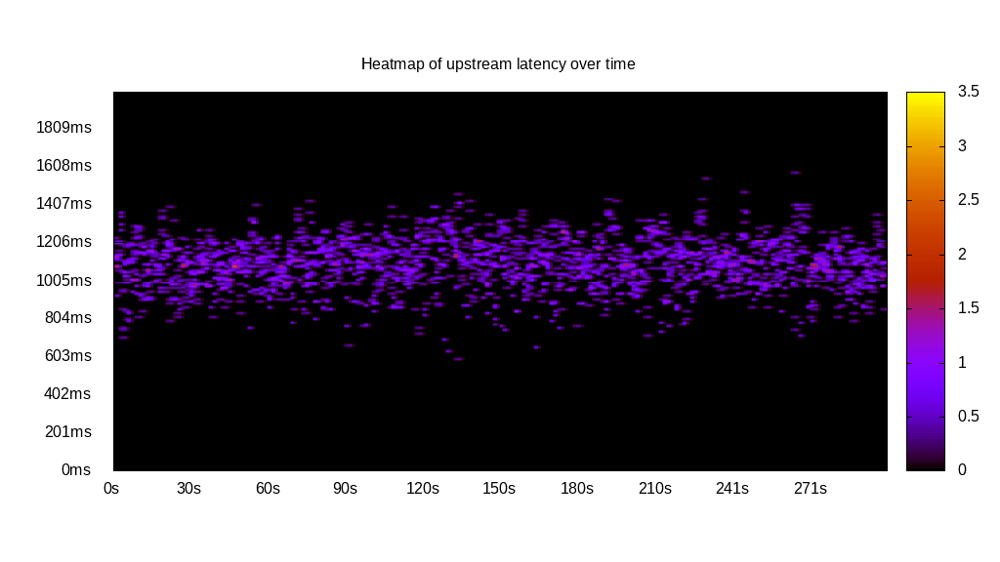
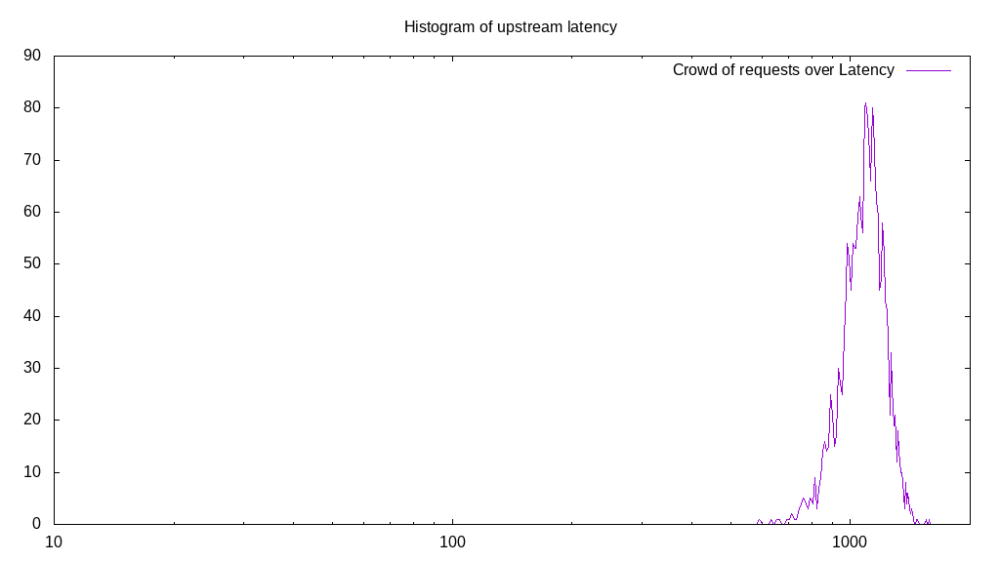
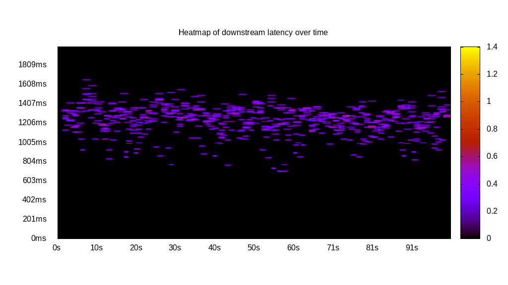
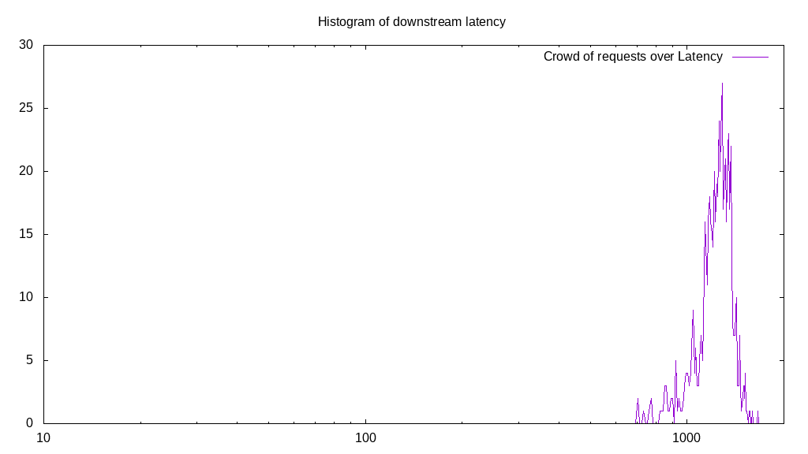
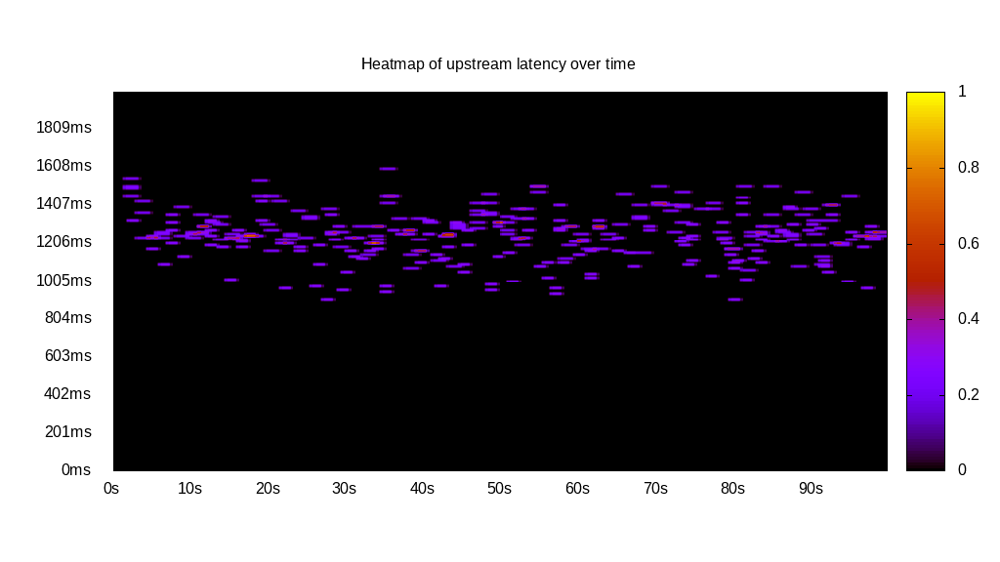
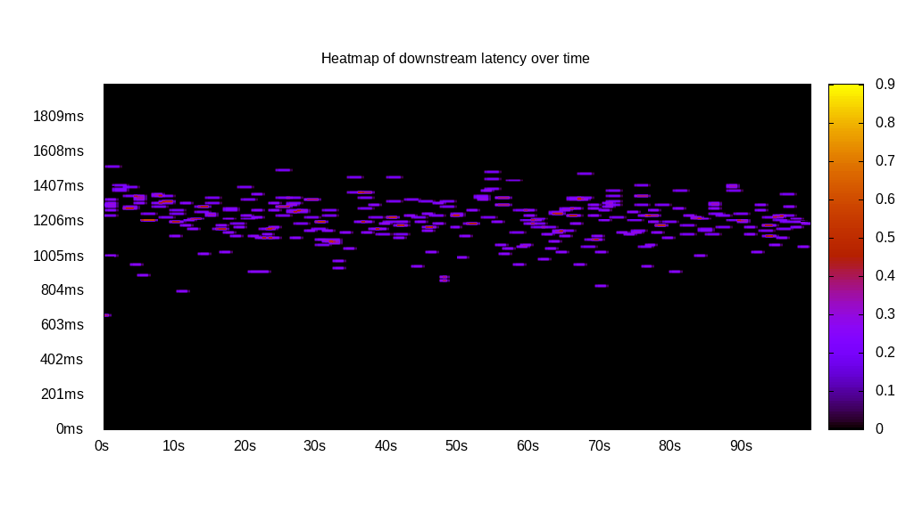
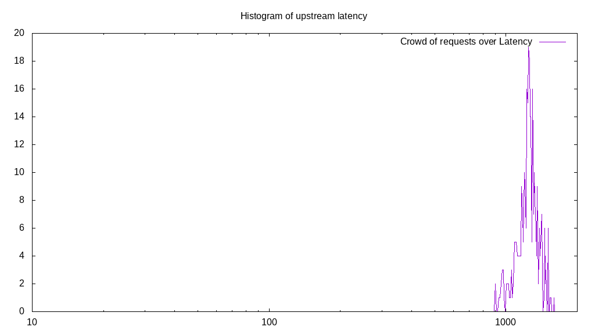
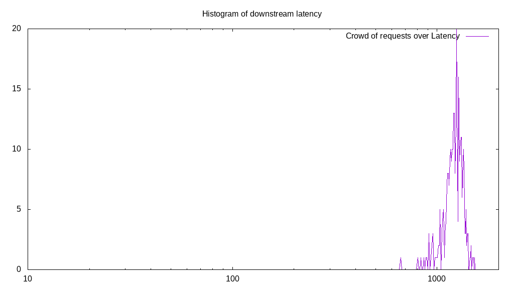
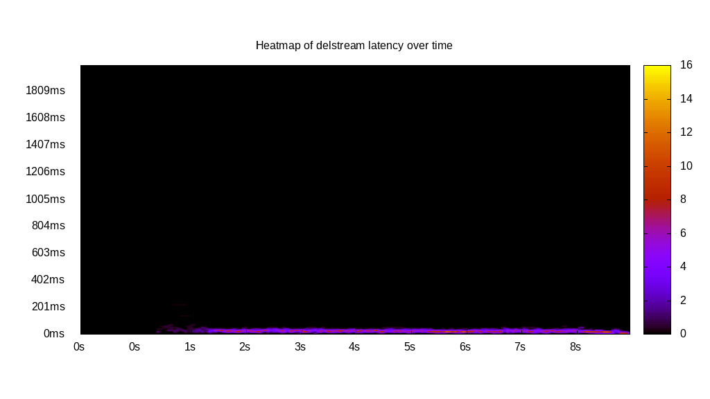
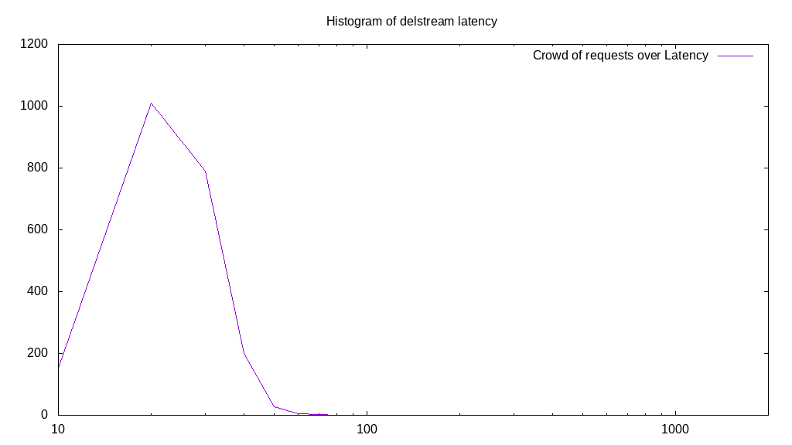

# Latency benchmark report. Crowd is 8

## Populate workload

## Object Size is 32768.00kiB

### PUT Latency in ms over time

Evolution of PUT Latency over time

| Parameter | Value |
| --- | --- |
| Y Coordinate | PUT Latency in ms |
| X Coordinate | time in s since begining of workload |

### PUT Latency distribution in ms

Distribution of the PUT Latency in ms

| Parameter | Value |
| --- | --- |
| Y Coordinate | Number of PUT |
| X Coordinate | Latency in ms |
| Server volume | 69792.000MiB|
| Server bandwidth | 232.711MiB/s |
| Server time | 299.91s |
| Server load | 7.98 |
| Server responses | 2181PUT |
| Server IOps | 7.27PUT/s |
| Client bandwidth | 29.089MiB/s |
| Client volume | 8724.000MiB|
| Client time | 2394.33s |
| Client IOps |  0.91PUT/s  |
| Client Latency | 1097.81ms/PUT |
| Client Limbo | 0.62ms/PUT |
| Crowd time | 2399.26s |
| Crowd efficiency | 99.79% |
| Highest Latency | 1577.89ms |
| 95th percentile Latency | 1306.53ms |
| 68th percentile Latency | 1165.83ms |
| 50th percentile Latency | 1115.58ms |
| 32nd percentile Latency | 1055.28ms |
| 5th percentile Latency | 884.42ms |
| Lowest Latency | 592.96ms |

## Read workload

## Object Size is 32768.00kiB

### GET Latency in ms over time

Evolution of GET Latency over time

| Parameter | Value |
| --- | --- |
| Y Coordinate | GET Latency in ms |
| X Coordinate | time in s since begining of workload |

### GET Latency distribution in ms

Distribution of the GET Latency in ms

| Parameter | Value |
| --- | --- |
| Y Coordinate | Number of GET |
| X Coordinate | Latency in ms |
| Server volume | 20480.000MiB|
| Server bandwidth | 202.634MiB/s |
| Server time | 101.07s |
| Server load | 7.86 |
| Server responses | 640GET |
| Server IOps | 6.33GET/s |
| Client bandwidth | 25.329MiB/s |
| Client volume | 2560.000MiB|
| Client time | 794.26s |
| Client IOps |  0.81GET/s  |
| Client Latency | 1241.04ms/GET |
| Client Limbo | 1.79ms/GET |
| Crowd time | 808.55s |
| Crowd efficiency | 98.23% |
| Highest Latency | 1658.29ms |
| 95th percentile Latency | 1447.24ms |
| 68th percentile Latency | 1326.63ms |
| 50th percentile Latency | 1266.33ms |
| 32nd percentile Latency | 1206.03ms |
| 5th percentile Latency | 984.92ms |
| Lowest Latency | 703.52ms |

## Mixed workload

## Object Size is 32768.00kiB

### PUT Latency in ms over time

Evolution of PUT Latency over time

| Parameter | Value |
| --- | --- |
| Y Coordinate | PUT Latency in ms |
| X Coordinate | time in s since begining of workload |

### GET Latency in ms over time

Evolution of GET Latency over time

| Parameter | Value |
| --- | --- |
| Y Coordinate | GET Latency in ms |
| X Coordinate | time in s since begining of workload |

### PUT Latency distribution in ms

Distribution of the PUT Latency in ms

| Parameter | Value |
| --- | --- |
| Y Coordinate | Number of PUT |
| X Coordinate | Latency in ms |
| Server volume | 10336.000MiB|
| Server bandwidth | 102.896MiB/s |
| Server time | 100.45s |
| Server load | 4.02 |
| Server responses | 323PUT |
| Server IOps | 3.22PUT/s |
| Client bandwidth | 12.862MiB/s |
| Client volume | 1292.000MiB|
| Client time | 404.29s |
| Client IOps |  0.80PUT/s  |
| Client Latency | 1251.66ms/PUT |
| Client Limbo | 49.92ms/PUT |
| Crowd time | 803.61s |
| Crowd efficiency | 50.31% |
| Highest Latency | 1597.99ms |
| 95th percentile Latency | 1467.34ms |
| 68th percentile Latency | 1306.53ms |
| 50th percentile Latency | 1266.33ms |
| 32nd percentile Latency | 1226.13ms |
| 5th percentile Latency | 1025.13ms |
| Lowest Latency | 904.52ms |

### GET Latency distribution in ms

Distribution of the GET Latency in ms

| Parameter | Value |
| --- | --- |
| Y Coordinate | Number of GET |
| X Coordinate | Latency in ms |
| Server volume | 10304.000MiB|
| Server bandwidth | 102.577MiB/s |
| Server time | 100.45s |
| Server load | 3.91 |
| Server responses | 322GET |
| Server IOps | 3.21GET/s |
| Client bandwidth | 12.822MiB/s |
| Client volume | 1288.000MiB|
| Client time | 392.37s |
| Client IOps |  0.82GET/s  |
| Client Latency | 1218.54ms/GET |
| Client Limbo | 51.40ms/GET |
| Crowd time | 803.61s |
| Crowd efficiency | 48.83% |
| Highest Latency | 1527.64ms |
| 95th percentile Latency | 1396.98ms |
| 68th percentile Latency | 1286.43ms |
| 50th percentile Latency | 1246.23ms |
| 32nd percentile Latency | 1185.93ms |
| 5th percentile Latency | 994.97ms |
| Lowest Latency | 663.32ms |

## Cleanup workload

## Object Size is 32768.00kiB

### DELETE Latency in ms over time

Evolution of DELETE Latency over time

| Parameter | Value |
| --- | --- |
| Y Coordinate | DELETE Latency in ms |
| X Coordinate | time in s since begining of workload |

### DELETE Latency distribution in ms

Distribution of the DELETE Latency in ms

| Parameter | Value |
| --- | --- |
| Y Coordinate | Number of DELETE |
| X Coordinate | Latency in ms |
| Server volume | 70048.000MiB|
| Server bandwidth | 7676.493MiB/s |
| Server time | 9.13s |
| Server load | 6.14 |
| Server responses | 2189DELETE |
| Server IOps | 239.89DELETE/s |
| Client bandwidth | 959.562MiB/s |
| Client volume | 8756.000MiB|
| Client time | 56.02s |
| Client IOps |  39.08DELETE/s  |
| Client Latency | 25.59ms/DELETE |
| Client Limbo | 2.12ms/DELETE |
| Crowd time | 73.00s |
| Crowd efficiency | 76.73% |
| Highest Latency | 221.11ms |
| 95th percentile Latency | 50.25ms |
| 68th percentile Latency | 40.20ms |
| 50th percentile Latency | 30.15ms |
| 32nd percentile Latency | 30.15ms |
| 5th percentile Latency | 20.10ms |
| Lowest Latency | 10.05ms |

