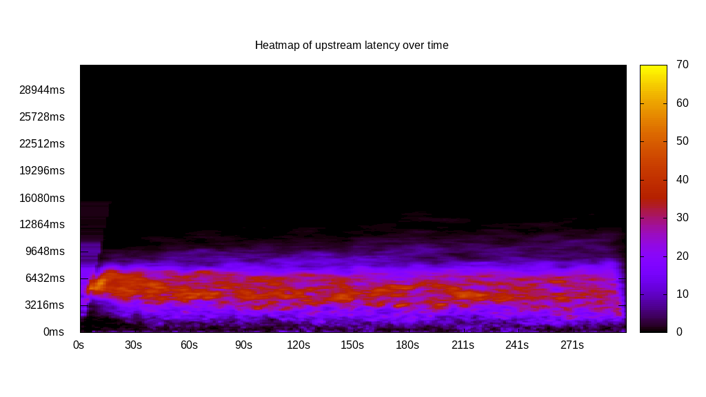
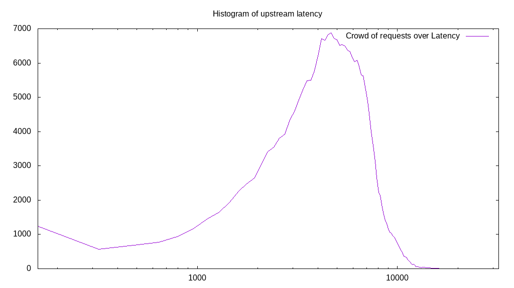
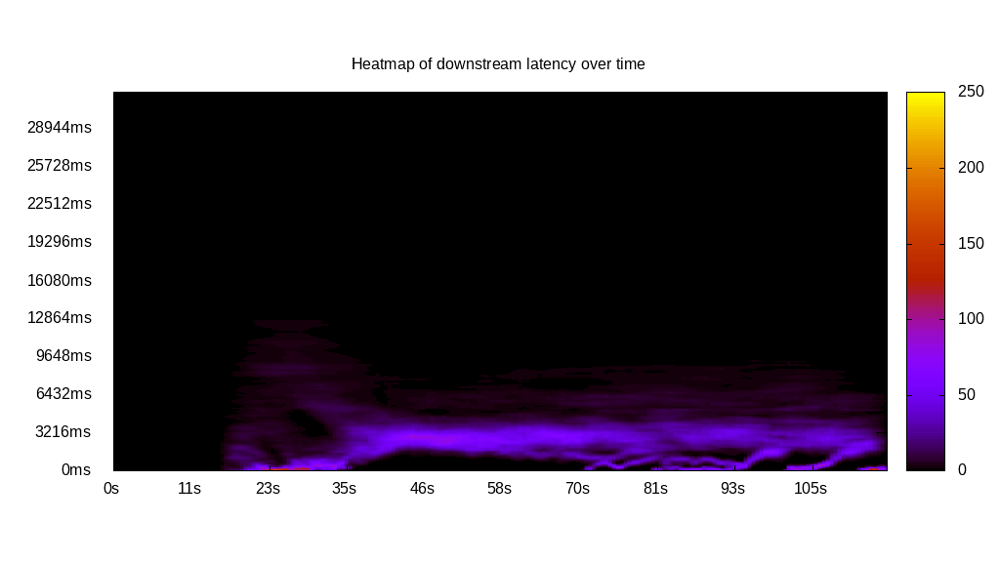
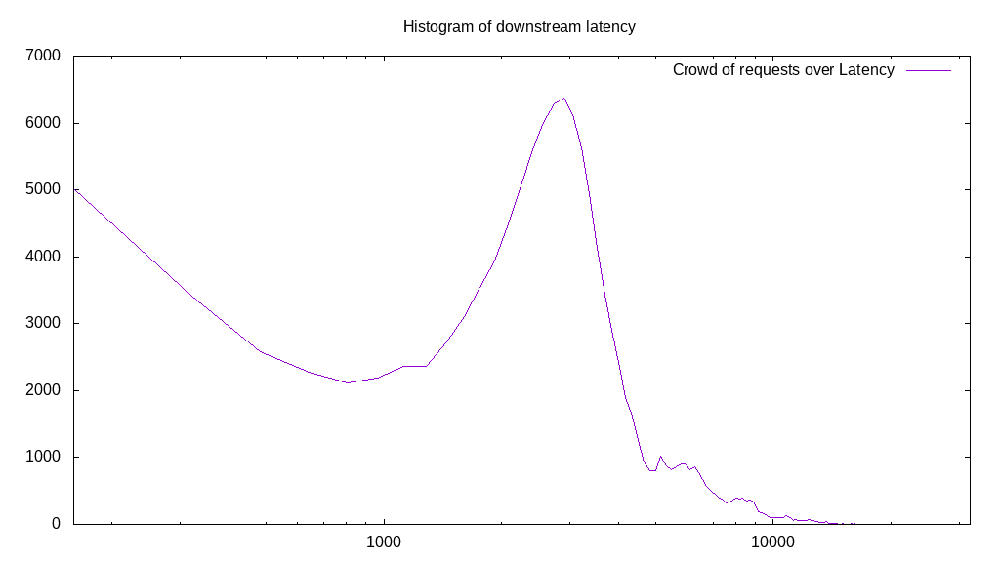
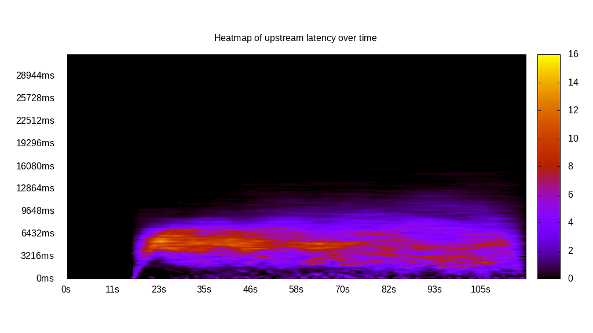
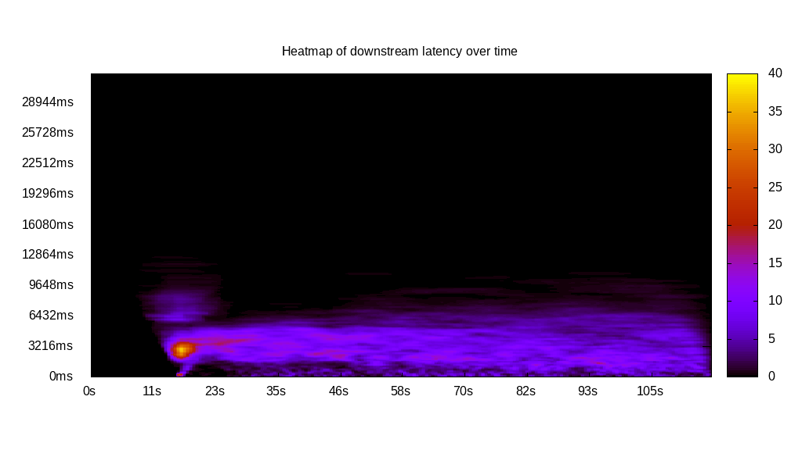
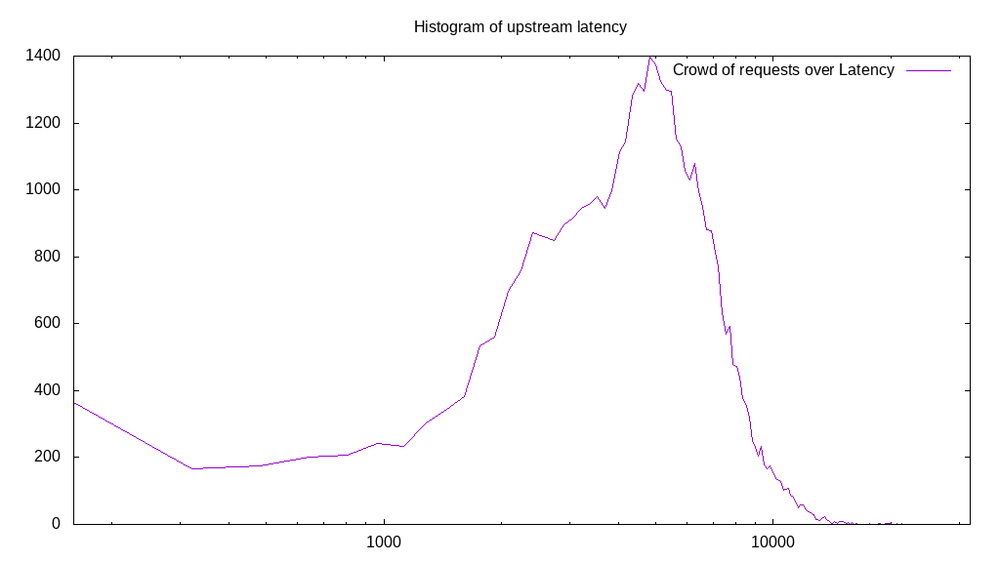
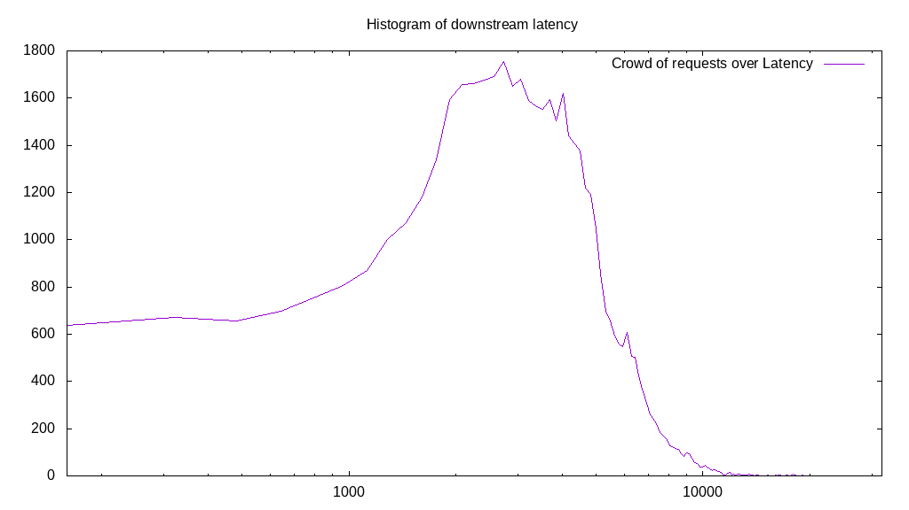
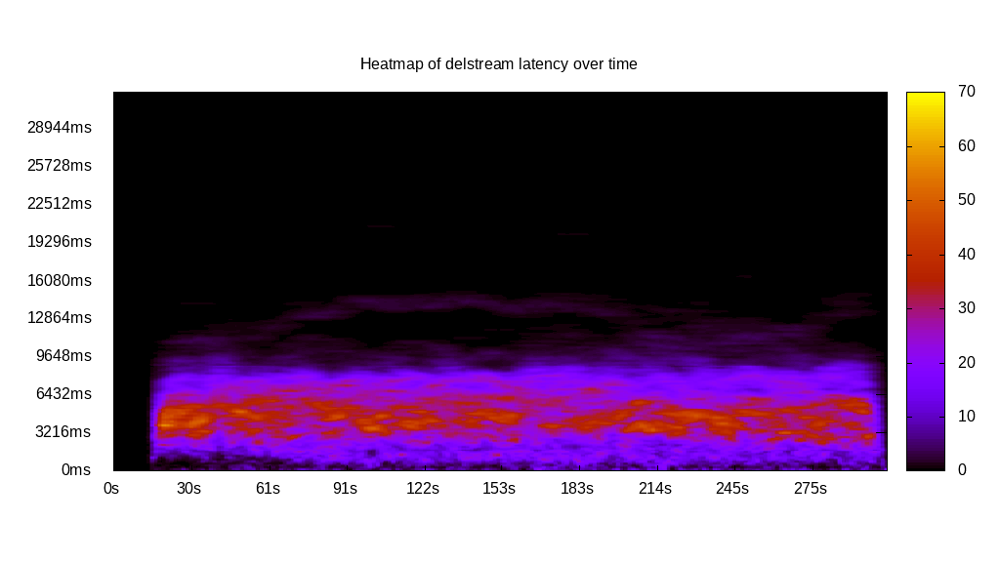
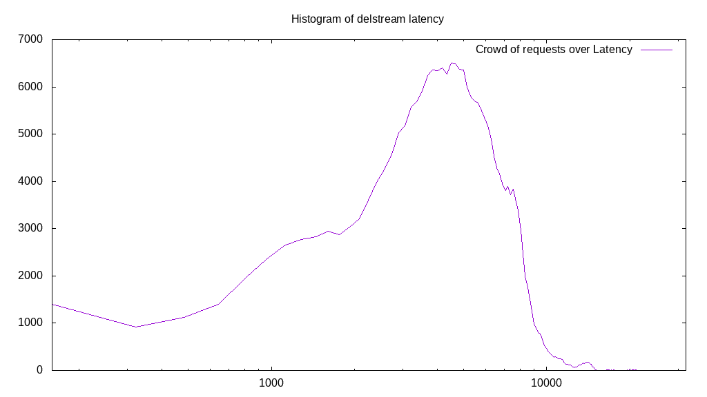

# Latency benchmark report. Crowd is 4096

## Populate workload

## Object Size is 0.00kiB

### PUT Latency in ms over time

Evolution of PUT Latency over time

| Parameter | Value |
| --- | --- |
| Y Coordinate | PUT Latency in ms |
| X Coordinate | time in s since begining of workload |

### PUT Latency distribution in ms

Distribution of the PUT Latency in ms

| Parameter | Value |
| --- | --- |
| Y Coordinate | Number of PUT |
| X Coordinate | Latency in ms |
| Server volume | 0.000MiB|
| Server bandwidth | 0.000MiB/s |
| Server time | 300.00s |
| Server load | 4050.48 |
| Server responses | 236928PUT |
| Server IOps | 789.77PUT/s |
| Client bandwidth | 0.000MiB/s |
| Client volume | 0.000MiB|
| Client time | 1215130.66s |
| Client IOps |  0.19PUT/s  |
| Client Latency | 5128.69ms/PUT |
| Client Limbo | 3.33ms/PUT |
| Crowd time | 1228787.71s |
| Crowd efficiency | 98.89% |
| Highest Latency | 23316.58ms |
| 95th percentile Latency | 9165.83ms |
| 68th percentile Latency | 6271.36ms |
| 50th percentile Latency | 5145.73ms |
| 32nd percentile Latency | 4180.90ms |
| 5th percentile Latency | 1768.84ms |
| Lowest Latency | 160.80ms |

## Read workload

## Object Size is 0.00kiB

### GET Latency in ms over time

Evolution of GET Latency over time

| Parameter | Value |
| --- | --- |
| Y Coordinate | GET Latency in ms |
| X Coordinate | time in s since begining of workload |

### GET Latency distribution in ms

Distribution of the GET Latency in ms

| Parameter | Value |
| --- | --- |
| Y Coordinate | Number of GET |
| X Coordinate | Latency in ms |
| Server volume | 0.000MiB|
| Server bandwidth | 0.000MiB/s |
| Server time | 116.22s |
| Server load | 3287.24 |
| Server responses | 125926GET |
| Server IOps | 1083.54GET/s |
| Client bandwidth | 0.000MiB/s |
| Client volume | 0.000MiB|
| Client time | 382033.58s |
| Client IOps |  0.33GET/s  |
| Client Latency | 3033.79ms/GET |
| Client Limbo | 22.95ms/GET |
| Crowd time | 476024.83s |
| Crowd efficiency | 80.25% |
| Highest Latency | 22030.15ms |
| 95th percentile Latency | 7557.79ms |
| 68th percentile Latency | 3537.69ms |
| 50th percentile Latency | 2894.47ms |
| 32nd percentile Latency | 2251.26ms |
| 5th percentile Latency | 321.61ms |
| Lowest Latency | 160.80ms |

## Mixed workload

## Object Size is 0.00kiB

### PUT Latency in ms over time

Evolution of PUT Latency over time

| Parameter | Value |
| --- | --- |
| Y Coordinate | PUT Latency in ms |
| X Coordinate | time in s since begining of workload |

### GET Latency in ms over time

Evolution of GET Latency over time

| Parameter | Value |
| --- | --- |
| Y Coordinate | GET Latency in ms |
| X Coordinate | time in s since begining of workload |

### PUT Latency distribution in ms

Distribution of the PUT Latency in ms

| Parameter | Value |
| --- | --- |
| Y Coordinate | Number of PUT |
| X Coordinate | Latency in ms |
| Server volume | 0.000MiB|
| Server bandwidth | 0.000MiB/s |
| Server time | 116.60s |
| Server load | 1993.62 |
| Server responses | 45338PUT |
| Server IOps | 388.82PUT/s |
| Client bandwidth | 0.000MiB/s |
| Client volume | 0.000MiB|
| Client time | 232462.54s |
| Client IOps |  0.20PUT/s  |
| Client Latency | 5127.32ms/PUT |
| Client Limbo | 59.85ms/PUT |
| Crowd time | 477605.89s |
| Crowd efficiency | 48.67% |
| Highest Latency | 22834.17ms |
| 95th percentile Latency | 9487.44ms |
| 68th percentile Latency | 6271.36ms |
| 50th percentile Latency | 5145.73ms |
| 32nd percentile Latency | 4180.90ms |
| 5th percentile Latency | 1608.04ms |
| Lowest Latency | 160.80ms |

### GET Latency distribution in ms

Distribution of the GET Latency in ms

| Parameter | Value |
| --- | --- |
| Y Coordinate | Number of GET |
| X Coordinate | Latency in ms |
| Server volume | 0.000MiB|
| Server bandwidth | 0.000MiB/s |
| Server time | 116.60s |
| Server load | 1502.23 |
| Server responses | 49875GET |
| Server IOps | 427.73GET/s |
| Client bandwidth | 0.000MiB/s |
| Client volume | 0.000MiB|
| Client time | 175164.92s |
| Client IOps |  0.28GET/s  |
| Client Latency | 3512.08ms/GET |
| Client Limbo | 73.84ms/GET |
| Crowd time | 477605.89s |
| Crowd efficiency | 36.68% |
| Highest Latency | 21547.74ms |
| 95th percentile Latency | 7236.18ms |
| 68th percentile Latency | 4341.71ms |
| 50th percentile Latency | 3376.88ms |
| 32nd percentile Latency | 2572.86ms |
| 5th percentile Latency | 804.02ms |
| Lowest Latency | 160.80ms |

## Cleanup workload

## Object Size is 0.00kiB

### DELETE Latency in ms over time

Evolution of DELETE Latency over time

| Parameter | Value |
| --- | --- |
| Y Coordinate | DELETE Latency in ms |
| X Coordinate | time in s since begining of workload |

### DELETE Latency distribution in ms

Distribution of the DELETE Latency in ms

| Parameter | Value |
| --- | --- |
| Y Coordinate | Number of DELETE |
| X Coordinate | Latency in ms |
| Server volume | 0.000MiB|
| Server bandwidth | 0.000MiB/s |
| Server time | 304.95s |
| Server load | 3804.44 |
| Server responses | 236936DELETE |
| Server IOps | 776.97DELETE/s |
| Client bandwidth | 0.000MiB/s |
| Client volume | 0.000MiB|
| Client time | 1160160.00s |
| Client IOps |  0.20DELETE/s  |
| Client Latency | 4896.51ms/DELETE |
| Client Limbo | 21.71ms/DELETE |
| Crowd time | 1249071.10s |
| Crowd efficiency | 92.88% |
| Highest Latency | 21226.13ms |
| 95th percentile Latency | 8844.22ms |
| 68th percentile Latency | 6110.55ms |
| 50th percentile Latency | 4824.12ms |
| 32nd percentile Latency | 3859.30ms |
| 5th percentile Latency | 1286.43ms |
| Lowest Latency | 160.80ms |

