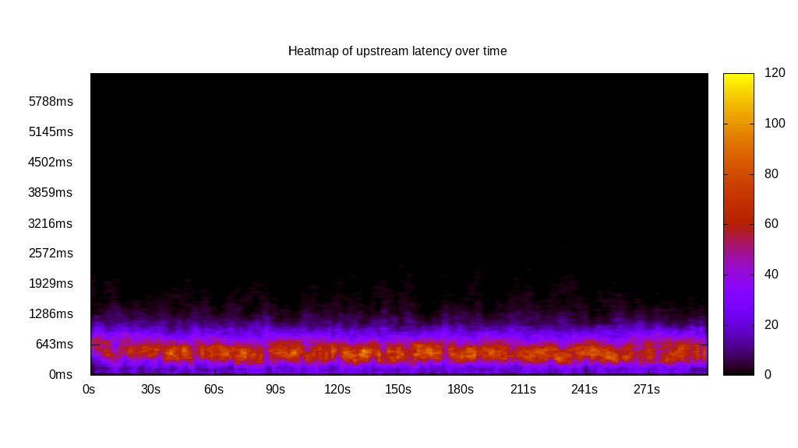
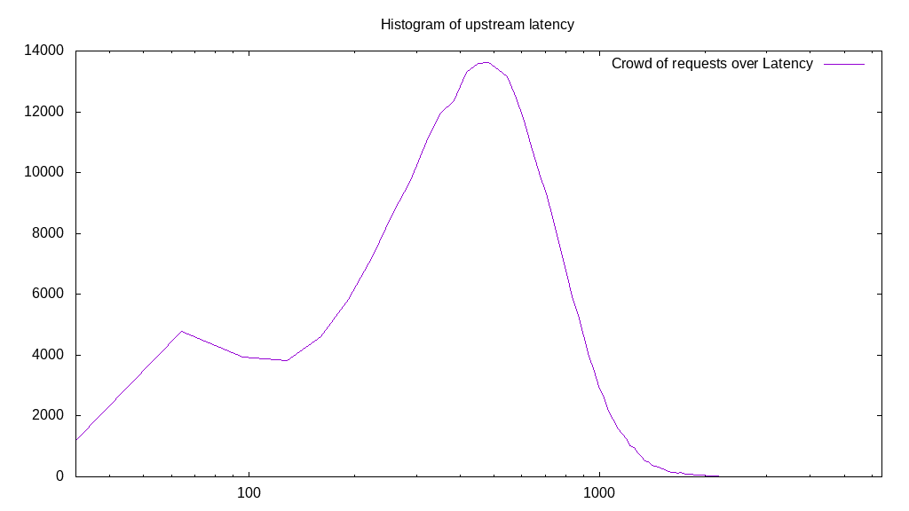
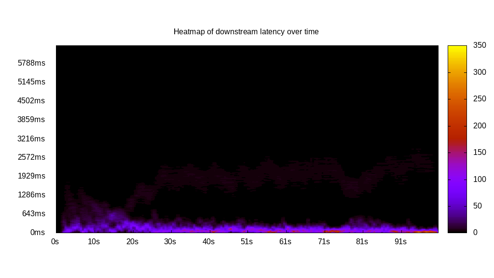
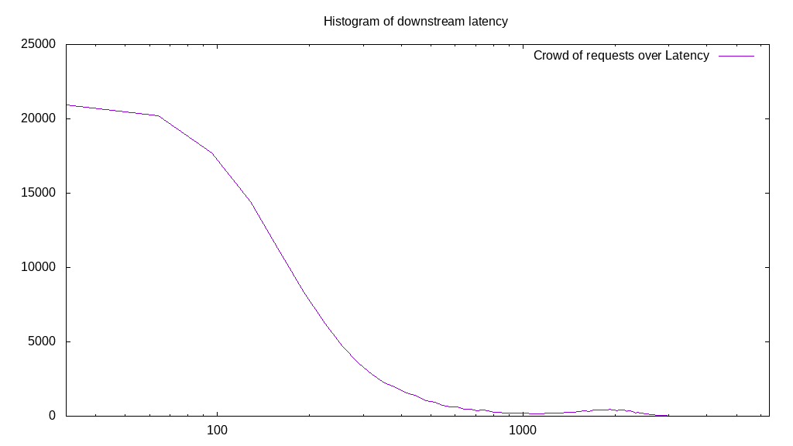
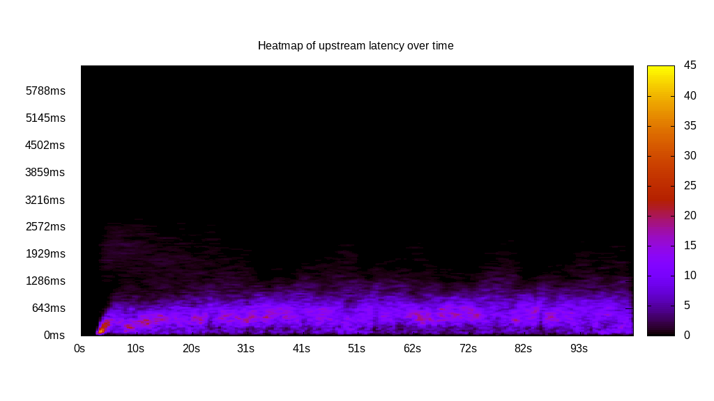
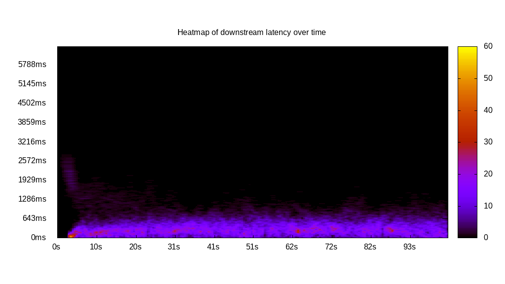
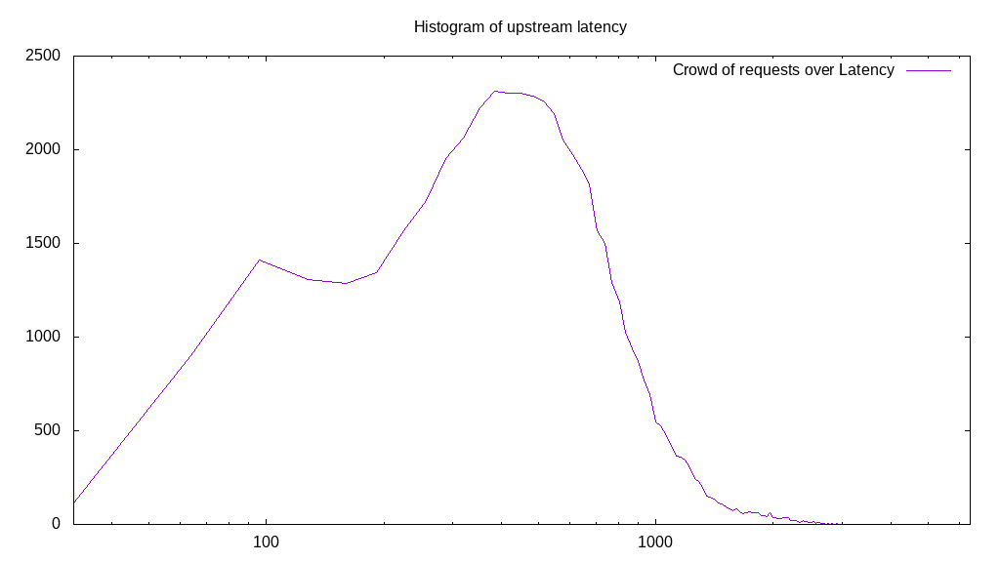
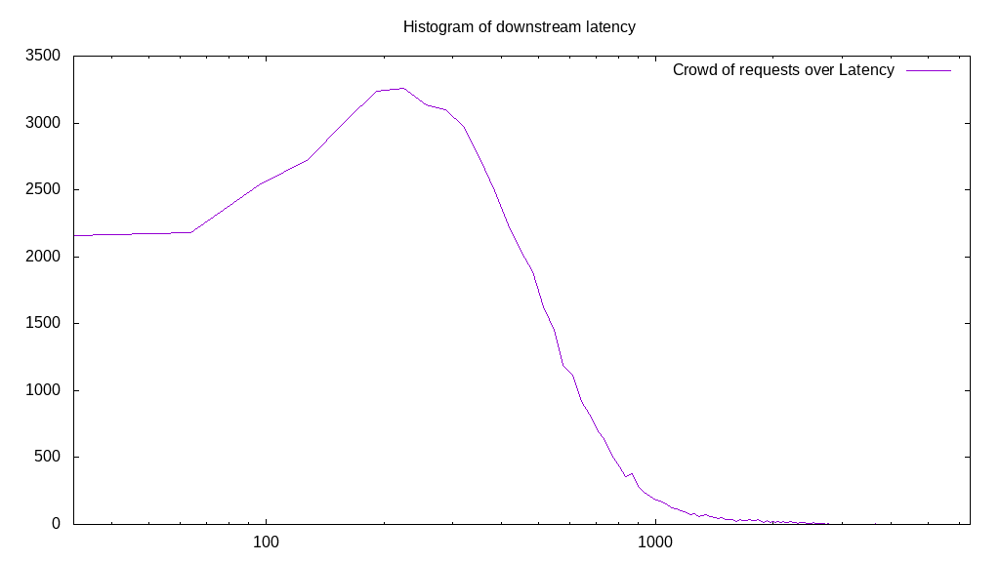
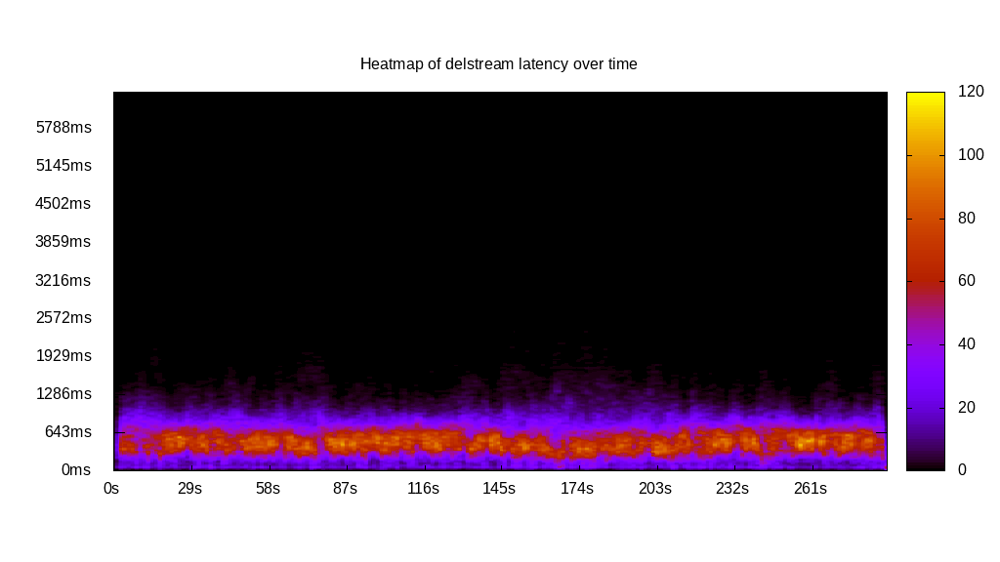
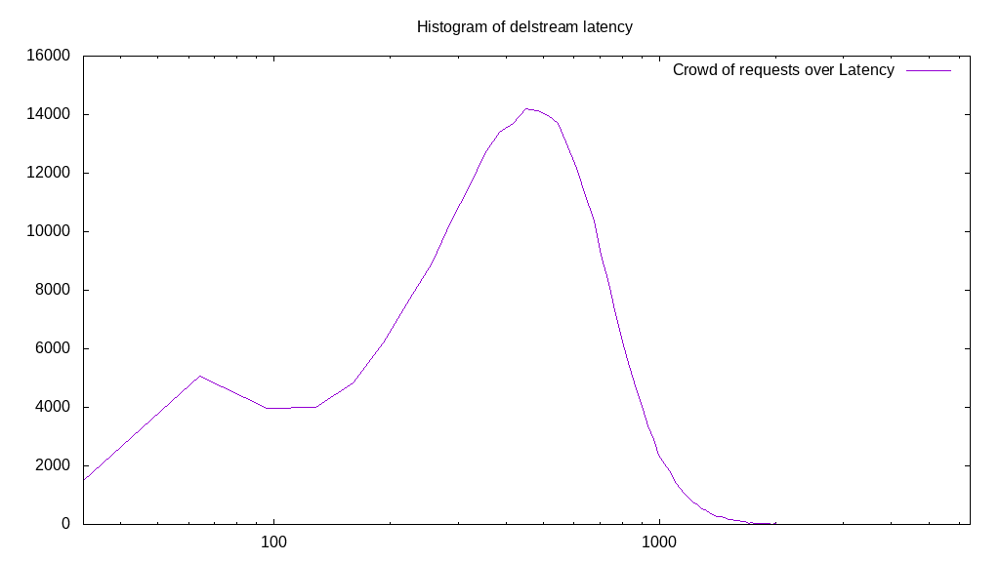

# Latency benchmark report. Crowd is 512

## Populate workload

## Object Size is 0.00kiB

### PUT Latency in ms over time

Evolution of PUT Latency over time

| Parameter | Value |
| --- | --- |
| Y Coordinate | PUT Latency in ms |
| X Coordinate | time in s since begining of workload |

### PUT Latency distribution in ms

Distribution of the PUT Latency in ms

| Parameter | Value |
| --- | --- |
| Y Coordinate | Number of PUT |
| X Coordinate | Latency in ms |
| Server volume | 0.000MiB|
| Server bandwidth | 0.000MiB/s |
| Server time | 300.00s |
| Server load | 511.17 |
| Server responses | 273935PUT |
| Server IOps | 913.13PUT/s |
| Client bandwidth | 0.000MiB/s |
| Client volume | 0.000MiB|
| Client time | 153347.49s |
| Client IOps |  1.79PUT/s  |
| Client Latency | 559.80ms/PUT |
| Client Limbo | 0.49ms/PUT |
| Crowd time | 153597.95s |
| Crowd efficiency | 99.84% |
| Highest Latency | 3023.12ms |
| 95th percentile Latency | 1125.63ms |
| 68th percentile Latency | 675.38ms |
| 50th percentile Latency | 546.73ms |
| 32nd percentile Latency | 450.25ms |
| 5th percentile Latency | 160.80ms |
| Lowest Latency | 32.16ms |

## Read workload

## Object Size is 0.00kiB

### GET Latency in ms over time

Evolution of GET Latency over time

| Parameter | Value |
| --- | --- |
| Y Coordinate | GET Latency in ms |
| X Coordinate | time in s since begining of workload |

### GET Latency distribution in ms

Distribution of the GET Latency in ms

| Parameter | Value |
| --- | --- |
| Y Coordinate | Number of GET |
| X Coordinate | Latency in ms |
| Server volume | 0.000MiB|
| Server bandwidth | 0.000MiB/s |
| Server time | 101.50s |
| Server load | 497.16 |
| Server responses | 144033GET |
| Server IOps | 1419.07GET/s |
| Client bandwidth | 0.000MiB/s |
| Client volume | 0.000MiB|
| Client time | 50460.91s |
| Client IOps |  2.85GET/s  |
| Client Latency | 350.34ms/GET |
| Client Limbo | 2.94ms/GET |
| Crowd time | 51966.98s |
| Crowd efficiency | 97.10% |
| Highest Latency | 3891.46ms |
| 95th percentile Latency | 1961.81ms |
| 68th percentile Latency | 257.29ms |
| 50th percentile Latency | 160.80ms |
| 32nd percentile Latency | 128.64ms |
| 5th percentile Latency | 64.32ms |
| Lowest Latency | 32.16ms |

## Mixed workload

## Object Size is 0.00kiB

### PUT Latency in ms over time

Evolution of PUT Latency over time

| Parameter | Value |
| --- | --- |
| Y Coordinate | PUT Latency in ms |
| X Coordinate | time in s since begining of workload |

### GET Latency in ms over time

Evolution of GET Latency over time

| Parameter | Value |
| --- | --- |
| Y Coordinate | GET Latency in ms |
| X Coordinate | time in s since begining of workload |

### PUT Latency distribution in ms

Distribution of the PUT Latency in ms

| Parameter | Value |
| --- | --- |
| Y Coordinate | Number of PUT |
| X Coordinate | Latency in ms |
| Server volume | 0.000MiB|
| Server bandwidth | 0.000MiB/s |
| Server time | 103.17s |
| Server load | 301.14 |
| Server responses | 53258PUT |
| Server IOps | 516.19PUT/s |
| Client bandwidth | 0.000MiB/s |
| Client volume | 0.000MiB|
| Client time | 31069.69s |
| Client IOps |  1.71PUT/s  |
| Client Latency | 583.38ms/PUT |
| Client Limbo | 42.49ms/PUT |
| Crowd time | 52825.60s |
| Crowd efficiency | 58.82% |
| Highest Latency | 3312.56ms |
| 95th percentile Latency | 1286.43ms |
| 68th percentile Latency | 707.54ms |
| 50th percentile Latency | 546.73ms |
| 32nd percentile Latency | 418.09ms |
| 5th percentile Latency | 160.80ms |
| Lowest Latency | 32.16ms |

### GET Latency distribution in ms

Distribution of the GET Latency in ms

| Parameter | Value |
| --- | --- |
| Y Coordinate | Number of GET |
| X Coordinate | Latency in ms |
| Server volume | 0.000MiB|
| Server bandwidth | 0.000MiB/s |
| Server time | 103.17s |
| Server load | 198.10 |
| Server responses | 53847GET |
| Server IOps | 521.90GET/s |
| Client bandwidth | 0.000MiB/s |
| Client volume | 0.000MiB|
| Client time | 20438.64s |
| Client IOps |  2.63GET/s  |
| Client Latency | 379.57ms/GET |
| Client Limbo | 63.26ms/GET |
| Crowd time | 52825.60s |
| Crowd efficiency | 38.69% |
| Highest Latency | 3666.33ms |
| 95th percentile Latency | 964.82ms |
| 68th percentile Latency | 450.25ms |
| 50th percentile Latency | 353.77ms |
| 32nd percentile Latency | 257.29ms |
| 5th percentile Latency | 64.32ms |
| Lowest Latency | 32.16ms |

## Cleanup workload

## Object Size is 0.00kiB

### DELETE Latency in ms over time

Evolution of DELETE Latency over time

| Parameter | Value |
| --- | --- |
| Y Coordinate | DELETE Latency in ms |
| X Coordinate | time in s since begining of workload |

### DELETE Latency distribution in ms

Distribution of the DELETE Latency in ms

| Parameter | Value |
| --- | --- |
| Y Coordinate | Number of DELETE |
| X Coordinate | Latency in ms |
| Server volume | 0.000MiB|
| Server bandwidth | 0.000MiB/s |
| Server time | 289.15s |
| Server load | 507.44 |
| Server responses | 273943DELETE |
| Server IOps | 947.40DELETE/s |
| Client bandwidth | 0.000MiB/s |
| Client volume | 0.000MiB|
| Client time | 146727.71s |
| Client IOps |  1.87DELETE/s  |
| Client Latency | 535.61ms/DELETE |
| Client Limbo | 2.57ms/DELETE |
| Crowd time | 148045.31s |
| Crowd efficiency | 99.11% |
| Highest Latency | 2605.03ms |
| 95th percentile Latency | 1061.31ms |
| 68th percentile Latency | 675.38ms |
| 50th percentile Latency | 546.73ms |
| 32nd percentile Latency | 418.09ms |
| 5th percentile Latency | 160.80ms |
| Lowest Latency | 32.16ms |

