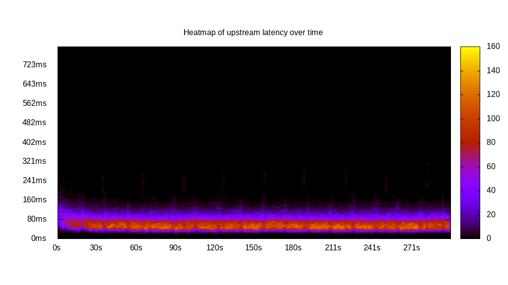
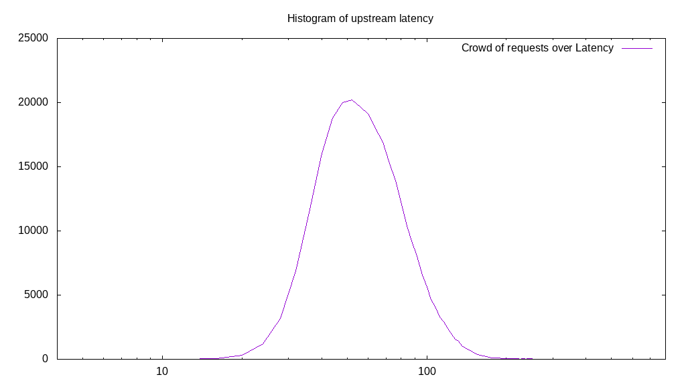
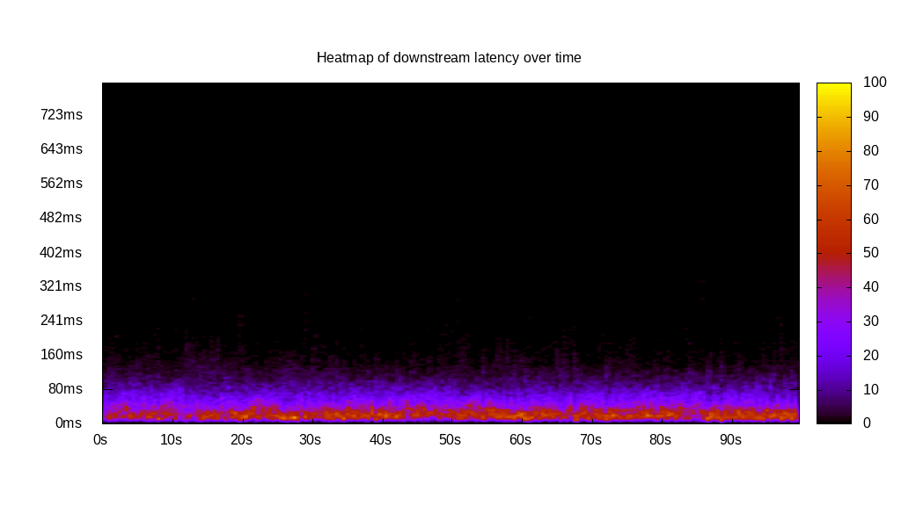
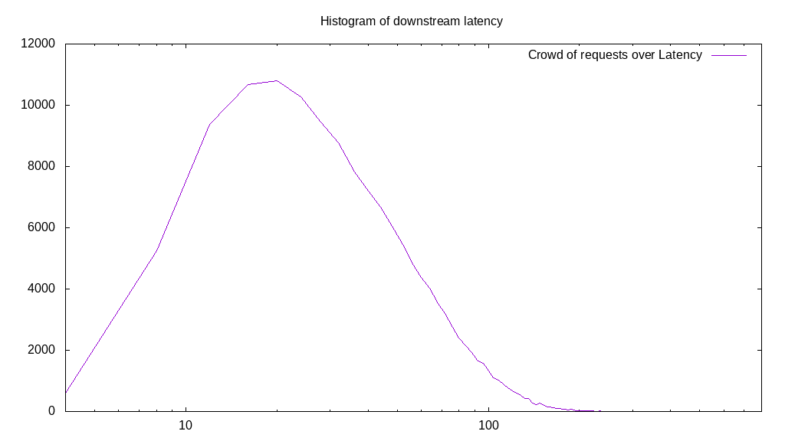
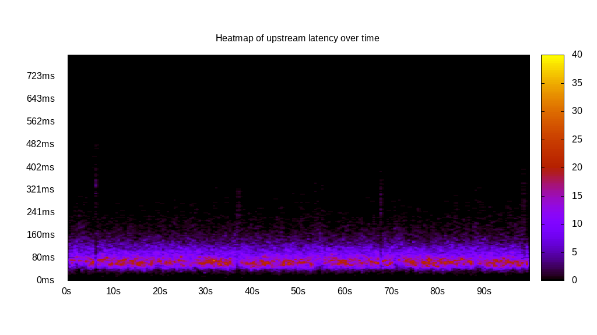
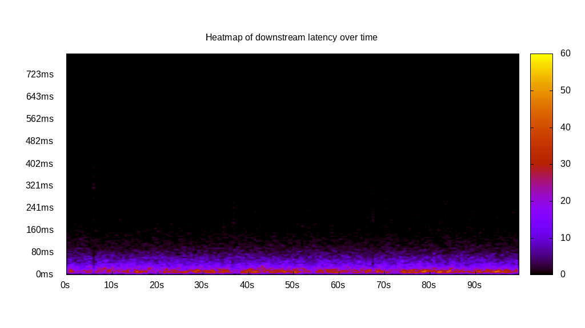
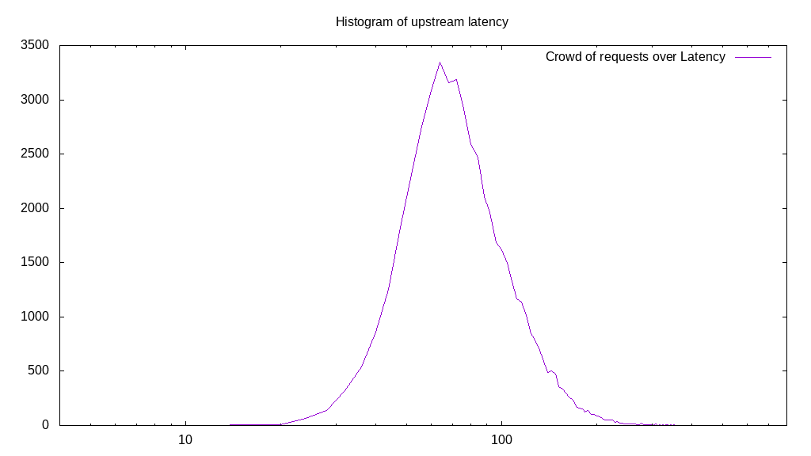
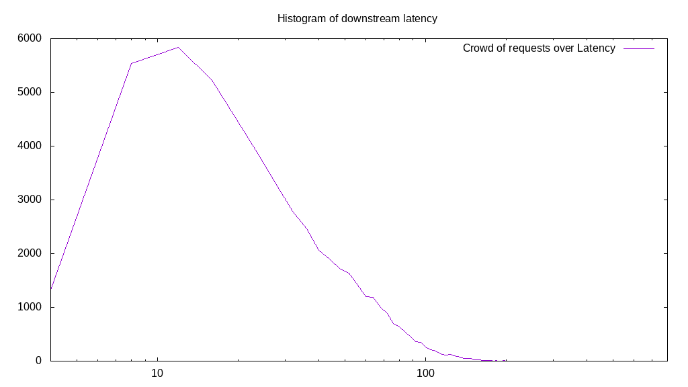
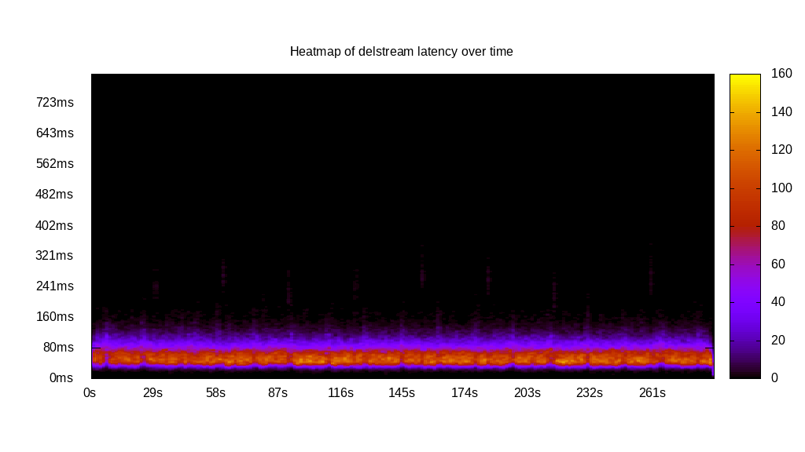
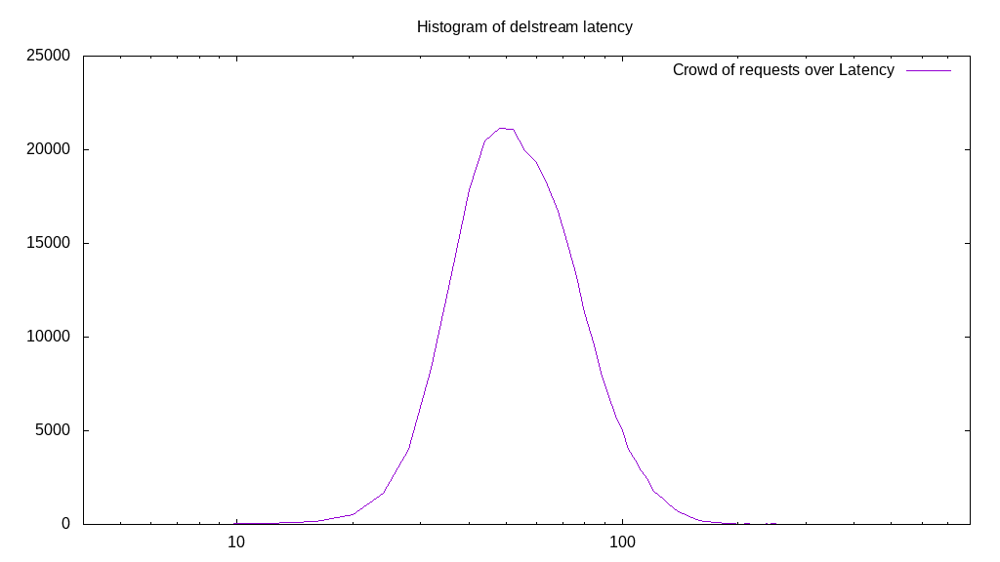

# Latency benchmark report. Crowd is 64

## Populate workload

## Object Size is 0.00kiB

### PUT Latency in ms over time

Evolution of PUT Latency over time

| Parameter | Value |
| --- | --- |
| Y Coordinate | PUT Latency in ms |
| X Coordinate | time in s since begining of workload |

### PUT Latency distribution in ms

Distribution of the PUT Latency in ms

| Parameter | Value |
| --- | --- |
| Y Coordinate | Number of PUT |
| X Coordinate | Latency in ms |
| Server volume | 0.000MiB|
| Server bandwidth | 0.000MiB/s |
| Server time | 300.00s |
| Server load | 63.89 |
| Server responses | 281550PUT |
| Server IOps | 938.50PUT/s |
| Client bandwidth | 0.000MiB/s |
| Client volume | 0.000MiB|
| Client time | 19166.00s |
| Client IOps |  14.69PUT/s  |
| Client Latency | 68.07ms/PUT |
| Client Limbo | 0.53ms/PUT |
| Crowd time | 19200.00s |
| Crowd efficiency | 99.82% |
| Highest Latency | 410.05ms |
| 95th percentile Latency | 120.60ms |
| 68th percentile Latency | 80.40ms |
| 50th percentile Latency | 68.34ms |
| 32nd percentile Latency | 56.28ms |
| 5th percentile Latency | 40.20ms |
| Lowest Latency | 12.06ms |

## Read workload

## Object Size is 0.00kiB

### GET Latency in ms over time

Evolution of GET Latency over time

| Parameter | Value |
| --- | --- |
| Y Coordinate | GET Latency in ms |
| X Coordinate | time in s since begining of workload |

### GET Latency distribution in ms

Distribution of the GET Latency in ms

| Parameter | Value |
| --- | --- |
| Y Coordinate | Number of GET |
| X Coordinate | Latency in ms |
| Server volume | 0.000MiB|
| Server bandwidth | 0.000MiB/s |
| Server time | 100.11s |
| Server load | 63.70 |
| Server responses | 140843GET |
| Server IOps | 1406.95GET/s |
| Client bandwidth | 0.000MiB/s |
| Client volume | 0.000MiB|
| Client time | 6377.15s |
| Client IOps |  22.09GET/s  |
| Client Latency | 45.28ms/GET |
| Client Limbo | 0.46ms/GET |
| Crowd time | 6406.72s |
| Crowd efficiency | 99.54% |
| Highest Latency | 385.93ms |
| 95th percentile Latency | 112.56ms |
| 68th percentile Latency | 56.28ms |
| 50th percentile Latency | 40.20ms |
| 32nd percentile Latency | 28.14ms |
| 5th percentile Latency | 16.08ms |
| Lowest Latency | 4.02ms |

## Mixed workload

## Object Size is 0.00kiB

### PUT Latency in ms over time

Evolution of PUT Latency over time

| Parameter | Value |
| --- | --- |
| Y Coordinate | PUT Latency in ms |
| X Coordinate | time in s since begining of workload |

### GET Latency in ms over time

Evolution of GET Latency over time

| Parameter | Value |
| --- | --- |
| Y Coordinate | GET Latency in ms |
| X Coordinate | time in s since begining of workload |

### PUT Latency distribution in ms

Distribution of the PUT Latency in ms

| Parameter | Value |
| --- | --- |
| Y Coordinate | Number of PUT |
| X Coordinate | Latency in ms |
| Server volume | 0.000MiB|
| Server bandwidth | 0.000MiB/s |
| Server time | 100.16s |
| Server load | 45.49 |
| Server responses | 52015PUT |
| Server IOps | 519.30PUT/s |
| Client bandwidth | 0.000MiB/s |
| Client volume | 0.000MiB|
| Client time | 4556.39s |
| Client IOps |  11.42PUT/s  |
| Client Latency | 87.60ms/PUT |
| Client Limbo | 28.97ms/PUT |
| Crowd time | 6410.50s |
| Crowd efficiency | 71.08% |
| Highest Latency | 482.41ms |
| 95th percentile Latency | 160.80ms |
| 68th percentile Latency | 100.50ms |
| 50th percentile Latency | 84.42ms |
| 32nd percentile Latency | 72.36ms |
| 5th percentile Latency | 48.24ms |
| Lowest Latency | 12.06ms |

### GET Latency distribution in ms

Distribution of the GET Latency in ms

| Parameter | Value |
| --- | --- |
| Y Coordinate | Number of GET |
| X Coordinate | Latency in ms |
| Server volume | 0.000MiB|
| Server bandwidth | 0.000MiB/s |
| Server time | 100.16s |
| Server load | 18.30 |
| Server responses | 52538GET |
| Server IOps | 524.52GET/s |
| Client bandwidth | 0.000MiB/s |
| Client volume | 0.000MiB|
| Client time | 1833.33s |
| Client IOps |  28.66GET/s  |
| Client Latency | 34.90ms/GET |
| Client Limbo | 71.52ms/GET |
| Crowd time | 6410.50s |
| Crowd efficiency | 28.60% |
| Highest Latency | 385.93ms |
| 95th percentile Latency | 92.46ms |
| 68th percentile Latency | 44.22ms |
| 50th percentile Latency | 32.16ms |
| 32nd percentile Latency | 20.10ms |
| 5th percentile Latency | 12.06ms |
| Lowest Latency | 4.02ms |

## Cleanup workload

## Object Size is 0.00kiB

### DELETE Latency in ms over time

Evolution of DELETE Latency over time

| Parameter | Value |
| --- | --- |
| Y Coordinate | DELETE Latency in ms |
| X Coordinate | time in s since begining of workload |

### DELETE Latency distribution in ms

Distribution of the DELETE Latency in ms

| Parameter | Value |
| --- | --- |
| Y Coordinate | Number of DELETE |
| X Coordinate | Latency in ms |
| Server volume | 0.000MiB|
| Server bandwidth | 0.000MiB/s |
| Server time | 289.44s |
| Server load | 63.73 |
| Server responses | 281558DELETE |
| Server IOps | 972.76DELETE/s |
| Client bandwidth | 0.000MiB/s |
| Client volume | 0.000MiB|
| Client time | 18446.65s |
| Client IOps |  15.26DELETE/s  |
| Client Latency | 65.52ms/DELETE |
| Client Limbo | 1.21ms/DELETE |
| Crowd time | 18524.22s |
| Crowd efficiency | 99.58% |
| Highest Latency | 357.79ms |
| 95th percentile Latency | 116.58ms |
| 68th percentile Latency | 76.38ms |
| 50th percentile Latency | 64.32ms |
| 32nd percentile Latency | 56.28ms |
| 5th percentile Latency | 36.18ms |
| Lowest Latency | 8.04ms |

