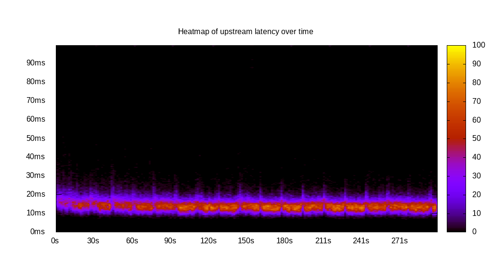
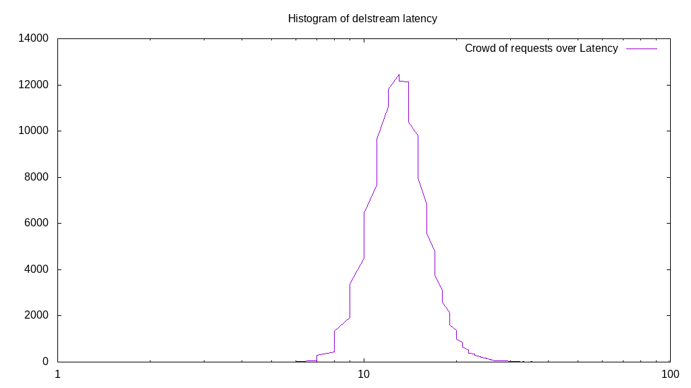

# Latency benchmark report. Crowd is 8

## Populate workload

## Object Size is 0.00kiB

### PUT Latency in ms over time

Evolution of PUT Latency over time

| Parameter | Value |
| --- | --- |
| Y Coordinate | PUT Latency in ms |
| X Coordinate | time in s since begining of workload |

### PUT Latency distribution in ms

Distribution of the PUT Latency in ms

| Parameter | Value |
| --- | --- |
| Y Coordinate | Number of PUT |
| X Coordinate | Latency in ms |
| Server volume | 0.000MiB|
| Server bandwidth | 0.000MiB/s |
| Server time | 300.00s |
| Server load | 7.93 |
| Server responses | 160993PUT |
| Server IOps | 536.65PUT/s |
| Client bandwidth | 0.000MiB/s |
| Client volume | 0.000MiB|
| Client time | 2379.42s |
| Client IOps |  67.66PUT/s  |
| Client Latency | 14.78ms/PUT |
| Client Limbo | 2.57ms/PUT |
| Crowd time | 2399.96s |
| Crowd efficiency | 99.14% |
| Highest Latency | 100.00ms |
| 95th percentile Latency | 21.11ms |
| 68th percentile Latency | 16.08ms |
| 50th percentile Latency | 14.57ms |
| 32nd percentile Latency | 13.57ms |
| 5th percentile Latency | 10.55ms |
| Lowest Latency | 6.53ms |

## Read workload

## Object Size is 0.00kiB

### GET Latency in ms over time

Evolution of GET Latency over time

| Parameter | Value |
| --- | --- |
| Y Coordinate | GET Latency in ms |
| X Coordinate | time in s since begining of workload |

### GET Latency distribution in ms

Distribution of the GET Latency in ms

| Parameter | Value |
| --- | --- |
| Y Coordinate | Number of GET |
| X Coordinate | Latency in ms |
| Server volume | 0.000MiB|
| Server bandwidth | 0.000MiB/s |
| Server time | 100.01s |
| Server load | 7.89 |
| Server responses | 106836GET |
| Server IOps | 1068.24GET/s |
| Client bandwidth | 0.000MiB/s |
| Client volume | 0.000MiB|
| Client time | 789.13s |
| Client IOps |  135.38GET/s  |
| Client Latency | 7.39ms/GET |
| Client Limbo | 1.37ms/GET |
| Crowd time | 800.09s |
| Crowd efficiency | 98.63% |
| Highest Latency | 48.74ms |
| 95th percentile Latency | 12.56ms |
| 68th percentile Latency | 8.54ms |
| 50th percentile Latency | 7.54ms |
| 32nd percentile Latency | 6.53ms |
| 5th percentile Latency | 5.03ms |
| Lowest Latency | 2.51ms |

## Mixed workload

## Object Size is 0.00kiB

### PUT Latency in ms over time

Evolution of PUT Latency over time

| Parameter | Value |
| --- | --- |
| Y Coordinate | PUT Latency in ms |
| X Coordinate | time in s since begining of workload |

### GET Latency in ms over time

Evolution of GET Latency over time

| Parameter | Value |
| --- | --- |
| Y Coordinate | GET Latency in ms |
| X Coordinate | time in s since begining of workload |

### PUT Latency distribution in ms

Distribution of the PUT Latency in ms

| Parameter | Value |
| --- | --- |
| Y Coordinate | Number of PUT |
| X Coordinate | Latency in ms |
| Server volume | 0.000MiB|
| Server bandwidth | 0.000MiB/s |
| Server time | 100.00s |
| Server load | 5.57 |
| Server responses | 33377PUT |
| Server IOps | 333.75PUT/s |
| Client bandwidth | 0.000MiB/s |
| Client volume | 0.000MiB|
| Client time | 556.95s |
| Client IOps |  59.93PUT/s  |
| Client Latency | 16.69ms/PUT |
| Client Limbo | 30.39ms/PUT |
| Crowd time | 800.04s |
| Crowd efficiency | 69.61% |
| Highest Latency | 100.00ms |
| 95th percentile Latency | 24.12ms |
| 68th percentile Latency | 18.09ms |
| 50th percentile Latency | 16.58ms |
| 32nd percentile Latency | 15.08ms |
| 5th percentile Latency | 11.56ms |
| Lowest Latency | 6.53ms |

### GET Latency distribution in ms

Distribution of the GET Latency in ms

| Parameter | Value |
| --- | --- |
| Y Coordinate | Number of GET |
| X Coordinate | Latency in ms |
| Server volume | 0.000MiB|
| Server bandwidth | 0.000MiB/s |
| Server time | 100.00s |
| Server load | 2.35 |
| Server responses | 33709GET |
| Server IOps | 337.07GET/s |
| Client bandwidth | 0.000MiB/s |
| Client volume | 0.000MiB|
| Client time | 235.28s |
| Client IOps |  143.27GET/s  |
| Client Latency | 6.98ms/GET |
| Client Limbo | 70.60ms/GET |
| Crowd time | 800.04s |
| Crowd efficiency | 29.41% |
| Highest Latency | 30.15ms |
| 95th percentile Latency | 11.56ms |
| 68th percentile Latency | 8.04ms |
| 50th percentile Latency | 7.04ms |
| 32nd percentile Latency | 6.03ms |
| 5th percentile Latency | 5.03ms |
| Lowest Latency | 2.51ms |

## Cleanup workload

## Object Size is 0.00kiB

### DELETE Latency in ms over time

Evolution of DELETE Latency over time

| Parameter | Value |
| --- | --- |
| Y Coordinate | DELETE Latency in ms |
| X Coordinate | time in s since begining of workload |

### DELETE Latency distribution in ms

Distribution of the DELETE Latency in ms

| Parameter | Value |
| --- | --- |
| Y Coordinate | Number of DELETE |
| X Coordinate | Latency in ms |
| Server volume | 0.000MiB|
| Server bandwidth | 0.000MiB/s |
| Server time | 287.24s |
| Server load | 7.92 |
| Server responses | 161001DELETE |
| Server IOps | 560.51DELETE/s |
| Client bandwidth | 0.000MiB/s |
| Client volume | 0.000MiB|
| Client time | 2274.69s |
| Client IOps |  70.78DELETE/s  |
| Client Latency | 14.13ms/DELETE |
| Client Limbo | 2.90ms/DELETE |
| Crowd time | 2297.92s |
| Crowd efficiency | 98.99% |
| Highest Latency | 100.00ms |
| 95th percentile Latency | 20.10ms |
| 68th percentile Latency | 15.58ms |
| 50th percentile Latency | 14.07ms |
| 32nd percentile Latency | 13.07ms |
| 5th percentile Latency | 10.55ms |
| Lowest Latency | 4.52ms |

