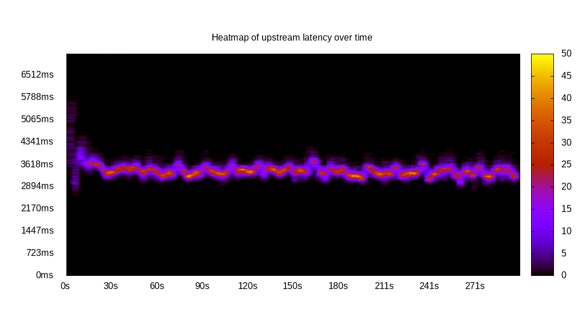
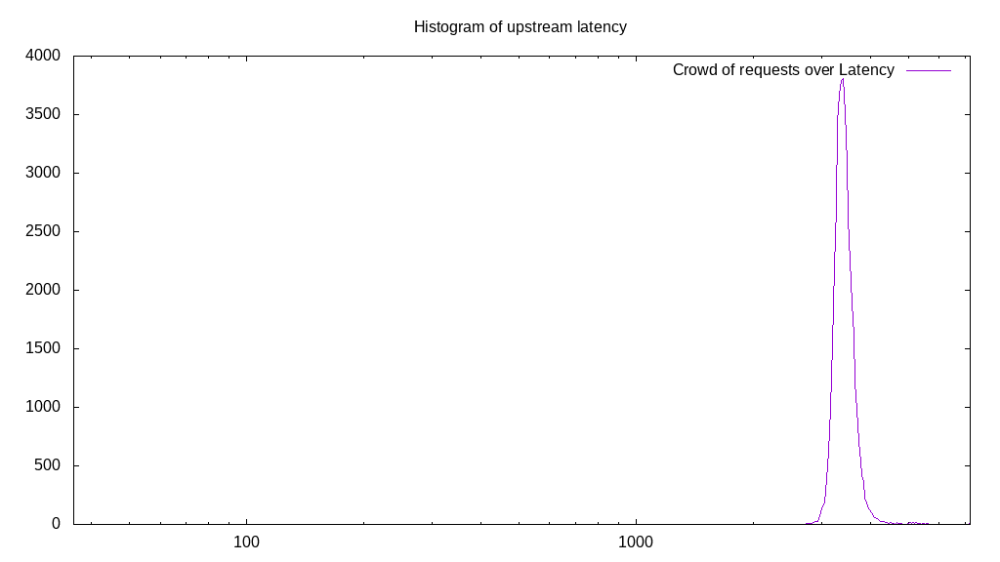
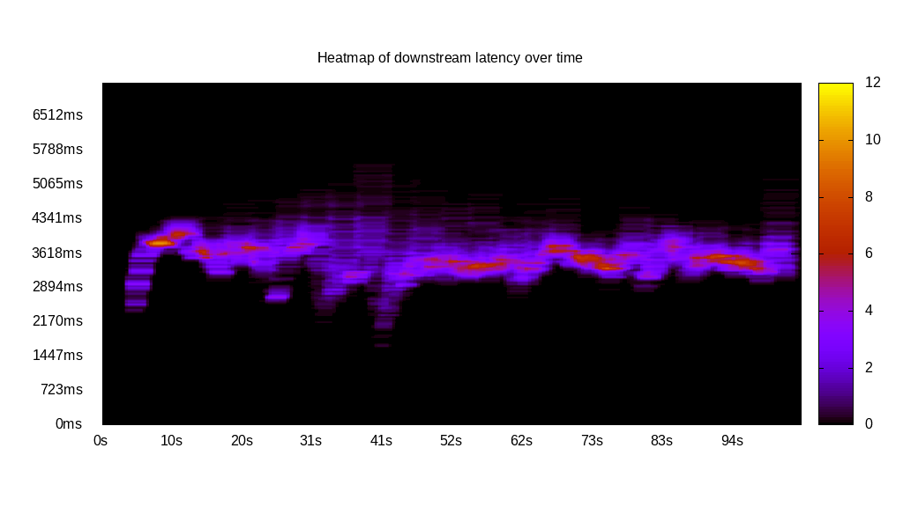
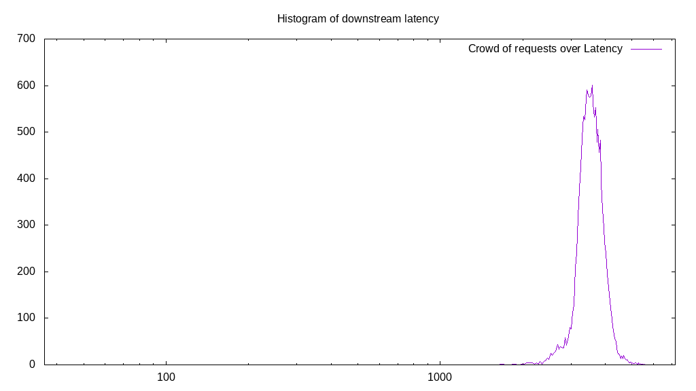
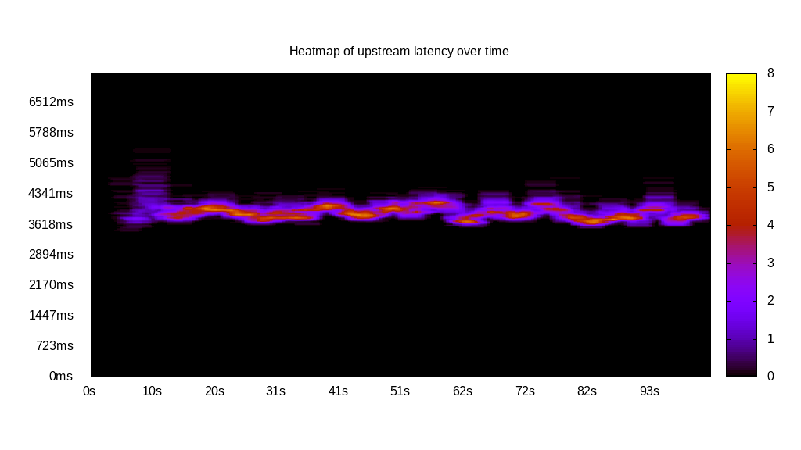
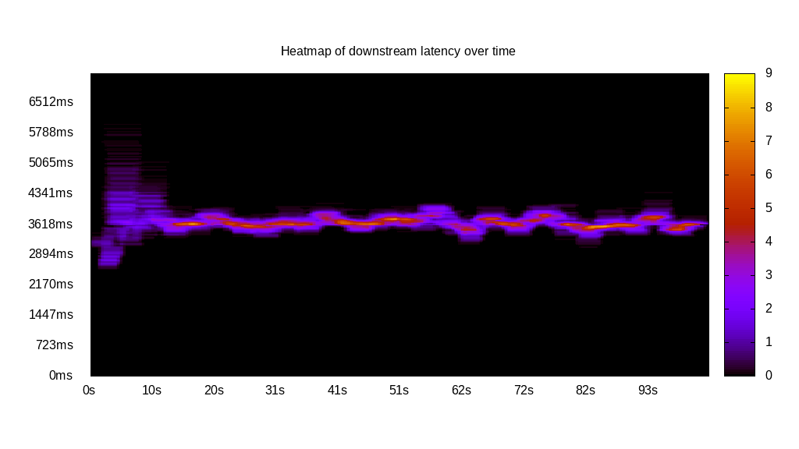
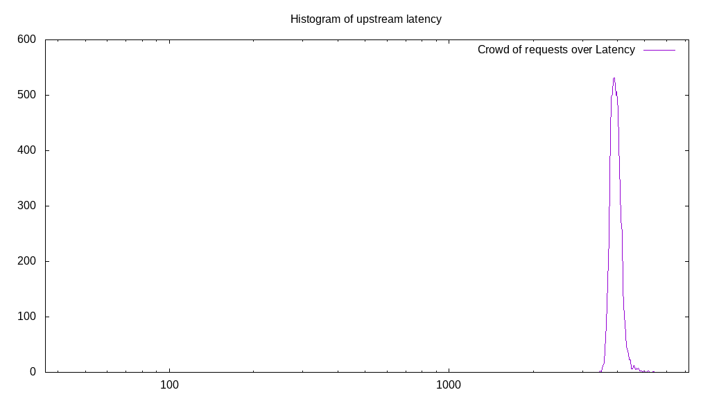
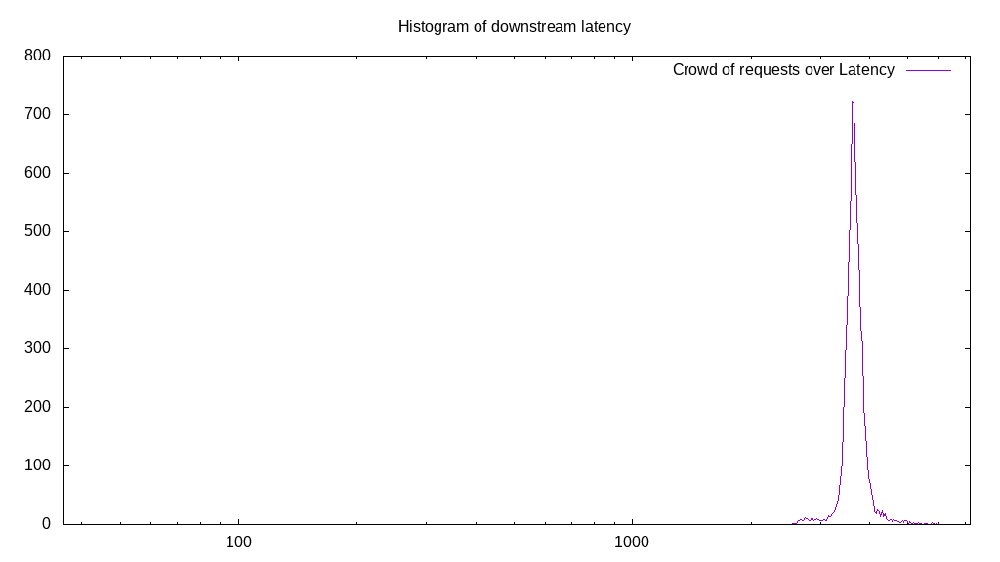
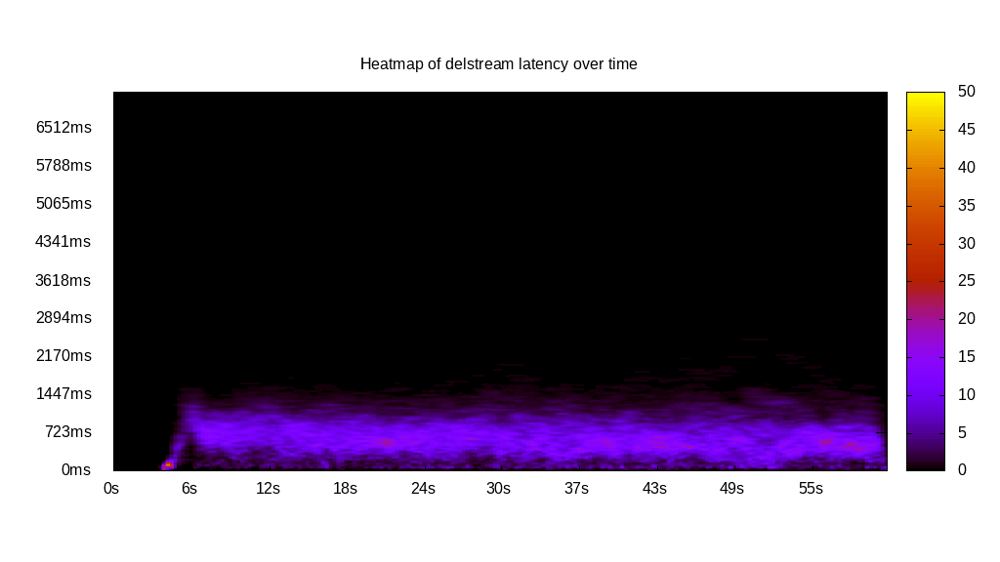
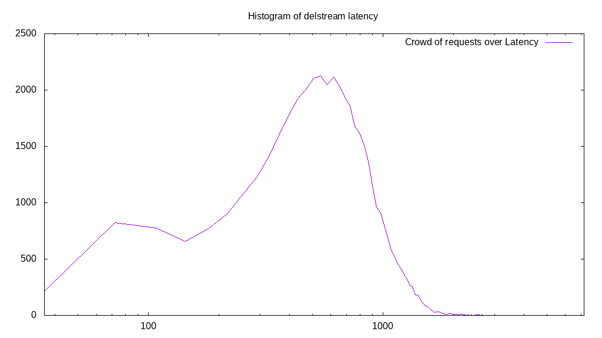

# Latency benchmark report. Crowd is 512

## Populate workload

## Object Size is 1024.00kiB

### PUT Latency in ms over time

Evolution of PUT Latency over time

| Parameter | Value |
| --- | --- |
| Y Coordinate | PUT Latency in ms |
| X Coordinate | time in s since begining of workload |

### PUT Latency distribution in ms

Distribution of the PUT Latency in ms

| Parameter | Value |
| --- | --- |
| Y Coordinate | Number of PUT |
| X Coordinate | Latency in ms |
| Server volume | 44353.000MiB|
| Server bandwidth | 147.846MiB/s |
| Server time | 299.99s |
| Server load | 508.78 |
| Server responses | 44353PUT |
| Server IOps | 147.85PUT/s |
| Client bandwidth | 0.289MiB/s |
| Client volume | 86.627MiB|
| Client time | 152630.72s |
| Client IOps |  0.29PUT/s  |
| Client Latency | 3441.27ms/PUT |
| Client Limbo | 1.89ms/PUT |
| Crowd time | 153596.93s |
| Crowd efficiency | 99.37% |
| Highest Latency | 7200.00ms |
| 95th percentile Latency | 3835.18ms |
| 68th percentile Latency | 3509.55ms |
| 50th percentile Latency | 3437.19ms |
| 32nd percentile Latency | 3364.82ms |
| 5th percentile Latency | 3183.92ms |
| Lowest Latency | 2605.03ms |

## Read workload

## Object Size is 1024.00kiB

### GET Latency in ms over time

Evolution of GET Latency over time

| Parameter | Value |
| --- | --- |
| Y Coordinate | GET Latency in ms |
| X Coordinate | time in s since begining of workload |

### GET Latency distribution in ms

Distribution of the GET Latency in ms

| Parameter | Value |
| --- | --- |
| Y Coordinate | Number of GET |
| X Coordinate | Latency in ms |
| Server volume | 14075.000MiB|
| Server bandwidth | 134.985MiB/s |
| Server time | 104.27s |
| Server load | 483.65 |
| Server responses | 14075GET |
| Server IOps | 134.98GET/s |
| Client bandwidth | 0.264MiB/s |
| Client volume | 27.490MiB|
| Client time | 50430.31s |
| Client IOps |  0.28GET/s  |
| Client Latency | 3582.97ms/GET |
| Client Limbo | 5.77ms/GET |
| Crowd time | 53386.75s |
| Crowd efficiency | 94.46% |
| Highest Latency | 5571.86ms |
| 95th percentile Latency | 4233.17ms |
| 68th percentile Latency | 3762.81ms |
| 50th percentile Latency | 3618.09ms |
| 32nd percentile Latency | 3437.19ms |
| 5th percentile Latency | 3075.38ms |
| Lowest Latency | 1664.32ms |

## Mixed workload

## Object Size is 1024.00kiB

### PUT Latency in ms over time

Evolution of PUT Latency over time

| Parameter | Value |
| --- | --- |
| Y Coordinate | PUT Latency in ms |
| X Coordinate | time in s since begining of workload |

### GET Latency in ms over time

Evolution of GET Latency over time

| Parameter | Value |
| --- | --- |
| Y Coordinate | GET Latency in ms |
| X Coordinate | time in s since begining of workload |

### PUT Latency distribution in ms

Distribution of the PUT Latency in ms

| Parameter | Value |
| --- | --- |
| Y Coordinate | Number of PUT |
| X Coordinate | Latency in ms |
| Server volume | 6309.000MiB|
| Server bandwidth | 61.271MiB/s |
| Server time | 102.97s |
| Server load | 242.49 |
| Server responses | 6309PUT |
| Server IOps | 61.27PUT/s |
| Client bandwidth | 0.120MiB/s |
| Client volume | 12.322MiB|
| Client time | 24969.04s |
| Client IOps |  0.25PUT/s  |
| Client Latency | 3957.69ms/PUT |
| Client Limbo | 54.20ms/PUT |
| Crowd time | 52719.62s |
| Crowd efficiency | 47.36% |
| Highest Latency | 5427.14ms |
| 95th percentile Latency | 4305.53ms |
| 68th percentile Latency | 4052.26ms |
| 50th percentile Latency | 3979.90ms |
| 32nd percentile Latency | 3907.54ms |
| 5th percentile Latency | 3726.63ms |
| Lowest Latency | 3473.37ms |

### GET Latency distribution in ms

Distribution of the GET Latency in ms

| Parameter | Value |
| --- | --- |
| Y Coordinate | Number of GET |
| X Coordinate | Latency in ms |
| Server volume | 6919.000MiB|
| Server bandwidth | 67.196MiB/s |
| Server time | 102.97s |
| Server load | 247.50 |
| Server responses | 6919GET |
| Server IOps | 67.20GET/s |
| Client bandwidth | 0.131MiB/s |
| Client volume | 13.514MiB|
| Client time | 25484.90s |
| Client IOps |  0.27GET/s  |
| Client Latency | 3683.32ms/GET |
| Client Limbo | 53.19ms/GET |
| Crowd time | 52719.62s |
| Crowd efficiency | 48.34% |
| Highest Latency | 6006.03ms |
| 95th percentile Latency | 4088.44ms |
| 68th percentile Latency | 3762.81ms |
| 50th percentile Latency | 3690.45ms |
| 32nd percentile Latency | 3618.09ms |
| 5th percentile Latency | 3437.19ms |
| Lowest Latency | 2568.84ms |

## Cleanup workload

## Object Size is 1024.00kiB

### DELETE Latency in ms over time

Evolution of DELETE Latency over time

| Parameter | Value |
| --- | --- |
| Y Coordinate | DELETE Latency in ms |
| X Coordinate | time in s since begining of workload |

### DELETE Latency distribution in ms

Distribution of the DELETE Latency in ms

| Parameter | Value |
| --- | --- |
| Y Coordinate | Number of DELETE |
| X Coordinate | Latency in ms |
| Server volume | 44361.000MiB|
| Server bandwidth | 720.123MiB/s |
| Server time | 61.60s |
| Server load | 460.87 |
| Server responses | 44361DELETE |
| Server IOps | 720.12DELETE/s |
| Client bandwidth | 1.406MiB/s |
| Client volume | 86.643MiB|
| Client time | 28390.52s |
| Client IOps |  1.56DELETE/s  |
| Client Latency | 639.99ms/DELETE |
| Client Limbo | 6.15ms/DELETE |
| Crowd time | 31540.22s |
| Crowd efficiency | 90.01% |
| Highest Latency | 3509.55ms |
| 95th percentile Latency | 1266.33ms |
| 68th percentile Latency | 795.98ms |
| 50th percentile Latency | 651.26ms |
| 32nd percentile Latency | 506.53ms |
| 5th percentile Latency | 180.90ms |
| Lowest Latency | 36.18ms |

