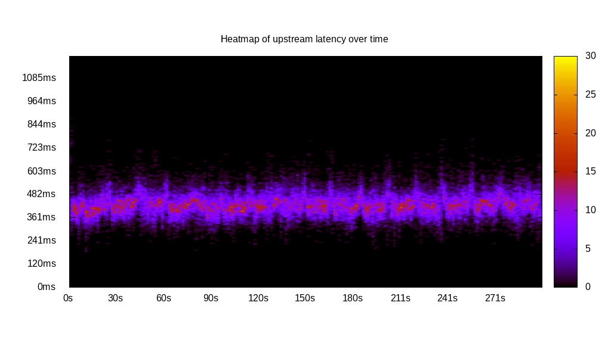
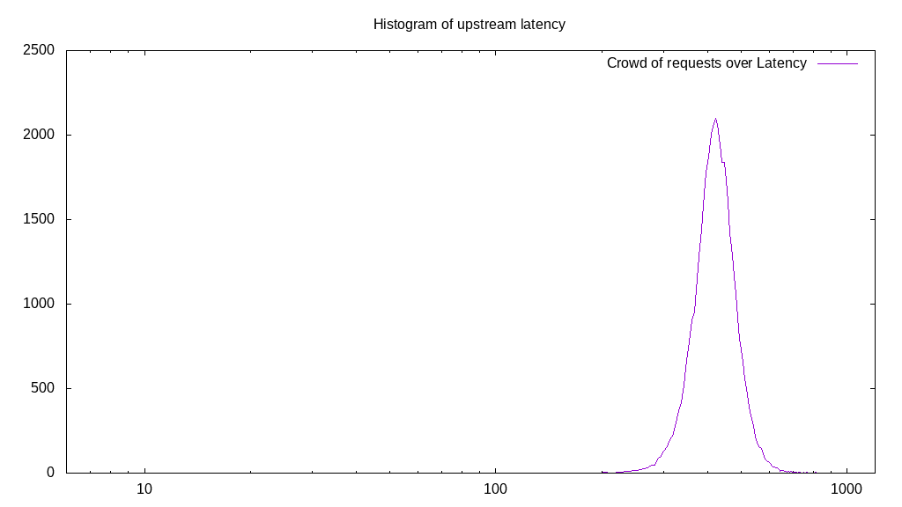
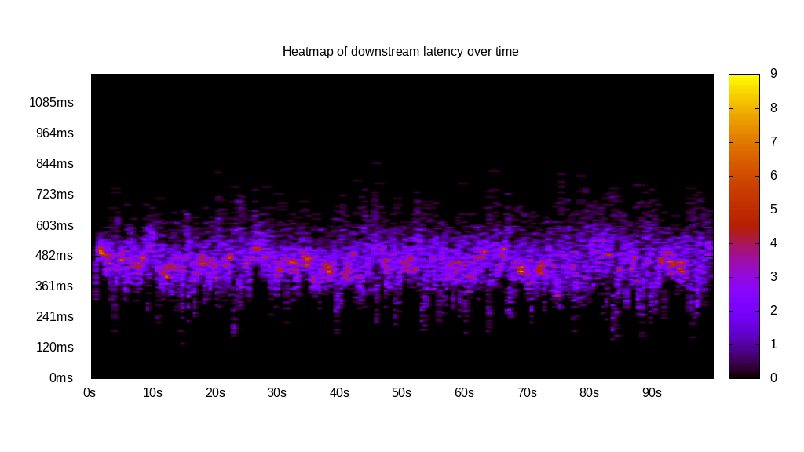
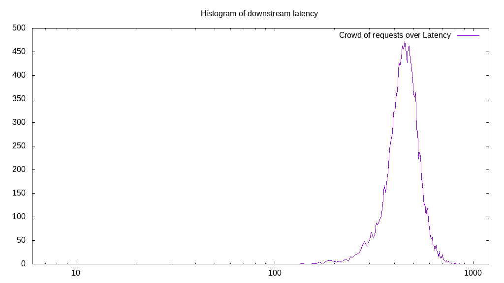
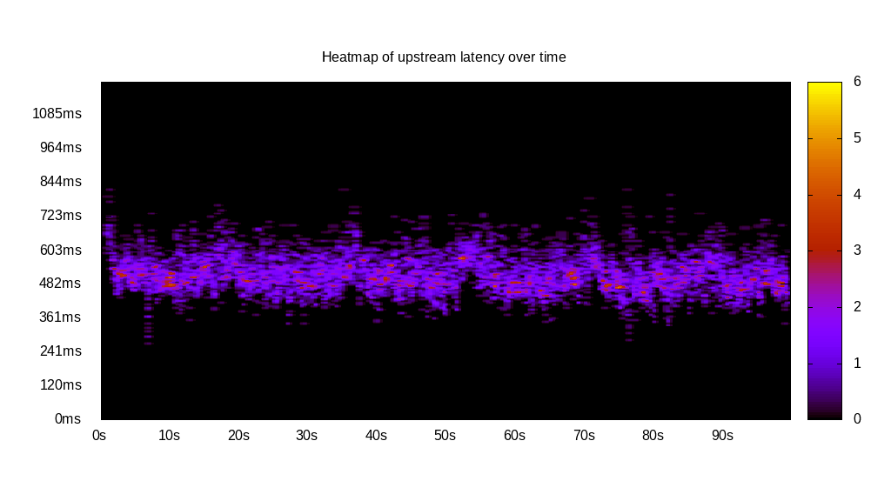
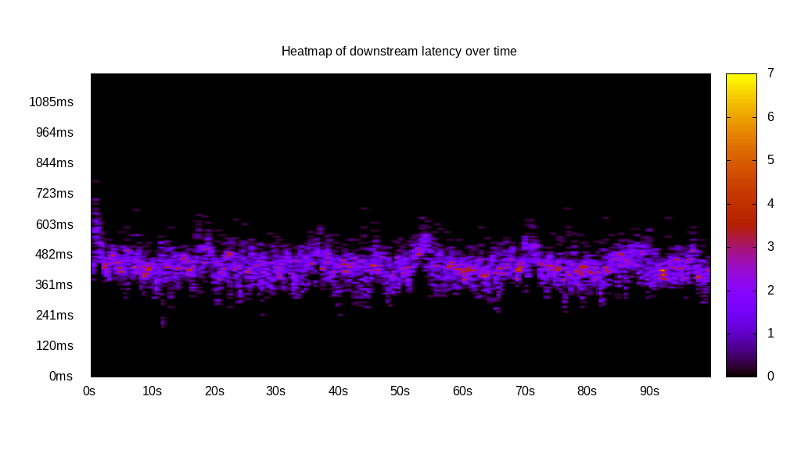
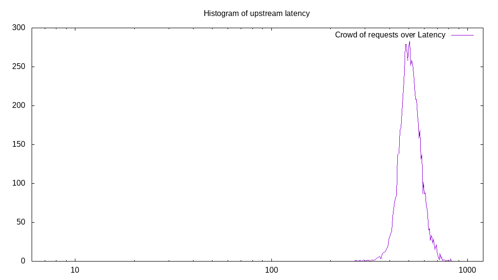
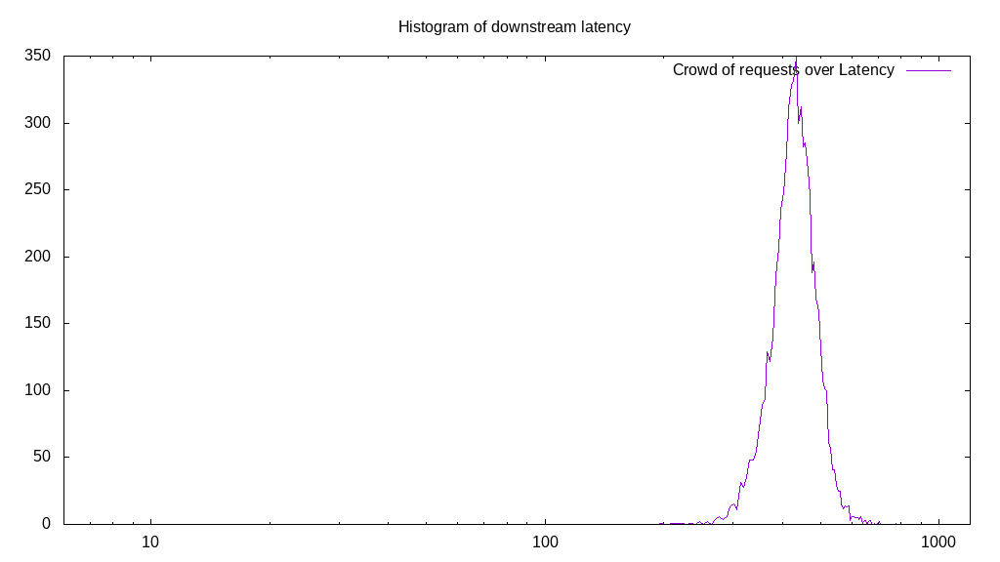
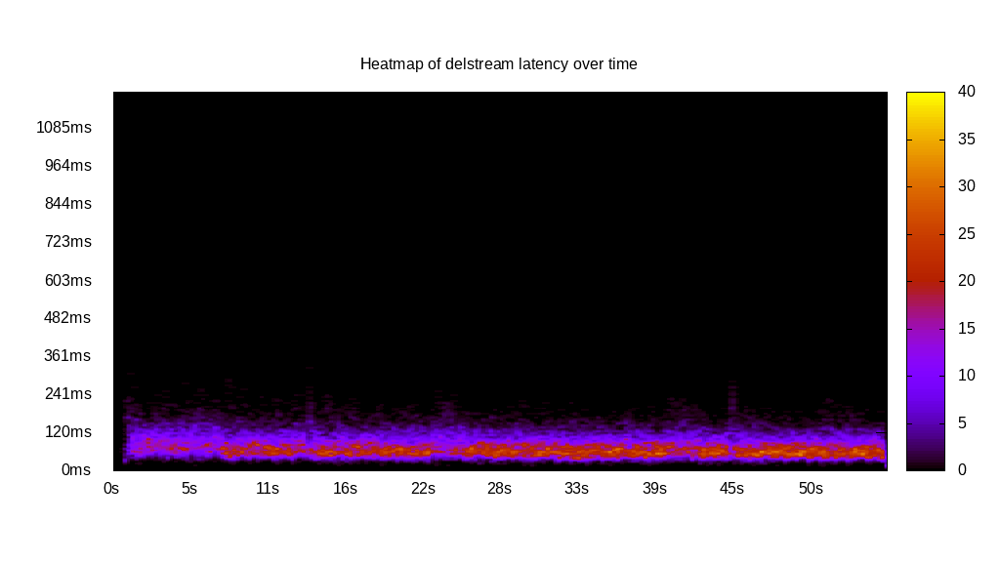
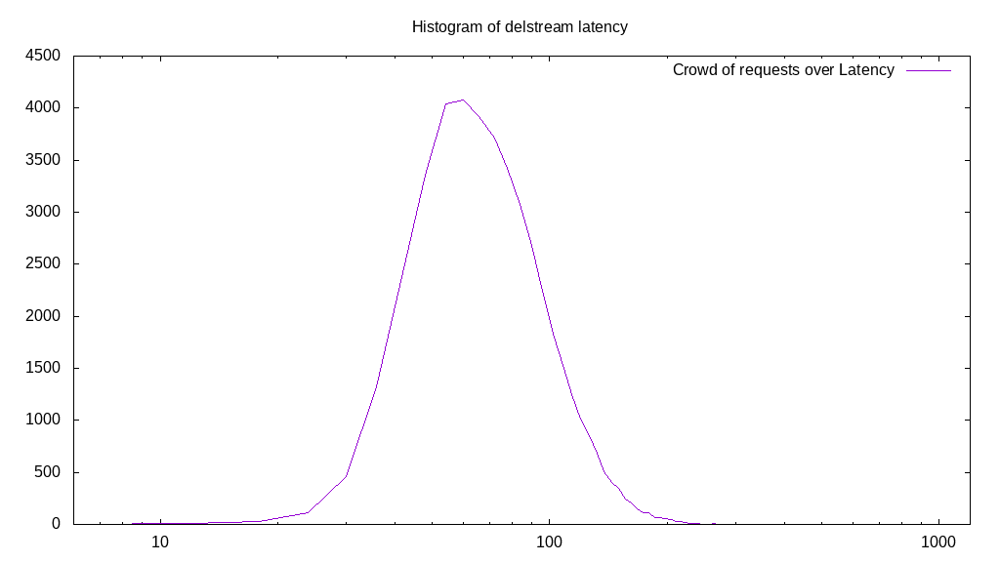

# Latency benchmark report. Crowd is 64

## Populate workload

## Object Size is 1024.00kiB

### PUT Latency in ms over time

Evolution of PUT Latency over time

| Parameter | Value |
| --- | --- |
| Y Coordinate | PUT Latency in ms |
| X Coordinate | time in s since begining of workload |

### PUT Latency distribution in ms

Distribution of the PUT Latency in ms

| Parameter | Value |
| --- | --- |
| Y Coordinate | Number of PUT |
| X Coordinate | Latency in ms |
| Server volume | 44455.000MiB|
| Server bandwidth | 148.179MiB/s |
| Server time | 300.01s |
| Server load | 63.91 |
| Server responses | 44455PUT |
| Server IOps | 148.18PUT/s |
| Client bandwidth | 2.315MiB/s |
| Client volume | 694.609MiB|
| Client time | 19172.69s |
| Client IOps |  2.32PUT/s  |
| Client Latency | 431.28ms/PUT |
| Client Limbo | 0.43ms/PUT |
| Crowd time | 19200.51s |
| Crowd efficiency | 99.86% |
| Highest Latency | 880.40ms |
| 95th percentile Latency | 536.68ms |
| 68th percentile Latency | 458.29ms |
| 50th percentile Latency | 434.17ms |
| 32nd percentile Latency | 410.05ms |
| 5th percentile Latency | 349.75ms |
| Lowest Latency | 186.93ms |

## Read workload

## Object Size is 1024.00kiB

### GET Latency in ms over time

Evolution of GET Latency over time

| Parameter | Value |
| --- | --- |
| Y Coordinate | GET Latency in ms |
| X Coordinate | time in s since begining of workload |

### GET Latency distribution in ms

Distribution of the GET Latency in ms

| Parameter | Value |
| --- | --- |
| Y Coordinate | Number of GET |
| X Coordinate | Latency in ms |
| Server volume | 13822.000MiB|
| Server bandwidth | 137.400MiB/s |
| Server time | 100.60s |
| Server load | 63.36 |
| Server responses | 13822GET |
| Server IOps | 137.40GET/s |
| Client bandwidth | 2.147MiB/s |
| Client volume | 215.969MiB|
| Client time | 6374.22s |
| Client IOps |  2.17GET/s  |
| Client Latency | 461.16ms/GET |
| Client Limbo | 1.00ms/GET |
| Crowd time | 6438.21s |
| Crowd efficiency | 99.01% |
| Highest Latency | 850.25ms |
| 95th percentile Latency | 603.02ms |
| 68th percentile Latency | 500.50ms |
| 50th percentile Latency | 464.32ms |
| 32nd percentile Latency | 434.17ms |
| 5th percentile Latency | 337.69ms |
| Lowest Latency | 138.69ms |

## Mixed workload

## Object Size is 1024.00kiB

### PUT Latency in ms over time

Evolution of PUT Latency over time

| Parameter | Value |
| --- | --- |
| Y Coordinate | PUT Latency in ms |
| X Coordinate | time in s since begining of workload |

### GET Latency in ms over time

Evolution of GET Latency over time

| Parameter | Value |
| --- | --- |
| Y Coordinate | GET Latency in ms |
| X Coordinate | time in s since begining of workload |

### PUT Latency distribution in ms

Distribution of the PUT Latency in ms

| Parameter | Value |
| --- | --- |
| Y Coordinate | Number of PUT |
| X Coordinate | Latency in ms |
| Server volume | 6673.000MiB|
| Server bandwidth | 66.435MiB/s |
| Server time | 100.44s |
| Server load | 34.55 |
| Server responses | 6673PUT |
| Server IOps | 66.44PUT/s |
| Client bandwidth | 1.038MiB/s |
| Client volume | 104.266MiB|
| Client time | 3470.61s |
| Client IOps |  1.92PUT/s  |
| Client Latency | 520.10ms/PUT |
| Client Limbo | 46.22ms/PUT |
| Crowd time | 6428.42s |
| Crowd efficiency | 53.99% |
| Highest Latency | 820.10ms |
| 95th percentile Latency | 639.20ms |
| 68th percentile Latency | 548.74ms |
| 50th percentile Latency | 518.59ms |
| 32nd percentile Latency | 494.47ms |
| 5th percentile Latency | 434.17ms |
| Lowest Latency | 271.36ms |

### GET Latency distribution in ms

Distribution of the GET Latency in ms

| Parameter | Value |
| --- | --- |
| Y Coordinate | Number of GET |
| X Coordinate | Latency in ms |
| Server volume | 6670.000MiB|
| Server bandwidth | 66.405MiB/s |
| Server time | 100.44s |
| Server load | 29.05 |
| Server responses | 6670GET |
| Server IOps | 66.41GET/s |
| Client bandwidth | 1.038MiB/s |
| Client volume | 104.219MiB|
| Client time | 2918.16s |
| Client IOps |  2.29GET/s  |
| Client Latency | 437.51ms/GET |
| Client Limbo | 54.85ms/GET |
| Crowd time | 6428.42s |
| Crowd efficiency | 45.39% |
| Highest Latency | 777.89ms |
| 95th percentile Latency | 536.68ms |
| 68th percentile Latency | 464.32ms |
| 50th percentile Latency | 440.20ms |
| 32nd percentile Latency | 422.11ms |
| 5th percentile Latency | 355.78ms |
| Lowest Latency | 198.99ms |

## Cleanup workload

## Object Size is 1024.00kiB

### DELETE Latency in ms over time

Evolution of DELETE Latency over time

| Parameter | Value |
| --- | --- |
| Y Coordinate | DELETE Latency in ms |
| X Coordinate | time in s since begining of workload |

### DELETE Latency distribution in ms

Distribution of the DELETE Latency in ms

| Parameter | Value |
| --- | --- |
| Y Coordinate | Number of DELETE |
| X Coordinate | Latency in ms |
| Server volume | 44463.000MiB|
| Server bandwidth | 791.621MiB/s |
| Server time | 56.17s |
| Server load | 62.64 |
| Server responses | 44463DELETE |
| Server IOps | 791.62DELETE/s |
| Client bandwidth | 12.369MiB/s |
| Client volume | 694.734MiB|
| Client time | 3518.41s |
| Client IOps |  12.64DELETE/s  |
| Client Latency | 79.13ms/DELETE |
| Client Limbo | 1.19ms/DELETE |
| Crowd time | 3594.69s |
| Crowd efficiency | 97.88% |
| Highest Latency | 325.63ms |
| 95th percentile Latency | 144.72ms |
| 68th percentile Latency | 96.48ms |
| 50th percentile Latency | 78.39ms |
| 32nd percentile Latency | 66.33ms |
| 5th percentile Latency | 48.24ms |
| Lowest Latency | 12.06ms |

