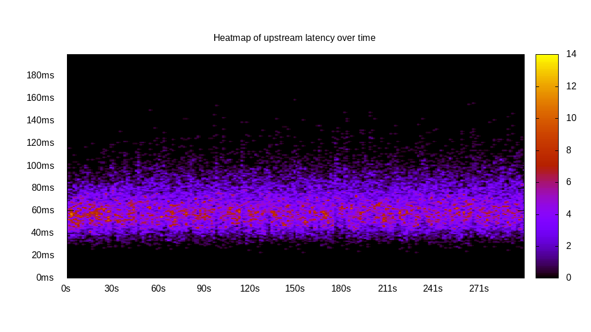
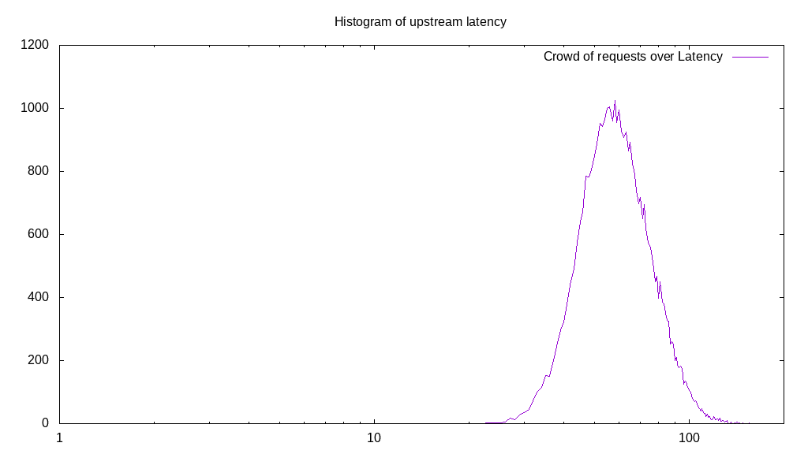
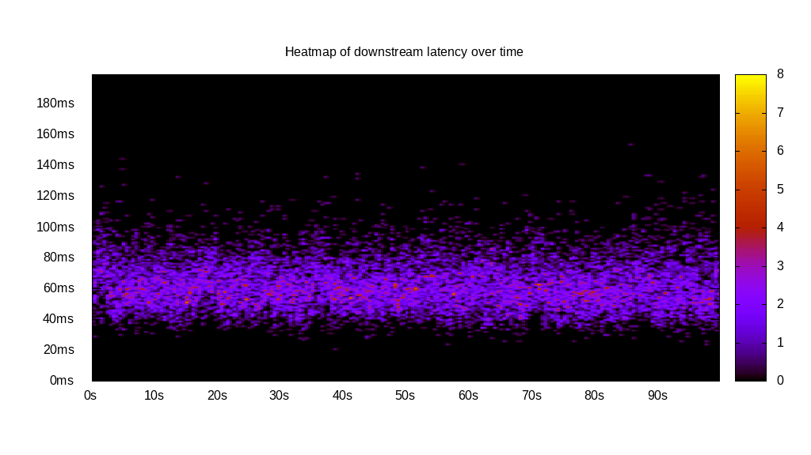
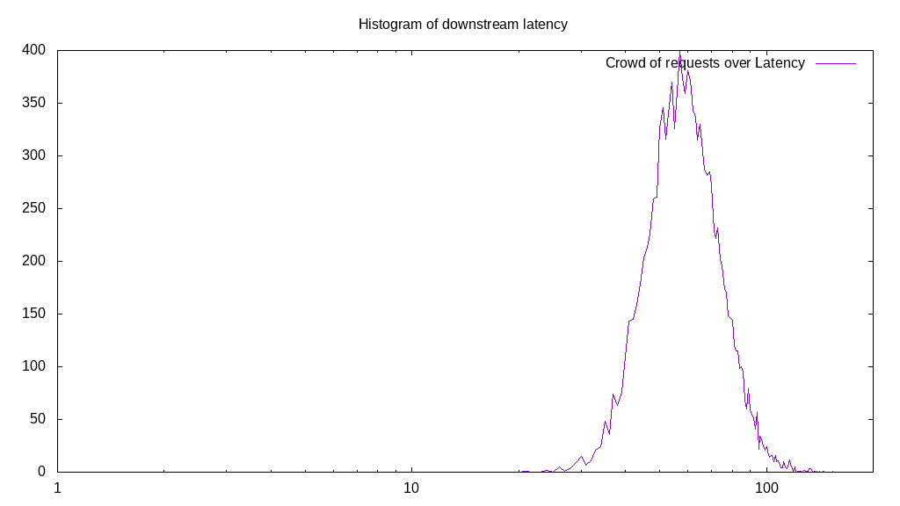
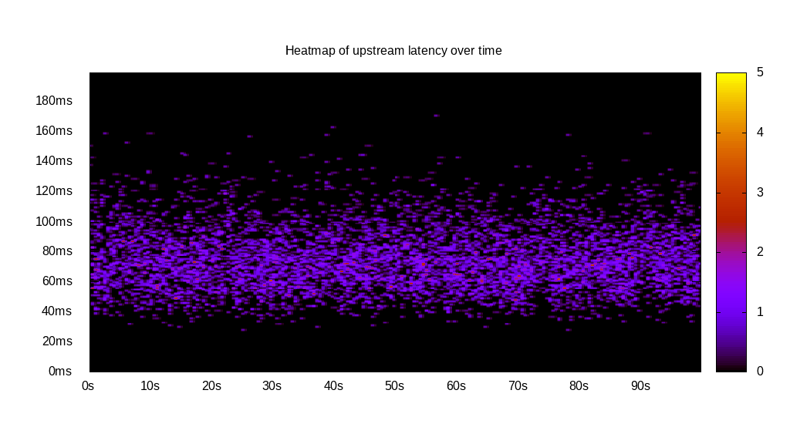
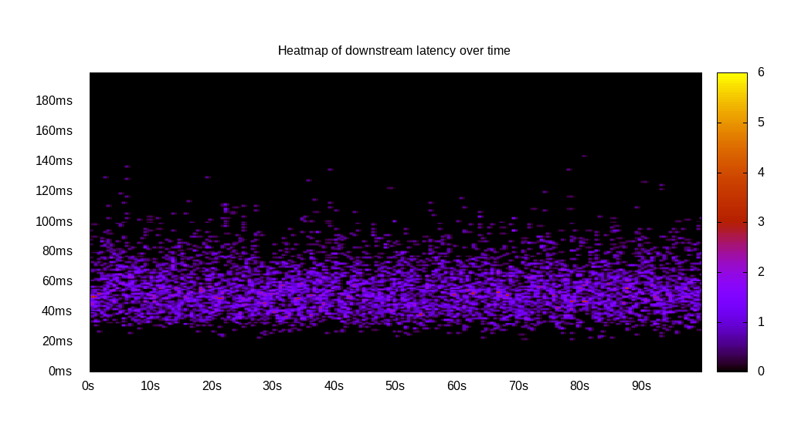
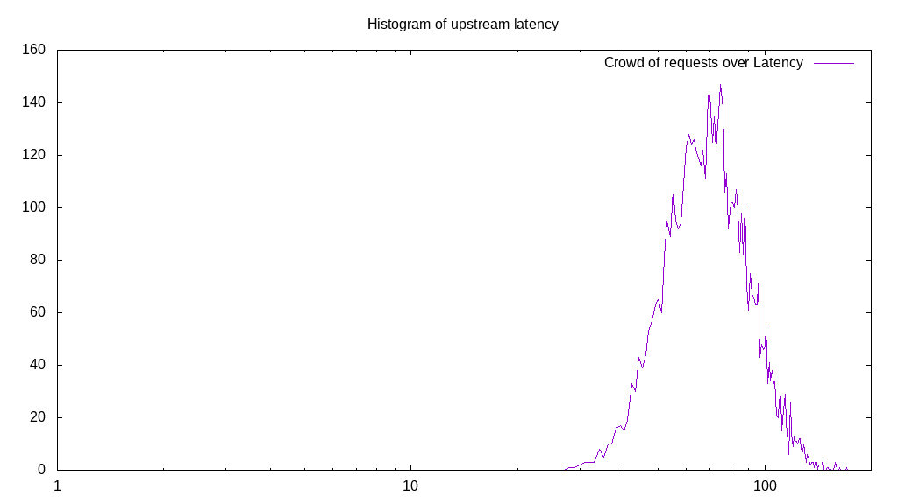
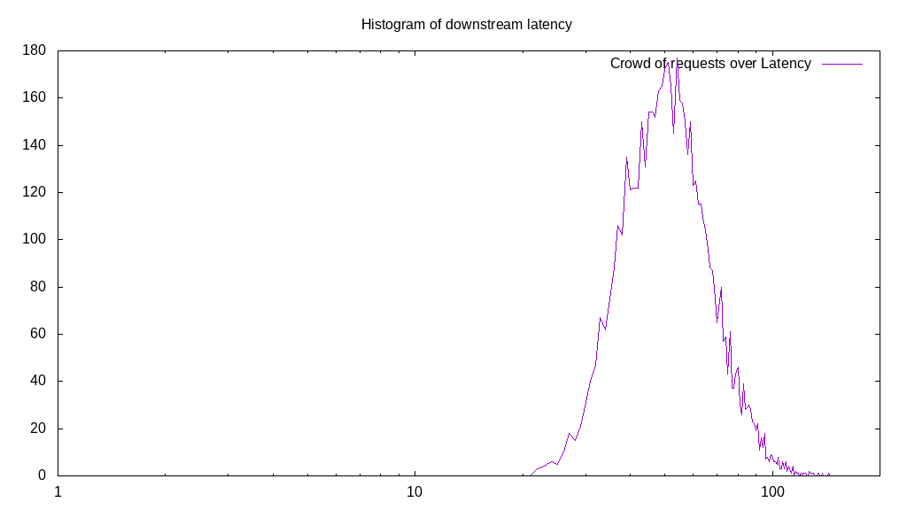
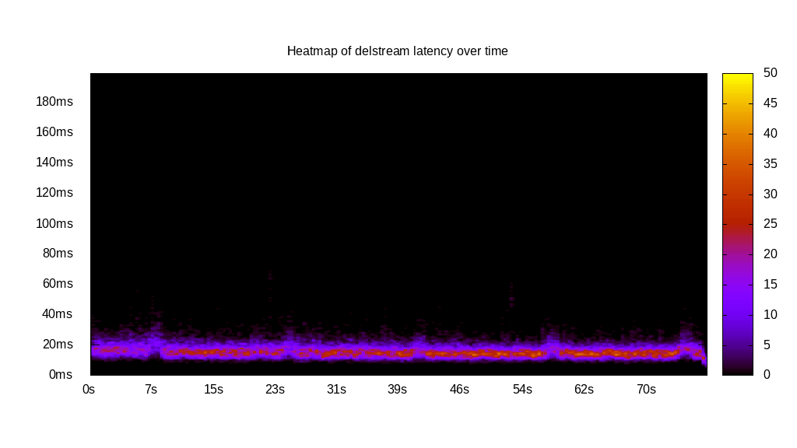
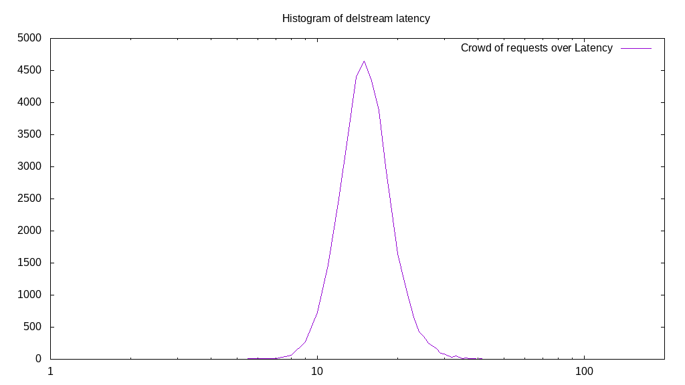

# Latency benchmark report. Crowd is 8

## Populate workload

## Object Size is 1024.00kiB

### PUT Latency in ms over time

Evolution of PUT Latency over time

| Parameter | Value |
| --- | --- |
| Y Coordinate | PUT Latency in ms |
| X Coordinate | time in s since begining of workload |

### PUT Latency distribution in ms

Distribution of the PUT Latency in ms

| Parameter | Value |
| --- | --- |
| Y Coordinate | Number of PUT |
| X Coordinate | Latency in ms |
| Server volume | 37410.000MiB|
| Server bandwidth | 124.700MiB/s |
| Server time | 300.00s |
| Server load | 7.97 |
| Server responses | 37410PUT |
| Server IOps | 124.70PUT/s |
| Client bandwidth | 15.587MiB/s |
| Client volume | 4676.250MiB|
| Client time | 2391.99s |
| Client IOps |  15.64PUT/s  |
| Client Latency | 63.94ms/PUT |
| Client Limbo | 1.00ms/PUT |
| Crowd time | 2400.01s |
| Crowd efficiency | 99.67% |
| Highest Latency | 159.80ms |
| 95th percentile Latency | 95.48ms |
| 68th percentile Latency | 70.35ms |
| 50th percentile Latency | 62.31ms |
| 32nd percentile Latency | 55.28ms |
| 5th percentile Latency | 42.21ms |
| Lowest Latency | 22.11ms |

## Read workload

## Object Size is 1024.00kiB

### GET Latency in ms over time

Evolution of GET Latency over time

| Parameter | Value |
| --- | --- |
| Y Coordinate | GET Latency in ms |
| X Coordinate | time in s since begining of workload |

### GET Latency distribution in ms

Distribution of the GET Latency in ms

| Parameter | Value |
| --- | --- |
| Y Coordinate | Number of GET |
| X Coordinate | Latency in ms |
| Server volume | 12649.000MiB|
| Server bandwidth | 126.356MiB/s |
| Server time | 100.11s |
| Server load | 7.95 |
| Server responses | 12649GET |
| Server IOps | 126.36GET/s |
| Client bandwidth | 15.795MiB/s |
| Client volume | 1581.125MiB|
| Client time | 795.80s |
| Client IOps |  15.89GET/s  |
| Client Latency | 62.91ms/GET |
| Client Limbo | 0.63ms/GET |
| Crowd time | 800.85s |
| Crowd efficiency | 99.37% |
| Highest Latency | 154.77ms |
| 95th percentile Latency | 90.45ms |
| 68th percentile Latency | 69.35ms |
| 50th percentile Latency | 62.31ms |
| 32nd percentile Latency | 56.28ms |
| 5th percentile Latency | 42.21ms |
| Lowest Latency | 21.11ms |

## Mixed workload

## Object Size is 1024.00kiB

### PUT Latency in ms over time

Evolution of PUT Latency over time

| Parameter | Value |
| --- | --- |
| Y Coordinate | PUT Latency in ms |
| X Coordinate | time in s since begining of workload |

### GET Latency in ms over time

Evolution of GET Latency over time

| Parameter | Value |
| --- | --- |
| Y Coordinate | GET Latency in ms |
| X Coordinate | time in s since begining of workload |

### PUT Latency distribution in ms

Distribution of the PUT Latency in ms

| Parameter | Value |
| --- | --- |
| Y Coordinate | Number of PUT |
| X Coordinate | Latency in ms |
| Server volume | 6114.000MiB|
| Server bandwidth | 61.123MiB/s |
| Server time | 100.03s |
| Server load | 4.62 |
| Server responses | 6114PUT |
| Server IOps | 61.12PUT/s |
| Client bandwidth | 7.640MiB/s |
| Client volume | 764.250MiB|
| Client time | 461.64s |
| Client IOps |  13.24PUT/s  |
| Client Latency | 75.51ms/PUT |
| Client Limbo | 42.32ms/PUT |
| Crowd time | 800.22s |
| Crowd efficiency | 57.69% |
| Highest Latency | 170.85ms |
| 95th percentile Latency | 112.56ms |
| 68th percentile Latency | 84.42ms |
| 50th percentile Latency | 74.37ms |
| 32nd percentile Latency | 65.33ms |
| 5th percentile Latency | 48.24ms |
| Lowest Latency | 28.14ms |

### GET Latency distribution in ms

Distribution of the GET Latency in ms

| Parameter | Value |
| --- | --- |
| Y Coordinate | Number of GET |
| X Coordinate | Latency in ms |
| Server volume | 5963.000MiB|
| Server bandwidth | 59.614MiB/s |
| Server time | 100.03s |
| Server load | 3.35 |
| Server responses | 5963GET |
| Server IOps | 59.61GET/s |
| Client bandwidth | 7.452MiB/s |
| Client volume | 745.375MiB|
| Client time | 335.34s |
| Client IOps |  17.78GET/s  |
| Client Latency | 56.24ms/GET |
| Client Limbo | 58.11ms/GET |
| Crowd time | 800.22s |
| Crowd efficiency | 41.91% |
| Highest Latency | 144.72ms |
| 95th percentile Latency | 87.44ms |
| 68th percentile Latency | 62.31ms |
| 50th percentile Latency | 55.28ms |
| 32nd percentile Latency | 48.24ms |
| 5th percentile Latency | 35.18ms |
| Lowest Latency | 22.11ms |

## Cleanup workload

## Object Size is 1024.00kiB

### DELETE Latency in ms over time

Evolution of DELETE Latency over time

| Parameter | Value |
| --- | --- |
| Y Coordinate | DELETE Latency in ms |
| X Coordinate | time in s since begining of workload |

### DELETE Latency distribution in ms

Distribution of the DELETE Latency in ms

| Parameter | Value |
| --- | --- |
| Y Coordinate | Number of DELETE |
| X Coordinate | Latency in ms |
| Server volume | 37418.000MiB|
| Server bandwidth | 480.297MiB/s |
| Server time | 77.91s |
| Server load | 7.89 |
| Server responses | 37418DELETE |
| Server IOps | 480.30DELETE/s |
| Client bandwidth | 60.037MiB/s |
| Client volume | 4677.250MiB|
| Client time | 614.95s |
| Client IOps |  60.85DELETE/s  |
| Client Latency | 16.43ms/DELETE |
| Client Limbo | 1.04ms/DELETE |
| Crowd time | 623.25s |
| Crowd efficiency | 98.67% |
| Highest Latency | 75.38ms |
| 95th percentile Latency | 24.12ms |
| 68th percentile Latency | 18.09ms |
| 50th percentile Latency | 17.09ms |
| 32nd percentile Latency | 15.08ms |
| 5th percentile Latency | 12.06ms |
| Lowest Latency | 6.03ms |

