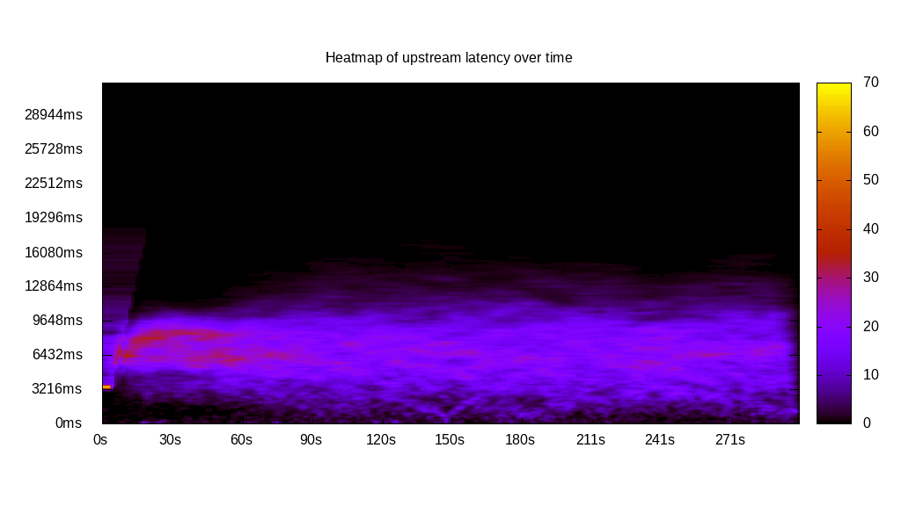
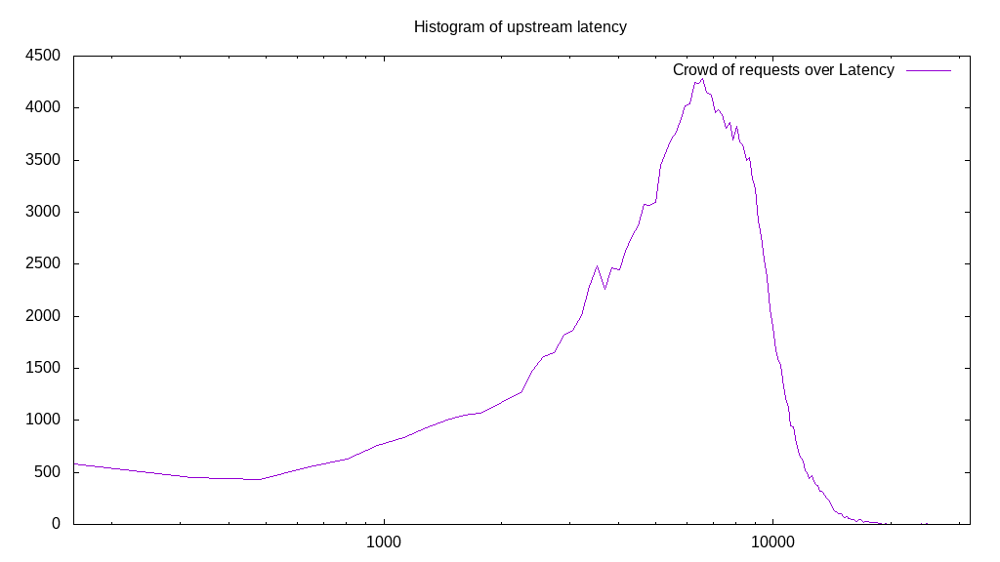
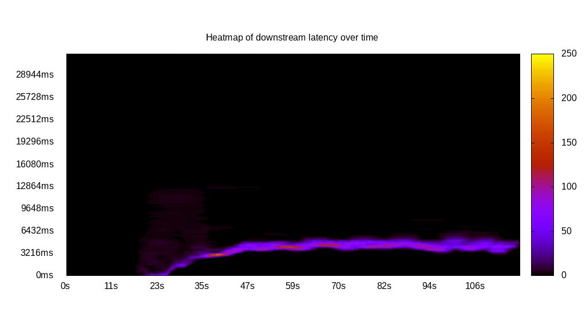
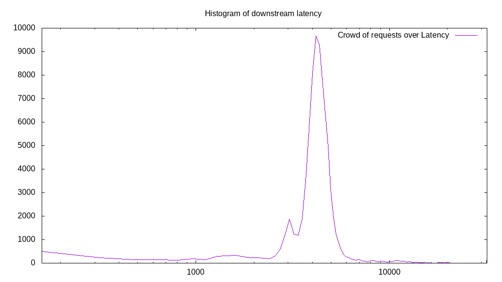
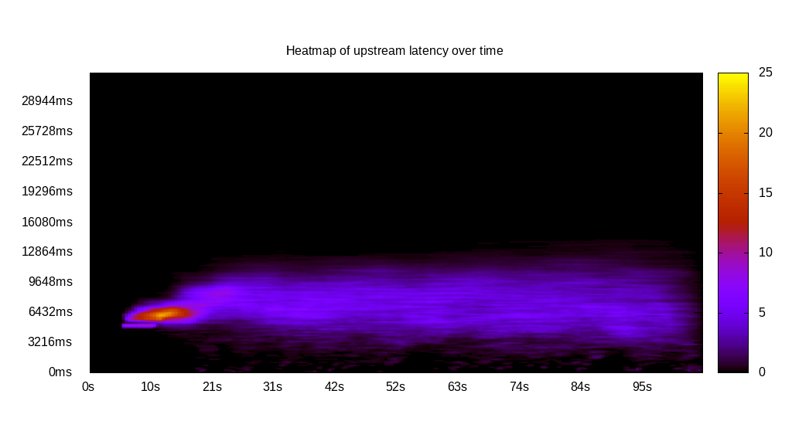
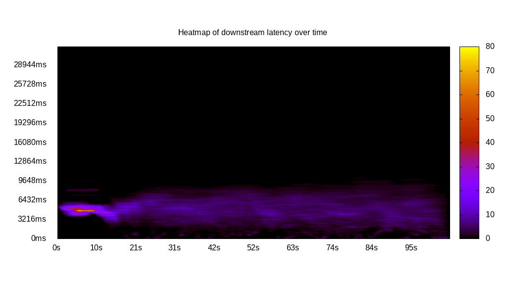
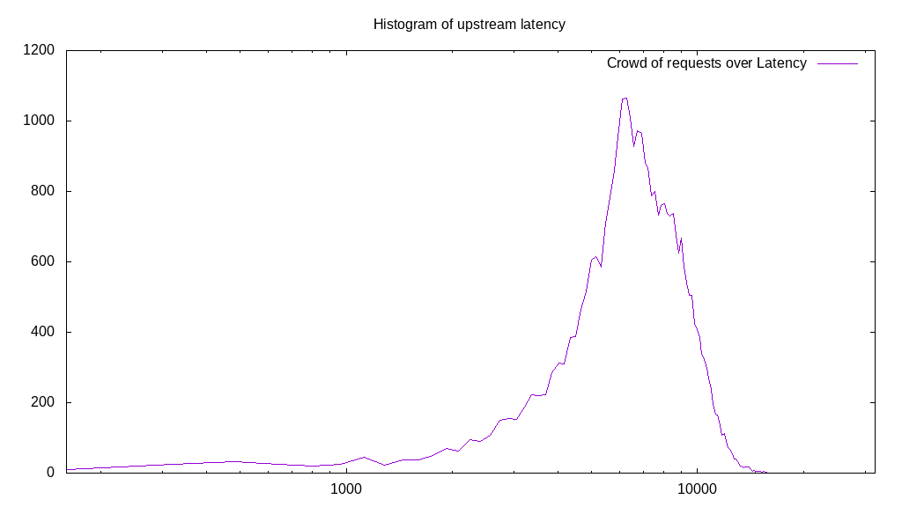
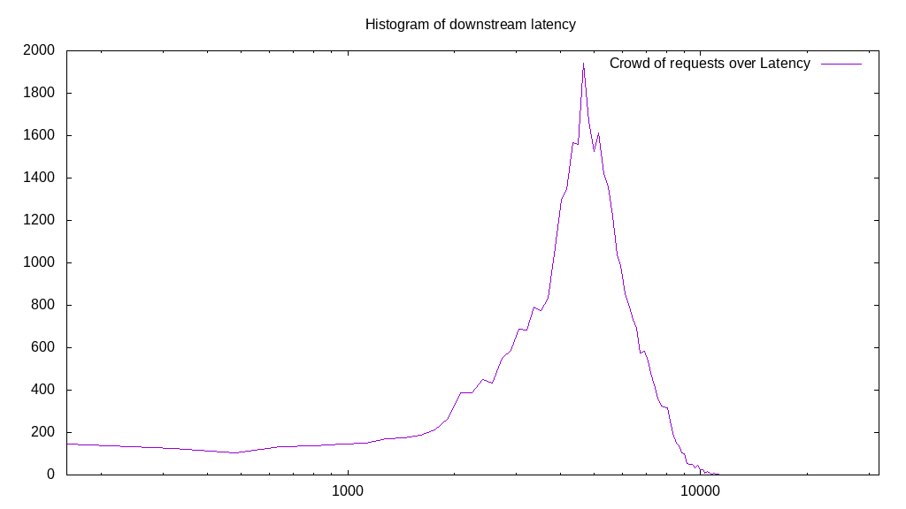
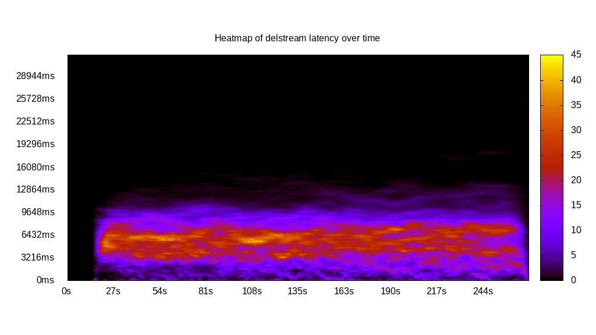
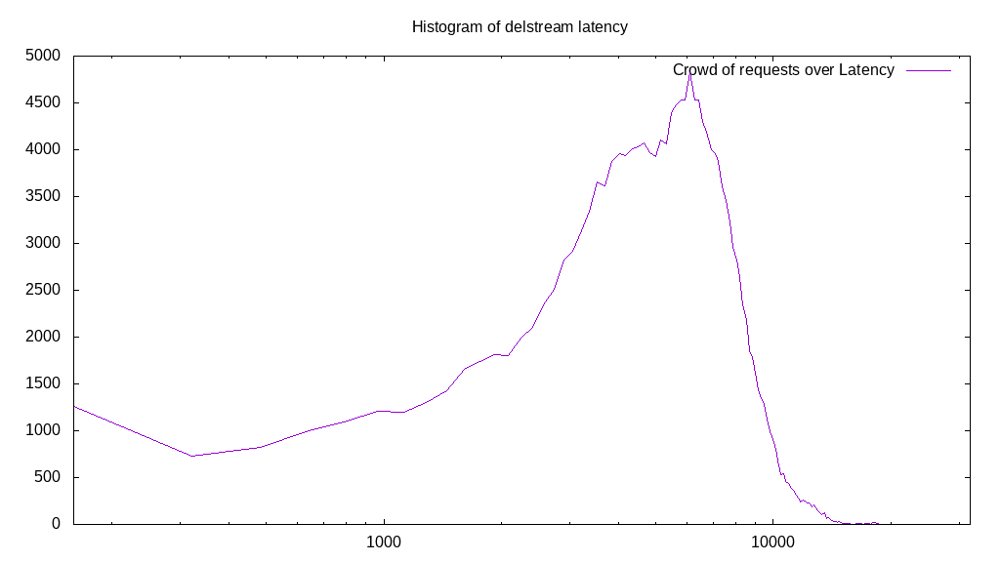

# Latency benchmark report. Crowd is 4096

## Populate workload

## Object Size is 32.00kiB

### PUT Latency in ms over time

Evolution of PUT Latency over time

| Parameter | Value |
| --- | --- |
| Y Coordinate | PUT Latency in ms |
| X Coordinate | time in s since begining of workload |

### PUT Latency distribution in ms

Distribution of the PUT Latency in ms

| Parameter | Value |
| --- | --- |
| Y Coordinate | Number of PUT |
| X Coordinate | Latency in ms |
| Server volume | 5666.625MiB|
| Server bandwidth | 18.888MiB/s |
| Server time | 300.00s |
| Server load | 4037.28 |
| Server responses | 181332PUT |
| Server IOps | 604.43PUT/s |
| Client bandwidth | 0.005MiB/s |
| Client volume | 1.383MiB|
| Client time | 1211200.36s |
| Client IOps |  0.15PUT/s  |
| Client Latency | 6679.46ms/PUT |
| Client Limbo | 4.30ms/PUT |
| Crowd time | 1228816.38s |
| Crowd efficiency | 98.57% |
| Highest Latency | 27015.08ms |
| 95th percentile Latency | 11577.89ms |
| 68th percentile Latency | 8201.01ms |
| 50th percentile Latency | 6753.77ms |
| 32nd percentile Latency | 5467.34ms |
| 5th percentile Latency | 2090.45ms |
| Lowest Latency | 160.80ms |

## Read workload

## Object Size is 32.00kiB

### GET Latency in ms over time

Evolution of GET Latency over time

| Parameter | Value |
| --- | --- |
| Y Coordinate | GET Latency in ms |
| X Coordinate | time in s since begining of workload |

### GET Latency distribution in ms

Distribution of the GET Latency in ms

| Parameter | Value |
| --- | --- |
| Y Coordinate | Number of GET |
| X Coordinate | Latency in ms |
| Server volume | 2537.313MiB|
| Server bandwidth | 21.564MiB/s |
| Server time | 117.67s |
| Server load | 3220.08 |
| Server responses | 81194GET |
| Server IOps | 690.03GET/s |
| Client bandwidth | 0.005MiB/s |
| Client volume | 0.619MiB|
| Client time | 378896.62s |
| Client IOps |  0.21GET/s  |
| Client Latency | 4666.56ms/GET |
| Client Limbo | 25.16ms/GET |
| Crowd time | 481964.03s |
| Crowd efficiency | 78.62% |
| Highest Latency | 32000.00ms |
| 95th percentile Latency | 7557.79ms |
| 68th percentile Latency | 4663.32ms |
| 50th percentile Latency | 4502.51ms |
| 32nd percentile Latency | 4180.90ms |
| 5th percentile Latency | 2733.67ms |
| Lowest Latency | 160.80ms |

## Mixed workload

## Object Size is 32.00kiB

### PUT Latency in ms over time

Evolution of PUT Latency over time

| Parameter | Value |
| --- | --- |
| Y Coordinate | PUT Latency in ms |
| X Coordinate | time in s since begining of workload |

### GET Latency in ms over time

Evolution of GET Latency over time

| Parameter | Value |
| --- | --- |
| Y Coordinate | GET Latency in ms |
| X Coordinate | time in s since begining of workload |

### PUT Latency distribution in ms

Distribution of the PUT Latency in ms

| Parameter | Value |
| --- | --- |
| Y Coordinate | Number of PUT |
| X Coordinate | Latency in ms |
| Server volume | 995.500MiB|
| Server bandwidth | 9.440MiB/s |
| Server time | 105.45s |
| Server load | 2157.44 |
| Server responses | 31856PUT |
| Server IOps | 302.09PUT/s |
| Client bandwidth | 0.002MiB/s |
| Client volume | 0.243MiB|
| Client time | 227503.89s |
| Client IOps |  0.14PUT/s  |
| Client Latency | 7141.63ms/PUT |
| Client Limbo | 49.91ms/PUT |
| Crowd time | 431927.30s |
| Crowd efficiency | 52.67% |
| Highest Latency | 16080.40ms |
| 95th percentile Latency | 11095.48ms |
| 68th percentile Latency | 8361.81ms |
| 50th percentile Latency | 7236.18ms |
| 32nd percentile Latency | 6271.36ms |
| 5th percentile Latency | 3537.69ms |
| Lowest Latency | 160.80ms |

### GET Latency distribution in ms

Distribution of the GET Latency in ms

| Parameter | Value |
| --- | --- |
| Y Coordinate | Number of GET |
| X Coordinate | Latency in ms |
| Server volume | 1138.063MiB|
| Server bandwidth | 10.792MiB/s |
| Server time | 105.45s |
| Server load | 1678.95 |
| Server responses | 36418GET |
| Server IOps | 345.35GET/s |
| Client bandwidth | 0.003MiB/s |
| Client volume | 0.278MiB|
| Client time | 177046.61s |
| Client IOps |  0.21GET/s  |
| Client Latency | 4861.51ms/GET |
| Client Limbo | 62.23ms/GET |
| Crowd time | 431927.30s |
| Crowd efficiency | 40.99% |
| Highest Latency | 11899.50ms |
| 95th percentile Latency | 8040.20ms |
| 68th percentile Latency | 5628.14ms |
| 50th percentile Latency | 4984.92ms |
| 32nd percentile Latency | 4341.71ms |
| 5th percentile Latency | 2090.45ms |
| Lowest Latency | 160.80ms |

## Cleanup workload

## Object Size is 32.00kiB

### DELETE Latency in ms over time

Evolution of DELETE Latency over time

| Parameter | Value |
| --- | --- |
| Y Coordinate | DELETE Latency in ms |
| X Coordinate | time in s since begining of workload |

### DELETE Latency distribution in ms

Distribution of the DELETE Latency in ms

| Parameter | Value |
| --- | --- |
| Y Coordinate | Number of DELETE |
| X Coordinate | Latency in ms |
| Server volume | 5666.875MiB|
| Server bandwidth | 20.946MiB/s |
| Server time | 270.55s |
| Server load | 3728.84 |
| Server responses | 181340DELETE |
| Server IOps | 670.27DELETE/s |
| Client bandwidth | 0.005MiB/s |
| Client volume | 1.384MiB|
| Client time | 1008833.13s |
| Client IOps |  0.18DELETE/s  |
| Client Latency | 5563.21ms/DELETE |
| Client Limbo | 24.25ms/DELETE |
| Crowd time | 1108168.70s |
| Crowd efficiency | 91.04% |
| Highest Latency | 19457.29ms |
| 95th percentile Latency | 9969.85ms |
| 68th percentile Latency | 6914.57ms |
| 50th percentile Latency | 5788.94ms |
| 32nd percentile Latency | 4502.51ms |
| 5th percentile Latency | 1608.04ms |
| Lowest Latency | 160.80ms |

