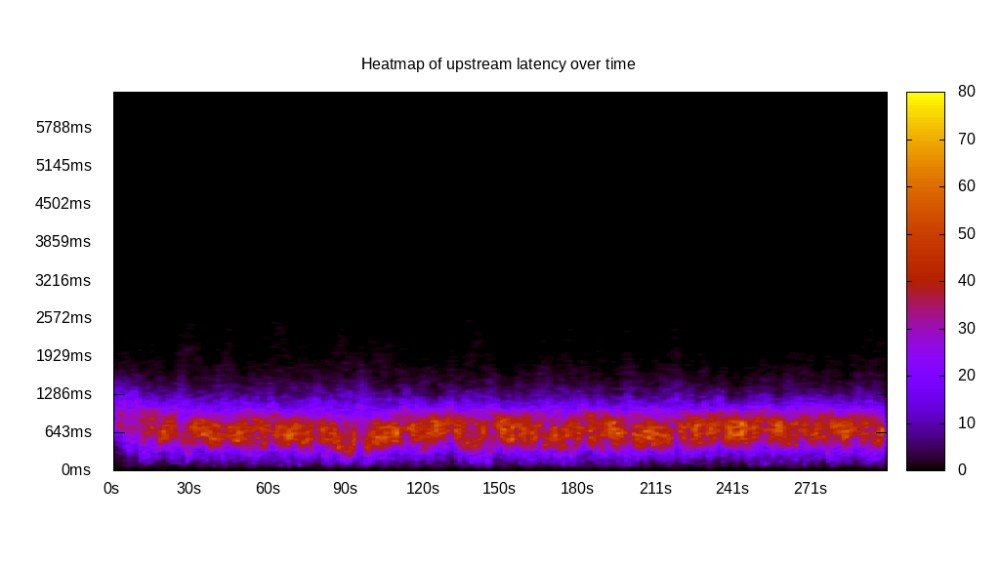
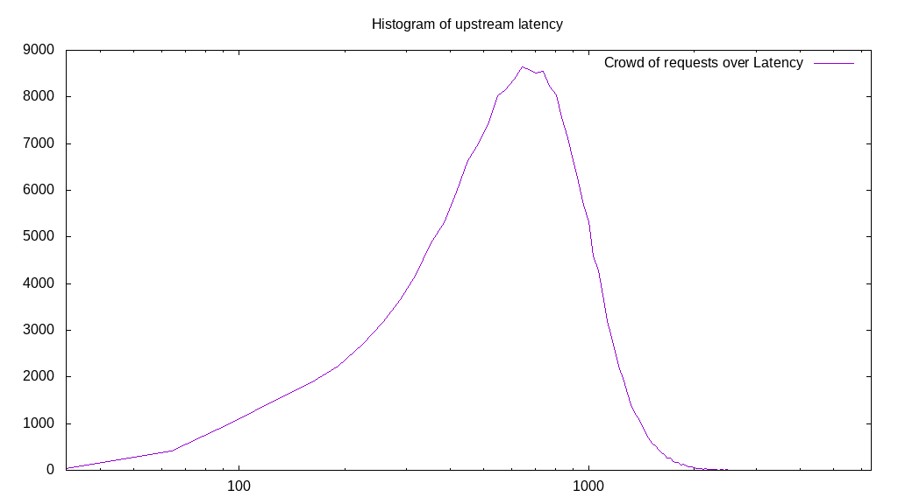
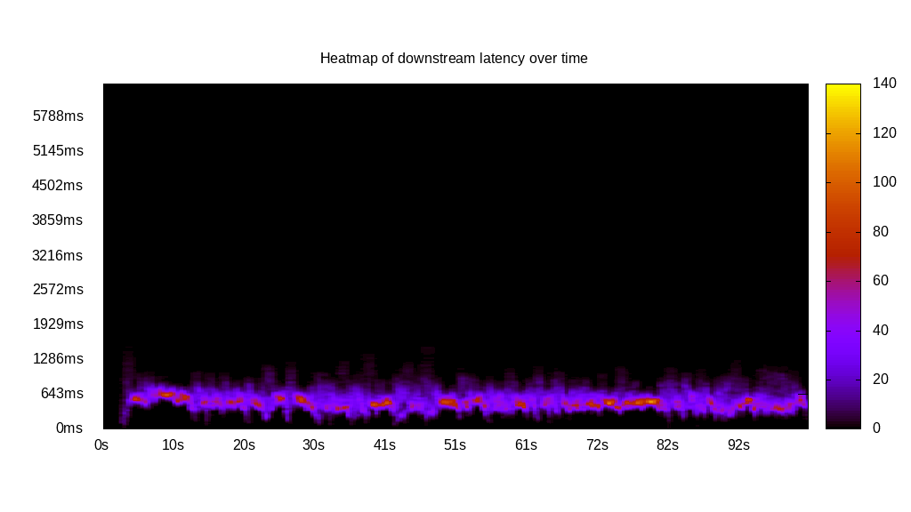
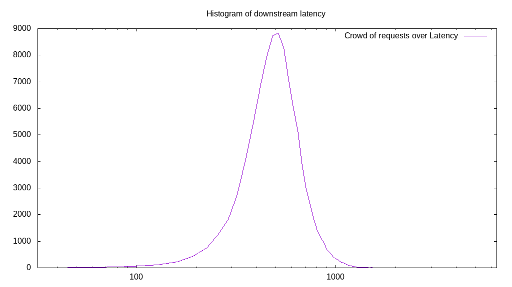
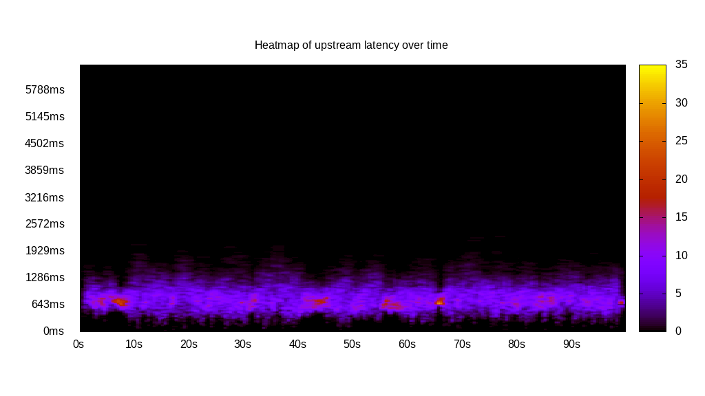
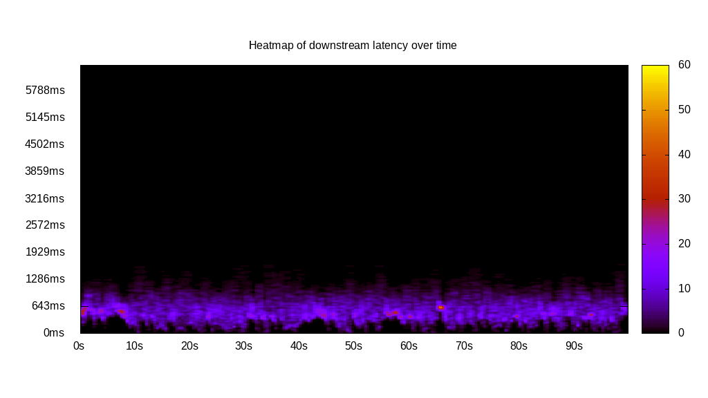
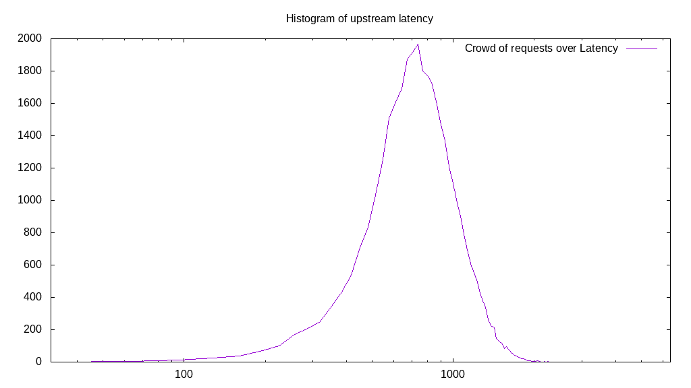
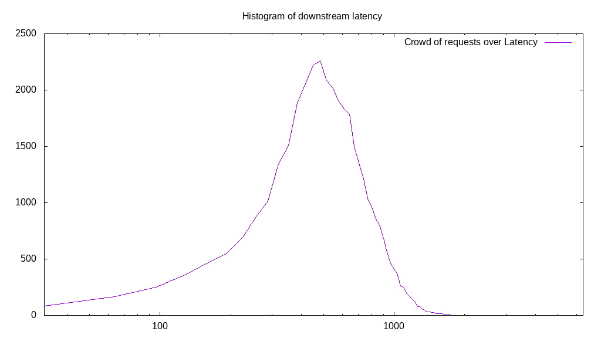
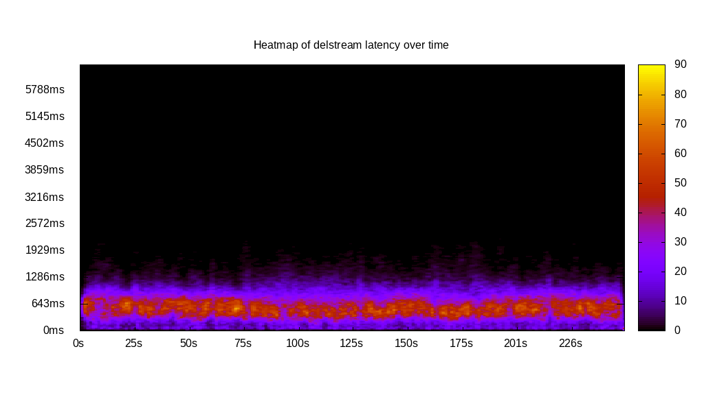
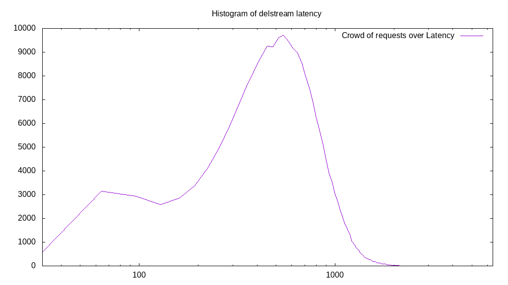

# Latency benchmark report. Crowd is 512

## Populate workload

## Object Size is 32.00kiB

### PUT Latency in ms over time

Evolution of PUT Latency over time

| Parameter | Value |
| --- | --- |
| Y Coordinate | PUT Latency in ms |
| X Coordinate | time in s since begining of workload |

### PUT Latency distribution in ms

Distribution of the PUT Latency in ms

| Parameter | Value |
| --- | --- |
| Y Coordinate | Number of PUT |
| X Coordinate | Latency in ms |
| Server volume | 6530.688MiB|
| Server bandwidth | 21.769MiB/s |
| Server time | 299.99s |
| Server load | 511.08 |
| Server responses | 208982PUT |
| Server IOps | 696.62PUT/s |
| Client bandwidth | 0.043MiB/s |
| Client volume | 12.755MiB|
| Client time | 153320.63s |
| Client IOps |  1.36PUT/s  |
| Client Latency | 733.65ms/PUT |
| Client Limbo | 0.54ms/PUT |
| Crowd time | 153596.93s |
| Crowd efficiency | 99.82% |
| Highest Latency | 3183.92ms |
| 95th percentile Latency | 1318.59ms |
| 68th percentile Latency | 900.50ms |
| 50th percentile Latency | 739.70ms |
| 32nd percentile Latency | 611.06ms |
| 5th percentile Latency | 289.45ms |
| Lowest Latency | 32.16ms |

## Read workload

## Object Size is 32.00kiB

### GET Latency in ms over time

Evolution of GET Latency over time

| Parameter | Value |
| --- | --- |
| Y Coordinate | GET Latency in ms |
| X Coordinate | time in s since begining of workload |

### GET Latency distribution in ms

Distribution of the GET Latency in ms

| Parameter | Value |
| --- | --- |
| Y Coordinate | Number of GET |
| X Coordinate | Latency in ms |
| Server volume | 2939.969MiB|
| Server bandwidth | 28.678MiB/s |
| Server time | 102.52s |
| Server load | 495.52 |
| Server responses | 94079GET |
| Server IOps | 917.71GET/s |
| Client bandwidth | 0.056MiB/s |
| Client volume | 5.742MiB|
| Client time | 50798.43s |
| Client IOps |  1.85GET/s  |
| Client Latency | 539.96ms/GET |
| Client Limbo | 3.30ms/GET |
| Crowd time | 52487.68s |
| Crowd efficiency | 96.78% |
| Highest Latency | 1993.97ms |
| 95th percentile Latency | 868.34ms |
| 68th percentile Latency | 611.06ms |
| 50th percentile Latency | 546.73ms |
| 32nd percentile Latency | 482.41ms |
| 5th percentile Latency | 353.77ms |
| Lowest Latency | 32.16ms |

## Mixed workload

## Object Size is 32.00kiB

### PUT Latency in ms over time

Evolution of PUT Latency over time

| Parameter | Value |
| --- | --- |
| Y Coordinate | PUT Latency in ms |
| X Coordinate | time in s since begining of workload |

### GET Latency in ms over time

Evolution of GET Latency over time

| Parameter | Value |
| --- | --- |
| Y Coordinate | GET Latency in ms |
| X Coordinate | time in s since begining of workload |

### PUT Latency distribution in ms

Distribution of the PUT Latency in ms

| Parameter | Value |
| --- | --- |
| Y Coordinate | Number of PUT |
| X Coordinate | Latency in ms |
| Server volume | 1140.406MiB|
| Server bandwidth | 11.343MiB/s |
| Server time | 100.54s |
| Server load | 296.62 |
| Server responses | 36493PUT |
| Server IOps | 362.97PUT/s |
| Client bandwidth | 0.022MiB/s |
| Client volume | 2.227MiB|
| Client time | 29822.13s |
| Client IOps |  1.22PUT/s  |
| Client Latency | 817.20ms/PUT |
| Client Limbo | 42.29ms/PUT |
| Crowd time | 51476.99s |
| Crowd efficiency | 57.93% |
| Highest Latency | 2637.19ms |
| 95th percentile Latency | 1350.75ms |
| 68th percentile Latency | 932.66ms |
| 50th percentile Latency | 804.02ms |
| 32nd percentile Latency | 707.54ms |
| 5th percentile Latency | 450.25ms |
| Lowest Latency | 32.16ms |

### GET Latency distribution in ms

Distribution of the GET Latency in ms

| Parameter | Value |
| --- | --- |
| Y Coordinate | Number of GET |
| X Coordinate | Latency in ms |
| Server volume | 1162.031MiB|
| Server bandwidth | 11.558MiB/s |
| Server time | 100.54s |
| Server load | 211.81 |
| Server responses | 37185GET |
| Server IOps | 369.85GET/s |
| Client bandwidth | 0.023MiB/s |
| Client volume | 2.270MiB|
| Client time | 21295.44s |
| Client IOps |  1.75GET/s  |
| Client Latency | 572.69ms/GET |
| Client Limbo | 58.95ms/GET |
| Crowd time | 51476.99s |
| Crowd efficiency | 41.37% |
| Highest Latency | 2186.93ms |
| 95th percentile Latency | 1061.31ms |
| 68th percentile Latency | 675.38ms |
| 50th percentile Latency | 578.89ms |
| 32nd percentile Latency | 482.41ms |
| 5th percentile Latency | 225.13ms |
| Lowest Latency | 32.16ms |

## Cleanup workload

## Object Size is 32.00kiB

### DELETE Latency in ms over time

Evolution of DELETE Latency over time

| Parameter | Value |
| --- | --- |
| Y Coordinate | DELETE Latency in ms |
| X Coordinate | time in s since begining of workload |

### DELETE Latency distribution in ms

Distribution of the DELETE Latency in ms

| Parameter | Value |
| --- | --- |
| Y Coordinate | Number of DELETE |
| X Coordinate | Latency in ms |
| Server volume | 6530.938MiB|
| Server bandwidth | 26.110MiB/s |
| Server time | 250.13s |
| Server load | 507.22 |
| Server responses | 208990DELETE |
| Server IOps | 835.53DELETE/s |
| Client bandwidth | 0.051MiB/s |
| Client volume | 12.756MiB|
| Client time | 126870.14s |
| Client IOps |  1.65DELETE/s  |
| Client Latency | 607.06ms/DELETE |
| Client Limbo | 2.34ms/DELETE |
| Crowd time | 128066.05s |
| Crowd efficiency | 99.07% |
| Highest Latency | 2990.95ms |
| 95th percentile Latency | 1157.79ms |
| 68th percentile Latency | 739.70ms |
| 50th percentile Latency | 611.06ms |
| 32nd percentile Latency | 482.41ms |
| 5th percentile Latency | 192.96ms |
| Lowest Latency | 32.16ms |

