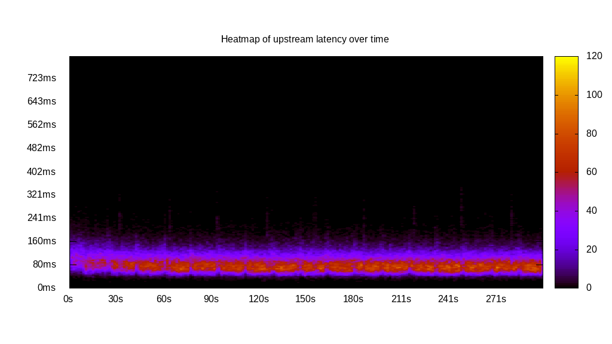
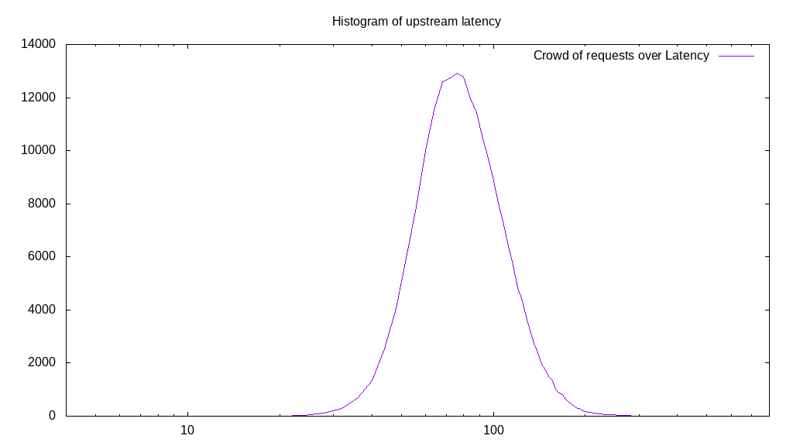
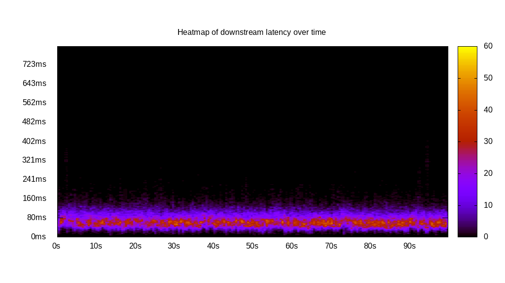
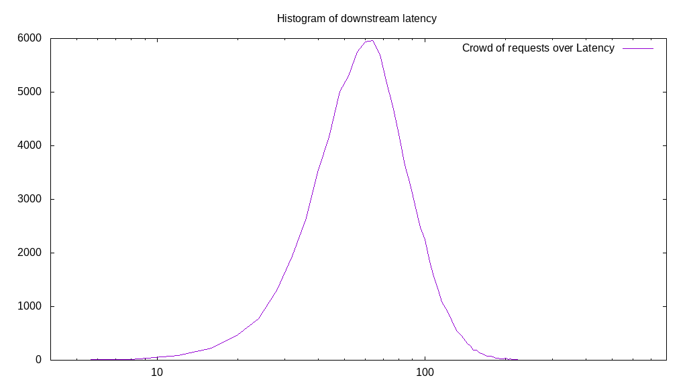
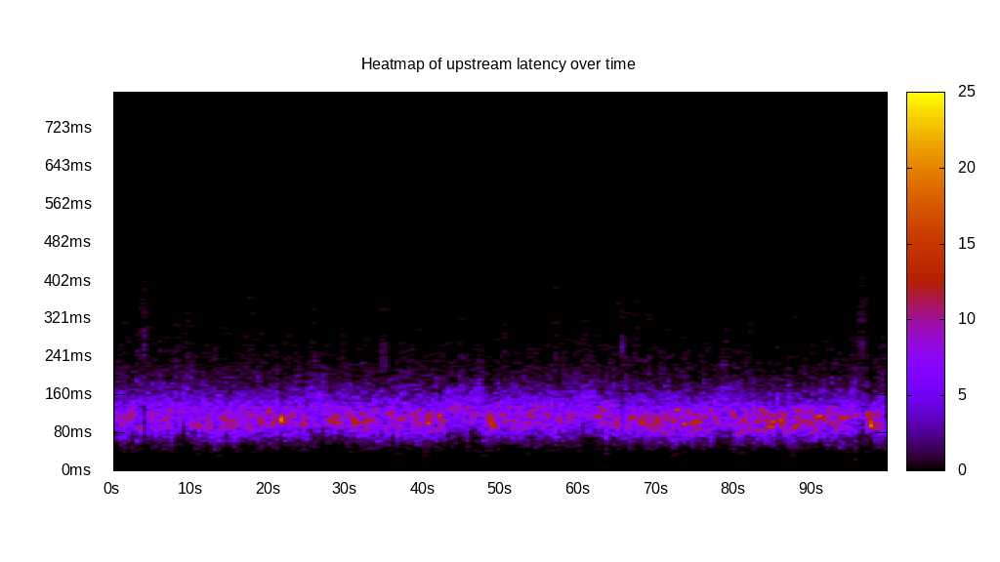
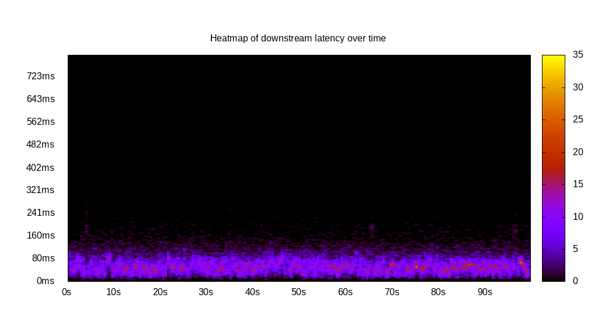
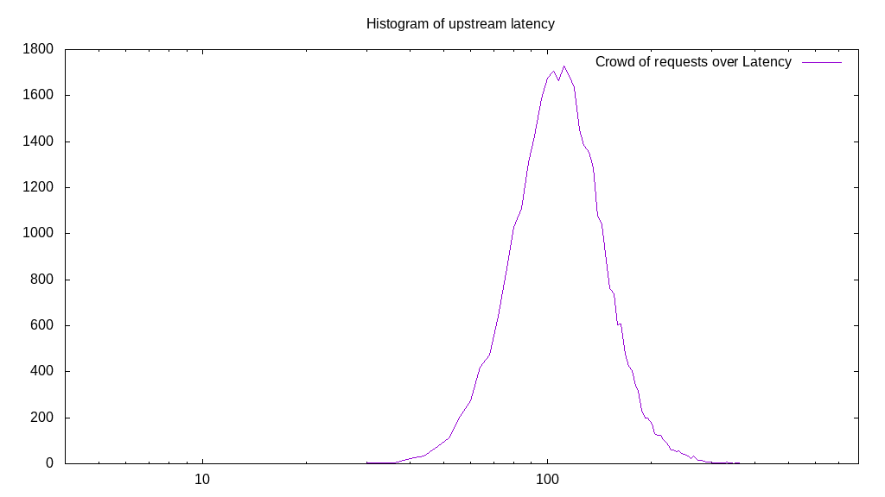
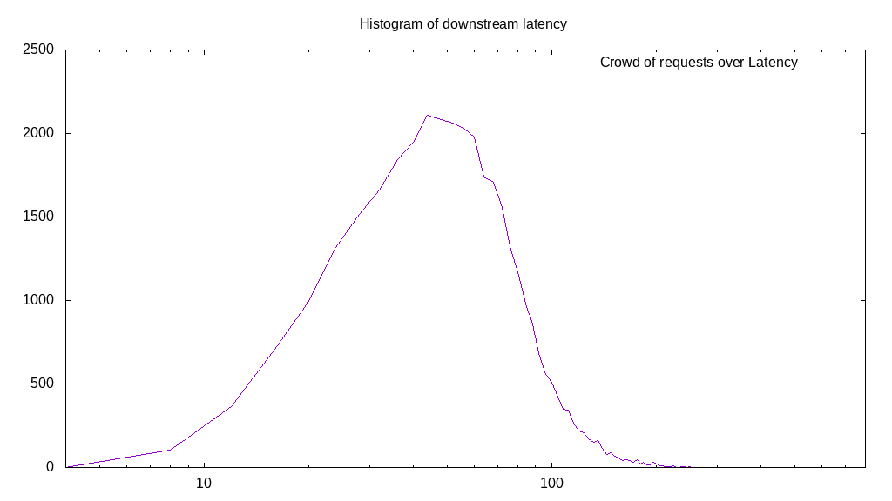
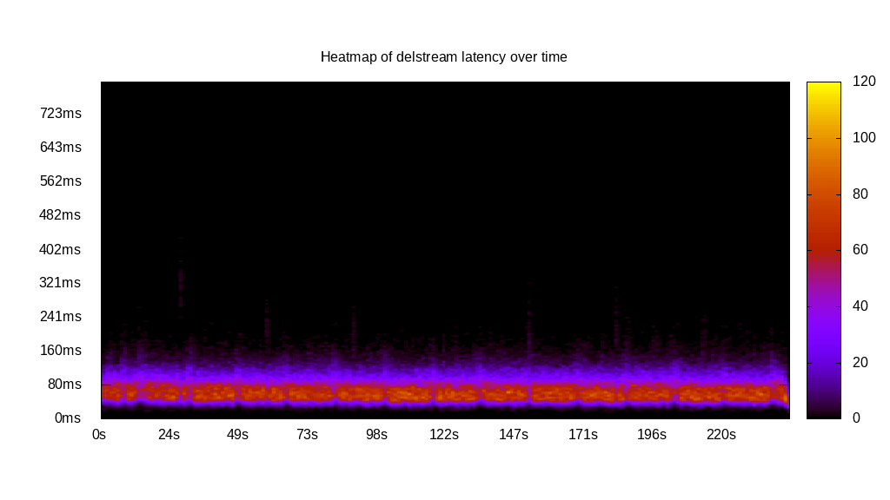
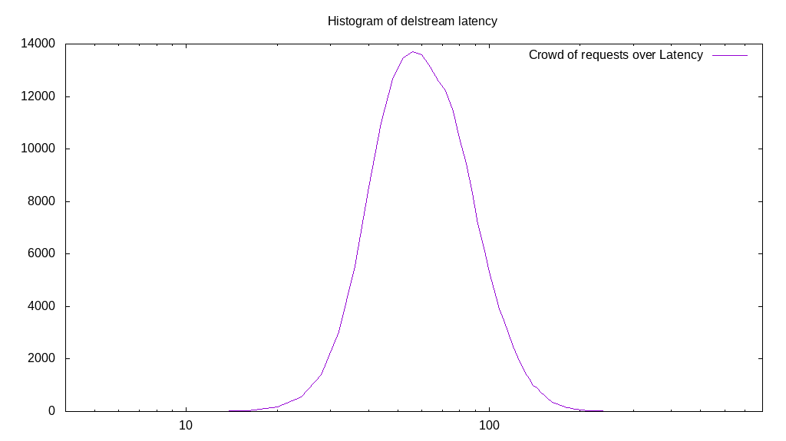

# Latency benchmark report. Crowd is 64

## Populate workload

## Object Size is 32.00kiB

### PUT Latency in ms over time

Evolution of PUT Latency over time

| Parameter | Value |
| --- | --- |
| Y Coordinate | PUT Latency in ms |
| X Coordinate | time in s since begining of workload |

### PUT Latency distribution in ms

Distribution of the PUT Latency in ms

| Parameter | Value |
| --- | --- |
| Y Coordinate | Number of PUT |
| X Coordinate | Latency in ms |
| Server volume | 6570.969MiB|
| Server bandwidth | 21.904MiB/s |
| Server time | 300.00s |
| Server load | 63.88 |
| Server responses | 210271PUT |
| Server IOps | 700.91PUT/s |
| Client bandwidth | 0.342MiB/s |
| Client volume | 102.671MiB|
| Client time | 19162.87s |
| Client IOps |  10.97PUT/s  |
| Client Latency | 91.13ms/PUT |
| Client Limbo | 0.58ms/PUT |
| Crowd time | 19199.74s |
| Crowd efficiency | 99.81% |
| Highest Latency | 406.03ms |
| 95th percentile Latency | 152.76ms |
| 68th percentile Latency | 104.52ms |
| 50th percentile Latency | 88.44ms |
| 32nd percentile Latency | 76.38ms |
| 5th percentile Latency | 56.28ms |
| Lowest Latency | 16.08ms |

## Read workload

## Object Size is 32.00kiB

### GET Latency in ms over time

Evolution of GET Latency over time

| Parameter | Value |
| --- | --- |
| Y Coordinate | GET Latency in ms |
| X Coordinate | time in s since begining of workload |

### GET Latency distribution in ms

Distribution of the GET Latency in ms

| Parameter | Value |
| --- | --- |
| Y Coordinate | Number of GET |
| X Coordinate | Latency in ms |
| Server volume | 2781.094MiB|
| Server bandwidth | 27.773MiB/s |
| Server time | 100.14s |
| Server load | 63.67 |
| Server responses | 88995GET |
| Server IOps | 888.72GET/s |
| Client bandwidth | 0.434MiB/s |
| Client volume | 43.455MiB|
| Client time | 6376.26s |
| Client IOps |  13.96GET/s  |
| Client Latency | 71.65ms/GET |
| Client Limbo | 0.51ms/GET |
| Crowd time | 6408.83s |
| Crowd efficiency | 99.49% |
| Highest Latency | 406.03ms |
| 95th percentile Latency | 128.64ms |
| 68th percentile Latency | 84.42ms |
| 50th percentile Latency | 72.36ms |
| 32nd percentile Latency | 60.30ms |
| 5th percentile Latency | 36.18ms |
| Lowest Latency | 8.04ms |

## Mixed workload

## Object Size is 32.00kiB

### PUT Latency in ms over time

Evolution of PUT Latency over time

| Parameter | Value |
| --- | --- |
| Y Coordinate | PUT Latency in ms |
| X Coordinate | time in s since begining of workload |

### GET Latency in ms over time

Evolution of GET Latency over time

| Parameter | Value |
| --- | --- |
| Y Coordinate | GET Latency in ms |
| X Coordinate | time in s since begining of workload |

### PUT Latency distribution in ms

Distribution of the PUT Latency in ms

| Parameter | Value |
| --- | --- |
| Y Coordinate | Number of PUT |
| X Coordinate | Latency in ms |
| Server volume | 1089.531MiB|
| Server bandwidth | 10.886MiB/s |
| Server time | 100.08s |
| Server load | 42.74 |
| Server responses | 34865PUT |
| Server IOps | 348.36PUT/s |
| Client bandwidth | 0.170MiB/s |
| Client volume | 17.024MiB|
| Client time | 4277.15s |
| Client IOps |  8.15PUT/s  |
| Client Latency | 122.68ms/PUT |
| Client Limbo | 33.25ms/PUT |
| Crowd time | 6405.31s |
| Crowd efficiency | 66.78% |
| Highest Latency | 410.05ms |
| 95th percentile Latency | 196.98ms |
| 68th percentile Latency | 136.68ms |
| 50th percentile Latency | 120.60ms |
| 32nd percentile Latency | 104.52ms |
| 5th percentile Latency | 76.38ms |
| Lowest Latency | 24.12ms |

### GET Latency distribution in ms

Distribution of the GET Latency in ms

| Parameter | Value |
| --- | --- |
| Y Coordinate | Number of GET |
| X Coordinate | Latency in ms |
| Server volume | 1091.063MiB|
| Server bandwidth | 10.902MiB/s |
| Server time | 100.08s |
| Server load | 21.10 |
| Server responses | 34914GET |
| Server IOps | 348.85GET/s |
| Client bandwidth | 0.170MiB/s |
| Client volume | 17.048MiB|
| Client time | 2111.43s |
| Client IOps |  16.54GET/s  |
| Client Latency | 60.48ms/GET |
| Client Limbo | 67.09ms/GET |
| Crowd time | 6405.31s |
| Crowd efficiency | 32.96% |
| Highest Latency | 369.85ms |
| 95th percentile Latency | 120.60ms |
| 68th percentile Latency | 72.36ms |
| 50th percentile Latency | 60.30ms |
| 32nd percentile Latency | 48.24ms |
| 5th percentile Latency | 24.12ms |
| Lowest Latency | 4.02ms |

## Cleanup workload

## Object Size is 32.00kiB

### DELETE Latency in ms over time

Evolution of DELETE Latency over time

| Parameter | Value |
| --- | --- |
| Y Coordinate | DELETE Latency in ms |
| X Coordinate | time in s since begining of workload |

### DELETE Latency distribution in ms

Distribution of the DELETE Latency in ms

| Parameter | Value |
| --- | --- |
| Y Coordinate | Number of DELETE |
| X Coordinate | Latency in ms |
| Server volume | 6571.219MiB|
| Server bandwidth | 26.954MiB/s |
| Server time | 243.79s |
| Server load | 63.75 |
| Server responses | 210279DELETE |
| Server IOps | 862.54DELETE/s |
| Client bandwidth | 0.421MiB/s |
| Client volume | 102.675MiB|
| Client time | 15542.17s |
| Client IOps |  13.53DELETE/s  |
| Client Latency | 73.91ms/DELETE |
| Client Limbo | 0.94ms/DELETE |
| Crowd time | 15602.62s |
| Crowd efficiency | 99.61% |
| Highest Latency | 434.17ms |
| 95th percentile Latency | 132.66ms |
| 68th percentile Latency | 84.42ms |
| 50th percentile Latency | 72.36ms |
| 32nd percentile Latency | 60.30ms |
| 5th percentile Latency | 40.20ms |
| Lowest Latency | 8.04ms |

