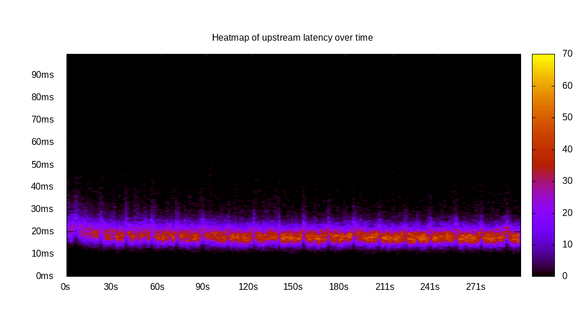
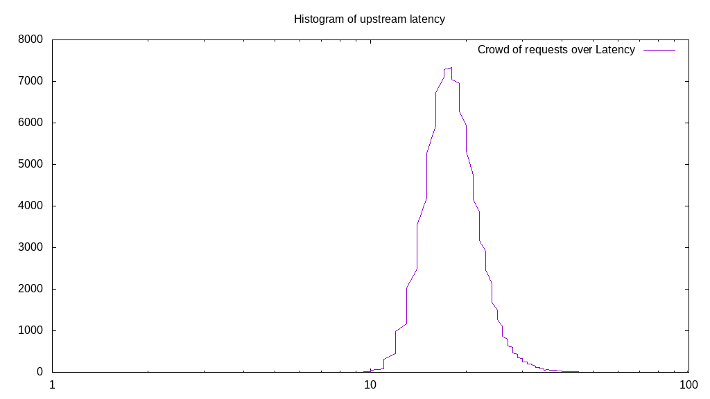
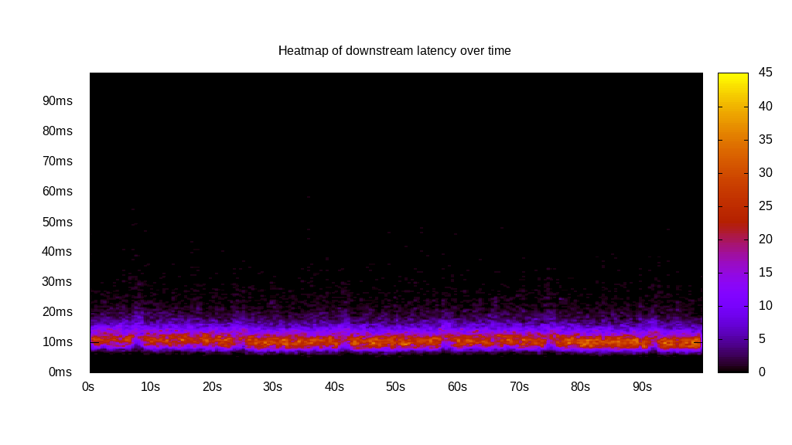
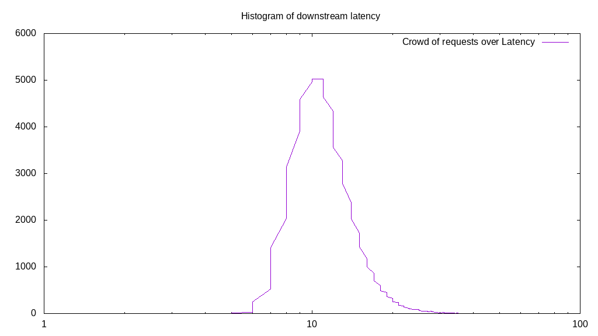
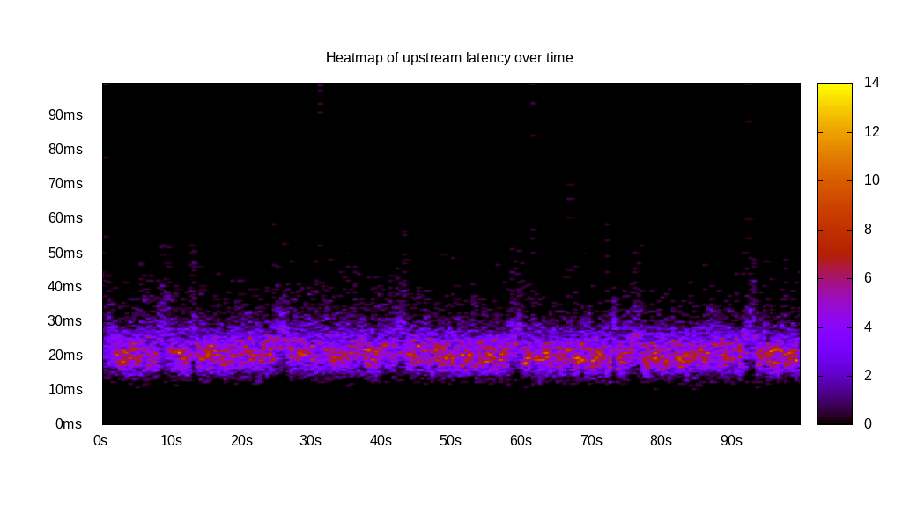
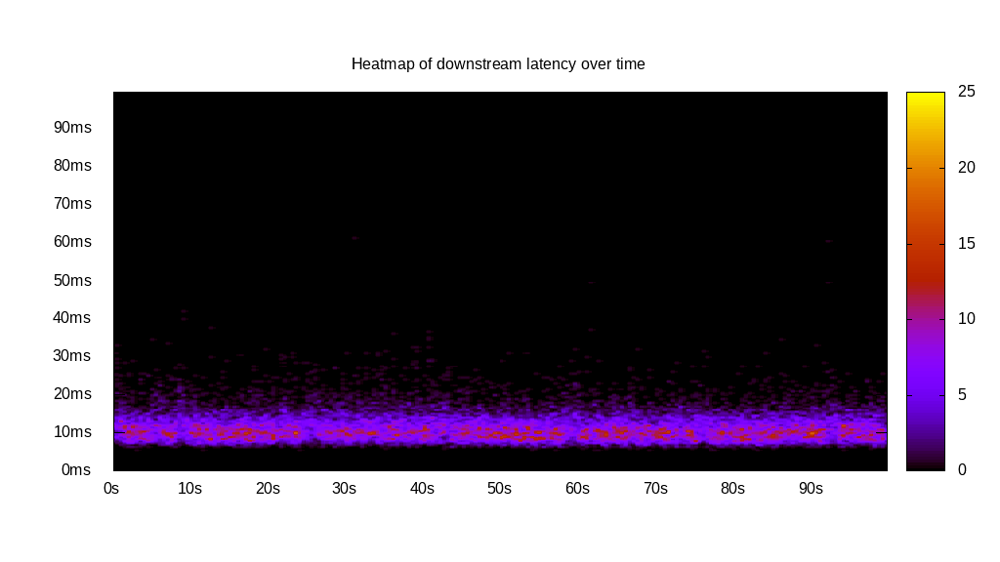
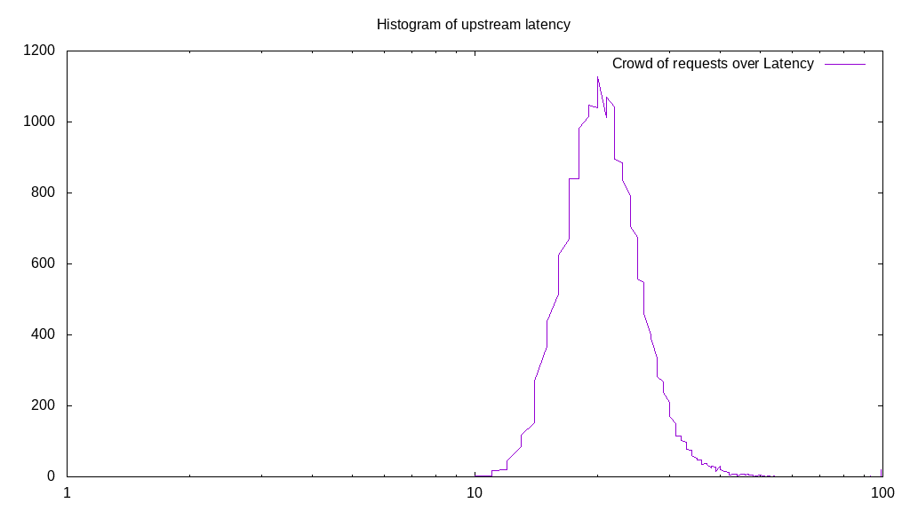
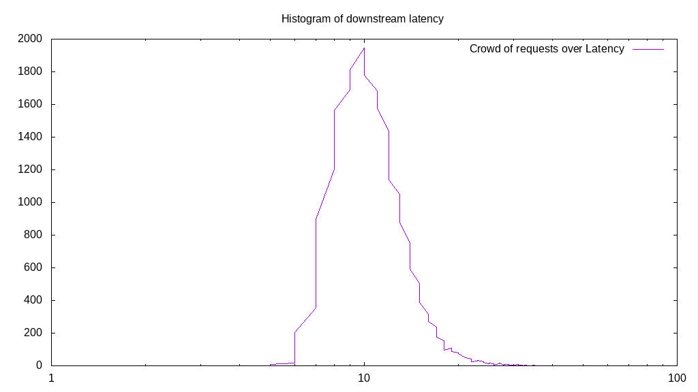
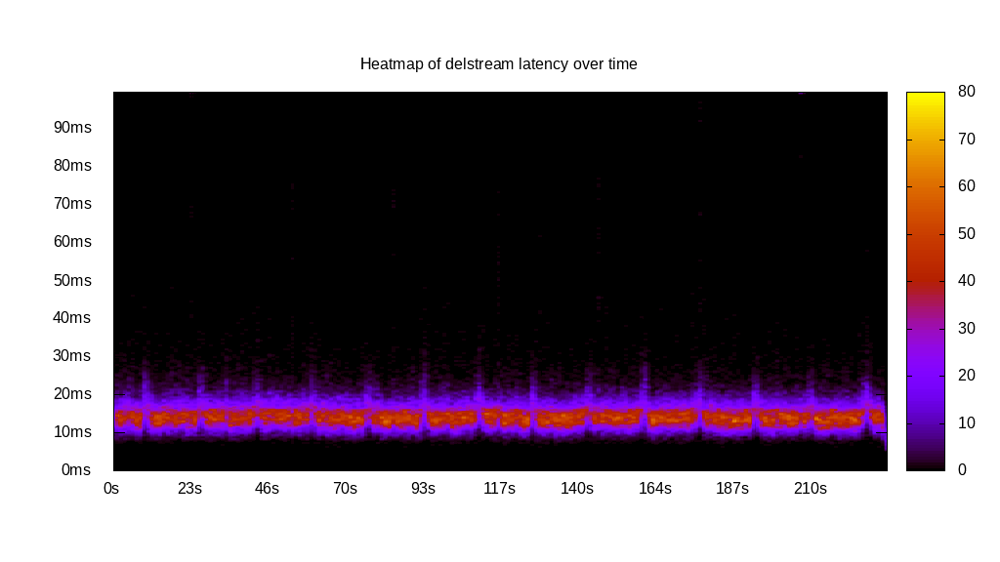
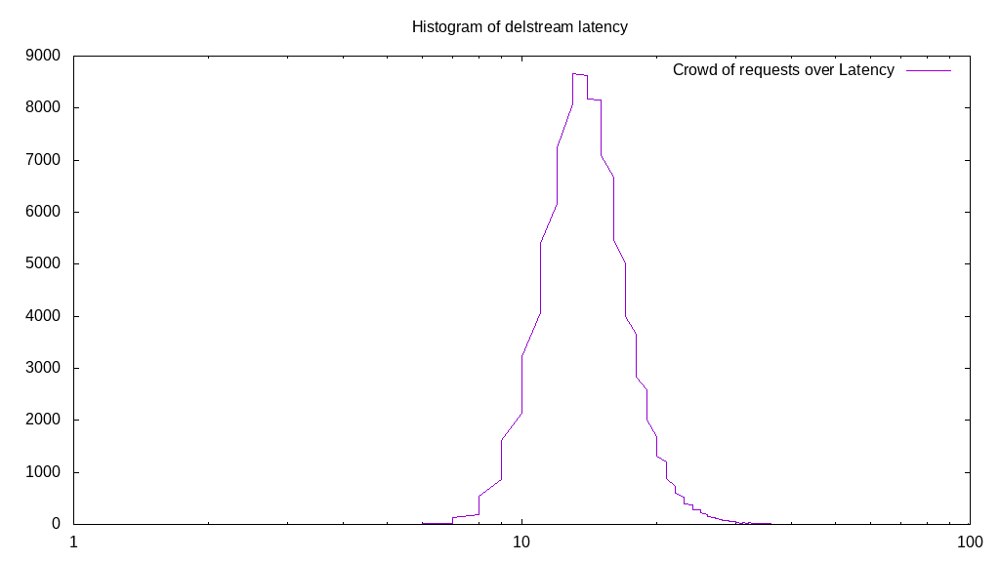

# Latency benchmark report. Crowd is 8

## Populate workload

## Object Size is 32.00kiB

### PUT Latency in ms over time

Evolution of PUT Latency over time

| Parameter | Value |
| --- | --- |
| Y Coordinate | PUT Latency in ms |
| X Coordinate | time in s since begining of workload |

### PUT Latency distribution in ms

Distribution of the PUT Latency in ms

| Parameter | Value |
| --- | --- |
| Y Coordinate | Number of PUT |
| X Coordinate | Latency in ms |
| Server volume | 3826.719MiB|
| Server bandwidth | 12.756MiB/s |
| Server time | 300.00s |
| Server load | 7.94 |
| Server responses | 122455PUT |
| Server IOps | 408.18PUT/s |
| Client bandwidth | 1.594MiB/s |
| Client volume | 478.340MiB|
| Client time | 2382.78s |
| Client IOps |  51.39PUT/s  |
| Client Latency | 19.46ms/PUT |
| Client Limbo | 2.15ms/PUT |
| Crowd time | 2399.99s |
| Crowd efficiency | 99.28% |
| Highest Latency | 100.00ms |
| 95th percentile Latency | 27.14ms |
| 68th percentile Latency | 21.11ms |
| 50th percentile Latency | 19.10ms |
| 32nd percentile Latency | 17.59ms |
| 5th percentile Latency | 14.57ms |
| Lowest Latency | 9.05ms |

## Read workload

## Object Size is 32.00kiB

### GET Latency in ms over time

Evolution of GET Latency over time

| Parameter | Value |
| --- | --- |
| Y Coordinate | GET Latency in ms |
| X Coordinate | time in s since begining of workload |

### GET Latency distribution in ms

Distribution of the GET Latency in ms

| Parameter | Value |
| --- | --- |
| Y Coordinate | Number of GET |
| X Coordinate | Latency in ms |
| Server volume | 2030.188MiB|
| Server bandwidth | 20.299MiB/s |
| Server time | 100.02s |
| Server load | 7.92 |
| Server responses | 64966GET |
| Server IOps | 649.56GET/s |
| Client bandwidth | 2.537MiB/s |
| Client volume | 253.773MiB|
| Client time | 791.78s |
| Client IOps |  82.05GET/s  |
| Client Latency | 12.19ms/GET |
| Client Limbo | 1.04ms/GET |
| Crowd time | 800.13s |
| Crowd efficiency | 98.96% |
| Highest Latency | 59.30ms |
| 95th percentile Latency | 19.10ms |
| 68th percentile Latency | 13.57ms |
| 50th percentile Latency | 12.06ms |
| 32nd percentile Latency | 10.55ms |
| 5th percentile Latency | 8.54ms |
| Lowest Latency | 5.53ms |

## Mixed workload

## Object Size is 32.00kiB

### PUT Latency in ms over time

Evolution of PUT Latency over time

| Parameter | Value |
| --- | --- |
| Y Coordinate | PUT Latency in ms |
| X Coordinate | time in s since begining of workload |

### GET Latency in ms over time

Evolution of GET Latency over time

| Parameter | Value |
| --- | --- |
| Y Coordinate | GET Latency in ms |
| X Coordinate | time in s since begining of workload |

### PUT Latency distribution in ms

Distribution of the PUT Latency in ms

| Parameter | Value |
| --- | --- |
| Y Coordinate | Number of PUT |
| X Coordinate | Latency in ms |
| Server volume | 730.406MiB|
| Server bandwidth | 7.303MiB/s |
| Server time | 100.01s |
| Server load | 5.24 |
| Server responses | 23373PUT |
| Server IOps | 233.71PUT/s |
| Client bandwidth | 0.913MiB/s |
| Client volume | 91.301MiB|
| Client time | 523.69s |
| Client IOps |  44.63PUT/s  |
| Client Latency | 22.41ms/PUT |
| Client Limbo | 34.55ms/PUT |
| Crowd time | 800.08s |
| Crowd efficiency | 65.46% |
| Highest Latency | 100.00ms |
| 95th percentile Latency | 32.16ms |
| 68th percentile Latency | 24.12ms |
| 50th percentile Latency | 22.11ms |
| 32nd percentile Latency | 20.10ms |
| 5th percentile Latency | 16.08ms |
| Lowest Latency | 10.55ms |

### GET Latency distribution in ms

Distribution of the GET Latency in ms

| Parameter | Value |
| --- | --- |
| Y Coordinate | Number of GET |
| X Coordinate | Latency in ms |
| Server volume | 734.063MiB|
| Server bandwidth | 7.340MiB/s |
| Server time | 100.01s |
| Server load | 2.70 |
| Server responses | 23490GET |
| Server IOps | 234.88GET/s |
| Client bandwidth | 0.917MiB/s |
| Client volume | 91.758MiB|
| Client time | 270.25s |
| Client IOps |  86.92GET/s  |
| Client Latency | 11.50ms/GET |
| Client Limbo | 66.23ms/GET |
| Crowd time | 800.08s |
| Crowd efficiency | 33.78% |
| Highest Latency | 62.31ms |
| 95th percentile Latency | 18.09ms |
| 68th percentile Latency | 12.56ms |
| 50th percentile Latency | 11.56ms |
| 32nd percentile Latency | 10.05ms |
| 5th percentile Latency | 8.04ms |
| Lowest Latency | 5.53ms |

## Cleanup workload

## Object Size is 32.00kiB

### DELETE Latency in ms over time

Evolution of DELETE Latency over time

| Parameter | Value |
| --- | --- |
| Y Coordinate | DELETE Latency in ms |
| X Coordinate | time in s since begining of workload |

### DELETE Latency distribution in ms

Distribution of the DELETE Latency in ms

| Parameter | Value |
| --- | --- |
| Y Coordinate | Number of DELETE |
| X Coordinate | Latency in ms |
| Server volume | 3826.969MiB|
| Server bandwidth | 16.412MiB/s |
| Server time | 233.18s |
| Server load | 7.91 |
| Server responses | 122463DELETE |
| Server IOps | 525.18DELETE/s |
| Client bandwidth | 2.051MiB/s |
| Client volume | 478.371MiB|
| Client time | 1845.61s |
| Client IOps |  66.35DELETE/s  |
| Client Latency | 15.07ms/DELETE |
| Client Limbo | 2.48ms/DELETE |
| Crowd time | 1865.47s |
| Crowd efficiency | 98.94% |
| Highest Latency | 100.00ms |
| 95th percentile Latency | 21.61ms |
| 68th percentile Latency | 16.58ms |
| 50th percentile Latency | 15.08ms |
| 32nd percentile Latency | 13.57ms |
| 5th percentile Latency | 11.06ms |
| Lowest Latency | 5.53ms |

