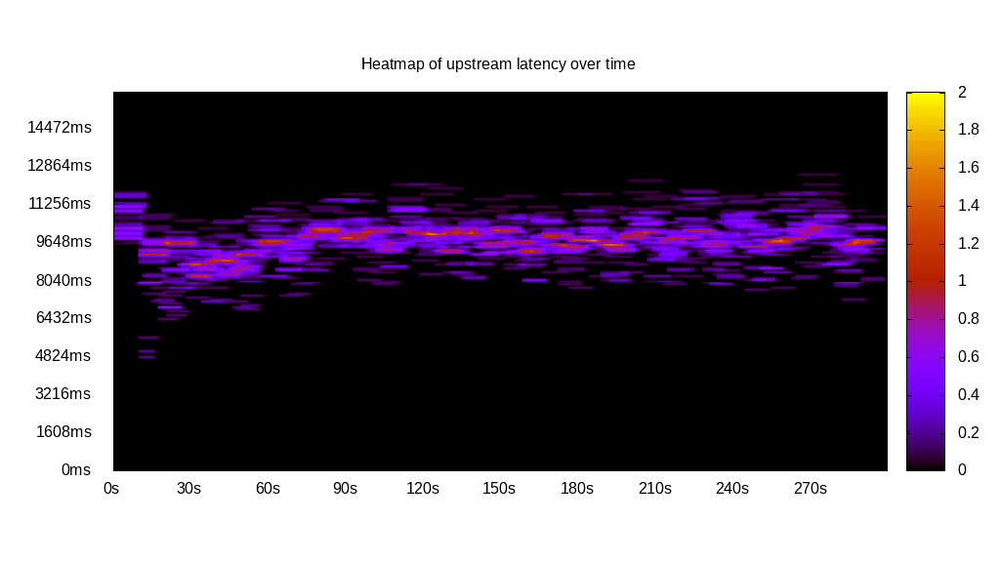
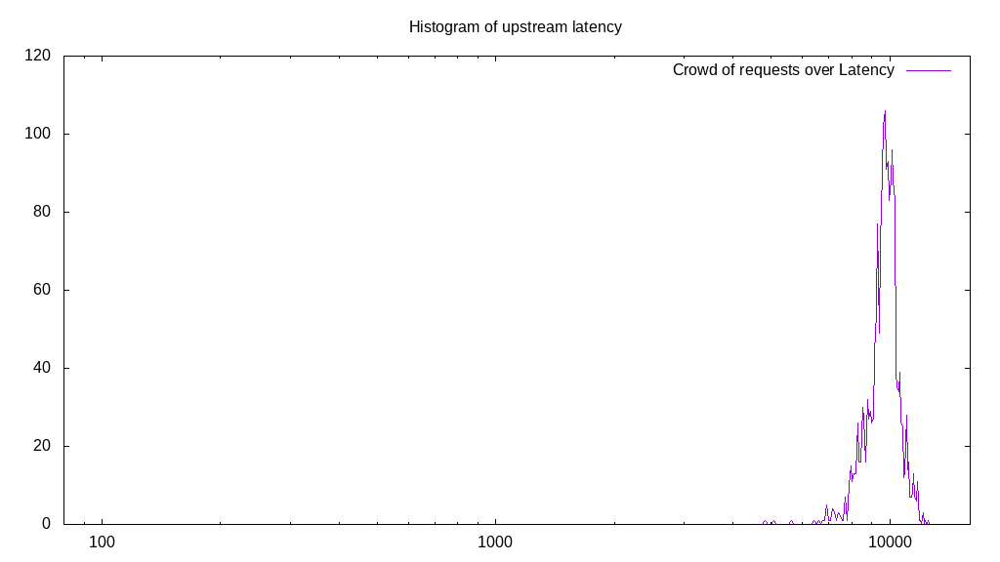
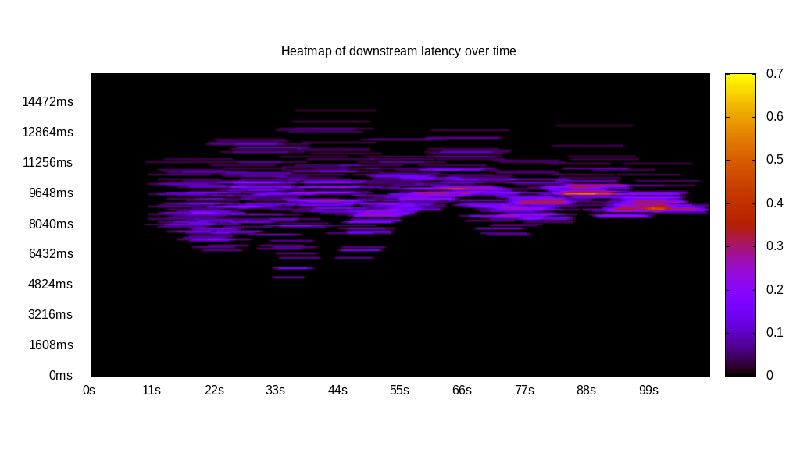
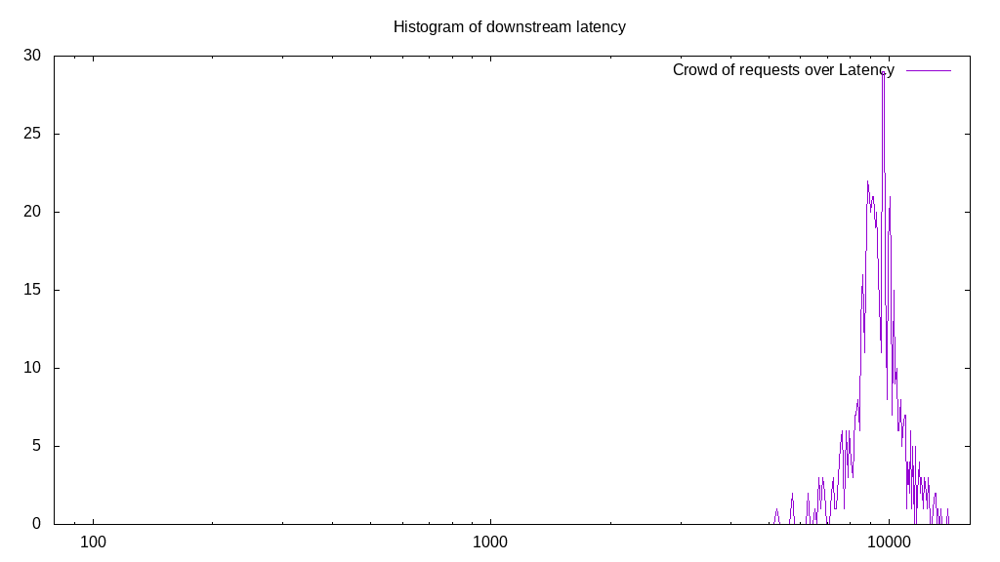
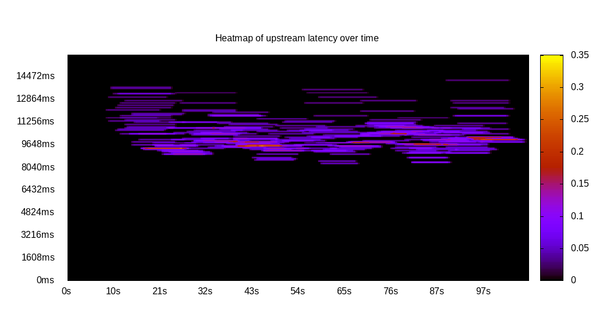
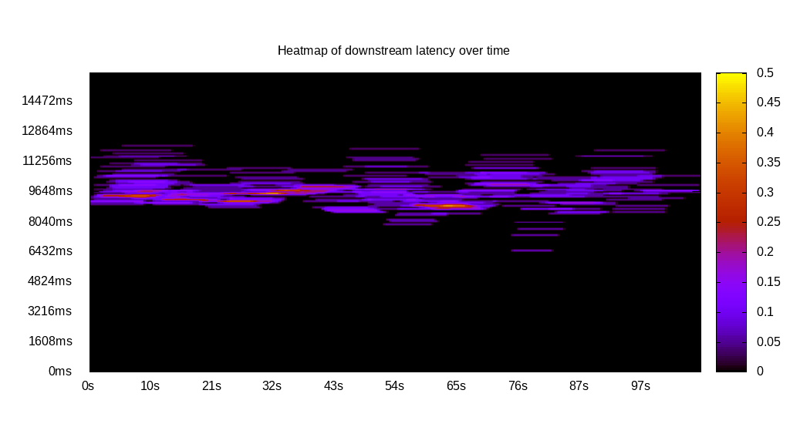
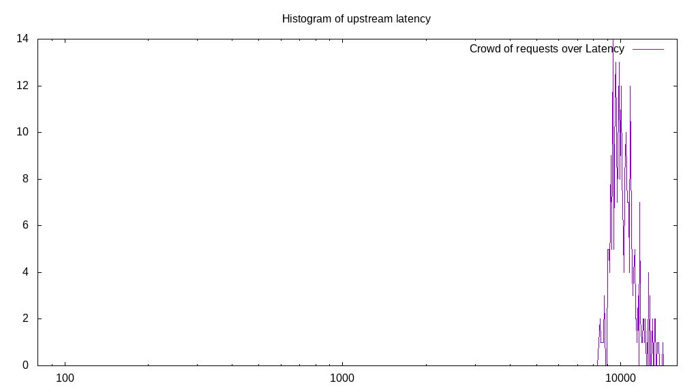
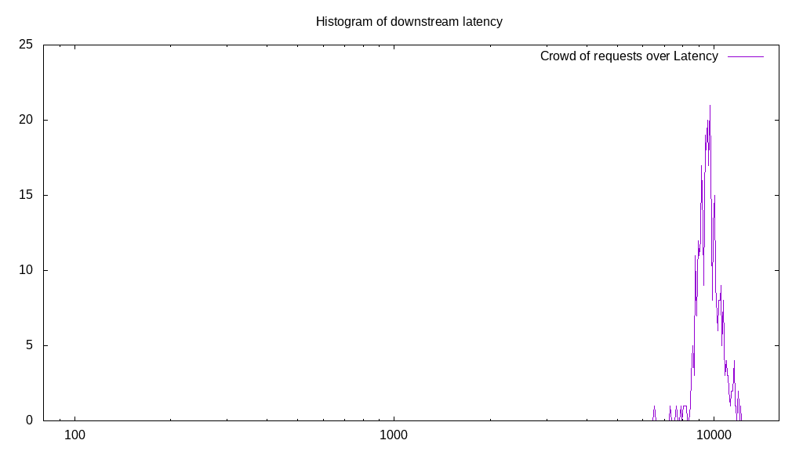
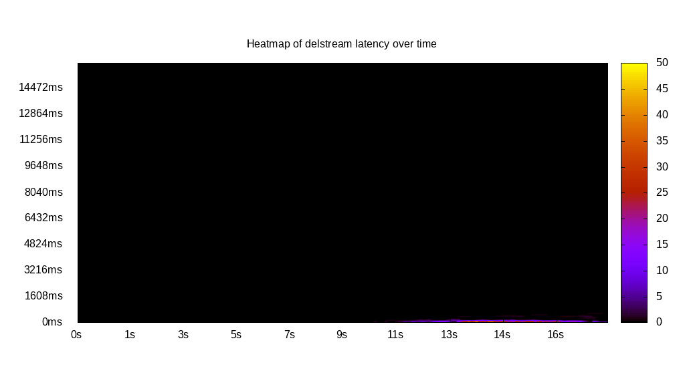
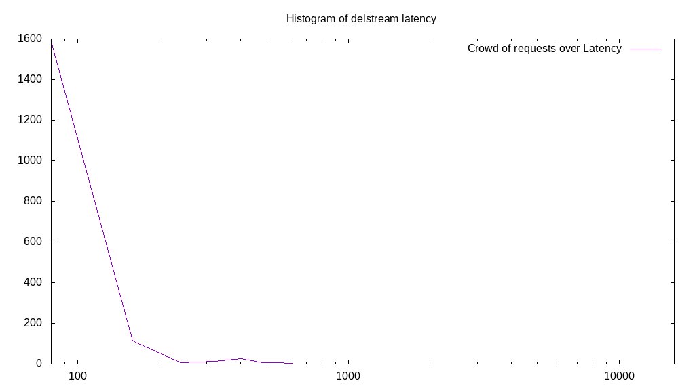

# Latency benchmark report. Crowd is 64

## Populate workload

## Object Size is 32768.00kiB

### PUT Latency in ms over time

Evolution of PUT Latency over time

| Parameter | Value |
| --- | --- |
| Y Coordinate | PUT Latency in ms |
| X Coordinate | time in s since begining of workload |

### PUT Latency distribution in ms

Distribution of the PUT Latency in ms

| Parameter | Value |
| --- | --- |
| Y Coordinate | Number of PUT |
| X Coordinate | Latency in ms |
| Server volume | 62080.000MiB|
| Server bandwidth | 207.467MiB/s |
| Server time | 299.23s |
| Server load | 63.03 |
| Server responses | 1940PUT |
| Server IOps | 6.48PUT/s |
| Client bandwidth | 3.242MiB/s |
| Client volume | 970.000MiB|
| Client time | 18860.36s |
| Client IOps |  0.10PUT/s  |
| Client Latency | 9721.83ms/PUT |
| Client Limbo | 4.54ms/PUT |
| Crowd time | 19150.66s |
| Crowd efficiency | 98.48% |
| Highest Latency | 12542.71ms |
| 95th percentile Latency | 11175.88ms |
| 68th percentile Latency | 10130.65ms |
| 50th percentile Latency | 9889.45ms |
| 32nd percentile Latency | 9567.84ms |
| 5th percentile Latency | 8281.41ms |
| Lowest Latency | 4824.12ms |

## Read workload

## Object Size is 32768.00kiB

### GET Latency in ms over time

Evolution of GET Latency over time

| Parameter | Value |
| --- | --- |
| Y Coordinate | GET Latency in ms |
| X Coordinate | time in s since begining of workload |

### GET Latency distribution in ms

Distribution of the GET Latency in ms

| Parameter | Value |
| --- | --- |
| Y Coordinate | Number of GET |
| X Coordinate | Latency in ms |
| Server volume | 19456.000MiB|
| Server bandwidth | 176.281MiB/s |
| Server time | 110.37s |
| Server load | 52.49 |
| Server responses | 608GET |
| Server IOps | 5.51GET/s |
| Client bandwidth | 2.754MiB/s |
| Client volume | 304.000MiB|
| Client time | 5793.07s |
| Client IOps |  0.10GET/s  |
| Client Latency | 9528.08ms/GET |
| Client Limbo | 19.85ms/GET |
| Crowd time | 7063.62s |
| Crowd efficiency | 82.01% |
| Highest Latency | 14070.35ms |
| 95th percentile Latency | 11979.90ms |
| 68th percentile Latency | 10050.25ms |
| 50th percentile Latency | 9567.84ms |
| 32nd percentile Latency | 9085.43ms |
| 5th percentile Latency | 7718.59ms |
| Lowest Latency | 5226.13ms |

## Mixed workload

## Object Size is 32768.00kiB

### PUT Latency in ms over time

Evolution of PUT Latency over time

| Parameter | Value |
| --- | --- |
| Y Coordinate | PUT Latency in ms |
| X Coordinate | time in s since begining of workload |

### GET Latency in ms over time

Evolution of GET Latency over time

| Parameter | Value |
| --- | --- |
| Y Coordinate | GET Latency in ms |
| X Coordinate | time in s since begining of workload |

### PUT Latency distribution in ms

Distribution of the PUT Latency in ms

| Parameter | Value |
| --- | --- |
| Y Coordinate | Number of PUT |
| X Coordinate | Latency in ms |
| Server volume | 8672.000MiB|
| Server bandwidth | 80.058MiB/s |
| Server time | 108.32s |
| Server load | 25.97 |
| Server responses | 271PUT |
| Server IOps | 2.50PUT/s |
| Client bandwidth | 1.251MiB/s |
| Client volume | 135.500MiB|
| Client time | 2813.02s |
| Client IOps |  0.10PUT/s  |
| Client Latency | 10380.14ms/PUT |
| Client Limbo | 64.37ms/PUT |
| Crowd time | 6932.54s |
| Crowd efficiency | 40.58% |
| Highest Latency | 14231.16ms |
| 95th percentile Latency | 12703.52ms |
| 68th percentile Latency | 10773.87ms |
| 50th percentile Latency | 10211.06ms |
| 32nd percentile Latency | 9809.05ms |
| 5th percentile Latency | 9085.43ms |
| Lowest Latency | 8361.81ms |

### GET Latency distribution in ms

Distribution of the GET Latency in ms

| Parameter | Value |
| --- | --- |
| Y Coordinate | Number of GET |
| X Coordinate | Latency in ms |
| Server volume | 11424.000MiB|
| Server bandwidth | 105.464MiB/s |
| Server time | 108.32s |
| Server load | 32.10 |
| Server responses | 357GET |
| Server IOps | 3.30GET/s |
| Client bandwidth | 1.648MiB/s |
| Client volume | 178.500MiB|
| Client time | 3477.44s |
| Client IOps |  0.10GET/s  |
| Client Latency | 9740.74ms/GET |
| Client Limbo | 53.99ms/GET |
| Crowd time | 6932.54s |
| Crowd efficiency | 50.16% |
| Highest Latency | 12140.70ms |
| 95th percentile Latency | 11256.28ms |
| 68th percentile Latency | 10050.25ms |
| 50th percentile Latency | 9728.64ms |
| 32nd percentile Latency | 9487.44ms |
| 5th percentile Latency | 8763.82ms |
| Lowest Latency | 6512.56ms |

## Cleanup workload

## Object Size is 32768.00kiB

### DELETE Latency in ms over time

Evolution of DELETE Latency over time

| Parameter | Value |
| --- | --- |
| Y Coordinate | DELETE Latency in ms |
| X Coordinate | time in s since begining of workload |

### DELETE Latency distribution in ms

Distribution of the DELETE Latency in ms

| Parameter | Value |
| --- | --- |
| Y Coordinate | Number of DELETE |
| X Coordinate | Latency in ms |
| Server volume | 62560.000MiB|
| Server bandwidth | 3383.451MiB/s |
| Server time | 18.49s |
| Server load | 8.73 |
| Server responses | 1955DELETE |
| Server IOps | 105.73DELETE/s |
| Client bandwidth | 52.866MiB/s |
| Client volume | 977.500MiB|
| Client time | 161.37s |
| Client IOps |  12.12DELETE/s  |
| Client Latency | 82.54ms/DELETE |
| Client Limbo | 15.97ms/DELETE |
| Crowd time | 1183.36s |
| Crowd efficiency | 13.64% |
| Highest Latency | 562.81ms |
| 95th percentile Latency | 241.21ms |
| 68th percentile Latency | 160.80ms |
| 50th percentile Latency | 160.80ms |
| 32nd percentile Latency | 160.80ms |
| 5th percentile Latency | 80.40ms |
| Lowest Latency | 80.40ms |

