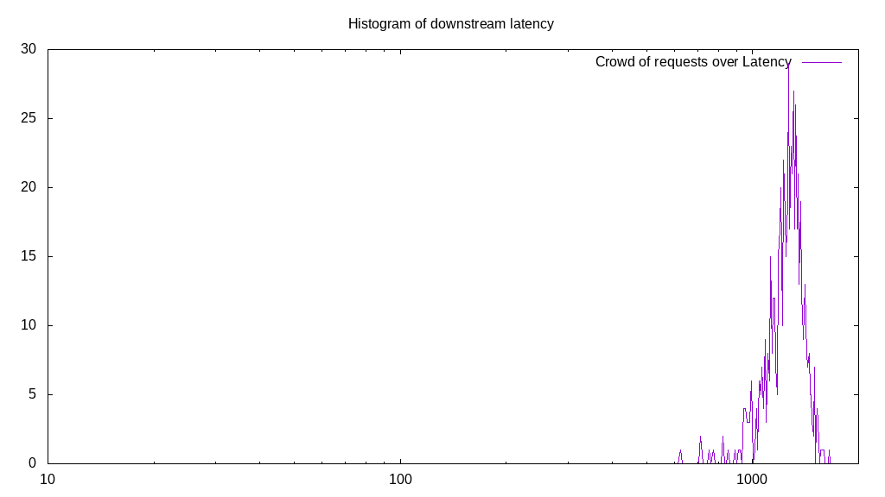

# Latency benchmark report. Crowd is 8

## Populate workload

## Object Size is 32768.00kiB

### PUT Latency in ms over time

Evolution of PUT Latency over time

| Parameter | Value |
| --- | --- |
| Y Coordinate | PUT Latency in ms |
| X Coordinate | time in s since begining of workload |

### PUT Latency distribution in ms

Distribution of the PUT Latency in ms

| Parameter | Value |
| --- | --- |
| Y Coordinate | Number of PUT |
| X Coordinate | Latency in ms |
| Server volume | 68160.000MiB|
| Server bandwidth | 227.225MiB/s |
| Server time | 299.97s |
| Server load | 7.98 |
| Server responses | 2130PUT |
| Server IOps | 7.10PUT/s |
| Client bandwidth | 28.403MiB/s |
| Client volume | 8520.000MiB|
| Client time | 2394.59s |
| Client IOps |  0.89PUT/s  |
| Client Latency | 1124.22ms/PUT |
| Client Limbo | 0.64ms/PUT |
| Crowd time | 2399.74s |
| Crowd efficiency | 99.79% |
| Highest Latency | 1557.79ms |
| 95th percentile Latency | 1336.68ms |
| 68th percentile Latency | 1195.98ms |
| 50th percentile Latency | 1135.68ms |
| 32nd percentile Latency | 1085.43ms |
| 5th percentile Latency | 914.57ms |
| Lowest Latency | 552.76ms |

## Read workload

## Object Size is 32768.00kiB

### GET Latency in ms over time

Evolution of GET Latency over time

| Parameter | Value |
| --- | --- |
| Y Coordinate | GET Latency in ms |
| X Coordinate | time in s since begining of workload |

### GET Latency distribution in ms

Distribution of the GET Latency in ms

| Parameter | Value |
| --- | --- |
| Y Coordinate | Number of GET |
| X Coordinate | Latency in ms |
| Server volume | 20128.000MiB|
| Server bandwidth | 199.232MiB/s |
| Server time | 101.03s |
| Server load | 7.84 |
| Server responses | 629GET |
| Server IOps | 6.23GET/s |
| Client bandwidth | 24.904MiB/s |
| Client volume | 2516.000MiB|
| Client time | 792.29s |
| Client IOps |  0.79GET/s  |
| Client Latency | 1259.61ms/GET |
| Client Limbo | 1.99ms/GET |
| Crowd time | 808.22s |
| Crowd efficiency | 98.03% |
| Highest Latency | 1648.24ms |
| 95th percentile Latency | 1477.39ms |
| 68th percentile Latency | 1336.68ms |
| 50th percentile Latency | 1286.43ms |
| 32nd percentile Latency | 1226.13ms |
| 5th percentile Latency | 1005.03ms |
| Lowest Latency | 623.12ms |

## Mixed workload

## Object Size is 32768.00kiB

### PUT Latency in ms over time

Evolution of PUT Latency over time

| Parameter | Value |
| --- | --- |
| Y Coordinate | PUT Latency in ms |
| X Coordinate | time in s since begining of workload |

### GET Latency in ms over time

Evolution of GET Latency over time

| Parameter | Value |
| --- | --- |
| Y Coordinate | GET Latency in ms |
| X Coordinate | time in s since begining of workload |

### PUT Latency distribution in ms

Distribution of the PUT Latency in ms

| Parameter | Value |
| --- | --- |
| Y Coordinate | Number of PUT |
| X Coordinate | Latency in ms |
| Server volume | 10272.000MiB|
| Server bandwidth | 101.835MiB/s |
| Server time | 100.87s |
| Server load | 3.92 |
| Server responses | 321PUT |
| Server IOps | 3.18PUT/s |
| Client bandwidth | 12.729MiB/s |
| Client volume | 1284.000MiB|
| Client time | 395.64s |
| Client IOps |  0.81PUT/s  |
| Client Latency | 1232.54ms/PUT |
| Client Limbo | 51.41ms/PUT |
| Crowd time | 806.95s |
| Crowd efficiency | 49.03% |
| Highest Latency | 1628.14ms |
| 95th percentile Latency | 1457.29ms |
| 68th percentile Latency | 1296.48ms |
| 50th percentile Latency | 1236.18ms |
| 32nd percentile Latency | 1185.93ms |
| 5th percentile Latency | 1045.23ms |
| Lowest Latency | 914.57ms |

### GET Latency distribution in ms

Distribution of the GET Latency in ms

| Parameter | Value |
| --- | --- |
| Y Coordinate | Number of GET |
| X Coordinate | Latency in ms |
| Server volume | 10560.000MiB|
| Server bandwidth | 104.690MiB/s |
| Server time | 100.87s |
| Server load | 4.01 |
| Server responses | 330GET |
| Server IOps | 3.27GET/s |
| Client bandwidth | 13.086MiB/s |
| Client volume | 1320.000MiB|
| Client time | 404.94s |
| Client IOps |  0.81GET/s  |
| Client Latency | 1227.09ms/GET |
| Client Limbo | 50.25ms/GET |
| Crowd time | 806.95s |
| Crowd efficiency | 50.18% |
| Highest Latency | 1587.94ms |
| 95th percentile Latency | 1437.19ms |
| 68th percentile Latency | 1286.43ms |
| 50th percentile Latency | 1236.18ms |
| 32nd percentile Latency | 1185.93ms |
| 5th percentile Latency | 1035.18ms |
| Lowest Latency | 904.52ms |

## Cleanup workload

## Object Size is 32768.00kiB

### DELETE Latency in ms over time

Evolution of DELETE Latency over time

| Parameter | Value |
| --- | --- |
| Y Coordinate | DELETE Latency in ms |
| X Coordinate | time in s since begining of workload |

### DELETE Latency distribution in ms

Distribution of the DELETE Latency in ms

| Parameter | Value |
| --- | --- |
| Y Coordinate | Number of DELETE |
| X Coordinate | Latency in ms |
| Server volume | 68416.000MiB|
| Server bandwidth | 8490.444MiB/s |
| Server time | 8.06s |
| Server load | 6.05 |
| Server responses | 2138DELETE |
| Server IOps | 265.33DELETE/s |
| Client bandwidth | 1061.306MiB/s |
| Client volume | 8552.000MiB|
| Client time | 48.71s |
| Client IOps |  43.89DELETE/s  |
| Client Latency | 22.78ms/DELETE |
| Client Limbo | 1.97ms/DELETE |
| Crowd time | 64.46s |
| Crowd efficiency | 75.57% |
| Highest Latency | 190.95ms |
| 95th percentile Latency | 40.20ms |
| 68th percentile Latency | 30.15ms |
| 50th percentile Latency | 30.15ms |
| 32nd percentile Latency | 30.15ms |
| 5th percentile Latency | 20.10ms |
| Lowest Latency | 10.05ms |

