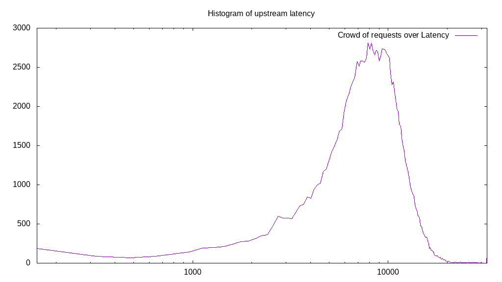
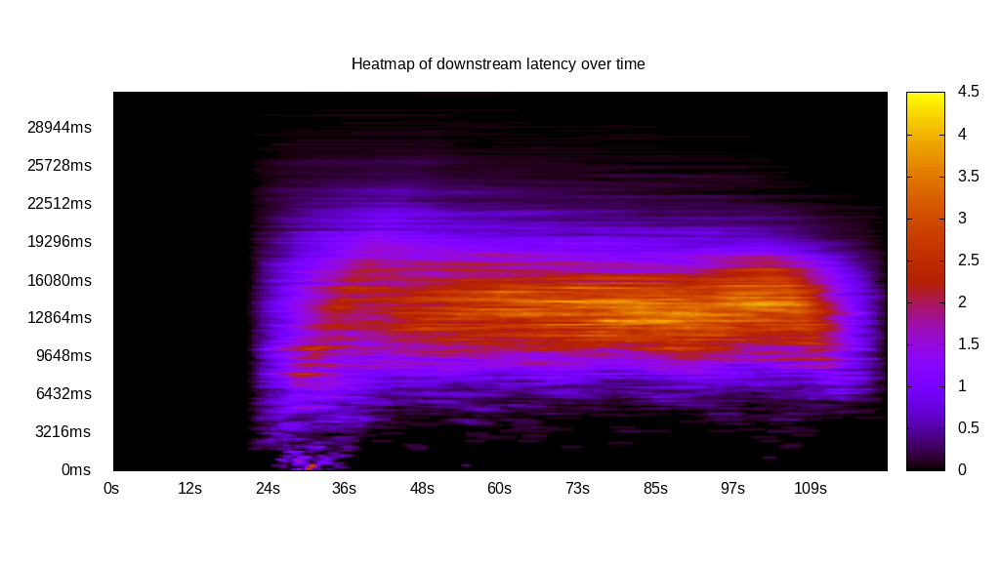
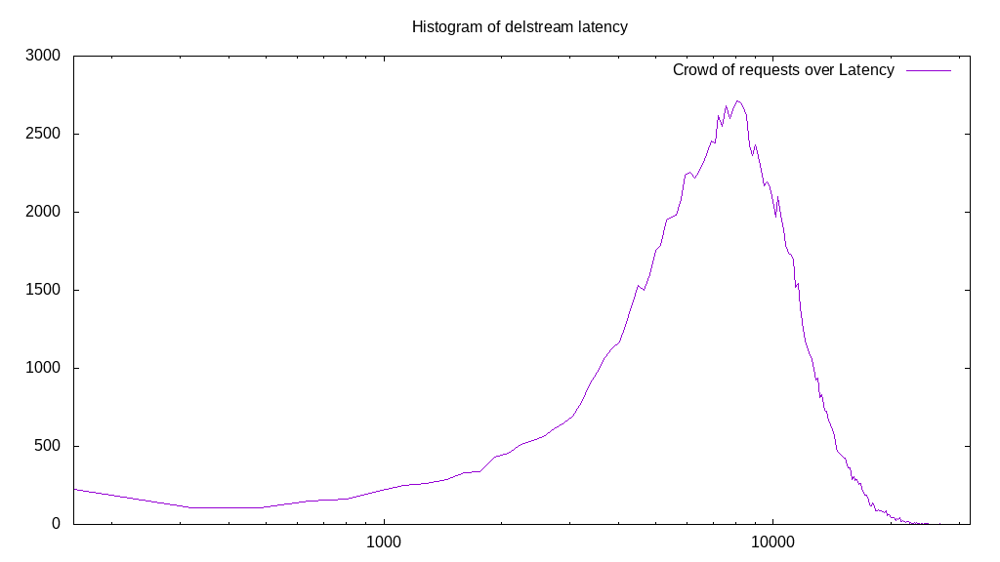

# Latency benchmark report. Crowd is 4096

## Populate workload

## Object Size is 0.00kiB

### PUT Latency in ms over time

Evolution of PUT Latency over time

| Parameter | Value |
| --- | --- |
| Y Coordinate | PUT Latency in ms |
| X Coordinate | time in s since begining of workload |

### PUT Latency distribution in ms

Distribution of the PUT Latency in ms

| Parameter | Value |
| --- | --- |
| Y Coordinate | Number of PUT |
| X Coordinate | Latency in ms |
| Server volume | 0.000MiB|
| Server bandwidth | 0.000MiB/s |
| Server time | 300.00s |
| Server load | 4023.17 |
| Server responses | 136413PUT |
| Server IOps | 454.72PUT/s |
| Client bandwidth | 0.000MiB/s |
| Client volume | 0.000MiB|
| Client time | 1206935.68s |
| Client IOps |  0.11PUT/s  |
| Client Latency | 8847.66ms/PUT |
| Client Limbo | 5.33ms/PUT |
| Crowd time | 1228783.62s |
| Crowd efficiency | 98.22% |
| Highest Latency | 49403.00ms |
| 95th percentile Latency | 14647.12ms |
| 68th percentile Latency | 10426.76ms |
| 50th percentile Latency | 8937.23ms |
| 32nd percentile Latency | 7447.69ms |
| 5th percentile Latency | 3723.84ms |
| Lowest Latency | 248.26ms |

## Read workload

## Object Size is 0.00kiB

### GET Latency in ms over time

Evolution of GET Latency over time

| Parameter | Value |
| --- | --- |
| Y Coordinate | GET Latency in ms |
| X Coordinate | time in s since begining of workload |

### GET Latency distribution in ms

Distribution of the GET Latency in ms

| Parameter | Value |
| --- | --- |
| Y Coordinate | Number of GET |
| X Coordinate | Latency in ms |
| Server volume | 0.000MiB|
| Server bandwidth | 0.000MiB/s |
| Server time | 121.33s |
| Server load | 2933.96 |
| Server responses | 25901GET |
| Server IOps | 213.47GET/s |
| Client bandwidth | 0.000MiB/s |
| Client volume | 0.000MiB|
| Client time | 355992.63s |
| Client IOps |  0.07GET/s  |
| Client Latency | 13744.36ms/GET |
| Client Limbo | 34.42ms/GET |
| Crowd time | 496988.16s |
| Crowd efficiency | 71.63% |
| Highest Latency | 34259.37ms |
| 95th percentile Latency | 21350.04ms |
| 68th percentile Latency | 15888.40ms |
| 50th percentile Latency | 13902.35ms |
| 32nd percentile Latency | 11916.30ms |
| 5th percentile Latency | 7199.43ms |
| Lowest Latency | 248.26ms |

## Mixed workload

## Object Size is 0.00kiB

### PUT Latency in ms over time

Evolution of PUT Latency over time

| Parameter | Value |
| --- | --- |
| Y Coordinate | PUT Latency in ms |
| X Coordinate | time in s since begining of workload |

### GET Latency in ms over time

Evolution of GET Latency over time

| Parameter | Value |
| --- | --- |
| Y Coordinate | GET Latency in ms |
| X Coordinate | time in s since begining of workload |

### PUT Latency distribution in ms

Distribution of the PUT Latency in ms

| Parameter | Value |
| --- | --- |
| Y Coordinate | Number of PUT |
| X Coordinate | Latency in ms |
| Server volume | 0.000MiB|
| Server bandwidth | 0.000MiB/s |
| Server time | 123.14s |
| Server load | 1184.35 |
| Server responses | 16492PUT |
| Server IOps | 133.92PUT/s |
| Client bandwidth | 0.000MiB/s |
| Client volume | 0.000MiB|
| Client time | 145846.24s |
| Client IOps |  0.11PUT/s  |
| Client Latency | 8843.45ms/PUT |
| Client Limbo | 87.54ms/PUT |
| Crowd time | 504401.92s |
| Crowd efficiency | 28.91% |
| Highest Latency | 28301.22ms |
| 95th percentile Latency | 14895.38ms |
| 68th percentile Latency | 10675.02ms |
| 50th percentile Latency | 8937.23ms |
| 32nd percentile Latency | 7447.69ms |
| 5th percentile Latency | 3475.59ms |
| Lowest Latency | 248.26ms |

### GET Latency distribution in ms

Distribution of the GET Latency in ms

| Parameter | Value |
| --- | --- |
| Y Coordinate | Number of GET |
| X Coordinate | Latency in ms |
| Server volume | 0.000MiB|
| Server bandwidth | 0.000MiB/s |
| Server time | 123.14s |
| Server load | 2161.59 |
| Server responses | 19724GET |
| Server IOps | 160.17GET/s |
| Client bandwidth | 0.000MiB/s |
| Client volume | 0.000MiB|
| Client time | 266188.46s |
| Client IOps |  0.07GET/s  |
| Client Latency | 13495.66ms/GET |
| Client Limbo | 58.16ms/GET |
| Crowd time | 504401.92s |
| Crowd efficiency | 52.77% |
| Highest Latency | 33514.60ms |
| 95th percentile Latency | 20357.02ms |
| 68th percentile Latency | 15640.15ms |
| 50th percentile Latency | 13654.10ms |
| 32nd percentile Latency | 11916.30ms |
| 5th percentile Latency | 7199.43ms |
| Lowest Latency | 496.51ms |

## Cleanup workload

## Object Size is 0.00kiB

### DELETE Latency in ms over time

Evolution of DELETE Latency over time

| Parameter | Value |
| --- | --- |
| Y Coordinate | DELETE Latency in ms |
| X Coordinate | time in s since begining of workload |

### DELETE Latency distribution in ms

Distribution of the DELETE Latency in ms

| Parameter | Value |
| --- | --- |
| Y Coordinate | Number of DELETE |
| X Coordinate | Latency in ms |
| Server volume | 0.000MiB|
| Server bandwidth | 0.000MiB/s |
| Server time | 328.59s |
| Server load | 3536.85 |
| Server responses | 136421DELETE |
| Server IOps | 415.17DELETE/s |
| Client bandwidth | 0.000MiB/s |
| Client volume | 0.000MiB|
| Client time | 1162163.11s |
| Client IOps |  0.12DELETE/s  |
| Client Latency | 8518.95ms/DELETE |
| Client Limbo | 44.86ms/DELETE |
| Crowd time | 1345892.35s |
| Crowd efficiency | 86.35% |
| Highest Latency | 31776.80ms |
| 95th percentile Latency | 15143.63ms |
| 68th percentile Latency | 10178.51ms |
| 50th percentile Latency | 8440.71ms |
| 32nd percentile Latency | 6951.18ms |
| 5th percentile Latency | 3475.59ms |
| Lowest Latency | 248.26ms |

