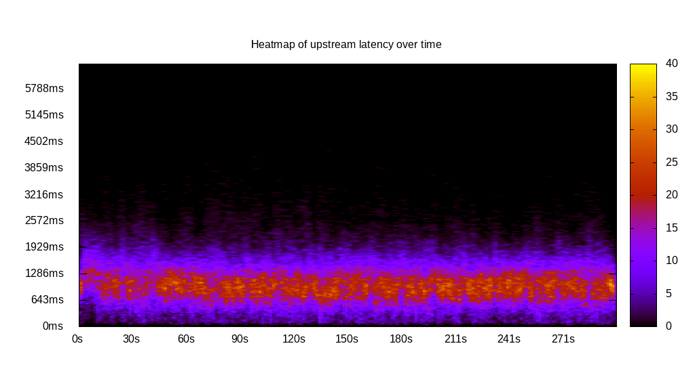
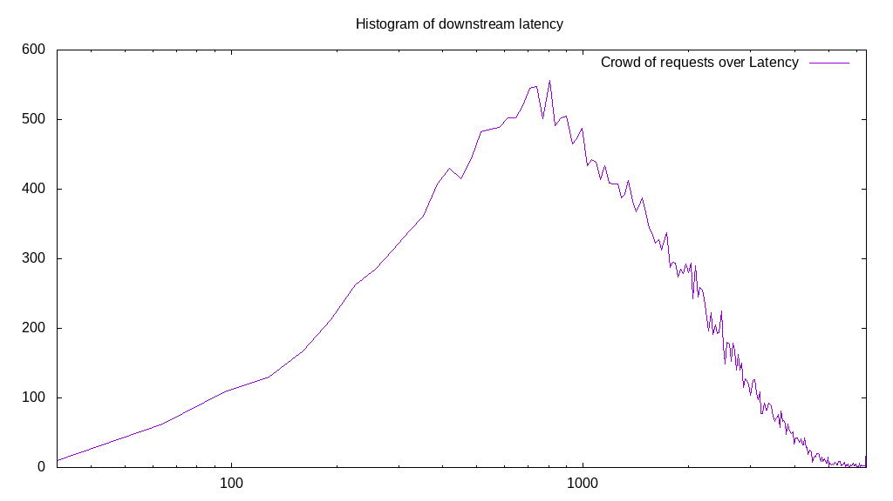
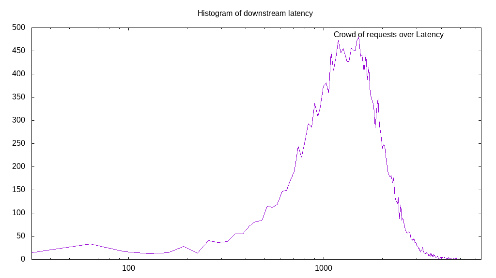
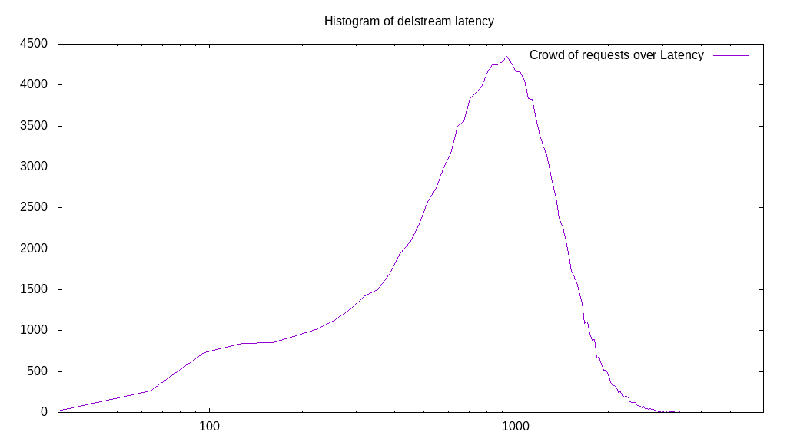

# Latency benchmark report. Crowd is 512

## Populate workload

## Object Size is 0.00kiB

### PUT Latency in ms over time

Evolution of PUT Latency over time

| Parameter | Value |
| --- | --- |
| Y Coordinate | PUT Latency in ms |
| X Coordinate | time in s since begining of workload |

### PUT Latency distribution in ms

Distribution of the PUT Latency in ms

| Parameter | Value |
| --- | --- |
| Y Coordinate | Number of PUT |
| X Coordinate | Latency in ms |
| Server volume | 0.000MiB|
| Server bandwidth | 0.000MiB/s |
| Server time | 299.99s |
| Server load | 510.79 |
| Server responses | 144430PUT |
| Server IOps | 481.45PUT/s |
| Client bandwidth | 0.000MiB/s |
| Client volume | 0.000MiB|
| Client time | 153231.20s |
| Client IOps |  0.94PUT/s  |
| Client Latency | 1060.94ms/PUT |
| Client Limbo | 0.71ms/PUT |
| Crowd time | 153593.86s |
| Crowd efficiency | 99.76% |
| Highest Latency | 4373.87ms |
| 95th percentile Latency | 1929.65ms |
| 68th percentile Latency | 1254.27ms |
| 50th percentile Latency | 1061.31ms |
| 32nd percentile Latency | 868.34ms |
| 5th percentile Latency | 385.93ms |
| Lowest Latency | 32.16ms |

## Read workload

## Object Size is 0.00kiB

### GET Latency in ms over time

Evolution of GET Latency over time

| Parameter | Value |
| --- | --- |
| Y Coordinate | GET Latency in ms |
| X Coordinate | time in s since begining of workload |

### GET Latency distribution in ms

Distribution of the GET Latency in ms

| Parameter | Value |
| --- | --- |
| Y Coordinate | Number of GET |
| X Coordinate | Latency in ms |
| Server volume | 0.000MiB|
| Server bandwidth | 0.000MiB/s |
| Server time | 101.83s |
| Server load | 493.43 |
| Server responses | 32193GET |
| Server IOps | 316.14GET/s |
| Client bandwidth | 0.000MiB/s |
| Client volume | 0.000MiB|
| Client time | 50247.95s |
| Client IOps |  0.64GET/s  |
| Client Latency | 1560.83ms/GET |
| Client Limbo | 3.69ms/GET |
| Crowd time | 52138.50s |
| Crowd efficiency | 96.37% |
| Highest Latency | 6400.00ms |
| 95th percentile Latency | 3634.17ms |
| 68th percentile Latency | 1897.49ms |
| 50th percentile Latency | 1350.75ms |
| 32nd percentile Latency | 932.66ms |
| 5th percentile Latency | 353.77ms |
| Lowest Latency | 32.16ms |

## Mixed workload

## Object Size is 0.00kiB

### PUT Latency in ms over time

Evolution of PUT Latency over time

| Parameter | Value |
| --- | --- |
| Y Coordinate | PUT Latency in ms |
| X Coordinate | time in s since begining of workload |

### GET Latency in ms over time

Evolution of GET Latency over time

| Parameter | Value |
| --- | --- |
| Y Coordinate | GET Latency in ms |
| X Coordinate | time in s since begining of workload |

### PUT Latency distribution in ms

Distribution of the PUT Latency in ms

| Parameter | Value |
| --- | --- |
| Y Coordinate | Number of PUT |
| X Coordinate | Latency in ms |
| Server volume | 0.000MiB|
| Server bandwidth | 0.000MiB/s |
| Server time | 104.58s |
| Server load | 196.88 |
| Server responses | 19462PUT |
| Server IOps | 186.10PUT/s |
| Client bandwidth | 0.000MiB/s |
| Client volume | 0.000MiB|
| Client time | 20588.58s |
| Client IOps |  0.95PUT/s  |
| Client Latency | 1057.89ms/PUT |
| Client Limbo | 64.36ms/PUT |
| Crowd time | 53542.91s |
| Crowd efficiency | 38.45% |
| Highest Latency | 4341.71ms |
| 95th percentile Latency | 1961.81ms |
| 68th percentile Latency | 1254.27ms |
| 50th percentile Latency | 1029.15ms |
| 32nd percentile Latency | 836.18ms |
| 5th percentile Latency | 385.93ms |
| Lowest Latency | 64.32ms |

### GET Latency distribution in ms

Distribution of the GET Latency in ms

| Parameter | Value |
| --- | --- |
| Y Coordinate | Number of GET |
| X Coordinate | Latency in ms |
| Server volume | 0.000MiB|
| Server bandwidth | 0.000MiB/s |
| Server time | 104.58s |
| Server load | 293.98 |
| Server responses | 20367GET |
| Server IOps | 194.76GET/s |
| Client bandwidth | 0.000MiB/s |
| Client volume | 0.000MiB|
| Client time | 30742.74s |
| Client IOps |  0.66GET/s  |
| Client Latency | 1509.44ms/GET |
| Client Limbo | 44.53ms/GET |
| Crowd time | 53542.91s |
| Crowd efficiency | 57.42% |
| Highest Latency | 5756.78ms |
| 95th percentile Latency | 2637.19ms |
| 68th percentile Latency | 1768.84ms |
| 50th percentile Latency | 1479.40ms |
| 32nd percentile Latency | 1222.11ms |
| 5th percentile Latency | 643.22ms |
| Lowest Latency | 32.16ms |

## Cleanup workload

## Object Size is 0.00kiB

### DELETE Latency in ms over time

Evolution of DELETE Latency over time

| Parameter | Value |
| --- | --- |
| Y Coordinate | DELETE Latency in ms |
| X Coordinate | time in s since begining of workload |

### DELETE Latency distribution in ms

Distribution of the DELETE Latency in ms

| Parameter | Value |
| --- | --- |
| Y Coordinate | Number of DELETE |
| X Coordinate | Latency in ms |
| Server volume | 0.000MiB|
| Server bandwidth | 0.000MiB/s |
| Server time | 291.02s |
| Server load | 500.53 |
| Server responses | 144438DELETE |
| Server IOps | 496.32DELETE/s |
| Client bandwidth | 0.000MiB/s |
| Client volume | 0.000MiB|
| Client time | 145661.39s |
| Client IOps |  0.99DELETE/s  |
| Client Latency | 1008.47ms/DELETE |
| Client Limbo | 6.52ms/DELETE |
| Crowd time | 149000.19s |
| Crowd efficiency | 97.76% |
| Highest Latency | 4213.07ms |
| 95th percentile Latency | 1865.33ms |
| 68th percentile Latency | 1222.11ms |
| 50th percentile Latency | 996.98ms |
| 32nd percentile Latency | 804.02ms |
| 5th percentile Latency | 353.77ms |
| Lowest Latency | 32.16ms |

