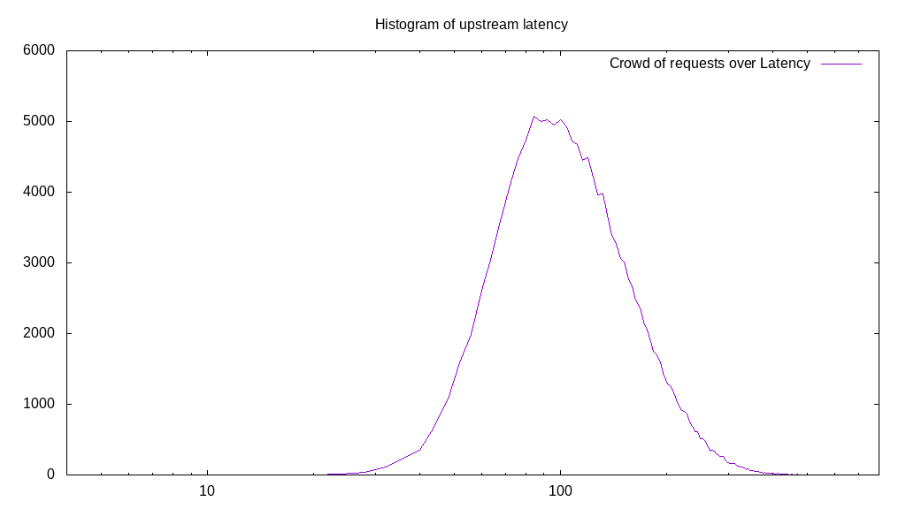
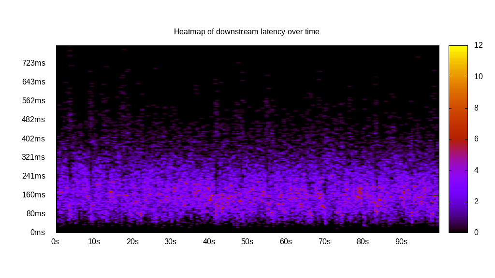
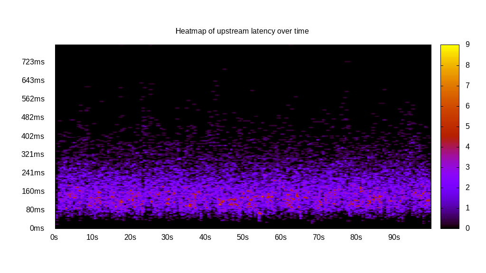

# Latency benchmark report. Crowd is 64

## Populate workload

## Object Size is 0.00kiB

### PUT Latency in ms over time

Evolution of PUT Latency over time

| Parameter | Value |
| --- | --- |
| Y Coordinate | PUT Latency in ms |
| X Coordinate | time in s since begining of workload |

### PUT Latency distribution in ms

Distribution of the PUT Latency in ms

| Parameter | Value |
| --- | --- |
| Y Coordinate | Number of PUT |
| X Coordinate | Latency in ms |
| Server volume | 0.000MiB|
| Server bandwidth | 0.000MiB/s |
| Server time | 299.99s |
| Server load | 63.91 |
| Server responses | 146274PUT |
| Server IOps | 487.59PUT/s |
| Client bandwidth | 0.000MiB/s |
| Client volume | 0.000MiB|
| Client time | 19172.95s |
| Client IOps |  7.63PUT/s  |
| Client Latency | 131.08ms/PUT |
| Client Limbo | 0.42ms/PUT |
| Crowd time | 19199.55s |
| Crowd efficiency | 99.86% |
| Highest Latency | 611.06ms |
| 95th percentile Latency | 245.23ms |
| 68th percentile Latency | 148.74ms |
| 50th percentile Latency | 124.62ms |
| 32nd percentile Latency | 100.50ms |
| 5th percentile Latency | 64.32ms |
| Lowest Latency | 20.10ms |

## Read workload

## Object Size is 0.00kiB

### GET Latency in ms over time

Evolution of GET Latency over time

| Parameter | Value |
| --- | --- |
| Y Coordinate | GET Latency in ms |
| X Coordinate | time in s since begining of workload |

### GET Latency distribution in ms

Distribution of the GET Latency in ms

| Parameter | Value |
| --- | --- |
| Y Coordinate | Number of GET |
| X Coordinate | Latency in ms |
| Server volume | 0.000MiB|
| Server bandwidth | 0.000MiB/s |
| Server time | 100.26s |
| Server load | 63.62 |
| Server responses | 32288GET |
| Server IOps | 322.06GET/s |
| Client bandwidth | 0.000MiB/s |
| Client volume | 0.000MiB|
| Client time | 6378.51s |
| Client IOps |  5.06GET/s  |
| Client Latency | 197.55ms/GET |
| Client Limbo | 0.59ms/GET |
| Crowd time | 6416.38s |
| Crowd efficiency | 99.41% |
| Highest Latency | 800.00ms |
| 95th percentile Latency | 381.91ms |
| 68th percentile Latency | 233.17ms |
| 50th percentile Latency | 184.92ms |
| 32nd percentile Latency | 144.72ms |
| 5th percentile Latency | 76.38ms |
| Lowest Latency | 20.10ms |

## Mixed workload

## Object Size is 0.00kiB

### PUT Latency in ms over time

Evolution of PUT Latency over time

| Parameter | Value |
| --- | --- |
| Y Coordinate | PUT Latency in ms |
| X Coordinate | time in s since begining of workload |

### GET Latency in ms over time

Evolution of GET Latency over time

| Parameter | Value |
| --- | --- |
| Y Coordinate | GET Latency in ms |
| X Coordinate | time in s since begining of workload |

### PUT Latency distribution in ms

Distribution of the PUT Latency in ms

| Parameter | Value |
| --- | --- |
| Y Coordinate | Number of PUT |
| X Coordinate | Latency in ms |
| Server volume | 0.000MiB|
| Server bandwidth | 0.000MiB/s |
| Server time | 100.49s |
| Server load | 33.14 |
| Server responses | 19087PUT |
| Server IOps | 189.94PUT/s |
| Client bandwidth | 0.000MiB/s |
| Client volume | 0.000MiB|
| Client time | 3330.38s |
| Client IOps |  5.73PUT/s  |
| Client Latency | 174.48ms/PUT |
| Client Limbo | 48.45ms/PUT |
| Crowd time | 6431.36s |
| Crowd efficiency | 51.78% |
| Highest Latency | 800.00ms |
| 95th percentile Latency | 329.65ms |
| 68th percentile Latency | 201.01ms |
| 50th percentile Latency | 164.82ms |
| 32nd percentile Latency | 132.66ms |
| 5th percentile Latency | 80.40ms |
| Lowest Latency | 20.10ms |

### GET Latency distribution in ms

Distribution of the GET Latency in ms

| Parameter | Value |
| --- | --- |
| Y Coordinate | Number of GET |
| X Coordinate | Latency in ms |
| Server volume | 0.000MiB|
| Server bandwidth | 0.000MiB/s |
| Server time | 100.49s |
| Server load | 30.50 |
| Server responses | 18968GET |
| Server IOps | 188.76GET/s |
| Client bandwidth | 0.000MiB/s |
| Client volume | 0.000MiB|
| Client time | 3065.09s |
| Client IOps |  6.19GET/s  |
| Client Latency | 161.59ms/GET |
| Client Limbo | 52.60ms/GET |
| Crowd time | 6431.36s |
| Crowd efficiency | 47.66% |
| Highest Latency | 755.78ms |
| 95th percentile Latency | 341.71ms |
| 68th percentile Latency | 192.96ms |
| 50th percentile Latency | 144.72ms |
| 32nd percentile Latency | 108.54ms |
| 5th percentile Latency | 52.26ms |
| Lowest Latency | 16.08ms |

## Cleanup workload

## Object Size is 0.00kiB

### DELETE Latency in ms over time

Evolution of DELETE Latency over time

| Parameter | Value |
| --- | --- |
| Y Coordinate | DELETE Latency in ms |
| X Coordinate | time in s since begining of workload |

### DELETE Latency distribution in ms

Distribution of the DELETE Latency in ms

| Parameter | Value |
| --- | --- |
| Y Coordinate | Number of DELETE |
| X Coordinate | Latency in ms |
| Server volume | 0.000MiB|
| Server bandwidth | 0.000MiB/s |
| Server time | 287.00s |
| Server load | 63.71 |
| Server responses | 146282DELETE |
| Server IOps | 509.69DELETE/s |
| Client bandwidth | 0.000MiB/s |
| Client volume | 0.000MiB|
| Client time | 18284.29s |
| Client IOps |  8.00DELETE/s  |
| Client Latency | 124.99ms/DELETE |
| Client Limbo | 1.31ms/DELETE |
| Crowd time | 18368.06s |
| Crowd efficiency | 99.54% |
| Highest Latency | 703.52ms |
| 95th percentile Latency | 233.17ms |
| 68th percentile Latency | 144.72ms |
| 50th percentile Latency | 116.58ms |
| 32nd percentile Latency | 96.48ms |
| 5th percentile Latency | 60.30ms |
| Lowest Latency | 12.06ms |

