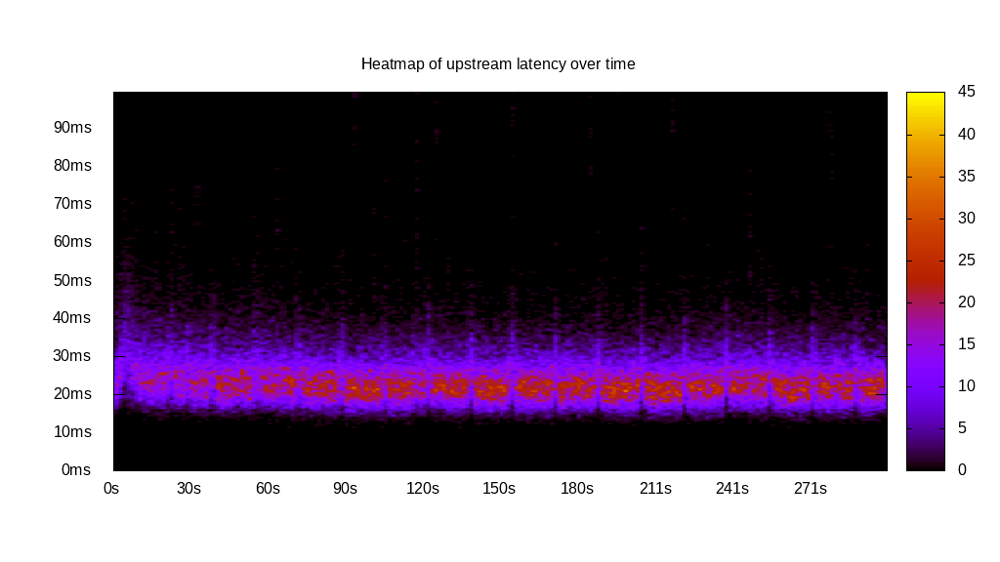
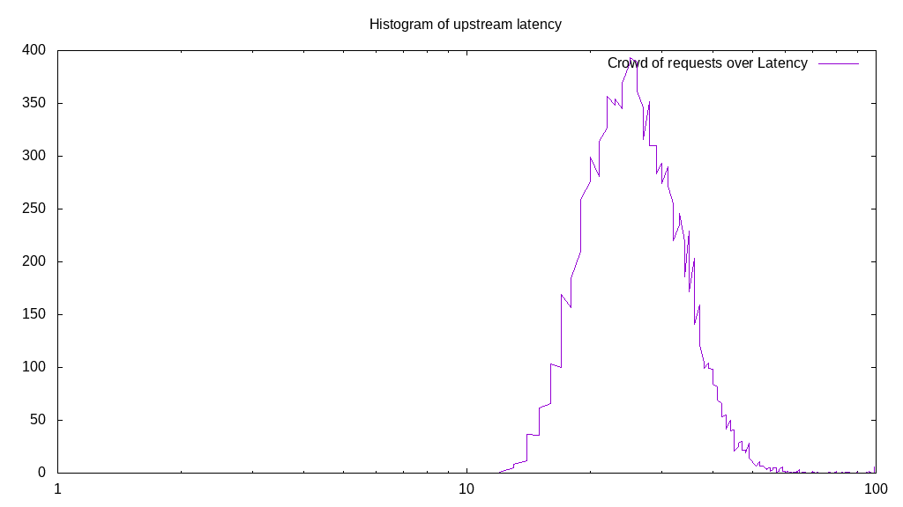
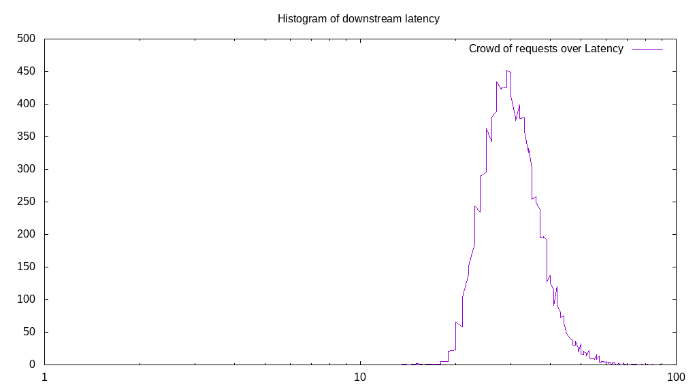

# Latency benchmark report. Crowd is 8

## Populate workload

## Object Size is 0.00kiB

### PUT Latency in ms over time

Evolution of PUT Latency over time

| Parameter | Value |
| --- | --- |
| Y Coordinate | PUT Latency in ms |
| X Coordinate | time in s since begining of workload |

### PUT Latency distribution in ms

Distribution of the PUT Latency in ms

| Parameter | Value |
| --- | --- |
| Y Coordinate | Number of PUT |
| X Coordinate | Latency in ms |
| Server volume | 0.000MiB|
| Server bandwidth | 0.000MiB/s |
| Server time | 300.00s |
| Server load | 7.95 |
| Server responses | 96560PUT |
| Server IOps | 321.87PUT/s |
| Client bandwidth | 0.000MiB/s |
| Client volume | 0.000MiB|
| Client time | 2386.26s |
| Client IOps |  40.46PUT/s  |
| Client Latency | 24.71ms/PUT |
| Client Limbo | 1.71ms/PUT |
| Crowd time | 2399.97s |
| Crowd efficiency | 99.43% |
| Highest Latency | 100.00ms |
| 95th percentile Latency | 36.18ms |
| 68th percentile Latency | 26.63ms |
| 50th percentile Latency | 24.12ms |
| 32nd percentile Latency | 22.11ms |
| 5th percentile Latency | 17.59ms |
| Lowest Latency | 11.56ms |

## Read workload

## Object Size is 0.00kiB

### GET Latency in ms over time

Evolution of GET Latency over time

| Parameter | Value |
| --- | --- |
| Y Coordinate | GET Latency in ms |
| X Coordinate | time in s since begining of workload |

### GET Latency distribution in ms

Distribution of the GET Latency in ms

| Parameter | Value |
| --- | --- |
| Y Coordinate | Number of GET |
| X Coordinate | Latency in ms |
| Server volume | 0.000MiB|
| Server bandwidth | 0.000MiB/s |
| Server time | 100.02s |
| Server load | 7.96 |
| Server responses | 24911GET |
| Server IOps | 249.07GET/s |
| Client bandwidth | 0.000MiB/s |
| Client volume | 0.000MiB|
| Client time | 795.76s |
| Client IOps |  31.30GET/s  |
| Client Latency | 31.94ms/GET |
| Client Limbo | 0.55ms/GET |
| Crowd time | 800.13s |
| Crowd efficiency | 99.45% |
| Highest Latency | 100.00ms |
| 95th percentile Latency | 46.23ms |
| 68th percentile Latency | 34.67ms |
| 50th percentile Latency | 31.16ms |
| 32nd percentile Latency | 28.14ms |
| 5th percentile Latency | 22.61ms |
| Lowest Latency | 17.09ms |

## Mixed workload

## Object Size is 0.00kiB

### PUT Latency in ms over time

Evolution of PUT Latency over time

| Parameter | Value |
| --- | --- |
| Y Coordinate | PUT Latency in ms |
| X Coordinate | time in s since begining of workload |

### GET Latency in ms over time

Evolution of GET Latency over time

| Parameter | Value |
| --- | --- |
| Y Coordinate | GET Latency in ms |
| X Coordinate | time in s since begining of workload |

### PUT Latency distribution in ms

Distribution of the PUT Latency in ms

| Parameter | Value |
| --- | --- |
| Y Coordinate | Number of PUT |
| X Coordinate | Latency in ms |
| Server volume | 0.000MiB|
| Server bandwidth | 0.000MiB/s |
| Server time | 100.03s |
| Server load | 3.73 |
| Server responses | 13085PUT |
| Server IOps | 130.82PUT/s |
| Client bandwidth | 0.000MiB/s |
| Client volume | 0.000MiB|
| Client time | 373.59s |
| Client IOps |  35.03PUT/s  |
| Client Latency | 28.55ms/PUT |
| Client Limbo | 53.33ms/PUT |
| Crowd time | 800.20s |
| Crowd efficiency | 46.69% |
| Highest Latency | 100.00ms |
| 95th percentile Latency | 42.71ms |
| 68th percentile Latency | 31.66ms |
| 50th percentile Latency | 27.64ms |
| 32nd percentile Latency | 24.62ms |
| 5th percentile Latency | 18.59ms |
| Lowest Latency | 12.56ms |

### GET Latency distribution in ms

Distribution of the GET Latency in ms

| Parameter | Value |
| --- | --- |
| Y Coordinate | Number of GET |
| X Coordinate | Latency in ms |
| Server volume | 0.000MiB|
| Server bandwidth | 0.000MiB/s |
| Server time | 100.03s |
| Server load | 4.22 |
| Server responses | 13083GET |
| Server IOps | 130.80GET/s |
| Client bandwidth | 0.000MiB/s |
| Client volume | 0.000MiB|
| Client time | 422.33s |
| Client IOps |  30.98GET/s  |
| Client Latency | 32.28ms/GET |
| Client Limbo | 47.23ms/GET |
| Crowd time | 800.20s |
| Crowd efficiency | 52.78% |
| Highest Latency | 100.00ms |
| 95th percentile Latency | 45.23ms |
| 68th percentile Latency | 34.67ms |
| 50th percentile Latency | 31.66ms |
| 32nd percentile Latency | 29.15ms |
| 5th percentile Latency | 23.62ms |
| Lowest Latency | 14.07ms |

## Cleanup workload

## Object Size is 0.00kiB

### DELETE Latency in ms over time

Evolution of DELETE Latency over time

| Parameter | Value |
| --- | --- |
| Y Coordinate | DELETE Latency in ms |
| X Coordinate | time in s since begining of workload |

### DELETE Latency distribution in ms

Distribution of the DELETE Latency in ms

| Parameter | Value |
| --- | --- |
| Y Coordinate | Number of DELETE |
| X Coordinate | Latency in ms |
| Server volume | 0.000MiB|
| Server bandwidth | 0.000MiB/s |
| Server time | 285.78s |
| Server load | 7.93 |
| Server responses | 96568DELETE |
| Server IOps | 337.91DELETE/s |
| Client bandwidth | 0.000MiB/s |
| Client volume | 0.000MiB|
| Client time | 2267.01s |
| Client IOps |  42.60DELETE/s  |
| Client Latency | 23.48ms/DELETE |
| Client Limbo | 2.40ms/DELETE |
| Crowd time | 2286.22s |
| Crowd efficiency | 99.16% |
| Highest Latency | 100.00ms |
| 95th percentile Latency | 34.17ms |
| 68th percentile Latency | 25.63ms |
| 50th percentile Latency | 23.12ms |
| 32nd percentile Latency | 21.11ms |
| 5th percentile Latency | 16.58ms |
| Lowest Latency | 6.53ms |

