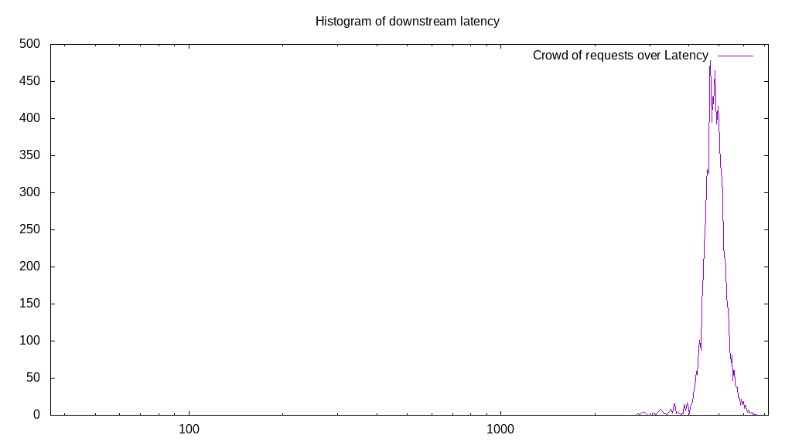

# Latency benchmark report. Crowd is 512

## Populate workload

## Object Size is 1024.00kiB

### PUT Latency in ms over time

Evolution of PUT Latency over time

| Parameter | Value |
| --- | --- |
| Y Coordinate | PUT Latency in ms |
| X Coordinate | time in s since begining of workload |

### PUT Latency distribution in ms

Distribution of the PUT Latency in ms

| Parameter | Value |
| --- | --- |
| Y Coordinate | Number of PUT |
| X Coordinate | Latency in ms |
| Server volume | 37666.000MiB|
| Server bandwidth | 125.581MiB/s |
| Server time | 299.93s |
| Server load | 508.42 |
| Server responses | 37666PUT |
| Server IOps | 125.58PUT/s |
| Client bandwidth | 0.245MiB/s |
| Client volume | 73.566MiB|
| Client time | 152492.90s |
| Client IOps |  0.25PUT/s  |
| Client Latency | 4048.56ms/PUT |
| Client Limbo | 2.10ms/PUT |
| Crowd time | 153566.21s |
| Crowd efficiency | 99.30% |
| Highest Latency | 6693.47ms |
| 95th percentile Latency | 4631.16ms |
| 68th percentile Latency | 4160.80ms |
| 50th percentile Latency | 4052.26ms |
| 32nd percentile Latency | 3943.72ms |
| 5th percentile Latency | 3690.45ms |
| Lowest Latency | 2677.39ms |

## Read workload

## Object Size is 1024.00kiB

### GET Latency in ms over time

Evolution of GET Latency over time

| Parameter | Value |
| --- | --- |
| Y Coordinate | GET Latency in ms |
| X Coordinate | time in s since begining of workload |

### GET Latency distribution in ms

Distribution of the GET Latency in ms

| Parameter | Value |
| --- | --- |
| Y Coordinate | Number of GET |
| X Coordinate | Latency in ms |
| Server volume | 10060.000MiB|
| Server bandwidth | 96.880MiB/s |
| Server time | 103.84s |
| Server load | 472.48 |
| Server responses | 10060GET |
| Server IOps | 96.88GET/s |
| Client bandwidth | 0.189MiB/s |
| Client volume | 19.648MiB|
| Client time | 49062.39s |
| Client IOps |  0.21GET/s  |
| Client Latency | 4876.98ms/GET |
| Client Limbo | 8.02ms/GET |
| Crowd time | 53166.08s |
| Crowd efficiency | 92.28% |
| Highest Latency | 6621.11ms |
| 95th percentile Latency | 5571.86ms |
| 68th percentile Latency | 5065.33ms |
| 50th percentile Latency | 4884.42ms |
| 32nd percentile Latency | 4739.70ms |
| 5th percentile Latency | 4377.89ms |
| Lowest Latency | 2749.75ms |

## Mixed workload

## Object Size is 1024.00kiB

### PUT Latency in ms over time

Evolution of PUT Latency over time

| Parameter | Value |
| --- | --- |
| Y Coordinate | PUT Latency in ms |
| X Coordinate | time in s since begining of workload |

### GET Latency in ms over time

Evolution of GET Latency over time

| Parameter | Value |
| --- | --- |
| Y Coordinate | GET Latency in ms |
| X Coordinate | time in s since begining of workload |

### PUT Latency distribution in ms

Distribution of the PUT Latency in ms

| Parameter | Value |
| --- | --- |
| Y Coordinate | Number of PUT |
| X Coordinate | Latency in ms |
| Server volume | 4975.000MiB|
| Server bandwidth | 47.716MiB/s |
| Server time | 104.26s |
| Server load | 235.38 |
| Server responses | 4975PUT |
| Server IOps | 47.72PUT/s |
| Client bandwidth | 0.093MiB/s |
| Client volume | 9.717MiB|
| Client time | 24541.01s |
| Client IOps |  0.20PUT/s  |
| Client Latency | 4932.87ms/PUT |
| Client Limbo | 56.33ms/PUT |
| Crowd time | 53382.14s |
| Crowd efficiency | 45.97% |
| Highest Latency | 6042.21ms |
| 95th percentile Latency | 5282.41ms |
| 68th percentile Latency | 5029.15ms |
| 50th percentile Latency | 4956.78ms |
| 32nd percentile Latency | 4884.42ms |
| 5th percentile Latency | 4703.52ms |
| Lowest Latency | 4377.89ms |

### GET Latency distribution in ms

Distribution of the GET Latency in ms

| Parameter | Value |
| --- | --- |
| Y Coordinate | Number of GET |
| X Coordinate | Latency in ms |
| Server volume | 5612.000MiB|
| Server bandwidth | 53.826MiB/s |
| Server time | 104.26s |
| Server load | 256.46 |
| Server responses | 5612GET |
| Server IOps | 53.83GET/s |
| Client bandwidth | 0.105MiB/s |
| Client volume | 10.961MiB|
| Client time | 26738.63s |
| Client IOps |  0.21GET/s  |
| Client Latency | 4764.55ms/GET |
| Client Limbo | 52.04ms/GET |
| Crowd time | 53382.14s |
| Crowd efficiency | 50.09% |
| Highest Latency | 7200.00ms |
| 95th percentile Latency | 5463.32ms |
| 68th percentile Latency | 4848.24ms |
| 50th percentile Latency | 4739.70ms |
| 32nd percentile Latency | 4631.16ms |
| 5th percentile Latency | 4414.07ms |
| Lowest Latency | 4088.44ms |

## Cleanup workload

## Object Size is 1024.00kiB

### DELETE Latency in ms over time

Evolution of DELETE Latency over time

| Parameter | Value |
| --- | --- |
| Y Coordinate | DELETE Latency in ms |
| X Coordinate | time in s since begining of workload |

### DELETE Latency distribution in ms

Distribution of the DELETE Latency in ms

| Parameter | Value |
| --- | --- |
| Y Coordinate | Number of DELETE |
| X Coordinate | Latency in ms |
| Server volume | 37674.000MiB|
| Server bandwidth | 407.388MiB/s |
| Server time | 92.48s |
| Server load | 467.51 |
| Server responses | 37674DELETE |
| Server IOps | 407.39DELETE/s |
| Client bandwidth | 0.796MiB/s |
| Client volume | 73.582MiB|
| Client time | 43233.59s |
| Client IOps |  0.87DELETE/s  |
| Client Latency | 1147.57ms/DELETE |
| Client Limbo | 8.04ms/DELETE |
| Crowd time | 47348.22s |
| Crowd efficiency | 91.31% |
| Highest Latency | 4775.88ms |
| 95th percentile Latency | 2098.49ms |
| 68th percentile Latency | 1374.87ms |
| 50th percentile Latency | 1157.79ms |
| 32nd percentile Latency | 940.70ms |
| 5th percentile Latency | 397.99ms |
| Lowest Latency | 36.18ms |

