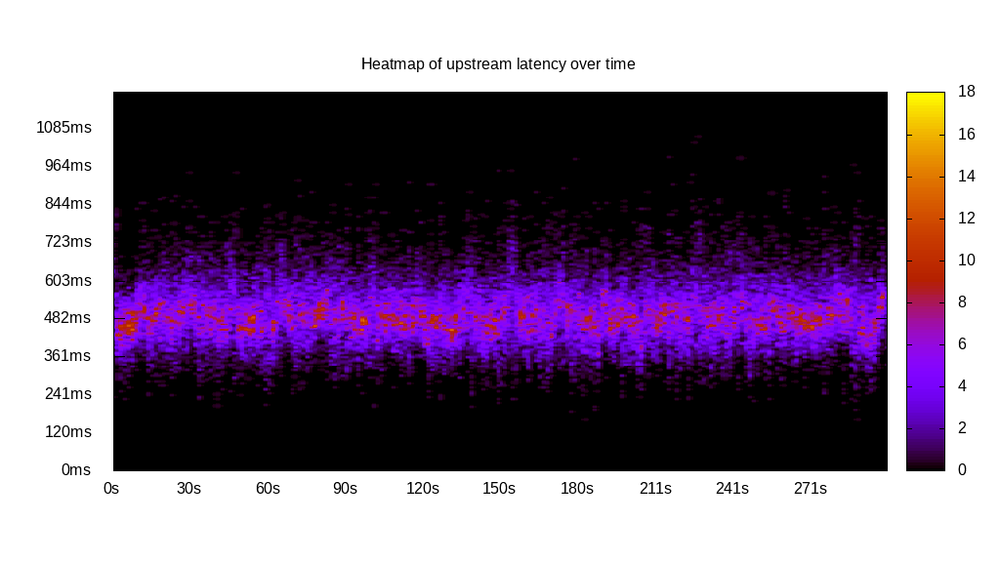
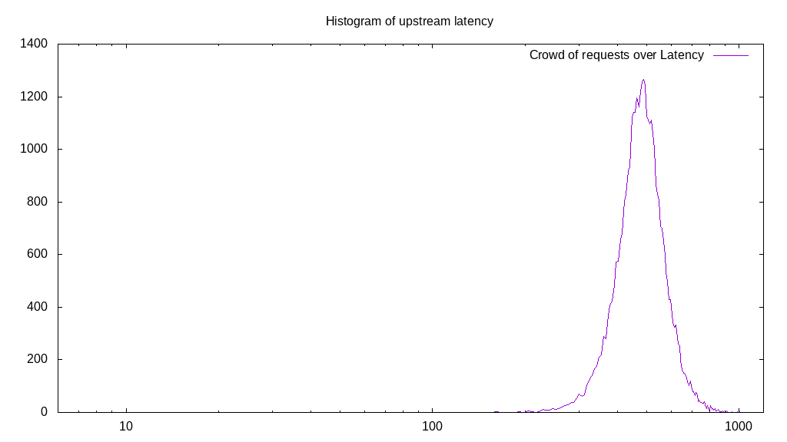
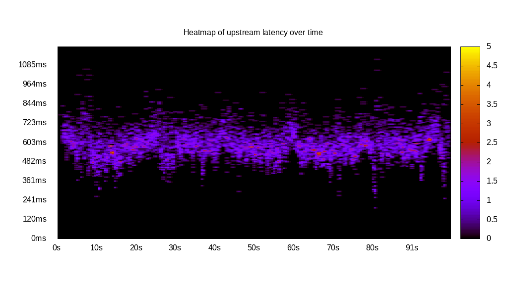
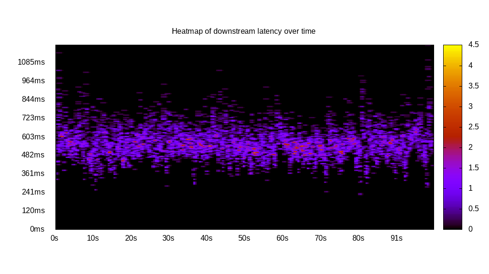

# Latency benchmark report. Crowd is 64

## Populate workload

## Object Size is 1024.00kiB

### PUT Latency in ms over time

Evolution of PUT Latency over time

| Parameter | Value |
| --- | --- |
| Y Coordinate | PUT Latency in ms |
| X Coordinate | time in s since begining of workload |

### PUT Latency distribution in ms

Distribution of the PUT Latency in ms

| Parameter | Value |
| --- | --- |
| Y Coordinate | Number of PUT |
| X Coordinate | Latency in ms |
| Server volume | 38517.000MiB|
| Server bandwidth | 128.391MiB/s |
| Server time | 300.00s |
| Server load | 63.90 |
| Server responses | 38517PUT |
| Server IOps | 128.39PUT/s |
| Client bandwidth | 2.006MiB/s |
| Client volume | 601.828MiB|
| Client time | 19168.87s |
| Client IOps |  2.01PUT/s  |
| Client Latency | 497.67ms/PUT |
| Client Limbo | 0.48ms/PUT |
| Crowd time | 19199.81s |
| Crowd efficiency | 99.84% |
| Highest Latency | 1061.31ms |
| 95th percentile Latency | 657.29ms |
| 68th percentile Latency | 536.68ms |
| 50th percentile Latency | 494.47ms |
| 32nd percentile Latency | 464.32ms |
| 5th percentile Latency | 373.87ms |
| Lowest Latency | 162.81ms |

## Read workload

## Object Size is 1024.00kiB

### GET Latency in ms over time

Evolution of GET Latency over time

| Parameter | Value |
| --- | --- |
| Y Coordinate | GET Latency in ms |
| X Coordinate | time in s since begining of workload |

### GET Latency distribution in ms

Distribution of the GET Latency in ms

| Parameter | Value |
| --- | --- |
| Y Coordinate | Number of GET |
| X Coordinate | Latency in ms |
| Server volume | 10807.000MiB|
| Server bandwidth | 107.551MiB/s |
| Server time | 100.48s |
| Server load | 63.40 |
| Server responses | 10807GET |
| Server IOps | 107.55GET/s |
| Client bandwidth | 1.680MiB/s |
| Client volume | 168.859MiB|
| Client time | 6370.37s |
| Client IOps |  1.70GET/s  |
| Client Latency | 589.47ms/GET |
| Client Limbo | 0.95ms/GET |
| Crowd time | 6430.91s |
| Crowd efficiency | 99.06% |
| Highest Latency | 1200.00ms |
| 95th percentile Latency | 850.25ms |
| 68th percentile Latency | 645.23ms |
| 50th percentile Latency | 584.92ms |
| 32nd percentile Latency | 530.65ms |
| 5th percentile Latency | 367.84ms |
| Lowest Latency | 126.63ms |

## Mixed workload

## Object Size is 1024.00kiB

### PUT Latency in ms over time

Evolution of PUT Latency over time

| Parameter | Value |
| --- | --- |
| Y Coordinate | PUT Latency in ms |
| X Coordinate | time in s since begining of workload |

### GET Latency in ms over time

Evolution of GET Latency over time

| Parameter | Value |
| --- | --- |
| Y Coordinate | GET Latency in ms |
| X Coordinate | time in s since begining of workload |

### PUT Latency distribution in ms

Distribution of the PUT Latency in ms

| Parameter | Value |
| --- | --- |
| Y Coordinate | Number of PUT |
| X Coordinate | Latency in ms |
| Server volume | 5527.000MiB|
| Server bandwidth | 54.918MiB/s |
| Server time | 100.64s |
| Server load | 32.41 |
| Server responses | 5527PUT |
| Server IOps | 54.92PUT/s |
| Client bandwidth | 0.858MiB/s |
| Client volume | 86.359MiB|
| Client time | 3261.57s |
| Client IOps |  1.69PUT/s  |
| Client Latency | 590.12ms/PUT |
| Client Limbo | 49.68ms/PUT |
| Crowd time | 6441.02s |
| Crowd efficiency | 50.64% |
| Highest Latency | 1121.61ms |
| 95th percentile Latency | 747.74ms |
| 68th percentile Latency | 627.14ms |
| 50th percentile Latency | 590.95ms |
| 32nd percentile Latency | 554.77ms |
| 5th percentile Latency | 458.29ms |
| Lowest Latency | 192.96ms |

### GET Latency distribution in ms

Distribution of the GET Latency in ms

| Parameter | Value |
| --- | --- |
| Y Coordinate | Number of GET |
| X Coordinate | Latency in ms |
| Server volume | 5545.000MiB|
| Server bandwidth | 55.097MiB/s |
| Server time | 100.64s |
| Server load | 31.09 |
| Server responses | 5545GET |
| Server IOps | 55.10GET/s |
| Client bandwidth | 0.861MiB/s |
| Client volume | 86.641MiB|
| Client time | 3128.94s |
| Client IOps |  1.77GET/s  |
| Client Latency | 564.28ms/GET |
| Client Limbo | 51.75ms/GET |
| Crowd time | 6441.02s |
| Crowd efficiency | 48.58% |
| Highest Latency | 1200.00ms |
| 95th percentile Latency | 747.74ms |
| 68th percentile Latency | 603.02ms |
| 50th percentile Latency | 560.80ms |
| 32nd percentile Latency | 524.62ms |
| 5th percentile Latency | 422.11ms |
| Lowest Latency | 229.15ms |

## Cleanup workload

## Object Size is 1024.00kiB

### DELETE Latency in ms over time

Evolution of DELETE Latency over time

| Parameter | Value |
| --- | --- |
| Y Coordinate | DELETE Latency in ms |
| X Coordinate | time in s since begining of workload |

### DELETE Latency distribution in ms

Distribution of the DELETE Latency in ms

| Parameter | Value |
| --- | --- |
| Y Coordinate | Number of DELETE |
| X Coordinate | Latency in ms |
| Server volume | 38525.000MiB|
| Server bandwidth | 422.363MiB/s |
| Server time | 91.21s |
| Server load | 62.89 |
| Server responses | 38525DELETE |
| Server IOps | 422.36DELETE/s |
| Client bandwidth | 6.599MiB/s |
| Client volume | 601.953MiB|
| Client time | 5735.98s |
| Client IOps |  6.72DELETE/s  |
| Client Latency | 148.89ms/DELETE |
| Client Limbo | 1.59ms/DELETE |
| Crowd time | 5837.63s |
| Crowd efficiency | 98.26% |
| Highest Latency | 753.77ms |
| 95th percentile Latency | 283.42ms |
| 68th percentile Latency | 174.87ms |
| 50th percentile Latency | 138.69ms |
| 32nd percentile Latency | 114.57ms |
| 5th percentile Latency | 72.36ms |
| Lowest Latency | 12.06ms |

