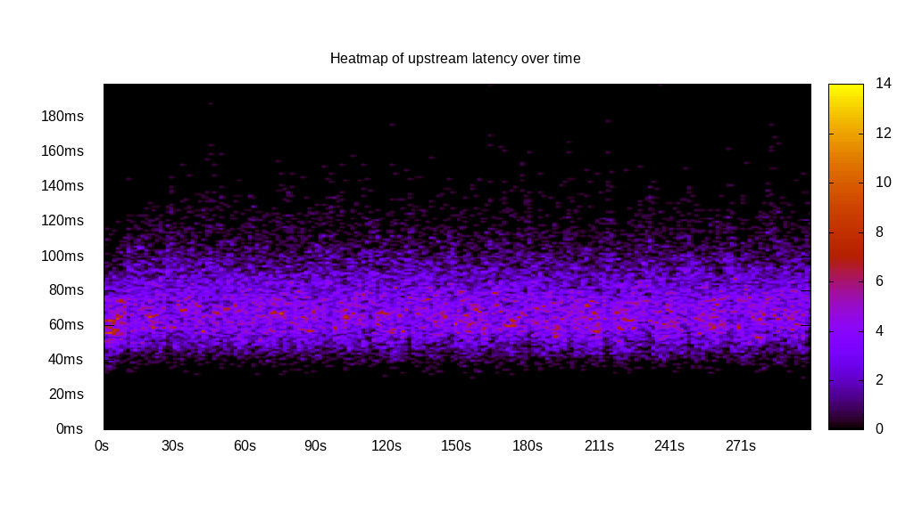
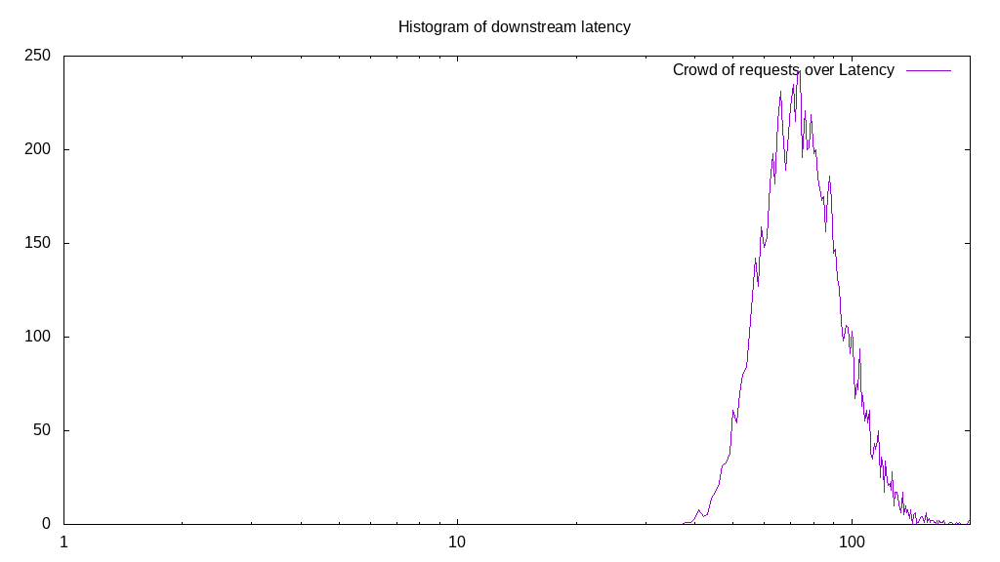
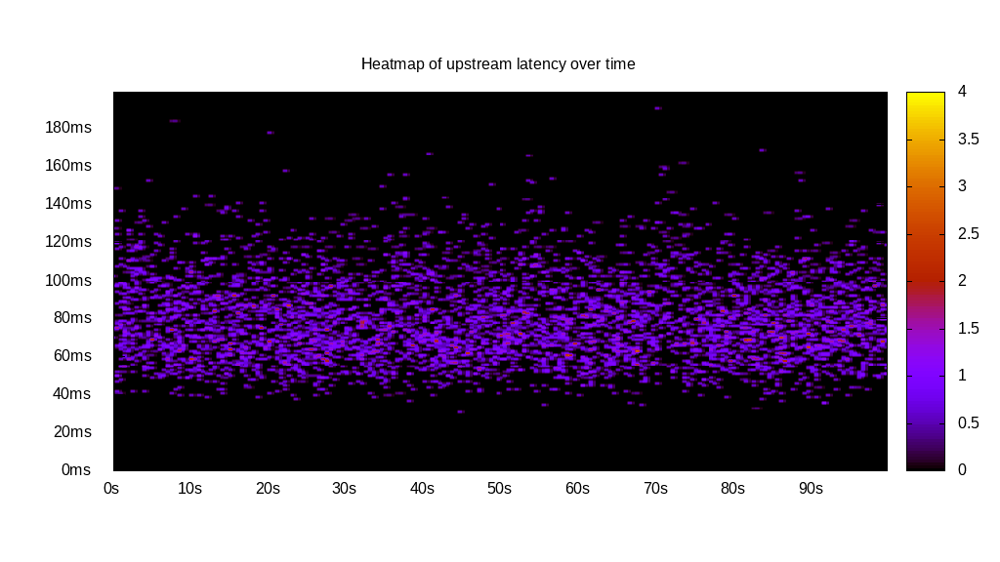
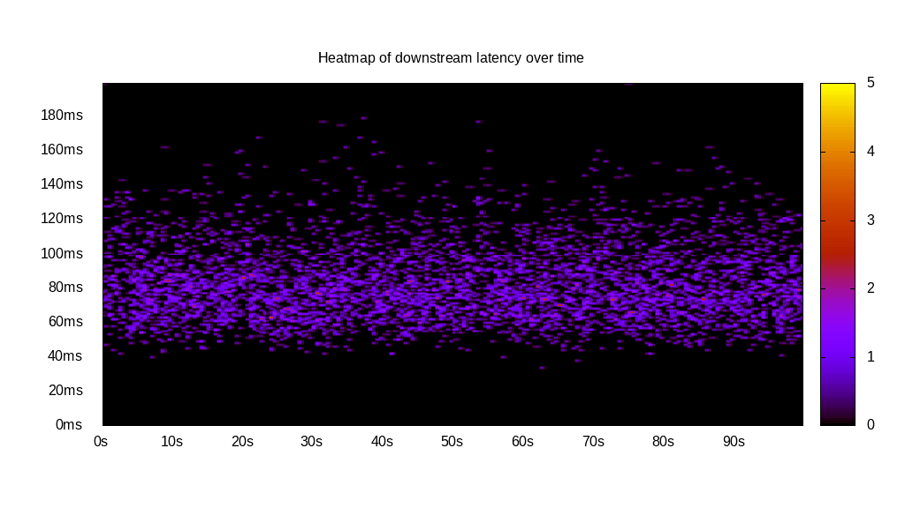
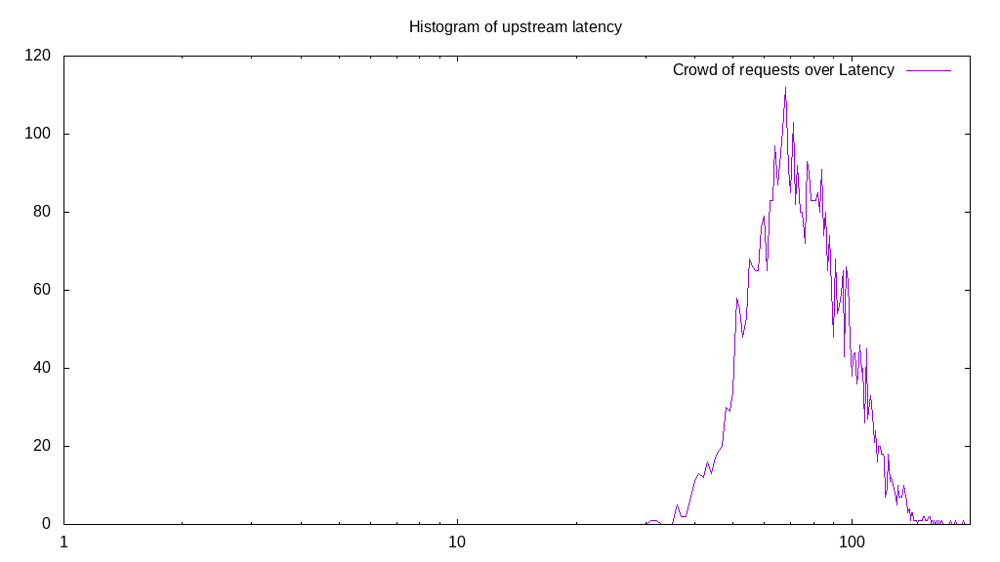
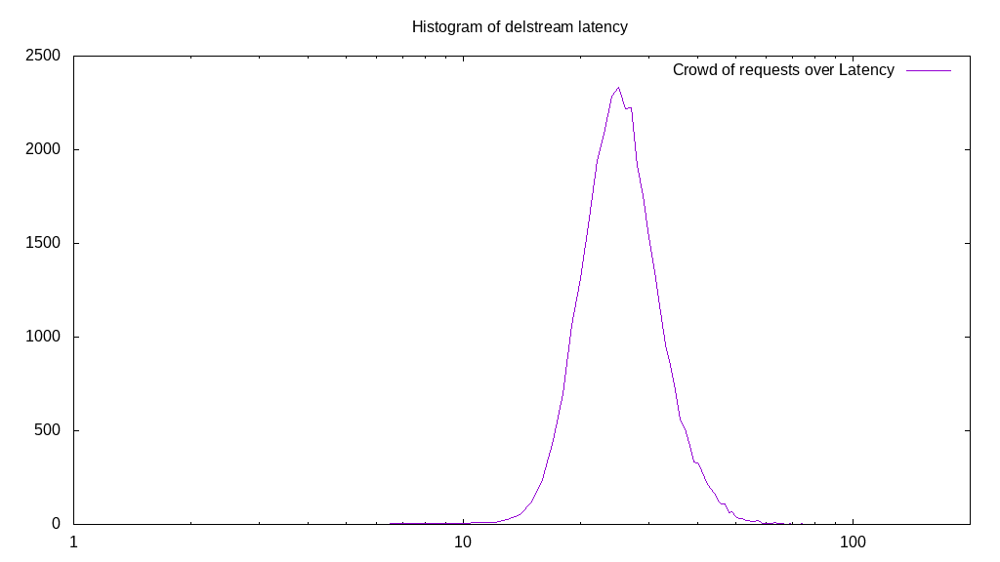

# Latency benchmark report. Crowd is 8

## Populate workload

## Object Size is 1024.00kiB

### PUT Latency in ms over time

Evolution of PUT Latency over time

| Parameter | Value |
| --- | --- |
| Y Coordinate | PUT Latency in ms |
| X Coordinate | time in s since begining of workload |

### PUT Latency distribution in ms

Distribution of the PUT Latency in ms

| Parameter | Value |
| --- | --- |
| Y Coordinate | Number of PUT |
| X Coordinate | Latency in ms |
| Server volume | 32754.000MiB|
| Server bandwidth | 109.185MiB/s |
| Server time | 299.99s |
| Server load | 7.98 |
| Server responses | 32754PUT |
| Server IOps | 109.19PUT/s |
| Client bandwidth | 13.648MiB/s |
| Client volume | 4094.250MiB|
| Client time | 2393.03s |
| Client IOps |  13.69PUT/s  |
| Client Latency | 73.06ms/PUT |
| Client Limbo | 0.86ms/PUT |
| Crowd time | 2399.89s |
| Crowd efficiency | 99.71% |
| Highest Latency | 246.00ms |
| 95th percentile Latency | 107.55ms |
| 68th percentile Latency | 80.35ms |
| 50th percentile Latency | 71.70ms |
| 32nd percentile Latency | 64.28ms |
| 5th percentile Latency | 49.45ms |
| Lowest Latency | 29.67ms |

## Read workload

## Object Size is 1024.00kiB

### GET Latency in ms over time

Evolution of GET Latency over time

| Parameter | Value |
| --- | --- |
| Y Coordinate | GET Latency in ms |
| X Coordinate | time in s since begining of workload |

### GET Latency distribution in ms

Distribution of the GET Latency in ms

| Parameter | Value |
| --- | --- |
| Y Coordinate | Number of GET |
| X Coordinate | Latency in ms |
| Server volume | 9833.000MiB|
| Server bandwidth | 98.244MiB/s |
| Server time | 100.09s |
| Server load | 7.96 |
| Server responses | 9833GET |
| Server IOps | 98.24GET/s |
| Client bandwidth | 12.280MiB/s |
| Client volume | 1229.125MiB|
| Client time | 796.86s |
| Client IOps |  12.34GET/s  |
| Client Latency | 81.04ms/GET |
| Client Limbo | 0.48ms/GET |
| Crowd time | 800.70s |
| Crowd efficiency | 99.52% |
| Highest Latency | 233.64ms |
| 95th percentile Latency | 118.67ms |
| 68th percentile Latency | 89.01ms |
| 50th percentile Latency | 79.12ms |
| 32nd percentile Latency | 71.70ms |
| 5th percentile Latency | 55.63ms |
| Lowest Latency | 39.56ms |

## Mixed workload

## Object Size is 1024.00kiB

### PUT Latency in ms over time

Evolution of PUT Latency over time

| Parameter | Value |
| --- | --- |
| Y Coordinate | PUT Latency in ms |
| X Coordinate | time in s since begining of workload |

### GET Latency in ms over time

Evolution of GET Latency over time

| Parameter | Value |
| --- | --- |
| Y Coordinate | GET Latency in ms |
| X Coordinate | time in s since begining of workload |

### PUT Latency distribution in ms

Distribution of the PUT Latency in ms

| Parameter | Value |
| --- | --- |
| Y Coordinate | Number of PUT |
| X Coordinate | Latency in ms |
| Server volume | 4742.000MiB|
| Server bandwidth | 47.373MiB/s |
| Server time | 100.10s |
| Server load | 3.82 |
| Server responses | 4742PUT |
| Server IOps | 47.37PUT/s |
| Client bandwidth | 5.922MiB/s |
| Client volume | 592.750MiB|
| Client time | 382.22s |
| Client IOps |  12.41PUT/s  |
| Client Latency | 80.60ms/PUT |
| Client Limbo | 52.32ms/PUT |
| Crowd time | 800.79s |
| Crowd efficiency | 47.73% |
| Highest Latency | 192.84ms |
| 95th percentile Latency | 121.15ms |
| 68th percentile Latency | 90.24ms |
| 50th percentile Latency | 79.12ms |
| 32nd percentile Latency | 69.23ms |
| 5th percentile Latency | 51.92ms |
| Lowest Latency | 30.90ms |

### GET Latency distribution in ms

Distribution of the GET Latency in ms

| Parameter | Value |
| --- | --- |
| Y Coordinate | Number of GET |
| X Coordinate | Latency in ms |
| Server volume | 4991.000MiB|
| Server bandwidth | 49.861MiB/s |
| Server time | 100.10s |
| Server load | 4.15 |
| Server responses | 4991GET |
| Server IOps | 49.86GET/s |
| Client bandwidth | 6.233MiB/s |
| Client volume | 623.875MiB|
| Client time | 415.65s |
| Client IOps |  12.01GET/s  |
| Client Latency | 83.28ms/GET |
| Client Limbo | 48.14ms/GET |
| Crowd time | 800.79s |
| Crowd efficiency | 51.91% |
| Highest Latency | 243.53ms |
| 95th percentile Latency | 122.38ms |
| 68th percentile Latency | 91.48ms |
| 50th percentile Latency | 81.59ms |
| 32nd percentile Latency | 72.93ms |
| 5th percentile Latency | 55.63ms |
| Lowest Latency | 34.61ms |

## Cleanup workload

## Object Size is 1024.00kiB

### DELETE Latency in ms over time

Evolution of DELETE Latency over time

| Parameter | Value |
| --- | --- |
| Y Coordinate | DELETE Latency in ms |
| X Coordinate | time in s since begining of workload |

### DELETE Latency distribution in ms

Distribution of the DELETE Latency in ms

| Parameter | Value |
| --- | --- |
| Y Coordinate | Number of DELETE |
| X Coordinate | Latency in ms |
| Server volume | 32762.000MiB|
| Server bandwidth | 287.069MiB/s |
| Server time | 114.13s |
| Server load | 7.94 |
| Server responses | 32762DELETE |
| Server IOps | 287.07DELETE/s |
| Client bandwidth | 35.884MiB/s |
| Client volume | 4095.250MiB|
| Client time | 906.14s |
| Client IOps |  36.16DELETE/s  |
| Client Latency | 27.66ms/DELETE |
| Client Limbo | 0.86ms/DELETE |
| Crowd time | 913.01s |
| Crowd efficiency | 99.25% |
| Highest Latency | 103.84ms |
| 95th percentile Latency | 42.03ms |
| 68th percentile Latency | 30.90ms |
| 50th percentile Latency | 27.20ms |
| 32nd percentile Latency | 24.72ms |
| 5th percentile Latency | 19.78ms |
| Lowest Latency | 6.18ms |

