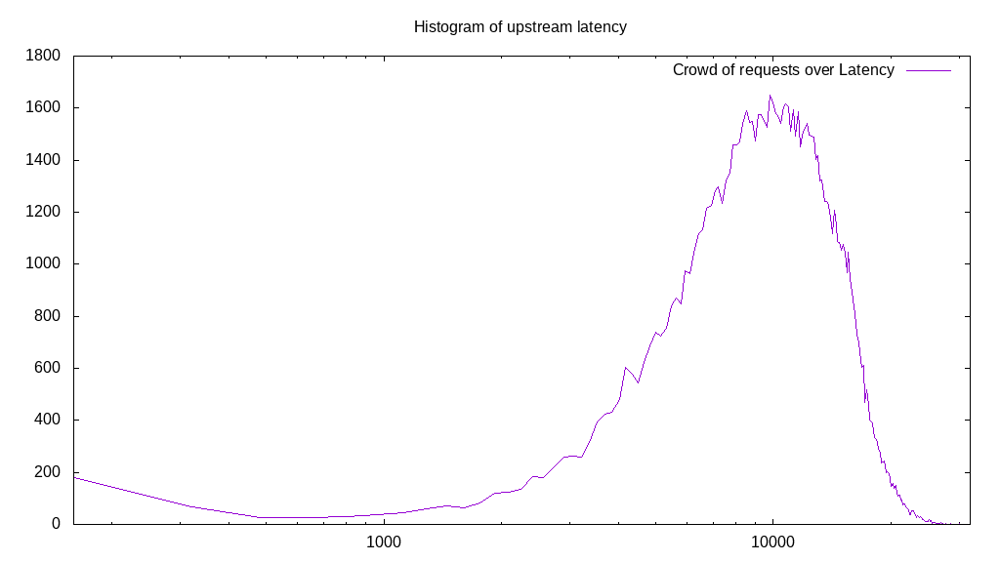
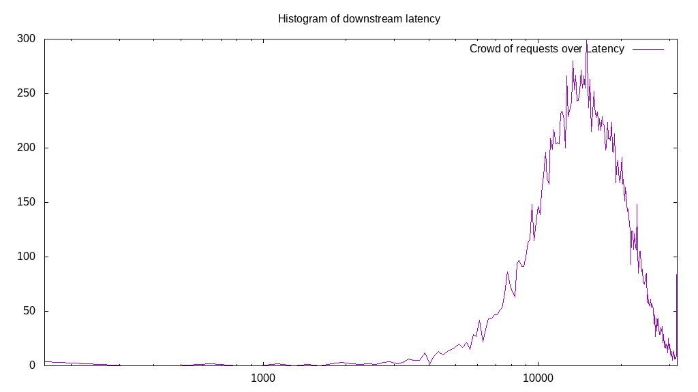
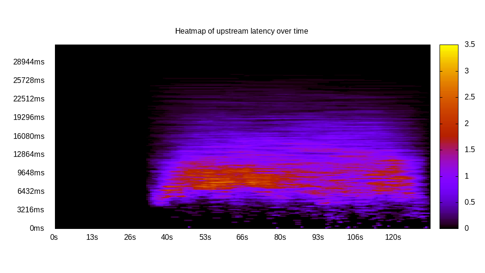
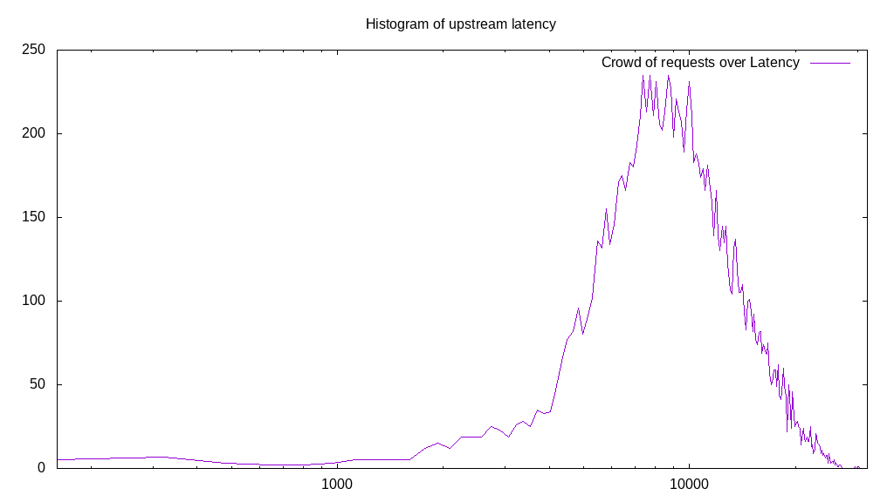
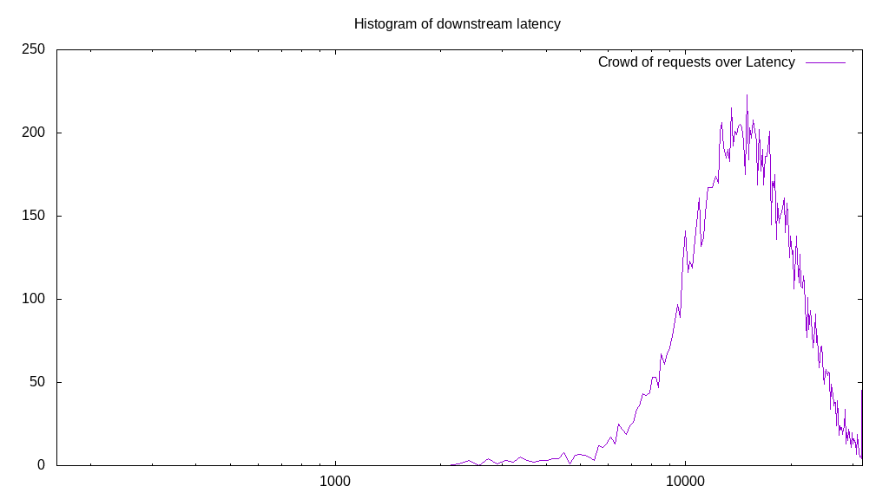
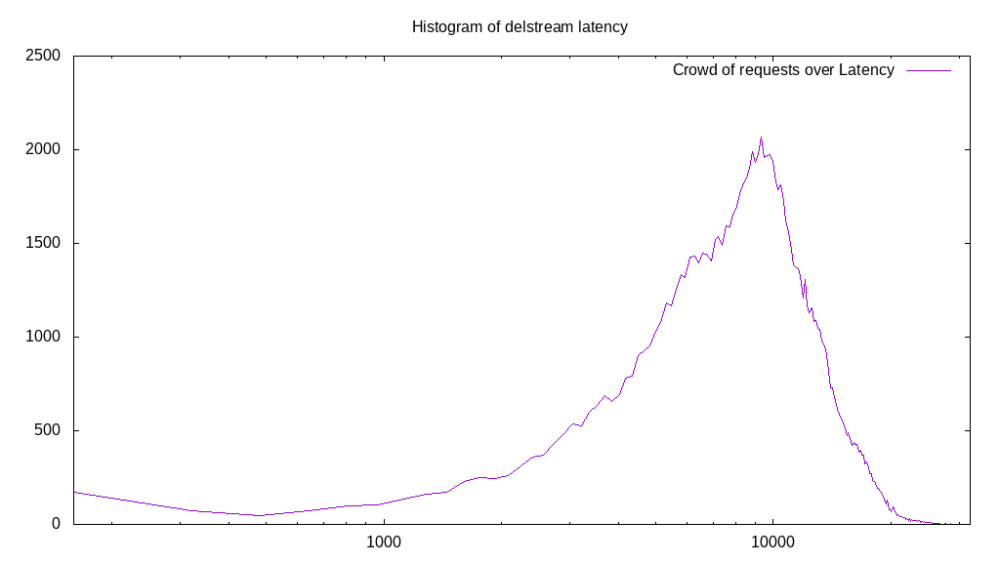

# Latency benchmark report. Crowd is 4096

## Populate workload

## Object Size is 32.00kiB

### PUT Latency in ms over time

Evolution of PUT Latency over time

| Parameter | Value |
| --- | --- |
| Y Coordinate | PUT Latency in ms |
| X Coordinate | time in s since begining of workload |

### PUT Latency distribution in ms

Distribution of the PUT Latency in ms

| Parameter | Value |
| --- | --- |
| Y Coordinate | Number of PUT |
| X Coordinate | Latency in ms |
| Server volume | 3434.406MiB|
| Server bandwidth | 11.448MiB/s |
| Server time | 300.00s |
| Server load | 4001.09 |
| Server responses | 109901PUT |
| Server IOps | 366.34PUT/s |
| Client bandwidth | 0.003MiB/s |
| Client volume | 0.838MiB|
| Client time | 1200319.29s |
| Client IOps |  0.09PUT/s  |
| Client Latency | 10921.82ms/PUT |
| Client Limbo | 6.95ms/PUT |
| Crowd time | 1228791.81s |
| Crowd efficiency | 97.68% |
| Highest Latency | 30133.26ms |
| 95th percentile Latency | 18037.51ms |
| 68th percentile Latency | 13156.77ms |
| 50th percentile Latency | 11034.71ms |
| 32nd percentile Latency | 8912.65ms |
| 5th percentile Latency | 4668.53ms |
| Lowest Latency | 212.21ms |

## Read workload

## Object Size is 32.00kiB

### GET Latency in ms over time

Evolution of GET Latency over time

| Parameter | Value |
| --- | --- |
| Y Coordinate | GET Latency in ms |
| X Coordinate | time in s since begining of workload |

### GET Latency distribution in ms

Distribution of the GET Latency in ms

| Parameter | Value |
| --- | --- |
| Y Coordinate | Number of GET |
| X Coordinate | Latency in ms |
| Server volume | 652.531MiB|
| Server bandwidth | 5.245MiB/s |
| Server time | 124.40s |
| Server load | 2748.14 |
| Server responses | 20881GET |
| Server IOps | 167.85GET/s |
| Client bandwidth | 0.001MiB/s |
| Client volume | 0.159MiB|
| Client time | 341871.59s |
| Client IOps |  0.06GET/s  |
| Client Latency | 16372.38ms/GET |
| Client Limbo | 40.94ms/GET |
| Crowd time | 509546.50s |
| Crowd efficiency | 67.09% |
| Highest Latency | 42229.00ms |
| 95th percentile Latency | 26101.34ms |
| 68th percentile Latency | 18674.13ms |
| 50th percentile Latency | 16127.66ms |
| 32nd percentile Latency | 13581.19ms |
| 5th percentile Latency | 8488.24ms |
| Lowest Latency | 212.21ms |

## Mixed workload

## Object Size is 32.00kiB

### PUT Latency in ms over time

Evolution of PUT Latency over time

| Parameter | Value |
| --- | --- |
| Y Coordinate | PUT Latency in ms |
| X Coordinate | time in s since begining of workload |

### GET Latency in ms over time

Evolution of GET Latency over time

| Parameter | Value |
| --- | --- |
| Y Coordinate | GET Latency in ms |
| X Coordinate | time in s since begining of workload |

### PUT Latency distribution in ms

Distribution of the PUT Latency in ms

| Parameter | Value |
| --- | --- |
| Y Coordinate | Number of PUT |
| X Coordinate | Latency in ms |
| Server volume | 414.094MiB|
| Server bandwidth | 3.118MiB/s |
| Server time | 132.79s |
| Server load | 1074.30 |
| Server responses | 13251PUT |
| Server IOps | 99.79PUT/s |
| Client bandwidth | 0.001MiB/s |
| Client volume | 0.101MiB|
| Client time | 142660.14s |
| Client IOps |  0.09PUT/s  |
| Client Latency | 10765.99ms/PUT |
| Client Limbo | 97.96ms/PUT |
| Crowd time | 543920.13s |
| Crowd efficiency | 26.23% |
| Highest Latency | 30345.46ms |
| 95th percentile Latency | 19522.95ms |
| 68th percentile Latency | 12520.16ms |
| 50th percentile Latency | 10185.89ms |
| 32nd percentile Latency | 8488.24ms |
| 5th percentile Latency | 4880.74ms |
| Lowest Latency | 212.21ms |

### GET Latency distribution in ms

Distribution of the GET Latency in ms

| Parameter | Value |
| --- | --- |
| Y Coordinate | Number of GET |
| X Coordinate | Latency in ms |
| Server volume | 507.125MiB|
| Server bandwidth | 3.819MiB/s |
| Server time | 132.79s |
| Server load | 2030.70 |
| Server responses | 16228GET |
| Server IOps | 122.21GET/s |
| Client bandwidth | 0.001MiB/s |
| Client volume | 0.124MiB|
| Client time | 269662.46s |
| Client IOps |  0.06GET/s  |
| Client Latency | 16617.11ms/GET |
| Client Limbo | 66.96ms/GET |
| Crowd time | 543920.13s |
| Crowd efficiency | 49.58% |
| Highest Latency | 40106.94ms |
| 95th percentile Latency | 26313.55ms |
| 68th percentile Latency | 18886.34ms |
| 50th percentile Latency | 16339.86ms |
| 32nd percentile Latency | 13793.39ms |
| 5th percentile Latency | 9124.86ms |
| Lowest Latency | 2334.27ms |

## Cleanup workload

## Object Size is 32.00kiB

### DELETE Latency in ms over time

Evolution of DELETE Latency over time

| Parameter | Value |
| --- | --- |
| Y Coordinate | DELETE Latency in ms |
| X Coordinate | time in s since begining of workload |

### DELETE Latency distribution in ms

Distribution of the DELETE Latency in ms

| Parameter | Value |
| --- | --- |
| Y Coordinate | Number of DELETE |
| X Coordinate | Latency in ms |
| Server volume | 3433.094MiB|
| Server bandwidth | 11.222MiB/s |
| Server time | 305.92s |
| Server load | 3433.99 |
| Server responses | 109859DELETE |
| Server IOps | 359.11DELETE/s |
| Client bandwidth | 0.003MiB/s |
| Client volume | 0.838MiB|
| Client time | 1050522.01s |
| Client IOps |  0.10DELETE/s  |
| Client Latency | 9562.46ms/DELETE |
| Client Limbo | 49.44ms/DELETE |
| Crowd time | 1253044.22s |
| Crowd efficiency | 83.84% |
| Highest Latency | 32891.93ms |
| 95th percentile Latency | 16976.48ms |
| 68th percentile Latency | 11246.92ms |
| 50th percentile Latency | 9549.27ms |
| 32nd percentile Latency | 7851.62ms |
| 5th percentile Latency | 3607.50ms |
| Lowest Latency | 212.21ms |

