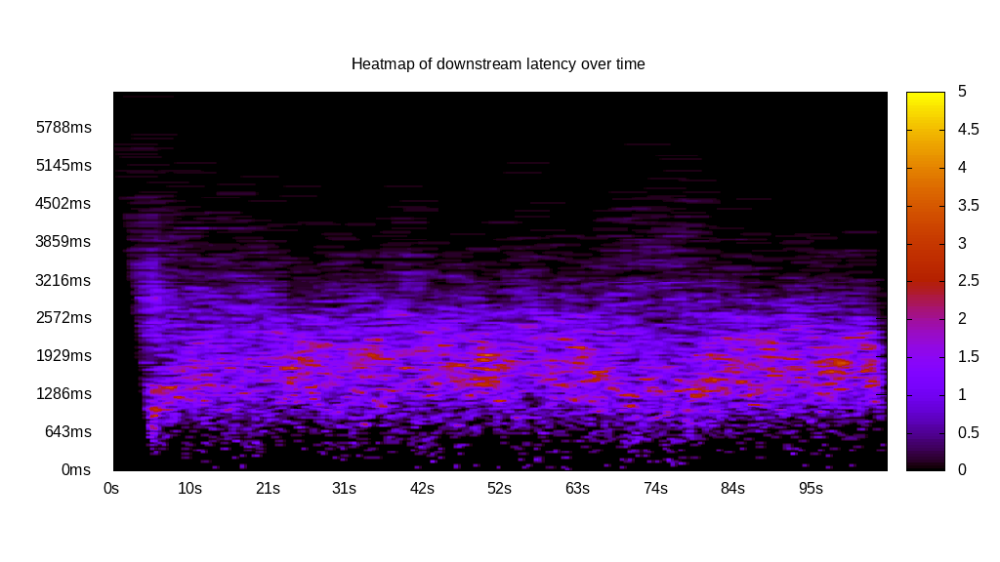
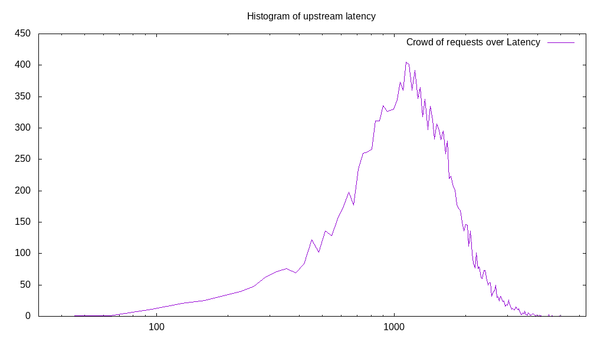
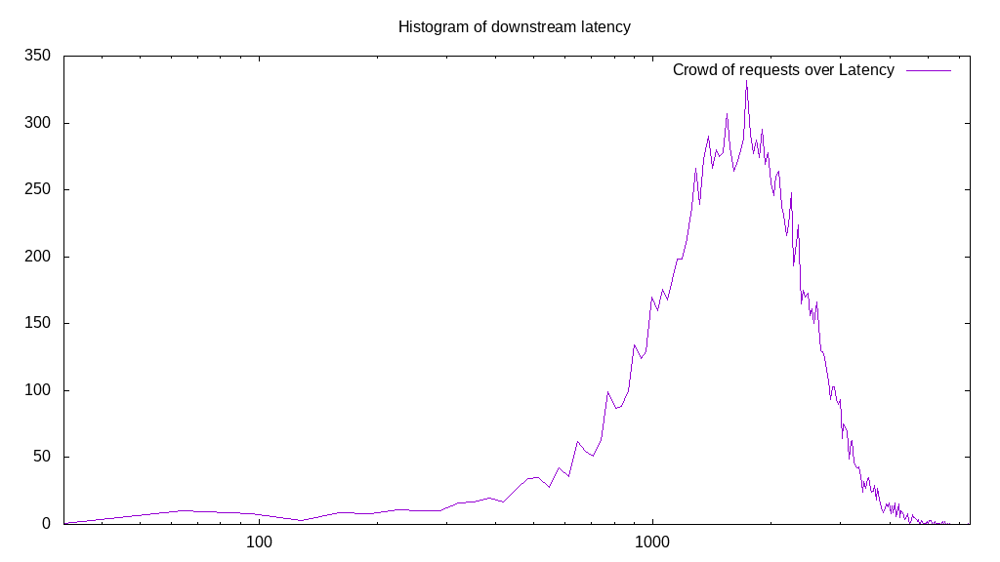

# Latency benchmark report. Crowd is 512

## Populate workload

## Object Size is 32.00kiB

### PUT Latency in ms over time

Evolution of PUT Latency over time

| Parameter | Value |
| --- | --- |
| Y Coordinate | PUT Latency in ms |
| X Coordinate | time in s since begining of workload |

### PUT Latency distribution in ms

Distribution of the PUT Latency in ms

| Parameter | Value |
| --- | --- |
| Y Coordinate | Number of PUT |
| X Coordinate | Latency in ms |
| Server volume | 3735.406MiB|
| Server bandwidth | 12.452MiB/s |
| Server time | 299.99s |
| Server load | 510.61 |
| Server responses | 119533PUT |
| Server IOps | 398.45PUT/s |
| Client bandwidth | 0.024MiB/s |
| Client volume | 7.296MiB|
| Client time | 153180.06s |
| Client IOps |  0.78PUT/s  |
| Client Latency | 1281.49ms/PUT |
| Client Limbo | 0.81ms/PUT |
| Crowd time | 153596.42s |
| Crowd efficiency | 99.73% |
| Highest Latency | 6350.00ms |
| 95th percentile Latency | 2329.40ms |
| 68th percentile Latency | 1467.84ms |
| 50th percentile Latency | 1244.47ms |
| 32nd percentile Latency | 1021.11ms |
| 5th percentile Latency | 542.46ms |
| Lowest Latency | 31.91ms |

## Read workload

## Object Size is 32.00kiB

### GET Latency in ms over time

Evolution of GET Latency over time

| Parameter | Value |
| --- | --- |
| Y Coordinate | GET Latency in ms |
| X Coordinate | time in s since begining of workload |

### GET Latency distribution in ms

Distribution of the GET Latency in ms

| Parameter | Value |
| --- | --- |
| Y Coordinate | Number of GET |
| X Coordinate | Latency in ms |
| Server volume | 829.125MiB|
| Server bandwidth | 8.115MiB/s |
| Server time | 102.17s |
| Server load | 489.67 |
| Server responses | 26532GET |
| Server IOps | 259.69GET/s |
| Client bandwidth | 0.016MiB/s |
| Client volume | 1.619MiB|
| Client time | 50028.26s |
| Client IOps |  0.53GET/s  |
| Client Latency | 1885.58ms/GET |
| Client Limbo | 4.46ms/GET |
| Crowd time | 52309.50s |
| Crowd efficiency | 95.64% |
| Highest Latency | 6094.72ms |
| 95th percentile Latency | 3605.78ms |
| 68th percentile Latency | 2265.58ms |
| 50th percentile Latency | 1818.84ms |
| 32nd percentile Latency | 1372.11ms |
| 5th percentile Latency | 606.28ms |
| Lowest Latency | 31.91ms |

## Mixed workload

## Object Size is 32.00kiB

### PUT Latency in ms over time

Evolution of PUT Latency over time

| Parameter | Value |
| --- | --- |
| Y Coordinate | PUT Latency in ms |
| X Coordinate | time in s since begining of workload |

### GET Latency in ms over time

Evolution of GET Latency over time

| Parameter | Value |
| --- | --- |
| Y Coordinate | GET Latency in ms |
| X Coordinate | time in s since begining of workload |

### PUT Latency distribution in ms

Distribution of the PUT Latency in ms

| Parameter | Value |
| --- | --- |
| Y Coordinate | Number of PUT |
| X Coordinate | Latency in ms |
| Server volume | 484.125MiB|
| Server bandwidth | 4.599MiB/s |
| Server time | 105.28s |
| Server load | 199.38 |
| Server responses | 15492PUT |
| Server IOps | 147.16PUT/s |
| Client bandwidth | 0.009MiB/s |
| Client volume | 0.946MiB|
| Client time | 20990.34s |
| Client IOps |  0.74PUT/s  |
| Client Latency | 1354.92ms/PUT |
| Client Limbo | 64.28ms/PUT |
| Crowd time | 53901.31s |
| Crowd efficiency | 38.94% |
| Highest Latency | 5041.71ms |
| 95th percentile Latency | 2520.85ms |
| 68th percentile Latency | 1595.48ms |
| 50th percentile Latency | 1308.29ms |
| 32nd percentile Latency | 1084.92ms |
| 5th percentile Latency | 542.46ms |
| Lowest Latency | 63.82ms |

### GET Latency distribution in ms

Distribution of the GET Latency in ms

| Parameter | Value |
| --- | --- |
| Y Coordinate | Number of GET |
| X Coordinate | Latency in ms |
| Server volume | 497.469MiB|
| Server bandwidth | 4.725MiB/s |
| Server time | 105.28s |
| Server load | 289.41 |
| Server responses | 15919GET |
| Server IOps | 151.21GET/s |
| Client bandwidth | 0.009MiB/s |
| Client volume | 0.972MiB|
| Client time | 30467.74s |
| Client IOps |  0.52GET/s  |
| Client Latency | 1913.92ms/GET |
| Client Limbo | 45.77ms/GET |
| Crowd time | 53901.31s |
| Crowd efficiency | 56.53% |
| Highest Latency | 6350.00ms |
| 95th percentile Latency | 3286.68ms |
| 68th percentile Latency | 2233.67ms |
| 50th percentile Latency | 1882.66ms |
| 32nd percentile Latency | 1563.57ms |
| 5th percentile Latency | 861.56ms |
| Lowest Latency | 31.91ms |

## Cleanup workload

## Object Size is 32.00kiB

### DELETE Latency in ms over time

Evolution of DELETE Latency over time

| Parameter | Value |
| --- | --- |
| Y Coordinate | DELETE Latency in ms |
| X Coordinate | time in s since begining of workload |

### DELETE Latency distribution in ms

Distribution of the DELETE Latency in ms

| Parameter | Value |
| --- | --- |
| Y Coordinate | Number of DELETE |
| X Coordinate | Latency in ms |
| Server volume | 3735.656MiB|
| Server bandwidth | 13.559MiB/s |
| Server time | 275.51s |
| Server load | 501.67 |
| Server responses | 119541DELETE |
| Server IOps | 433.89DELETE/s |
| Client bandwidth | 0.026MiB/s |
| Client volume | 7.296MiB|
| Client time | 138213.43s |
| Client IOps |  0.86DELETE/s  |
| Client Latency | 1156.20ms/DELETE |
| Client Limbo | 5.56ms/DELETE |
| Crowd time | 141060.61s |
| Crowd efficiency | 97.98% |
| Highest Latency | 5105.53ms |
| 95th percentile Latency | 2074.12ms |
| 68th percentile Latency | 1372.11ms |
| 50th percentile Latency | 1148.74ms |
| 32nd percentile Latency | 925.38ms |
| 5th percentile Latency | 414.82ms |
| Lowest Latency | 31.91ms |

